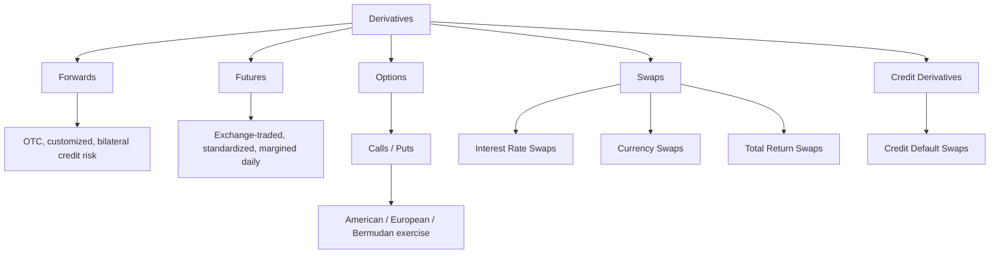

## Definition and Economic Purpose of Derivatives

### Definition

A derivative is a financial contract whose value is derived from the performance of an underlying asset, rate, index, or event, rather than possessing independent intrinsic value. The underlying can be a physical commodity, a financial security, an interest rate, a currency exchange rate, a credit event, or even a non-financial metric such as weather or catastrophe losses.

Formally, a derivative can be represented as a contract $C$ whose payoff function $V$ depends on the state of an underlying variable $S_t$ at one or more points in time:

$$V(C) = f(S_t, K, T, \ldots)$$

where $S_t$ is the underlying's price or level at time $t$, $K$ is a strike or reference level (where applicable), and $T$ is the maturity or settlement date. The defining characteristic is that $C$ has no independent cash-flow generation capacity; it exists purely as a claim contingent on $S_t$.

### Core Structural Characteristics

**Contingent Value**

The derivative's payoff is a deterministic or probabilistic function of the underlying's future price path. Removing the link to the underlying collapses the instrument to zero economic content.

**Leverage**

Most derivatives require an initial outlay (premium, margin) that is small relative to the notional exposure they control. A futures contract, for example, may require margin of 2-10% of notional, producing effective leverage of 10x-50x.

**Zero (or Near-Zero) Net Supply**

Unlike equities or bonds, derivatives are not claims on a firm's assets or cash flows. Every long position is matched by an equal and offsetting short position; aggregate market exposure nets to zero (ignoring counterparty credit differences). This distinguishes derivatives from "primary" securities issued to raise capital.

**Defined Life and Settlement Mechanism**

Derivatives typically specify a maturity/expiration date and a settlement method: physical delivery of the underlying or cash settlement based on a reference price.

### Taxonomy of Derivative Instruments

Each class differs along three dimensions: (1) linear vs. nonlinear payoff, (2) exchange-traded vs. over-the-counter (OTC), and (3) presence or absence of optionality.

### Payoff Structures: Linear vs. Nonlinear

**Linear Payoffs (Forwards, Futures, Swaps)**

The payoff changes proportionally, one-for-one, with the underlying. A long forward position on an asset with forward price $F$ has payoff at maturity:

$$\text{Payoff} = S_T - F$$

This is symmetric: gains and losses scale identically in both directions.

**Nonlinear Payoffs (Options)**

Options introduce asymmetry via the right, but not the obligation, to transact. A European call option payoff:

$$\text{Payoff}_{\text{call}} = \max(S_T - K, 0)$$

A European put option payoff:

$$\text{Payoff}_{\text{put}} = \max(K - S_T, 0)$$

The kink at $S_T = K$ is the source of convexity (positive gamma for the long option holder), which is priced into the premium.

**Illustrative Payoff Diagram (svg_diagram)**

<svg xmlns="http://www.w3.org/2000/svg" viewBox="0 0 640 320">
<text x="320" y="20" font-size="14" text-anchor="middle" font-family="sans-serif" font-weight="bold">Long Call vs Long Forward Payoff (svg_diagram)</text>
<line x1="60" y1="260" x2="600" y2="260" stroke="black" stroke-width="1.5" />
<line x1="330" y1="40" x2="330" y2="280" stroke="black" stroke-width="1.5" />
<text x="600" y="275" font-size="11" text-anchor="end" font-family="sans-serif">S_T</text>
<text x="335" y="50" font-size="11" font-family="sans-serif">Payoff</text>
<text x="330" y="295" font-size="11" text-anchor="middle" font-family="sans-serif">K</text>
<line x1="80" y1="80" x2="580" y2="240" stroke="#2b6cb0" stroke-width="2" />
<text x="500" y="150" font-size="11" fill="#2b6cb0" font-family="sans-serif">Long Forward</text>
<path d="M 80 260 L 330 260 L 580 90" fill="none" stroke="#c53030" stroke-width="2" />
<text x="480" y="230" font-size="11" fill="#c53030" font-family="sans-serif">Long Call</text>
</svg>

### Economic Purpose of Derivatives

Derivatives serve four principal, non-mutually-exclusive economic functions in financial markets.

**1. Risk Transfer (Hedging)**

Derivatives allow entities exposed to price, rate, or credit risk to transfer that risk to a counterparty willing to bear it, typically for a price. This is the foundational economic rationale.

- *Example*: An airline with fixed future fuel needs faces rising jet fuel prices. It buys crude oil or jet fuel futures/swaps to lock in a purchase price, converting an uncertain cost into a known one. If spot fuel prices rise, futures gains offset the higher physical purchase cost; if prices fall, futures losses offset lower physical costs, net cost is stabilized around the hedged level.
- *Example*: A U.S. exporter expecting EUR receivables in six months faces FX risk. It sells EUR/USD forward at the current forward rate, eliminating uncertainty about the USD value of future receivables regardless of spot movement.

**2. Price Discovery**

Because derivatives (especially exchange-traded futures) aggregate the expectations of a broad, liquid pool of market participants, their prices reveal consensus expectations about future spot prices, implied volatility, and interest rate paths.

- Futures curves (e.g., the crude oil term structure) convey market expectations of supply/demand balance across time (contango vs. backwardation).
- Options-implied volatility surfaces reveal the market's probability-weighted expectations of future price dispersion, information not directly observable from the spot market alone.

**3. Speculation**

Because derivatives offer leverage, they allow participants to take magnified directional or volatility views on an underlying without transacting in the full notional amount of the underlying itself. This increases market liquidity and, per efficient-market theory, accelerates the incorporation of information into prices, though it also raises the potential for outsized losses.

- *Example*: A trader with a bearish view on an equity index buys index put options, risking only the premium paid while gaining convex downside exposure, versus short-selling the full notional in the cash market.

**4. Arbitrage and Market Efficiency**

Derivatives enable arbitrageurs to exploit and thereby correct pricing discrepancies between related markets (e.g., spot-futures basis, put-call parity violations, cross-currency basis), which enforces consistent pricing across instruments and enhances overall market efficiency.

- *Example*: Cash-and-carry arbitrage. If a futures price $F$ exceeds the theoretical fair value $S_0 e^{(r+u-y)T}$ (where $r$ = risk-free rate, $u$ = storage cost, $y$ = convenience yield), an arbitrageur buys the underlying spot (financed at $r$), simultaneously sells the futures, and captures the spread risk-free at expiration. This activity pushes $F$ back toward fair value.

**5. Capital and Balance Sheet Efficiency (secondary function)**

Because derivatives require only a fraction of notional as collateral/margin, they let institutions achieve target exposures without the full balance-sheet commitment that owning the underlying would require, improving capital efficiency subject to regulatory capital charges (e.g., under Basel III SA-CCR).

### Worked Numerical Example: Hedging with Futures

A wheat farmer expects to harvest 50,000 bushels in three months. Current spot price: $6.00/bushel. Three-month wheat futures price: $6.20/bushel (one contract = 5,000 bushels, so 10 contracts needed).

The farmer sells (shorts) 10 futures contracts at $6.20/bushel.

| Scenario | Spot at Harvest | Futures P&L | Physical Sale Revenue | Net Effective Price |
| --- | --- | --- | --- | --- |
| Price falls | $5.50 | +$0.70/bu (short gain) | $5.50/bu | $6.20/bu |
| Price unchanged | $6.20 | $0.00 | $6.20/bu | $6.20/bu |
| Price rises | $7.00 | -$0.80/bu (short loss) | $7.00/bu | $6.20/bu |

The futures position converts an uncertain harvest-time price into a locked-in $6.20/bushel, net of basis risk (the risk that local cash price and futures price do not converge exactly at expiration). [Inference: real-world hedge effectiveness depends on basis behavior, contract specification match, and margin/liquidity constraints not modeled in this simplified example.]

### Key Points

- A derivative's value is contingent, entirely derived from an underlying reference variable, with no standalone economic substance.
- Payoffs are either linear (forwards, futures, swaps) or nonlinear/convex (options), a distinction that governs risk profile and pricing methodology.
- The four core economic functions are risk transfer, price discovery, speculation, and arbitrage/market efficiency; capital efficiency is a frequently cited secondary benefit.
- Derivatives exist in zero net aggregate supply: every contract has an exact offsetting counterparty position, distinguishing them from primary capital-raising securities like stocks and bonds.
- Leverage is intrinsic to most derivatives structures and is simultaneously the source of their hedging efficiency and their potential for amplified losses.

### Related Topics

- Forward Contracts: Mechanics, Pricing, and No-Arbitrage Valuation
- Futures Contracts: Exchange Mechanics, Margining, and Mark-to-Market
- Options Fundamentals: Calls, Puts, and Exercise Styles
- Swaps: Interest Rate, Currency, and Total Return Structures
- Put-Call Parity and No-Arbitrage Pricing Relationships
- Market Participants: Hedgers, Speculators, and Arbitrageurs
- Counterparty Risk and the Role of Central Clearing (CCPs)
- Basis Risk and Hedge Effectiveness