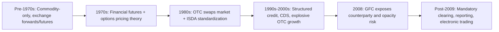

## History and Evolution of Derivatives Markets

### Overview

The history of derivatives markets spans millennia of agricultural risk-sharing arrangements, medieval commodity forward contracts, the birth of organized futures exchanges in the 19th century, the mathematical revolution of the 1970s, explosive OTC growth in the 1980s-2000s, the 2008 financial crisis and subsequent regulatory overhaul, and the current era of central clearing and electronic/algorithmic trading.

### Ancient and Pre-Modern Origins

**Early Forward-Like Arrangements**

Documented precursors to derivative contracts date to antiquity:

- Mesopotamian clay tablets (circa 1750 BCE, under the Code of Hammurabi) recorded contracts specifying future delivery of goods at agreed prices, functioning as primitive forward agreements.
- Aristotle's *Politics* describes Thales of Miletus reportedly securing rights to olive presses ahead of an anticipated bumper harvest, an arrangement economically analogous to a call option, illustrating the antiquity of optionality-based contracting.
- Roman and medieval European trade fairs used forward-delivery arrangements for grain and textiles to manage the timing mismatch between production and sale.

**Dojima Rice Exchange (Japan, 1710)**

The Dojima Rice Exchange in Osaka is widely regarded as the first organized futures market. Rice merchants and feudal lords (daimyo), whose stipends were paid in rice, used standardized rice coupons (*shomai*) to trade forward claims on future rice deliveries, enabling price stabilization and speculative trading independent of physical rice movement. This established core futures-market features: standardization, a central trading venue, and cash settlement mechanisms.

### 19th Century: Birth of Organized Futures Exchanges

**Chicago Board of Trade (CBOT), 1848**

The CBOT was established in response to the chaos of Midwest U.S. grain markets, where farmers faced volatile spot prices at harvest and merchants faced storage and financing risk. Chicago's position as a rail and grain-storage hub made it the natural center for standardized forward contracting.

- 1851: First recorded forward contract on the CBOT (corn).
- 1865: The CBOT formalized standardized futures contracts with specified quality, quantity, and delivery terms, plus the requirement of margin deposits, establishing the template for modern futures.

**Expansion Across Commodities**

Following the CBOT model, exchanges emerged for cotton (New York Cotton Exchange, 1870), coffee, sugar, and metals, extending standardized futures trading beyond grains into a broad commodity complex.

### Early-to-Mid 20th Century: Regulation and Consolidation

- **Commodity Exchange Act (1936, U.S.)**: Established federal regulatory oversight of commodity futures trading following speculative excesses of the 1920s-30s, creating the foundation for what became the Commodity Futures Trading Commission (CFTC) in 1974.
- Futures markets during this period remained overwhelmingly commodity-focused (agricultural products, metals); financial futures did not yet exist because major currencies operated under the fixed exchange-rate regime of Bretton Woods (1944-1971), which eliminated the FX volatility that would later drive demand for currency derivatives.

### 1970s: The Financial Derivatives Revolution

This decade is the inflection point that transformed derivatives from a commodity-hedging tool into the multi-trillion-dollar financial risk-management industry known today, driven by two converging developments.

**1. Collapse of Bretton Woods (1971-1973)**

The end of fixed exchange rates introduced currency volatility, creating genuine economic demand for FX risk-transfer instruments.

- 1972: The Chicago Mercantile Exchange (CME) launched the International Monetary Market (IMM), introducing the first exchange-traded currency futures.

**2. The Black-Scholes-Merton Option Pricing Model (1973)**

Fischer Black, Myron Scholes, and Robert Merton published a closed-form solution for pricing European options, solving the previously intractable problem of assigning a rigorous, arbitrage-free value to optionality. The model is expressed for a European call as:

$$C = S_0 N(d_1) - K e^{-rT} N(d_2)$$

$$d_1 = \frac{\ln(S_0/K) + (r + \sigma^2/2)T}{\sigma\sqrt{T}}, \quad d_2 = d_1 - \sigma\sqrt{T}$$

This provided the theoretical infrastructure for market-makers to hedge and price options at scale, directly enabling the launch of the Chicago Board Options Exchange (CBOE) in 1973, the first exchange dedicated to standardized, listed equity options. Scholes and Merton were awarded the 1997 Nobel Memorial Prize in Economic Sciences for this work (Black had died in 1995 and was ineligible).

**3. Interest Rate Volatility**

The inflationary environment and Federal Reserve policy shifts of the late 1970s (notably under Paul Volcker from 1979) generated significant interest-rate volatility, spurring demand for interest-rate hedging instruments.

- 1975: CBOT launched the first interest rate futures contract, on Government National Mortgage Association (GNMA) mortgage-backed certificates.
- 1977: CBOT launched U.S. Treasury Bond futures, which became one of the most heavily traded contracts globally.

### 1980s: Birth and Growth of the Swaps Market

- **1981**: The landmark IBM-World Bank currency swap is widely cited as the transaction that catalyzed the modern swaps market, allowing both parties to access favorable financing in currencies/markets where they had comparative advantage, then swap the cash flow obligations.
- Mid-1980s: The interest rate swap market emerged and expanded rapidly, allowing corporations and financial institutions to convert fixed-rate debt to floating (or vice versa) without refinancing the underlying obligation.
- **1985**: The International Swaps and Derivatives Association (ISDA) was founded to standardize documentation (the ISDA Master Agreement) for OTC derivatives, dramatically reducing negotiation friction and legal ambiguity in bilateral contracts.
- Exchange-traded index futures and options also matured in this period; the **October 1987 stock market crash ("Black Monday")** intensified scrutiny of the role of portfolio-insurance strategies using index futures in amplifying market declines, prompting early circuit-breaker regulations.

### 1990s: OTC Market Explosion and Early Warning Signs

- Explosive growth in OTC derivatives notional outstanding, driven by interest rate swaps, credit derivatives (credit default swaps emerging mid-decade, pioneered by JPMorgan), and increasingly complex structured products.
- **1994**: The collapse of Orange County, California's investment pool (leveraged use of structured notes and reverse repos) and losses at Procter & Gamble and Gibson Greetings from complex interest-rate swaps highlighted counterparty and complexity risk in OTC derivatives.
- **1998**: The collapse of Long-Term Capital Management (LTCM), a hedge fund employing highly leveraged derivatives-based arbitrage strategies, required a Federal Reserve-coordinated private-sector bailout to prevent systemic contagion, an early demonstration of derivatives-driven systemic risk.
- **2000**: The Commodity Futures Modernization Act (U.S.) explicitly exempted most OTC derivatives (including credit default swaps) from CFTC/SEC regulation, a deregulatory step later cited as a contributing factor to pre-2008 OTC market opacity.

### 2000s: Structured Credit Boom and the 2008 Crisis

- Rapid growth of structured credit derivatives, collateralized debt obligations (CDOs), and credit default swaps (CDS) referencing mortgage-backed securities, often layered into highly complex, opaque structures.
- **2008 Global Financial Crisis**: The near-collapse of AIG, driven substantially by uncollateralized CDS protection written against mortgage-related CDOs, and the broader interconnectedness of OTC derivatives exposures among major banks, became a central narrative of the crisis. The absence of central clearing and standardized collateralization for most OTC derivatives meant counterparty failures could transmit losses through an opaque, densely interconnected web of bilateral exposures.

### Post-Crisis: Regulatory Overhaul (2009-Present)

**G20 Pittsburgh Commitments (2009)**

G20 leaders agreed that standardized OTC derivatives should be traded on exchanges or electronic platforms, cleared through central counterparties (CCPs), and reported to trade repositories, reshaping global derivatives market structure.

**Key Implementing Legislation**

- **Dodd-Frank Act (2010, U.S.)**: Mandated central clearing for standardized swaps, introduced swap dealer registration, margin requirements for uncleared swaps, and created swap execution facilities (SEFs) for electronic trading.
- **EMIR (European Market Infrastructure Regulation, 2012, EU)**: Parallel European framework mandating clearing, reporting, and risk-mitigation techniques for OTC derivatives.

**Structural Consequences**

- Dramatic increase in the role of central counterparties (CCPs) such as LCH, CME Clearing, and ICE Clear, which now clear the substantial majority of standardized interest rate swaps and index CDS.
- Shift from bilateral counterparty credit risk toward concentrated CCP risk, prompting new regulatory focus on CCP resilience, default waterfalls, and "too big to fail" clearinghouse concerns.
- Growth of electronic and algorithmic trading in previously voice-broked OTC markets.

### Timeline (svg_diagram)

<svg xmlns="http://www.w3.org/2000/svg" viewBox="0 0 700 420">
<text x="350" y="20" font-size="14" text-anchor="middle" font-family="sans-serif" font-weight="bold">Evolution of Derivatives Markets (svg_diagram)</text>
<line x1="60" y1="380" x2="660" y2="380" stroke="black" stroke-width="2" />
<line x1="90" y1="375" x2="90" y2="385" stroke="black" />
<text x="90" y="400" font-size="10" text-anchor="middle" font-family="sans-serif">1710</text>
<text x="90" y="365" font-size="9" text-anchor="middle" font-family="sans-serif">Dojima Rice Exchange</text>
<line x1="180" y1="375" x2="180" y2="385" stroke="black" />
<text x="180" y="400" font-size="10" text-anchor="middle" font-family="sans-serif">1848</text>
<text x="180" y="365" font-size="9" text-anchor="middle" font-family="sans-serif">CBOT founded</text>
<line x1="290" y1="375" x2="290" y2="385" stroke="black" />
<text x="290" y="400" font-size="10" text-anchor="middle" font-family="sans-serif">1971-73</text>
<text x="290" y="365" font-size="9" text-anchor="middle" font-family="sans-serif">Bretton Woods ends /</text>
<text x="290" y="353" font-size="9" text-anchor="middle" font-family="sans-serif">Black-Scholes / CBOE</text>
<line x1="380" y1="375" x2="380" y2="385" stroke="black" />
<text x="380" y="400" font-size="10" text-anchor="middle" font-family="sans-serif">1981-85</text>
<text x="380" y="365" font-size="9" text-anchor="middle" font-family="sans-serif">Swaps market / ISDA</text>
<line x1="470" y1="375" x2="470" y2="385" stroke="black" />
<text x="470" y="400" font-size="10" text-anchor="middle" font-family="sans-serif">1998</text>
<text x="470" y="365" font-size="9" text-anchor="middle" font-family="sans-serif">LTCM collapse</text>
<line x1="560" y1="375" x2="560" y2="385" stroke="black" />
<text x="560" y="400" font-size="10" text-anchor="middle" font-family="sans-serif">2008</text>
<text x="560" y="365" font-size="9" text-anchor="middle" font-family="sans-serif">GFC / AIG-CDS crisis</text>
<line x1="630" y1="375" x2="630" y2="385" stroke="black" />
<text x="630" y="400" font-size="10" text-anchor="middle" font-family="sans-serif">2010-12</text>
<text x="630" y="365" font-size="9" text-anchor="middle" font-family="sans-serif">Dodd-Frank / EMIR</text>
</svg>

### Structural Evolution Summary

### Key Points

- Derivative-like risk-sharing contracts predate modern finance by millennia, but organized, standardized futures trading begins with the Dojima Rice Exchange (1710) and the CBOT (1848).
- The 1970s constitute the pivotal decade: the end of Bretton Woods created FX risk-hedging demand, and the Black-Scholes-Merton model provided the pricing theory that enabled scalable, market-made options trading.
- The 1980s birthed the swaps market and ISDA standardization, shifting derivatives from purely exchange-traded, commodity-linked instruments toward a large OTC, interest-rate/credit/currency-linked complex.
- The 2008 financial crisis exposed systemic risks inherent in opaque, bilaterally-cleared OTC derivatives (particularly CDS), directly driving the post-2009 global regulatory shift toward mandatory central clearing, reporting, and electronic execution.
- [Inference: the trajectory since Dodd-Frank/EMIR suggests continued expansion of CCP-cleared volumes and electronic trading, though the pace and scope of further regulatory change depend on evolving political and macroprudential priorities.]

### Related Topics

- Definition and Economic Purpose of Derivatives
- The Black-Scholes-Merton Model: Assumptions, Derivation, and Limitations
- ISDA Master Agreements and OTC Documentation Standards
- Central Clearing and the Role of CCPs (LCH, CME, ICE Clear)
- The 2008 Financial Crisis: AIG, CDS, and Systemic Counterparty Risk
- Dodd-Frank and EMIR: Post-Crisis Derivatives Regulation
- Credit Default Swaps: Mechanics and Market Structure
- Electronic Trading and Swap Execution Facilities (SEFs)