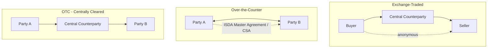

## Exchange Traded versus Over the Counter Markets

### Overview

Derivatives trade through two structurally distinct venue types: exchange-traded (ETD) markets, where standardized contracts trade on a centralized venue with a central counterparty guaranteeing performance, and over-the-counter (OTC) markets, where contracts are negotiated bilaterally between counterparties, historically without a central guarantor. The distinction shapes contract standardization, counterparty risk, liquidity, pricing transparency, and regulatory treatment.

### Core Structural Comparison

| Dimension | Exchange-Traded | Over-the-Counter |
| --- | --- | --- |
| Contract terms | Standardized (fixed size, expiry, tick size) | Customized/negotiated bilaterally |
| Counterparty | Central counterparty (CCP), anonymized | Original bilateral counterparty (or CCP if cleared) |
| Price transparency | Public, continuous, centrally disseminated | Historically opaque; now partially reported via trade repositories |
| Credit risk | Mutualized via CCP default waterfall | Bilateral (uncleared) or CCP-mutualized (cleared) |
| Margining | Daily mark-to-market, initial + variation margin | Negotiated (uncleared) or CCP-standard (cleared) |
| Liquidity | Concentrated in standard contracts | Fragmented across bespoke terms |
| Flexibility | Low: fixed contract specs | High: any notional, tenor, underlying combination |
| Regulatory venue | Designated Contract Markets (DCMs), exchanges | Swap Execution Facilities (SEFs), bilateral, or OTFs (EU) |

### Exchange-Traded Derivatives (ETD)

**Standardization**

Exchanges specify every contract term in advance: underlying, contract size, tick size, expiration cycle, delivery/settlement method, and trading hours. This uniformity is what enables deep, anonymous liquidity, participants trade a fungible instrument rather than negotiating bespoke terms each time.

- *Example*: The CME E-mini S&P 500 futures contract specifies a fixed multiplier ($50 x index level), quarterly expirations (March/June/September/December), and cash settlement against the index's final settlement value, identical for every market participant.

**Central Counterparty (CCP) Guarantee**

Upon execution, a CCP interposes itself between buyer and seller through novation, becoming the buyer to every seller and the seller to every buyer. This eliminates bilateral counterparty risk between the original trading parties and replaces it with counterparty risk to the CCP itself, risk that is mutualized across all clearing members via margin requirements and a default fund.

**Daily Mark-to-Market and Margining**

Exchange-traded futures are marked to market daily (sometimes intraday). Each account posts:

- **Initial margin**: A performance bond calculated (often via SPAN or similar risk-based methodologies) to cover a defined confidence-interval loss over a short liquidation horizon.
- **Variation margin**: Daily settlement of gains/losses, credited or debited to reflect the day's price movement.

This mechanism prevents loss accumulation and is a primary reason exchange-traded derivatives rarely produce the large uncollateralized counterparty exposures seen historically in OTC markets.

**Anonymity and Central Limit Order Book (CLOB)**

Trading occurs through a central limit order book, where bids and offers are matched electronically (or, historically, via open outcry) without participants needing to know or vet each other's creditworthiness, the CCP absorbs that function.

### Over-the-Counter (OTC) Derivatives

**Bilateral Negotiation**

OTC contracts are negotiated directly between two counterparties (or via an interdealer broker), allowing complete customization of notional, tenor, underlying reference, payment frequency, and optionality features to match a specific hedging or investment need that no standardized exchange contract could replicate.

- *Example*: A corporation with a $47.3 million loan amortizing on an irregular schedule can enter an interest rate swap with a matching, non-standard notional amortization profile, something no exchange-listed futures contract could accommodate.

**Documentation Framework**

OTC derivatives are governed by the **ISDA Master Agreement**, a standardized legal framework covering events of default, termination events, netting provisions, and governing law, supplemented by:

- **Schedule**: Counterparty-specific elections and amendments to the Master Agreement.
- **Credit Support Annex (CSA)**: Governs collateral posting terms (thresholds, minimum transfer amounts, eligible collateral, independent amounts).
- **Confirmation**: Trade-specific economic terms for each individual transaction.

**Counterparty Credit Risk**

Historically, uncleared OTC derivatives carried direct bilateral counterparty risk, the risk that one party defaults before fulfilling its obligations. This risk is quantified via metrics such as:

$$\text{CVA} = (1 - R) \int_0^T EE(t) \, dPD(t)$$

where CVA is credit valuation adjustment, $R$ is recovery rate, $EE(t)$ is expected positive exposure at time $t$, and $dPD(t)$ is the marginal default probability. Post-crisis reforms have pushed a large share of standardized OTC derivatives into central clearing, converting much of this bilateral risk into CCP-mutualized risk, while uncleared OTC positions remain subject to bilateral margin rules (initial and variation margin) under frameworks like the BCBS-IOSCO Uncleared Margin Rules (UMR).

**Reduced Pre-Trade Transparency**

Because trades are negotiated privately, pre-trade price transparency is inherently lower than on an exchange's public order book. Post-crisis reforms (Dodd-Frank, EMIR) introduced mandatory trade reporting to swap data repositories (SDRs) and, for sufficiently standardized products, mandatory execution on regulated electronic platforms (SEFs in the U.S., OTFs/MTFs in the EU), narrowing but not eliminating this transparency gap relative to exchanges.

### Structural Comparison Diagram

### Which Products Trade Where

**Predominantly Exchange-Traded**

- Equity index futures and options (e.g., E-mini S&P 500, Euro Stoxx 50 futures)
- Commodity futures (crude oil, gold, agricultural products)
- Standardized single-stock options
- Short-term interest rate futures (e.g., SOFR futures)

**Predominantly OTC**

- Interest rate swaps (though a large share is now centrally cleared)
- Currency swaps and non-deliverable forwards (NDFs)
- Credit default swaps (index CDS increasingly cleared; single-name less so)
- Exotic and structured options (barrier options, basket options, bespoke payoffs)
- Total return swaps

**Hybrid: OTC-Negotiated, Exchange/CCP-Settled**

A growing share of "OTC" products, particularly standardized interest rate swaps and index CDS, are now negotiated off-exchange but routed through mandatory clearing at a CCP, blending bilateral negotiation flexibility with centralized counterparty risk mitigation.

### Notional Outstanding Context

The Bank for International Settlements (BIS) semi-annual OTC derivatives statistics have historically shown OTC notional outstanding (interest rate derivatives alone typically exceeding $400-500 trillion in gross notional) dwarfing exchange-traded open interest by a wide margin, reflecting OTC dominance in the interest rate and currency swap space specifically. [Unverified: precise current BIS figures should be checked against the latest published statistics, as notional outstanding fluctuates materially by reporting period and is sensitive to portfolio compression activity that reduces gross notional without changing net risk.]

### Advantages and Trade-offs

**Key Points**

- **Exchange-traded** advantages: lower counterparty risk (via CCP mutualization), high pre-trade transparency, deep and anonymous liquidity in standard tenors/strikes, lower operational/legal overhead (no bespoke documentation per trade).
- **Exchange-traded** limitations: inflexibility, a firm's exact hedge need rarely matches a standardized contract precisely, producing basis risk.
- **OTC** advantages: perfect customization to the hedger's specific notional, tenor, and payoff profile; ability to structure exotic/non-standard risk transfer unavailable on any exchange.
- **OTC** limitations: historically higher counterparty risk (mitigated but not eliminated by clearing mandates and UMR for uncleared trades), higher legal/documentation cost, lower pre-trade transparency, and potential liquidity fragmentation across bespoke terms.

### Regulatory Convergence Post-2008

Since the G20 Pittsburgh commitments (2009), the line between ETD and OTC has blurred substantially for standardized products:

- Mandatory central clearing pushes standardized OTC swaps through the same CCP risk-mutualization mechanism previously exclusive to exchanges.
- Mandatory platform execution (SEFs/MTFs/OTFs) pushes liquid, standardized OTC instruments toward exchange-like, transparent order/request-for-quote systems.
- Uncleared margin rules (UMR) impose exchange-like daily variation margin and risk-based initial margin on the remaining bilateral OTC book.

[Inference: this convergence trend suggests the structural distinction is increasingly about degree of standardization and clearing mandate coverage rather than a strict binary between "exchange" and "OTC," though bespoke, non-standardized structures will likely remain OTC and uncleared for the foreseeable future given the practical impossibility of centrally clearing fully customized payoffs.]

### Related Topics

- Definition and Economic Purpose of Derivatives
- History and Evolution of Derivatives Markets
- Central Clearing and CCP Risk Management (Default Waterfalls, SPAN Margining)
- ISDA Master Agreements, Schedules, and Credit Support Annexes
- Counterparty Credit Risk and CVA/DVA
- Dodd-Frank and EMIR: Clearing Mandates and Trade Reporting
- Uncleared Margin Rules (UMR) and Bilateral Collateralization
- Basis Risk in Standardized Hedging Instruments