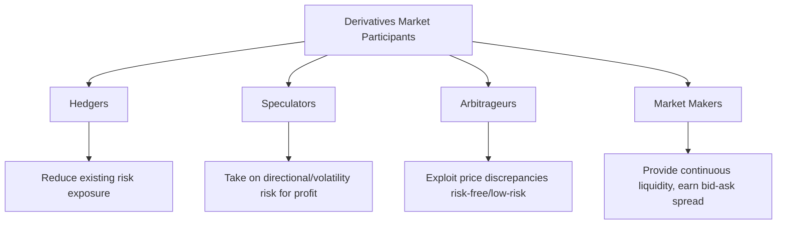
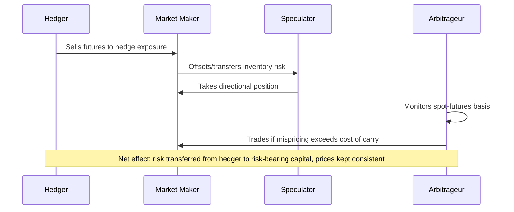

## Market Participants: Hedgers, Speculators, and Arbitrageurs

### Overview

Derivatives markets function because three broad participant categories, hedgers, speculators, and arbitrageurs, bring economically distinct motivations, risk appetites, and holding strategies. Their interaction is not incidental but structurally necessary: hedgers seek to transfer risk, speculators absorb that risk in exchange for expected return, and arbitrageurs enforce price consistency across related instruments and markets. A fourth functional category, market makers, is often distinguished separately due to its distinct liquidity-provision role.

### Participant Taxonomy

### Hedgers

**Definition and Motivation**

Hedgers use derivatives to reduce or eliminate an existing, pre-existing exposure to price, rate, or credit risk arising from their core business or portfolio activity. The defining feature is that the hedger already holds (or will hold) the underlying risk before entering the derivative; the derivative offsets rather than creates directional exposure.

**Typology of Hedgers**

- *Commercial/corporate hedgers*: Firms hedging operational exposures, an airline hedging jet fuel costs, an exporter hedging FX receivables, a manufacturer hedging commodity input costs.
- *Financial institution hedgers*: Banks hedging interest rate risk on loan portfolios, insurers hedging equity/rate exposure on liabilities, asset managers hedging portfolio beta.
- *Agricultural/producer hedgers*: Farmers and commodity producers locking in sale prices ahead of harvest or extraction.

**Hedge Ratio and Effectiveness**

A hedger's objective is typically to minimize the variance of the combined (hedged) position. The optimal hedge ratio $h^*$ that minimizes portfolio variance is:

$$h^* = \rho \frac{\sigma_S}{\sigma_F}$$

where $\rho$ is the correlation between changes in the spot price $S$ and futures price $F$, $\sigma_S$ is the standard deviation of spot price changes, and $\sigma_F$ is the standard deviation of futures price changes. When the hedging instrument does not perfectly match the underlying exposure (e.g., hedging heating oil exposure with crude oil futures due to the absence of a heating-oil-specific contract), the hedge is described as a **cross hedge**, and $\rho < 1$ introduces residual basis risk.

- *Example*: A pension fund holding a $500 million equity portfolio wishes to reduce equity beta ahead of anticipated volatility without liquidating holdings (avoiding transaction costs and tax consequences). It sells S&P 500 futures with notional value approximating its equity exposure, converting unhedged market risk into a largely beta-neutral position while retaining underlying stock ownership.

**Hedgers Do Not Seek Profit from the Derivative Itself**

A textbook hedge is economically "successful" even when the derivative position loses money, because that loss is, by design, offset by a favorable move in the underlying exposure. The goal is variance reduction and cost/revenue certainty, not directional profit.

### Speculators

**Definition and Motivation**

Speculators take on directional, volatility, or relative-value risk via derivatives with the explicit goal of profiting from anticipated price movements. Unlike hedgers, speculators typically have no offsetting exposure in the underlying, the derivative position itself is the source of risk and expected return.

**Why Derivatives Attract Speculative Capital**

- **Leverage**: Margin requirements are a small fraction of notional exposure, magnifying both potential gains and losses relative to capital deployed.
- **Shorting efficiency**: Taking a bearish view via derivatives (selling a futures contract, buying a put) is typically operationally simpler and less costly than short-selling the physical underlying (which may involve borrowing costs, uptick rules, or limited securities lending availability).
- **Asymmetric payoff structuring**: Options allow speculators to express nuanced views (on direction, volatility, or timing) with defined and limited downside (for long option positions).

**Typology of Speculators**

- *Directional speculators*: Take outright long or short positions based on a view of future price direction.
- *Volatility speculators*: Trade options structures (straddles, strangles) to express views on implied vs. realized volatility, independent of price direction.
- *Relative-value speculators*: Trade spreads between related instruments (calendar spreads, inter-commodity spreads) based on views about the relationship between two prices rather than either price outright.
- *Example*: A trader believes an equity index is overvalued and will decline within one month but does not want unlimited downside risk if wrong. The trader buys an at-the-money put option, risking only the premium paid while gaining convex profit potential if the index falls, versus the unlimited-loss exposure of an outright short futures position.

**Economic Function**

Although often characterized pejoratively, speculators provide essential market liquidity, standing ready to take the other side of hedgers' risk-transfer demand. Without speculative capital willing to absorb risk, hedgers would face wider bid-ask spreads, higher hedging costs, and reduced market depth. Speculators also contribute to price discovery by incorporating their information and views into market prices through trading activity.

### Arbitrageurs

**Definition and Motivation**

Arbitrageurs seek to profit from price discrepancies between economically equivalent (or closely related) instruments, positions, or markets, with the goal of capturing a risk-free or near-risk-free spread. Classical arbitrage requires no net investment, no risk, and a positive expected profit; in practice, most "arbitrage" strategies carry some residual execution, financing, or model risk.

**Cash-and-Carry Arbitrage (Futures Mispricing)**

The no-arbitrage fair value of a futures contract on a non-dividend-paying asset is:

$$F_0 = S_0 e^{rT}$$

where $S_0$ is the spot price, $r$ is the risk-free rate, and $T$ is time to maturity. If the observed futures price $F$ exceeds this fair value, an arbitrageur executes a **cash-and-carry trade**: borrow at $r$, buy the asset spot, simultaneously sell the futures contract. At maturity, deliver the asset into the futures contract, repay the loan, and capture the risk-free spread. If $F$ trades below fair value, the arbitrageur executes the reverse ("reverse cash-and-carry"): short the asset, invest proceeds at $r$, buy the futures contract.

**Put-Call Parity Arbitrage**

For European options on a non-dividend-paying underlying:

$$C - P = S_0 - Ke^{-rT}$$

Any observed deviation from this relationship allows an arbitrageur to construct a **conversion** (long stock, long put, short call) or **reversal** (short stock, short put, long call) to lock in a riskless profit equal to the mispricing, net of transaction costs.

**Convergence/Statistical Arbitrage**

More broadly, arbitrageurs (including many quantitative hedge funds) trade statistical or model-implied mispricings between correlated instruments, cross-currency basis, calendar spread misalignments, volatility surface inconsistencies, accepting a degree of model and execution risk in exchange for expected (rather than certain) profit. This is more precisely termed "relative value" trading rather than pure arbitrage, though the terms are often used loosely and interchangeably in practice.

**Economic Function**

Arbitrage activity is the primary mechanism enforcing consistent, no-arbitrage pricing across related instruments and markets. By exploiting and closing pricing gaps, arbitrageurs improve overall market efficiency, ensuring that, for example, futures prices track fair value relative to spot, and that options prices remain internally consistent with put-call parity.

### Market Makers (Related Fourth Category)

Market makers are a distinct functional participant who continuously quote both bid and ask prices, profiting from the bid-ask spread rather than from directional views. They typically hedge the resulting inventory risk using the underlying or related derivatives (delta-hedging an options book, for example), blending characteristics of a liquidity provider with continuous, small-scale hedging activity. Market makers are essential to the functioning of both exchange order books and OTC dealer markets, providing the continuous two-sided liquidity that allows hedgers and speculators to transact efficiently.

### Comparative Summary

| Participant | Pre-existing Exposure? | Primary Goal | Risk Appetite | Market Role |
| --- | --- | --- | --- | --- |
| Hedger | Yes | Reduce/offset existing risk | Low (risk-averse w.r.t. hedged exposure) | Demand for risk transfer |
| Speculator | No | Profit from price/volatility views | High | Supply of risk absorption, liquidity |
| Arbitrageur | No (temporary, offsetting) | Capture risk-free/low-risk mispricing | Very low (per position) | Enforces price consistency |
| Market Maker | No (inventory only) | Earn bid-ask spread | Low (actively hedged) | Continuous liquidity provision |

### Interaction Dynamics

### Same Participant, Multiple Roles

[Inference: In practice, a single institution frequently occupies more than one role simultaneously or across different desks, a bank's corporate treasury may hedge balance-sheet interest rate risk while its trading desk simultaneously speculates on rates and runs arbitrage/relative-value books, though robust internal risk controls and, in regulated entities, structural separations (e.g., under Volcker Rule-type proprietary trading restrictions) are generally intended to limit conflicts between these functions.] Classification therefore properly applies to the specific position or strategy rather than to the institution as a whole.

### Key Points

- Hedgers enter derivatives to offset a pre-existing risk exposure; a hedge can "lose money" on the derivative leg while still succeeding at its risk-management objective.
- Speculators take on directional or volatility risk with no offsetting exposure, seeking profit and, as a byproduct, supplying the liquidity and risk-absorption capacity that hedging markets require.
- Arbitrageurs exploit price discrepancies (cash-and-carry mispricing, put-call parity violations) to earn risk-free or low-risk profit, and in doing so enforce consistent, no-arbitrage pricing across related instruments.
- Market makers form a related but distinct category, profiting from bid-ask spreads while actively hedging resulting inventory exposure rather than taking directional bets.
- The three (or four) roles are functionally interdependent: hedging demand creates the risk that speculative capital is compensated to absorb, and arbitrage activity keeps the resulting prices internally consistent.

### Related Topics

- Definition and Economic Purpose of Derivatives
- Hedge Ratios, Basis Risk, and Cross-Hedging
- Cash-and-Carry Arbitrage and Futures Fair Value Pricing
- Put-Call Parity and Options Arbitrage Strategies
- Market Making and Delta-Hedging of Options Books
- Speculative Position Limits and Regulatory Oversight of Speculation
- Relative Value and Statistical Arbitrage Strategies