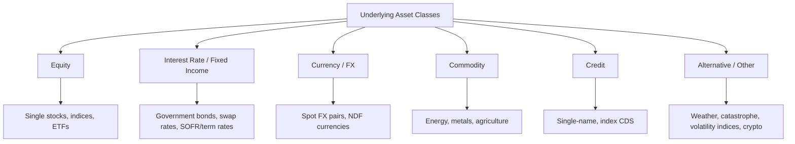

## Underlying Asset Classes and Market Structure

### Overview

Derivatives derive their value from an underlying reference, and the nature of that underlying, its market structure, liquidity, storability, and price-formation process, fundamentally shapes how derivatives on it are designed, priced, and traded. This item surveys the principal underlying asset classes (equities, interest rates/fixed income, currencies, commodities, credit, and "other"/alternative underlyings) and the distinct market-structure characteristics each imposes on the derivatives written against it.

### Taxonomy of Underlying Asset Classes

### Equity Underlyings

**Structure**

Equity derivatives reference single stocks, equity indices (S&P 500, Euro Stoxx 50, Nikkei 225), sector baskets, or ETFs. The underlying cash market is centrally exchange-traded with continuous, highly transparent pricing during market hours, making equity derivatives among the most straightforwardly priced relative to other asset classes.

**Market Structure Characteristics**

- Continuous, order-book-driven price discovery in the cash market feeds directly into derivative pricing (e.g., real-time index futures arbitrage against the cash basket).
- Dividends are a critical input: equity derivative pricing (futures fair value, option pricing) must account for expected discrete dividend payments, since dividend receipt is a benefit accruing to the physical holder but not the derivative holder.
- Corporate actions (splits, mergers, spin-offs) require systematic contract adjustment mechanisms (defined by exchange/OCC rules for listed options, or ISDA Equity Derivatives Definitions for OTC).

**Instruments**: Single-stock and index futures, listed equity/index options, equity swaps (including total return swaps referencing a basket or index), variance/volatility swaps on equity indices (e.g., VIX-related products).

### Interest Rate and Fixed Income Underlyings

**Structure**

Interest rate derivatives are the largest asset class by notional outstanding globally. The "underlying" is not a single tradable asset but a rate, curve, or bond price: government bond yields, swap rates, or reference rates such as SOFR (Secured Overnight Financing Rate, the primary USD reference rate following LIBOR's phase-out) or term equivalents in other currencies (€STR, SONIA, TONA).

**Market Structure Characteristics**

- No single "spot price" exists in the equity-market sense; the underlying is a term structure (yield curve) requiring multi-factor modeling (parallel shifts, curve steepening/flattening, butterfly moves) rather than single-variable price dynamics.
- The post-LIBOR transition (largely completed by mid-2023 for most currencies) shifted the dominant reference rate architecture from forward-looking term rates (LIBOR) to backward-looking, overnight compounded risk-free rates (SOFR, €STR, SONIA), materially changing swap cash-flow computation conventions (compounding-in-arrears vs. simple forward-rate setting).
- Government bond futures (e.g., U.S. Treasury futures) use a deliverable basket of eligible bonds with a conversion factor mechanism, introducing the concept of the "cheapest-to-deliver" bond, which the seller optimally selects for physical delivery.

**Instruments**: Interest rate swaps (fixed-for-floating, basis swaps), government bond futures, short-term rate futures (SOFR futures, Fed Funds futures), swaptions, caps/floors.

### Currency (FX) Underlyings

**Structure**

FX derivatives reference the exchange rate between two currencies. The underlying "spot" FX market is the largest and most liquid market globally, trading nearly continuously across global time zones (Tokyo, London, New York sessions) with no single central exchange, price formation occurs across a decentralized network of interbank dealers and electronic trading platforms.

**Market Structure Characteristics**

- Covered interest rate parity links the FX forward rate to the spot rate and the interest rate differential between the two currencies:

$$F_0 = S_0 \frac{1 + r_d T}{1 + r_f T}$$

where $r_d$ and $r_f$ are the domestic and foreign risk-free rates respectively (simple compounding convention shown; continuous compounding uses $F_0 = S_0 e^{(r_d - r_f)T}$).

- For currencies subject to capital controls or limited convertibility (e.g., historically the Chinese renminbi in offshore markets, Indian rupee, Brazilian real), **non-deliverable forwards (NDFs)** allow synthetic forward exposure settled in a convertible currency (typically USD) based on the difference between the contracted rate and a fixing rate, without physical exchange of the restricted currency.

**Instruments**: FX forwards, FX swaps (combining a spot and forward leg), currency futures, FX options, cross-currency basis swaps, NDFs.

### Commodity Underlyings

**Structure**

Commodity derivatives reference physical goods: energy (crude oil, natural gas), metals (gold, copper, aluminum), and agricultural products (corn, wheat, soybeans, coffee). Unlike financial underlyings, physical commodities involve storage costs, transportation/logistics, quality grading, and delivery-location specifications, all of which materially affect pricing.

**Market Structure Characteristics**

- The cost-of-carry model for commodity futures incorporates storage costs $u$ and convenience yield $y$ (the non-monetary benefit of holding physical inventory, e.g., avoiding stockout risk):

$$F_0 = S_0 e^{(r + u - y)T}$$

- Commodity futures curves exhibit **contango** (futures priced above spot, typical when storage costs dominate) or **backwardation** (futures priced below spot, typical when convenience yield/scarcity dominates), and the curve shape itself conveys market information about near-term supply/demand tightness.
- Physical delivery mechanics (delivery location, quality specifications, grade differentials) are far more operationally significant than in financial derivatives; most speculative/financial participants close out positions before the delivery window to avoid physical settlement obligations.
- Seasonality is a first-order pricing factor for agricultural and certain energy (natural gas heating demand) underlyings, in a way largely absent from financial underlyings.

**Instruments**: Commodity futures and options (CME, ICE, LME), commodity swaps, crack spreads (refining margin derivatives), calendar spreads.

### Credit Underlyings

**Structure**

Credit derivatives reference the creditworthiness of a specific issuer (single-name) or a basket/index of issuers, with payoff contingent on a defined **credit event** (bankruptcy, failure to pay, restructuring, as defined by ISDA Credit Derivatives Definitions) rather than continuous price movement alone.

**Market Structure Characteristics**

- The underlying "price" is a credit spread (typically quoted in basis points over a reference rate) reflecting the market's assessment of default probability and expected loss given default, rather than a directly observable traded price for a homogeneous asset.
- Credit events trigger a determination process (historically via ISDA Determinations Committees) and a settlement mechanism, cash settlement via auction-determined recovery value or physical settlement via delivery of a deliverable obligation.
- Index CDS (e.g., CDX in North America, iTraxx in Europe) reference standardized baskets of investment-grade or high-yield names, roll on a semi-annual series basis, and are substantially more liquid than most single-name CDS.

**Instruments**: Single-name credit default swaps (CDS), index CDS (CDX, iTraxx), CDS index tranches, total return swaps on credit instruments.

### Alternative and Emerging Underlyings

**Structure**

A growing set of derivatives reference underlyings outside the traditional four asset classes:

- **Volatility itself**: VIX futures/options reference the CBOE Volatility Index, a model-derived measure of 30-day implied S&P 500 volatility, making volatility a directly tradable underlying rather than merely a pricing input.
- **Weather derivatives**: Payoffs contingent on measured weather variables (heating/cooling degree days), used by utilities and agricultural firms to hedge weather-driven demand or yield risk.
- **Catastrophe/insurance-linked derivatives**: Payoffs linked to insured catastrophe losses (hurricanes, earthquakes), overlapping with the insurance-linked securities (ILS) market.
- **Digital assets**: Bitcoin and Ethereum futures/options now trade on regulated exchanges (CME, and various crypto-native venues), a rapidly evolving market structure area. [Inference: given the pace of regulatory and product development in digital asset derivatives, specific venue, margining, and product details should be verified against current exchange documentation rather than relied upon from static reference material, as this sub-area evolves materially faster than traditional asset classes.]

### Market Structure Comparison

| Asset Class | Underlying "Spot" Market | Key Pricing Driver | Delivery Complexity |
| --- | --- | --- | --- |
| Equity | Centralized exchange, continuous | Dividends, borrow cost | Low (cash-settled predominant) |
| Interest Rate | No single spot; term structure | Curve shape, day-count/compounding convention | N/A (rate-referenced) |
| FX | Decentralized interbank, near-continuous | Interest rate differential | Low-Moderate (physical settlement common in spot/forwards) |
| Commodity | Physical + futures markets | Storage cost, convenience yield, seasonality | High (grade, location, logistics) |
| Credit | No continuous "price"; spread-quoted | Default probability, recovery rate | Moderate (auction/physical settlement mechanics) |
| Alternative | Varies widely, often index-derived | Model-dependent (e.g., VIX calculation methodology) | Low (typically cash-settled) |

### Why Underlying Structure Matters for Derivative Design

**Key Points**

- The presence or absence of a continuously observable, liquid cash-market price for the underlying determines whether standard no-arbitrage pricing (cost-of-carry) applies directly (equities, FX, financial commodities) or whether a more model-dependent approach is required (interest rates, credit, volatility indices).
- Storability and physical delivery considerations (commodities) introduce cost-of-carry factors (storage, convenience yield) entirely absent from purely financial underlyings.
- The nature of the underlying dictates the appropriate settlement mechanism: cash settlement dominates where physical delivery is impractical or where the underlying is not itself a deliverable asset (indices, rates, volatility, weather); physical settlement remains common where the underlying is a genuinely deliverable commodity or security.
- Reference rate and benchmark transitions (e.g., LIBOR to SOFR) illustrate that even the definition of an "underlying" for interest rate derivatives is subject to structural, market-wide change requiring active monitoring rather than static assumption.

### Related Topics

- Definition and Economic Purpose of Derivatives
- Cost-of-Carry Pricing Models: Contango, Backwardation, and Convenience Yield
- The SOFR Transition and Post-LIBOR Reference Rate Architecture
- Credit Default Swaps: Mechanics, Credit Events, and Settlement
- Covered Interest Rate Parity and FX Forward Pricing
- Volatility as an Asset Class: VIX Futures and Variance Swaps
- Physical Delivery Mechanics and Cheapest-to-Deliver Bonds