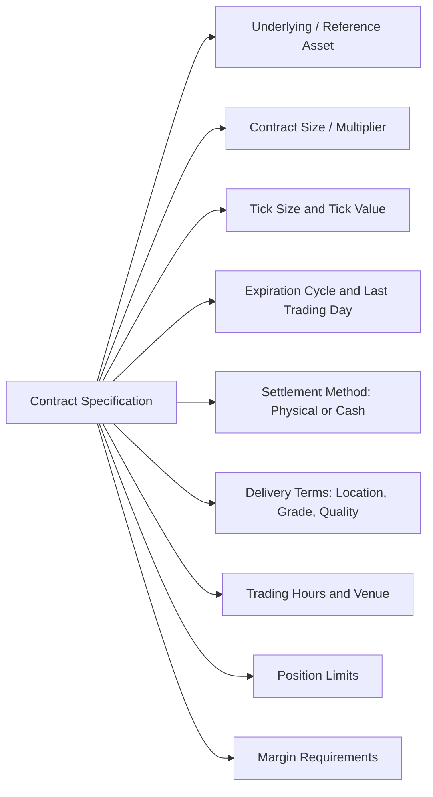

## Derivatives Terminology and Contract Specifications

### Overview

Precise terminology and standardized contract specifications form the operational backbone of derivatives markets. Because derivative payoffs are contractually defined rather than intrinsic, ambiguity in terms produces direct economic and legal disputes. This item catalogs the core vocabulary shared across derivative types and the specific fields that constitute a complete contract specification, both for exchange-listed and OTC instruments.

### Foundational Terminology

**Underlying (or "Underlier")**

The asset, rate, index, or reference variable whose value determines the derivative's payoff. Denoted conventionally as $S$ or $S_t$ for its price/level at time $t$.

**Notional Amount / Notional Value**

The reference quantity (units of the underlying, or a currency amount) used to scale the contract's payoff calculation. Notional is not, in most derivatives (swaps, most futures/options), physically exchanged; it is a calculation base.

- *Example*: An interest rate swap with $100 million notional does not involve exchange of $100 million; only the net interest cash flows calculated by applying fixed and floating rates to that $100 million are exchanged.

**Long and Short Positions**

- *Long*: The party benefiting from an increase in the underlying's value (buyer of a future/forward, buyer of a call, seller of a put in terms of directional exposure though not terminology).
- *Short*: The party benefiting from a decrease in the underlying's value.

**Maturity / Expiration Date**

The date on which the contract's obligations are settled or the right to exercise (for options) lapses.

**Settlement**

The process by which the contract's obligations are discharged at maturity (or upon exercise):

- **Physical settlement**: Actual delivery of the underlying asset in exchange for the agreed price.
- **Cash settlement**: Payment of the net economic value of the contract, computed by reference to a settlement price, without underlying delivery.

**Strike Price (Exercise Price)**

Applicable to options: the fixed price $K$ at which the option holder may buy (call) or sell (put) the underlying.

**Premium**

The price paid by the option buyer to the option seller (writer) at inception, compensating the writer for accepting the asymmetric obligation.

**Tick Size and Tick Value**

The minimum price increment by which a contract's price can move (tick size), and the corresponding monetary value of that increment given the contract multiplier (tick value). Standardized on exchange-traded contracts.

- *Example*: The CME E-mini S&P 500 future has a tick size of 0.25 index points, with a $50 multiplier, producing a tick value of $12.50 per contract.

**Contract Multiplier**

The factor converting a quoted price or index level into a monetary contract value: $\text{Contract Value} = \text{Price} \times \text{Multiplier}$.

**Open Interest**

The total number of outstanding (not yet closed, expired, or settled) derivative contracts of a given series, a commonly used proxy for market participation depth, distinct from trading volume (which measures activity over a period).

**Mark-to-Market (MTM)**

The process of revaluing an open position daily (or more frequently) against current market prices to determine unrealized gain/loss and, for margined positions, the resulting margin call or credit.

### Margin-Related Terminology

**Initial Margin**

Collateral posted at trade inception to cover potential future exposure over a defined liquidation horizon and confidence interval, distinct from a down payment; it remains the posting party's asset, held to secure performance.

**Variation Margin**

Collateral (or cash) transferred to reflect the day's (or period's) realized mark-to-market gain or loss, settling the current exposure rather than covering potential future exposure.

**Maintenance Margin**

The minimum account equity level that must be maintained; if equity falls below this threshold, a margin call requires the account to be topped up (typically back to the initial margin level).

**SPAN Margin (Standard Portfolio Analysis of Risk)**

A widely used risk-based margining methodology (originally developed by the CME) that computes initial margin requirements by simulating portfolio value under a defined set of scenario shocks to price and volatility, rather than margining each position in isolation.

### Options-Specific Terminology

**Moneyness**

- *In-the-money (ITM)*: A call where $S > K$, or a put where $S < K$, intrinsic value is positive.
- *At-the-money (ATM)*: $S \approx K$.
- *Out-of-the-money (OTM)*: A call where $S < K$, or a put where $S > K$, intrinsic value is zero.

**Intrinsic Value and Time Value**

$$\text{Option Premium} = \text{Intrinsic Value} + \text{Time Value}$$

where intrinsic value is $\max(S - K, 0)$ for a call (or $\max(K - S, 0)$ for a put), and time value reflects the remaining probability-weighted potential for the option to move further into the money before expiration.

**Exercise Style**

- *European*: Exercisable only at expiration.
- *American*: Exercisable at any time up to and including expiration.
- *Bermudan*: Exercisable on a discrete set of specified dates prior to expiration.

**The Greeks**

Sensitivity measures of option value to underlying risk factors:

| Greek | Definition | Measures Sensitivity To |
| --- | --- | --- |
| Delta ($\Delta$) | $\partial V/\partial S$ | Underlying price |
| Gamma ($\Gamma$) | $\partial^2 V/\partial S^2$ | Rate of change of delta |
| Vega ($\nu$) | $\partial V/\partial \sigma$ | Implied volatility |
| Theta ($\Theta$) | $\partial V/\partial t$ | Time decay |
| Rho ($\rho$) | $\partial V/\partial r$ | Interest rate |

### Futures/Forwards-Specific Terminology

**Basis**

$$\text{Basis} = S_t - F_t$$

The difference between the spot price and the futures price at a given time; basis converges to zero (subject to delivery/quality adjustments) as the futures contract approaches expiration.

**Contango and Backwardation**

- *Contango*: Futures price exceeds spot price ($F > S$), typically reflecting positive cost of carry.
- *Backwardation*: Futures price is below spot price ($F < S$), often reflecting high convenience yield or near-term scarcity.

**Roll / Roll Yield**

The act of closing an expiring futures position and opening a new position in a later-dated contract, incurring a gain or loss (roll yield) determined by the price difference between the two contracts.

**Cheapest-to-Deliver (CTD)**

In deliverable bond futures (e.g., U.S. Treasury futures), the specific bond within the eligible delivery basket that is most economical for the short position to deliver, given the exchange's conversion factor mechanism.

### Swap-Specific Terminology

**Fixed Leg / Floating Leg**

In an interest rate swap, the fixed leg pays a predetermined fixed rate on the notional; the floating leg pays a rate that resets periodically against a reference rate (e.g., SOFR compounded in arrears).

**Day Count Convention**

The method for calculating accrued interest over a period, e.g., Actual/360, Actual/365, 30/360, materially affecting cash-flow amounts and requiring precise specification in any swap confirmation.

**Reset Date / Fixing Date**

The date(s) on which the floating rate for the subsequent accrual period is determined (fixed) against the reference rate.

**Payment Frequency**

How often cash flows are exchanged (e.g., quarterly, semi-annual), which may differ between the fixed and floating legs of the same swap.

### Standard Exchange-Traded Contract Specification Fields

A complete futures/options contract specification, as published by an exchange, typically includes:

- *Example (illustrative)*: WTI Crude Oil futures (CME/NYMEX) specify: underlying = light sweet crude oil meeting defined API gravity and sulfur content specifications; contract size = 1,000 barrels; tick size = $0.01/barrel ($10/contract); delivery point = Cushing, Oklahoma; settlement = physical delivery (with cash-settled variants also available); expiration = monthly cycle. [Unverified: exact current tick values, delivery specifications, and expiration cycle details should be confirmed against the exchange's live contract specification sheet, as exchanges periodically revise these terms.]

### OTC Contract Documentation Terminology

**ISDA Master Agreement**

The standard legal framework governing the overall bilateral relationship, defining events of default, termination events, close-out netting mechanics, and governing law, executed once between two counterparties and covering all subsequent trades between them.

**Schedule**

A bilaterally negotiated document amending and supplementing the standard ISDA Master Agreement terms for a specific counterparty relationship.

**Confirmation**

The trade-specific document (or electronic message) capturing the economic terms of an individual transaction under the Master Agreement: notional, underlying, dates, rates, and settlement terms.

**Credit Support Annex (CSA)**

Governs collateral mechanics between the parties: eligible collateral types, thresholds, minimum transfer amounts, independent amounts, and valuation/dispute resolution procedures.

**Novation**

The legal mechanism by which an existing derivative contract's counterparty is replaced with a new one (common when a position is assigned to a CCP during clearing, or when a position is transferred between market participants), requiring consent of the remaining original counterparty.

### Consolidated Terminology Reference Table

| Term | Applies To | Definition (Short) |
| --- | --- | --- |
| Notional | All | Reference quantity for payoff calculation |
| Strike (K) | Options | Fixed exercise price |
| Premium | Options | Price paid for the option |
| Basis | Futures/Forwards | Spot minus futures price |
| Margin (Initial/Variation) | Exchange-traded, cleared OTC | Collateral covering potential/current exposure |
| Moneyness | Options | ITM / ATM / OTM classification |
| Day Count Convention | Swaps | Method for accrued interest calculation |
| ISDA Master Agreement | OTC | Governing bilateral legal framework |
| Confirmation | OTC | Trade-specific economic terms document |
| Open Interest | Exchange-traded | Outstanding contract count |

### Key Points

- Precise, standardized terminology (notional, strike, premium, settlement method, margin type) is not merely descriptive but legally and economically load-bearing, since derivative payoffs are entirely defined by contract terms rather than possessing independent value.
- Exchange-traded contract specifications are fully standardized and publicly published (underlying, size, tick, expiration, delivery, margin), enabling fungibility and anonymous trading.
- OTC derivatives rely on a layered documentation architecture, Master Agreement, Schedule, CSA, and trade-specific Confirmation, that separates the general bilateral legal relationship from individual trade economics.
- Options terminology (moneyness, the Greeks, exercise style) and futures/forwards terminology (basis, contango/backwardation, roll yield) reflect the structurally different payoff mechanics (nonlinear/optional vs. linear/obligatory) of these instrument classes.

### Related Topics

- Definition and Economic Purpose of Derivatives
- Exchange Traded versus Over the Counter Markets
- Options Fundamentals: Calls, Puts, and Exercise Styles
- The Greeks: Delta, Gamma, Vega, Theta, and Rho in Options Risk Management
- ISDA Master Agreements and Credit Support Annexes in Detail
- Futures Delivery Mechanics: Cheapest-to-Deliver and Conversion Factors
- Interest Rate Swap Cash Flow Mechanics and Day Count Conventions