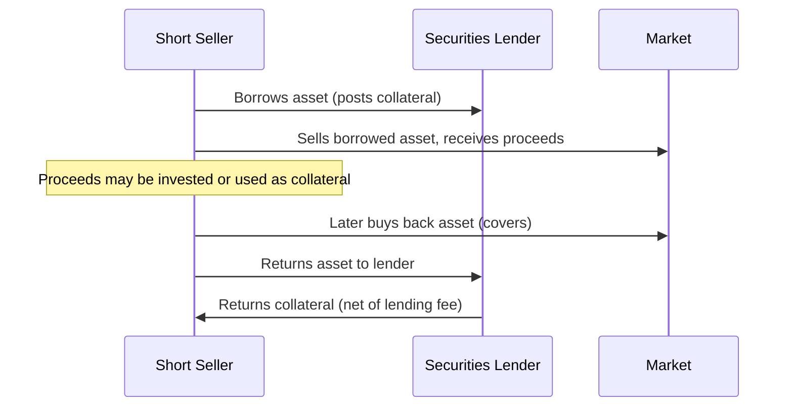

## Arbitrage, Short Selling, and No-Arbitrage Pricing

### Overview

No-arbitrage pricing is the theoretical foundation underlying virtually all derivatives valuation. The principle rests on a simple, powerful assumption: in a well-functioning market, no strategy should exist that requires zero net investment, bears zero risk, and produces a positive expected profit. If such an opportunity briefly appears, arbitrageurs, aided critically by the ability to short-sell, exploit it until prices realign, eliminating the mispricing. This item covers the mechanics of short selling, the formal no-arbitrage assumption set, and its application to forward/futures pricing.

### The Law of One Price

The foundational principle underlying no-arbitrage pricing: two assets (or portfolios) that produce identical cash flows in every future state of the world must have the same price today.

$$\text{If } V_A(s) = V_B(s) \, \forall s \in \Omega \implies P_A = P_B$$

where $V_A(s)$ and $V_B(s)$ are the payoffs of portfolios $A$ and $B$ in state $s$, and $\Omega$ is the set of all possible future states. If $P_A \neq P_B$ while payoffs are identical, an arbitrageur buys the cheaper portfolio and sells the more expensive one, capturing a riskless profit equal to the price difference with zero net investment and zero net future exposure.

### Formal No-Arbitrage Assumptions

Standard derivatives pricing models rely on a defined set of idealized market conditions, understanding these assumptions is essential to understanding both the power and the limitations of no-arbitrage pricing results:

1. **No transaction costs**: Trading is frictionless (bid-ask spreads, commissions, and taxes are zero or negligible).
2. **No restrictions on short selling**: Any market participant can sell borrowed assets short and use the proceeds freely.
3. **Unlimited borrowing and lending at the risk-free rate**: All participants can borrow or lend any amount at a single, common risk-free rate $r$.
4. **No counterparty credit risk**: All contracts are assumed to be honored with certainty.
5. **Continuous trading / market liquidity**: Assets can be bought or sold in any quantity without moving the price (perfectly elastic supply/demand at the quoted price).

[Inference: real markets violate these assumptions to varying degrees, transaction costs, short-sale constraints, margin requirements, and credit risk all exist, which is why observed prices trade within a "no-arbitrage band" around theoretical fair value rather than at an exact single point, with the band's width determined by the magnitude of these frictions.]

### Short Selling Mechanics

**Definition**

Short selling is the sale of an asset the seller does not own, executed by borrowing the asset (typically from a securities lender via a prime broker or custodian), selling it in the market, and later repurchasing an equivalent quantity to return to the lender ("covering" the short).

**Cash Flow Sequence**

**Costs and Frictions of Short Selling**

- **Stock loan fee (borrow cost)**: A fee paid to the securities lender, which varies by asset scarcity ("hard-to-borrow" securities command significantly higher fees, sometimes exceeding the risk-free rate itself).
- **Margin/collateral requirements**: Short sellers must typically post collateral (often exceeding 100% of the position's value) to the lender, and maintain margin with their broker to cover potential losses (since short positions carry theoretically unlimited loss potential as the asset price rises).
- **Recall risk**: The lender may recall the borrowed shares at any time, forcing the short seller to cover the position, potentially at an unfavorable price and time.
- **Regulatory constraints**: Certain jurisdictions impose restrictions such as uptick rules (limiting short sales to occur only on a price uptick) or temporary short-sale bans during periods of market stress; naked short selling (short selling without first locating a borrowable asset) is generally prohibited or restricted in most regulated markets.

**Why Short Selling Is Essential to No-Arbitrage Pricing**

Many classical no-arbitrage pricing proofs and arbitrage strategies (reverse cash-and-carry, put-call parity reversal/conversion) require the ability to short the underlying asset. Without this capability, arbitrage forces operate asymmetrically: overpricing of a derivative relative to its underlying can be arbitraged away (by buying the derivative and shorting/selling the underlying), but underpricing may be harder to arbitrage fully if shorting the underlying is constrained, restricted, or costly, potentially allowing persistent negative-basis or underpriced conditions to exist longer than the textbook zero-band result would suggest.

### Types of Arbitrage Strategies

**Pure (Riskless) Arbitrage**

Requires zero net investment, produces a certain, riskless profit, and involves no residual exposure. Classical examples include cash-and-carry arbitrage and put-call parity violations. True pure arbitrage opportunities are rare and typically fleeting in liquid, well-monitored markets, competing arbitrageurs close the gap within seconds to minutes.

**Risk Arbitrage (Merger Arbitrage)**

Involves taking offsetting positions around a corporate event (e.g., a pending merger) where the "arbitrage" profit is contingent on the deal closing as expected; this carries genuine deal-completion risk and is therefore not riskless in the classical sense, despite the "arbitrage" label.

**Statistical / Relative Value Arbitrage**

Exploits statistically observed, model-implied pricing relationships between correlated instruments (pairs trading, volatility surface consistency trades) without a guaranteed convergence mechanism; profit is probabilistic rather than certain, and losses can occur if the statistical relationship breaks down.

### No-Arbitrage Pricing Applied: Forward Contract Valuation

**Derivation via Replication**

Consider a forward contract on a non-dividend-paying asset with spot price $S_0$, maturing at time $T$, with continuously compounded risk-free rate $r$. Two strategies produce an identical payoff at $T$ (ownership of one unit of the asset):

- **Strategy A**: Enter a long forward at forward price $F_0$; separately invest $F_0 e^{-rT}$ at the risk-free rate, which grows to exactly $F_0$ at $T$, used to pay for the asset upon forward settlement.
- **Strategy B**: Buy the asset today at $S_0$.

Since both strategies produce identical payoffs (ownership of the asset at $T$) with certainty, the law of one price requires their initial costs to be equal:

$$F_0 e^{-rT} = S_0 \implies F_0 = S_0 e^{rT}$$

**Arbitrage Enforcement Mechanism**

If $F_{\text{market}} > S_0 e^{rT}$ (futures overpriced):

1. Borrow $S_0$ at rate $r$.
2. Buy the asset spot at $S_0$.
3. Sell (short) the forward at $F_{\text{market}}$.
4. At $T$: deliver the asset into the forward, receive $F_{\text{market}}$; repay the loan ($S_0 e^{rT}$).
5. Riskless profit: $F_{\text{market}} - S_0 e^{rT} > 0$.

If $F_{\text{market}} < S_0 e^{rT}$ (futures underpriced):

1. Short-sell the asset, receive $S_0$.
2. Invest $S_0$ at rate $r$.
3. Buy (go long) the forward at $F_{\text{market}}$.
4. At $T$: the invested cash has grown to $S_0 e^{rT}$; take delivery via the forward, paying $F_{\text{market}}$; return the asset to the securities lender.
5. Riskless profit: $S_0 e^{rT} - F_{\text{market}} > 0$.

This second leg (reverse cash-and-carry) is precisely where short-selling capability is required, without it, the underpricing scenario cannot be fully arbitraged, illustrating the asymmetric dependence of no-arbitrage enforcement on short-sale availability.

### No-Arbitrage Diagram (svg_diagram)

<svg xmlns="http://www.w3.org/2000/svg" viewBox="0 0 660 300">
<text x="330" y="20" font-size="14" text-anchor="middle" font-family="sans-serif" font-weight="bold">Cash-and-Carry vs Reverse Cash-and-Carry (svg_diagram)</text>
<rect x="30" y="50" width="280" height="200" fill="none" stroke="#2b6cb0" stroke-width="1.5" />
<text x="170" y="70" font-size="12" text-anchor="middle" font-family="sans-serif" font-weight="bold" fill="#2b6cb0">F &gt; S0 e^(rT): Cash-and-Carry</text>
<text x="45" y="95" font-size="10" font-family="sans-serif">1. Borrow S0</text>
<text x="45" y="115" font-size="10" font-family="sans-serif">2. Buy asset spot</text>
<text x="45" y="135" font-size="10" font-family="sans-serif">3. Sell forward at F</text>
<text x="45" y="155" font-size="10" font-family="sans-serif">4. Deliver at T, repay loan</text>
<text x="45" y="180" font-size="10" font-family="sans-serif" fill="#2b6cb0">Profit = F - S0e^(rT)</text>
<rect x="350" y="50" width="280" height="200" fill="none" stroke="#c53030" stroke-width="1.5" />
<text x="490" y="70" font-size="12" text-anchor="middle" font-family="sans-serif" font-weight="bold" fill="#c53030">F &lt; S0 e^(rT): Reverse Cash-and-Carry</text>
<text x="365" y="95" font-size="10" font-family="sans-serif">1. Short-sell asset, get S0</text>
<text x="365" y="115" font-size="10" font-family="sans-serif">2. Invest S0 at rate r</text>
<text x="365" y="135" font-size="10" font-family="sans-serif">3. Buy forward at F</text>
<text x="365" y="155" font-size="10" font-family="sans-serif">4. Take delivery, return asset</text>
<text x="365" y="180" font-size="10" font-family="sans-serif" fill="#c53030">Profit = S0e^(rT) - F</text>
<text x="365" y="205" font-size="9" font-family="sans-serif" font-style="italic">Requires short-sale capability</text>
</svg>

### No-Arbitrage Pricing with Dividends and Storage Costs

The base forward pricing formula generalizes to accommodate income and cost flows accruing to the physical asset holder but not the forward holder:

$$F_0 = (S_0 - I) e^{rT} \quad \text{(known discrete income } I \text{, e.g., dividends)}$$

$$F_0 = S_0 e^{(r - q)T} \quad \text{(continuous yield } q \text{, e.g., continuous dividend yield or foreign interest rate)}$$

$$F_0 = S_0 e^{(r + u - y)T} \quad \text{(storage cost } u \text{, convenience yield } y \text{, commodities)}$$

In each case, the arbitrage-enforcement logic mirrors the base derivation: any deviation from the formula permits a replicating strategy (long/short the asset plus borrowing/lending, offset against the forward) that locks in a riskless profit, and it is precisely this enforcement mechanism, requiring frictionless trading and unrestricted short-selling, that keeps observed forward prices tightly bound to theoretical fair value in liquid markets.

### Limits to Arbitrage

**Key Points**

- **Funding constraints**: Arbitrageurs require capital and financing access; in stressed markets, financing costs can rise or credit lines can be withdrawn precisely when arbitrage opportunities are largest, limiting the capital available to close mispricings (a phenomenon studied extensively in the "limits to arbitrage" academic literature).
- **Short-sale constraints**: Hard-to-borrow assets, high borrow fees, or outright short-sale bans can prevent the reverse cash-and-carry leg from being executed, allowing underpricing to persist.
- **Margin and mark-to-market risk**: Even a theoretically riskless arbitrage position can generate interim mark-to-market losses requiring additional margin before final convergence, exposing the arbitrageur to the risk of being forced to unwind before the theoretical profit is realized ("arbitrageurs can be wrong even when they are right," per the LTCM experience).
- **Model and basis risk**: Real-world "arbitrage" often relies on imperfect proxies or models, introducing residual risk that pure theoretical arbitrage does not carry.

### Key Points

- No-arbitrage pricing rests on the law of one price: identical future cash flows must command identical prices today, or a riskless profit opportunity exists.
- Standard derivatives pricing models assume frictionless markets, unrestricted short selling, and a single risk-free borrowing/lending rate; real markets approximate rather than perfectly satisfy these conditions, producing a no-arbitrage band rather than an exact price.
- Short selling is structurally necessary to enforce no-arbitrage pricing from both directions; when an asset is difficult or costly to borrow, only overpricing (not underpricing) of a derivative relative to its underlying can be reliably arbitraged away.
- The forward pricing formula $F_0 = S_0 e^{rT}$ (and its dividend/storage-cost-adjusted variants) is derived directly from a replication and no-arbitrage argument, not from a supply-demand equilibrium model, distinguishing derivatives pricing theory from most other asset pricing approaches.
- "Arbitrage" in practice spans a spectrum from pure riskless arbitrage to risk arbitrage and statistical arbitrage, each carrying progressively more residual risk despite the shared label.

### Related Topics

- Definition and Economic Purpose of Derivatives
- Market Participants: Hedgers, Speculators, and Arbitrageurs
- Cost-of-Carry Models: Contango, Backwardation, and Convenience Yield
- Put-Call Parity and Options Arbitrage Strategies
- Limits to Arbitrage: Funding, Margin, and Basis Risk
- Securities Lending Markets and Short-Sale Regulation
- The Long-Term Capital Management (LTCM) Case Study