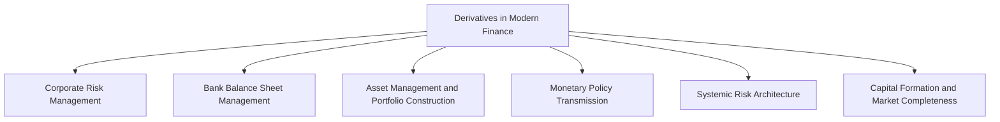

## The Role of Derivatives in Modern Finance

### Overview

Derivatives have moved from a niche commodity-hedging tool to a foundational component of the global financial system, embedded in corporate risk management, bank balance sheet management, asset management, monetary policy transmission, and systemic risk architecture. This item synthesizes the preceding foundational topics (definition, history, market structure, participants) into a coherent picture of how derivatives function within, and shape, the modern financial system as a whole.

### Scale and Systemic Footprint

Derivatives markets are, by gross notional measures, the largest component of global financial markets, substantially exceeding the combined market capitalization of global equity and bond markets. The Bank for International Settlements' semi-annual OTC derivatives statistics have historically reported gross notional outstanding in interest rate derivatives alone in the hundreds of trillions of dollars, alongside sizable currency, credit, equity, and commodity derivatives notional. [Unverified: precise current aggregate figures should be checked against the latest BIS statistical release, as notional outstanding is sensitive to portfolio compression activity, and gross notional substantially overstates actual net economic risk exposure, since it does not net offsetting positions.] It is important to distinguish gross notional (a measure of contract volume, not risk) from gross market value and net credit exposure (measures more indicative of actual economic risk).

### Functional Roles Across the Financial System

### Corporate Risk Management

Non-financial corporations use derivatives to convert uncertain future cash flows into predictable ones, directly supporting core business planning:

- **Commodity price risk**: Airlines hedging fuel, manufacturers hedging input costs, agricultural producers hedging crop/livestock prices.
- **FX risk**: Multinational corporations hedging foreign-currency revenues, costs, and translation exposure on foreign subsidiaries.
- **Interest rate risk**: Corporations converting floating-rate debt to fixed (or vice versa) via interest rate swaps to match asset/liability duration profiles or manage borrowing cost predictability.

By reducing cash-flow volatility, corporate hedging can lower the expected costs of financial distress, reduce the volatility of taxable income (potentially improving the value of tax shields under progressive/convex tax schedules), and support more stable capital budgeting and investment planning, a rationale formalized in corporate finance theory (e.g., Froot, Scharfstein, and Stein's work on why firms hedge).

### Bank and Financial Institution Balance Sheet Management

**Interest Rate Risk Management**

Banks use interest rate swaps and other derivatives extensively to manage the duration mismatch between assets (typically longer-duration loans) and liabilities (typically shorter-duration deposits), a core function of asset-liability management (ALM).

**Credit Risk Transfer**

Credit default swaps allow banks to transfer credit risk exposure on loan portfolios without selling the underlying loans, preserving client relationships while managing concentration risk and regulatory capital requirements.

**Regulatory Capital Optimization**

Derivatives, including synthetic securitization structures, are used to manage risk-weighted assets (RWA) and optimize regulatory capital ratios under frameworks such as Basel III, subject to strict rules (e.g., SA-CCR for counterparty credit risk capital) designed to prevent capital arbitrage that understates true risk.

### Asset Management and Portfolio Construction

**Efficient Exposure Management**

Asset managers use index futures and swaps to adjust portfolio beta or sector/factor exposure quickly and at lower transaction cost than trading the full underlying basket, useful for cash equitization (deploying new inflows immediately via futures while the underlying portfolio is constructed) and tactical asset allocation.

**Portfolio Insurance and Tail-Risk Hedging**

Options-based strategies (protective puts, collar structures) allow funds to define maximum downside loss while retaining upside participation, at the cost of the option premium.

**Alternative and Absolute-Return Strategies**

Many hedge fund strategies (volatility arbitrage, relative value, macro) are structurally dependent on derivatives markets for both the expression of the underlying view and the risk-management overlay around it.

**Liability-Driven Investment (LDI)**

Pension funds and insurers use interest rate and inflation swaps extensively to hedge long-duration liabilities against interest rate and inflation risk, a strategy that became a focal point of financial stability concern during the September 2022 UK gilt market/LDI crisis, when a sharp rise in gilt yields triggered margin calls on leveraged LDI derivative positions, forcing further gilt sales that amplified the yield spike in a destabilizing feedback loop, prompting Bank of England intervention.

### Monetary Policy Transmission

Derivatives markets play a role in how monetary policy signals propagate through the financial system:

- **Interest rate futures and swaps** (e.g., Fed Funds futures, SOFR futures, overnight index swaps) are widely used by market participants to price and hedge expected central bank policy paths, and are themselves closely monitored by policymakers and market commentators as a real-time gauge of market-implied rate expectations.
- **Cross-currency basis swaps** reflect and influence the relative cost of USD funding for non-US financial institutions, a channel of particular importance during periods of global dollar funding stress.

[Inference: the depth and liquidity of rate derivatives markets likely improves the efficiency of monetary policy transmission by allowing financial institutions to adjust exposure to anticipated rate changes in advance, though the precise quantitative contribution of derivatives markets specifically to transmission efficiency, as distinct from other financial market channels, is difficult to isolate empirically and is an active area of academic research rather than a settled, precisely measured finding.]

### Systemic Risk Architecture

**Interconnectedness**

Because derivatives create contractual linkages between institutions (particularly large dealer banks acting as central nodes in the OTC network), the failure or distress of one significant participant can transmit losses and liquidity stress to counterparties, a dynamic central to the 2008 crisis (notably AIG's CDS exposures) and a continuing focus of macroprudential regulation.

**Central Clearing as Risk Mitigation and Risk Concentration**

Post-2009 clearing mandates were designed to reduce bilateral interconnectedness risk by concentrating standardized derivatives risk at CCPs; this simultaneously reduces the complexity of the bilateral counterparty web but concentrates risk at a smaller number of systemically critical CCPs, whose own resilience (default waterfalls, loss-sharing arrangements, recovery and resolution planning) has become a primary macroprudential focus.

**Margin and Liquidity Spirals**

Episodes such as the 2022 UK LDI crisis and, earlier, various commodity margin call cascades, illustrate a recurring systemic pattern: sharp price moves trigger margin calls on derivative positions, forcing asset sales to raise cash, which can amplify the initial price move and trigger further margin calls, a self-reinforcing liquidity spiral that has become a recurring theme in post-crisis financial stability analysis.

### Market Completeness and Price Discovery

**Completing Markets**

In classical financial economics (Arrow-Debreu framework), derivatives can be understood as instruments that help "complete" markets by allowing participants to construct payoffs across specific future states of the world that would otherwise be unavailable through primary securities alone, in principle improving allocative efficiency and enabling more precise risk-sharing between parties with differing risk preferences and views.

**Information Aggregation**

Derivative prices, particularly deep, liquid futures and options markets, aggregate the dispersed information and expectations of a broad participant base into observable prices (futures curves, implied volatility surfaces), providing information of value to policymakers, corporations, and other market participants beyond the immediate trading counterparties.

### Balancing Benefits and Risks: A Summary View

| Function | Benefit to Financial System | Associated Risk if Misused/Under-Regulated |
| --- | --- | --- |
| Risk transfer | Allocates risk to parties best able/willing to bear it | Concentration of risk at under-capitalized bearers (e.g., AIG pre-2008) |
| Leverage | Capital-efficient exposure management | Amplified losses, margin/liquidity spirals |
| Price discovery | Transparent, information-rich pricing signals | Potential for derivatives-driven price distortion in illiquid underlyings |
| Interconnection via OTC/CCP networks | Efficient netting, reduced bilateral complexity | Systemic contagion channels, CCP concentration risk |
| Market completion | Enables precise, tailored risk-sharing | Complexity/opacity in bespoke structured products |

### Key Points

- Derivatives now function as core infrastructure across corporate treasury, bank balance sheet management, asset management, and monetary policy transmission, not merely as a specialized trading niche.
- The same structural features that make derivatives valuable, leverage, interconnectedness, and complex payoff engineering, are also the primary channels through which derivatives-related risk can become systemic, as demonstrated by AIG/CDS in 2008 and the UK LDI/gilt crisis in 2022.
- Post-2009 regulatory reforms (central clearing mandates, margin requirements, trade reporting) represent a deliberate redesign of derivatives market structure intended to preserve the economic benefits of derivatives while containing the systemic risk channels exposed by the 2008 crisis.
- Understanding derivatives' role in modern finance requires distinguishing gross notional exposure (a volume measure) from net economic risk exposure, aggregate notional figures substantially overstate the risk actually borne by the financial system due to extensive netting and offsetting positions.

### Related Topics

- Definition and Economic Purpose of Derivatives
- History and Evolution of Derivatives Markets
- Central Clearing and CCP Risk Management
- The 2008 Financial Crisis: AIG, CDS, and Systemic Counterparty Risk
- The 2022 UK LDI/Gilt Crisis: Margin Calls and Liquidity Spirals
- Liability-Driven Investment and Pension Fund Hedging Strategies
- Basel III and Regulatory Capital Treatment of Derivatives
- Monetary Policy Transmission via Interest Rate Derivatives Markets