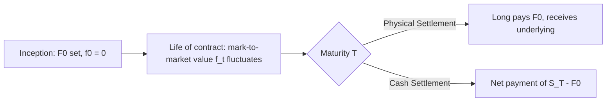

## Forward Contract Mechanics and Payoff Profiles

### Definition and Structure

A forward contract is a bilateral agreement to buy or sell a specified underlying asset at a predetermined price (the forward price, $F_0$), on a specified future date $T$, with no cash exchanged at inception. It is the simplest and most primitive derivative structure: a private, customized commitment between two counterparties, obligating both sides to transact regardless of how the underlying's price moves.

**Key Structural Features**

- **Bilateral obligation**: Both parties are obligated to perform, unlike an option, neither party has the discretion to walk away without cost.
- **OTC, customized**: Forwards are negotiated bilaterally (not exchange-traded), allowing any notional, maturity date, and underlying specification the two counterparties agree to.
- **No upfront payment**: The forward price $F_0$ is set at contract inception such that the contract has zero value to both parties at that moment, no premium changes hands.
- **Settlement at maturity only**: Unlike futures, forwards are typically not marked to market daily; the full gain or loss is realized (and, if physically settled, the underlying delivered) only at maturity $T$.

### Contractual Parties and Terminology

- **Long forward position**: The party contractually obligated to *buy* the underlying at $F_0$ on date $T$. Profits if $S_T > F_0$.
- **Short forward position**: The party contractually obligated to *sell* the underlying at $F_0$ on date $T$. Profits if $S_T < F_0$.
- **Delivery price**: Synonymous with the forward price agreed at inception, $F_0$; remains fixed for the life of the contract regardless of subsequent market movement.
- **Spot price at maturity**: $S_T$, the market price of the underlying observed at the contract's maturity date, the key determinant of the contract's final payoff.

### Payoff Profile

**Long Forward Payoff**

$$\text{Payoff}_{\text{long}} = S_T - F_0$$

**Short Forward Payoff**

$$\text{Payoff}_{\text{short}} = F_0 - S_T$$

These payoffs are **linear and symmetric**: unlike an option, there is no kink at any reference price, and gains/losses scale one-for-one, in both directions, with the underlying's movement at maturity. The long and short payoffs are exact mirror images of each other, and the contract is a zero-sum arrangement between the two counterparties (ignoring any subsequent credit losses).

**Payoff Diagram (svg_diagram)**

<svg xmlns="http://www.w3.org/2000/svg" viewBox="0 0 640 320">
<text x="320" y="20" font-size="14" text-anchor="middle" font-family="sans-serif" font-weight="bold">Forward Contract Payoff Profiles (svg_diagram)</text>
<line x1="60" y1="170" x2="600" y2="170" stroke="black" stroke-width="1" />
<line x1="330" y1="40" x2="330" y2="300" stroke="black" stroke-width="1.5" />
<text x="600" y="185" font-size="11" text-anchor="end" font-family="sans-serif">S_T</text>
<text x="335" y="50" font-size="11" font-family="sans-serif">Payoff</text>
<text x="330" y="315" font-size="11" text-anchor="middle" font-family="sans-serif">F0</text>
<line x1="80" y1="290" x2="580" y2="50" stroke="#2b6cb0" stroke-width="2" />
<text x="500" y="90" font-size="11" fill="#2b6cb0" font-family="sans-serif">Long Forward</text>
<line x1="80" y1="50" x2="580" y2="290" stroke="#c53030" stroke-width="2" />
<text x="500" y="255" font-size="11" fill="#c53030" font-family="sans-serif">Short Forward</text>
</svg>

### Value of a Forward Contract Over Its Life

**At Inception**

The forward contract is structured so that its initial value to both parties is exactly zero:

$$f_0 = 0$$

This is achieved by setting $F_0$ equal to the no-arbitrage fair forward price, $F_0 = S_0 e^{rT}$ (for a non-dividend-paying asset), derived via the replication argument covered under no-arbitrage pricing.

**During the Contract's Life**

As time passes and the spot price moves, the contract acquires positive or negative mark-to-market value to each party, even though no cash changes hands until maturity (for uncollateralized forwards). At time $t$ (where $0 < t < T$), the value of a long forward position entered at delivery price $F_0$ is:

$$f_t = (F_t - F_0)e^{-r(T-t)} = S_t - F_0 e^{-r(T-t)}$$

where $F_t$ is the current fair forward price for a new contract maturing at the same date $T$, and $S_t$ is the current spot price. This value represents the present value of the difference between the contract's original delivery price and the current fair forward price.

**At Maturity**

$$f_T = S_T - F_0$$

which is exactly the long forward payoff, since $t \to T$ collapses the discounting term.

### Worked Numerical Example

A firm enters a 6-month long forward contract on a non-dividend-paying stock currently trading at $S_0 = \$100$, with a continuously compounded risk-free rate of $r = 5\%$.

**Step 1: Determine the fair forward price at inception**

$$F_0 = S_0 e^{rT} = 100 \times e^{0.05 \times 0.5} = 100 \times e^{0.025} \approx \$102.53$$

**Step 2: Value the contract after 3 months**

Suppose after 3 months ($t = 0.25$), the spot price has risen to $S_t = \$108$. The remaining time to maturity is $T - t = 0.25$ years. The current fair forward price for a new 3-month contract is:

$$F_t = S_t \, e^{r(T-t)} = 108 \times e^{0.05 \times 0.25} \approx 108 \times 1.01258 \approx \$109.36$$

The value of the original long forward position (still obligated to buy at $F_0 = \$102.53$) is:

$$f_t = (F_t - F_0)e^{-r(T-t)} = (109.36 - 102.53) \times e^{-0.05 \times 0.25} \approx 6.83 \times 0.98758 \approx \$6.74$$

**Step 3: Payoff at maturity**

Suppose at maturity $S_T = \$115$. The long forward payoff is:

$$\text{Payoff} = S_T - F_0 = 115 - 102.53 = \$12.47$$

The long position gains $12.47 per share, while the short counterparty loses the identical $12.47 per share, confirming the zero-sum, symmetric nature of the contract.

### Settlement Mechanisms

**Physical Settlement**

The party with the long position pays the delivery price $F_0$ and receives the actual underlying asset from the short position. Common in commodity and some FX forward markets where the underlying is a genuinely deliverable good or currency.

**Cash Settlement**

Rather than exchanging the underlying, the parties settle the net cash difference $S_T - F_0$ (paid by the short to the long if positive, or vice versa). Common for forwards on indices, baskets, or underlyings that are impractical to deliver, and universally used for non-deliverable forwards (NDFs) on restricted currencies.

### Counterparty Risk in Forward Contracts

Because forwards are typically uncollateralized, bilateral OTC contracts settled only at maturity (absent a CSA requiring interim collateral posting), they carry direct bilateral counterparty credit risk, the risk that the counterparty defaults before or at settlement, particularly acute if the contract has accumulated substantial positive mark-to-market value for one side as maturity approaches. This is the principal structural distinction from exchange-traded futures, which mitigate this risk via daily mark-to-market settlement and CCP guarantee, at the cost of standardization and the need to actively manage a stream of daily variation margin flows.

### Forward Contract Mechanics Flow

### Key Points

- A forward contract is a bilateral, OTC obligation to transact at a fixed price on a fixed future date, with zero value and no cash exchange at inception, distinguishing it from options (which require an upfront premium) and futures (which are exchange-traded and marked to market daily).
- The payoff to a long forward is $S_T - F_0$ and to a short forward is $F_0 - S_T$, linear and symmetric, with unlimited upside and downside for both parties, unlike the asymmetric, bounded-downside payoff of a long option.
- The forward's mark-to-market value evolves over its life according to $f_t = (F_t - F_0)e^{-r(T-t)}$, even though no cash is actually exchanged until maturity, meaning a forward can accumulate substantial unrealized economic value or loss well before settlement.
- Because forwards are typically uncollateralized until maturity, they carry direct, un-mitigated bilateral counterparty credit risk, a structural weakness that motivated the development of exchange-traded, margined futures contracts as a risk-mitigated alternative for standardized underlyings.

### Related Topics

- Definition and Economic Purpose of Derivatives
- Arbitrage, Short Selling, and No-Arbitrage Pricing
- Futures Contracts: Exchange Mechanics, Margining, and Mark-to-Market
- Forward Pricing with Dividends, Storage Costs, and Convenience Yield
- Non-Deliverable Forwards (NDFs) and Restricted-Currency Hedging
- Counterparty Credit Risk and CVA in Uncollateralized OTC Contracts
- ISDA Master Agreements and Credit Support Annexes