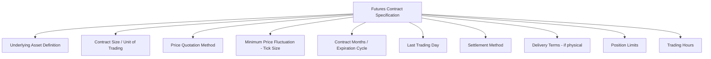
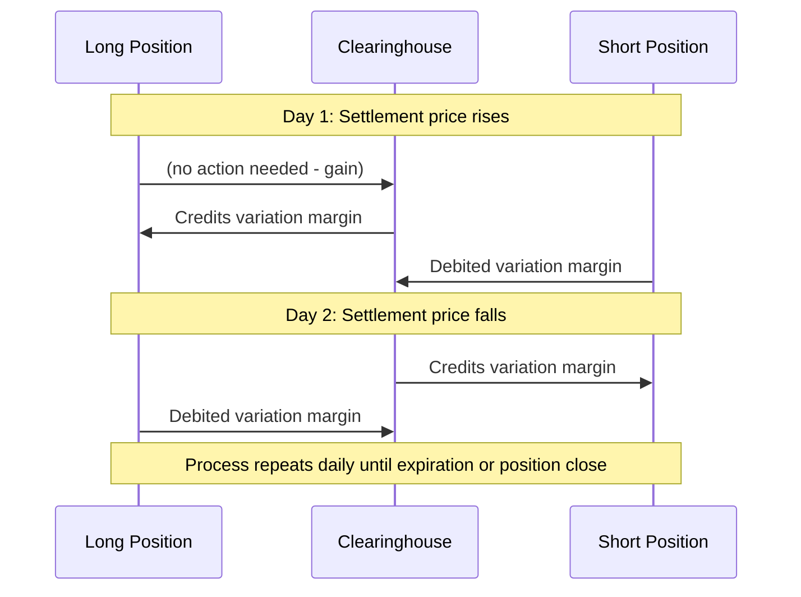

## Futures Contract Specifications and Standardization

### Definition and Purpose of Standardization

A futures contract is an exchange-traded agreement to buy or sell a specified underlying asset at a predetermined price on a specified future date, structurally similar to a forward contract in its core obligation but distinguished by exchange listing, contractual standardization, daily mark-to-market settlement, and a central counterparty guarantee. Standardization is the structural innovation that transforms a bespoke bilateral agreement into a fungible, exchange-tradable instrument: every market participant trades an identical contract, enabling deep, anonymous liquidity that customized forwards cannot achieve.

### Why Standardization Is Necessary

A forward contract's terms are negotiated uniquely between two counterparties; no two forwards are guaranteed identical. This customization is valuable for precise hedging but makes forwards illiquid, each contract is essentially a unique bilateral claim, difficult to transfer or offset with a third party. Futures solve this by fixing every economically material term in advance via exchange rules, so that a contract purchased from Party A is functionally identical to, and freely offsettable against, a contract purchased from Party B. This fungibility is the precondition for a central limit order book, anonymous trading, and CCP novation.

### Core Contract Specification Fields

**Underlying Asset Definition**

Precisely specifies what is being traded, for commodities, this includes grade, quality, and specification tolerances (e.g., WTI crude oil's API gravity and sulfur content bounds); for financial futures, the precise reference index, rate, or instrument basket.

**Contract Size (Unit of Trading)**

The standardized quantity of the underlying represented by one contract, e.g., 1,000 barrels of crude oil, $100,000 face value of Treasury bonds, or $50 x index points for certain equity index futures.

**Price Quotation**

How the contract is quoted in the market, per barrel, per bushel, in index points, in percentage of par, etc., which must be combined with the contract size to compute total contract value.

**Tick Size and Tick Value**

The minimum permissible price increment (tick size) and its corresponding dollar value given the contract size (tick value). This is fixed by the exchange and cannot be altered by individual traders.

$$\text{Tick Value} = \text{Tick Size} \times \text{Contract Multiplier}$$

- *Example*: CME E-mini S&P 500 futures: tick size = 0.25 index points; multiplier = $50; tick value = 0.25 x 50 = $12.50 per contract per tick.

**Contract Months (Expiration Cycle)**

The specific calendar months in which contracts expire and become deliverable/settleable, e.g., a quarterly cycle (March, June, September, December, common for equity index and interest rate futures) or a monthly cycle (common for many commodity futures). The set of currently listed contract months for a given underlying is referred to as the **futures curve** or **term structure**.

**Last Trading Day**

The final day on which a given contract month can be traded before it stops trading and proceeds to final settlement, precisely defined relative to the contract month (e.g., "the third Friday of the contract month" for many financial futures).

**Settlement Method**

Specifies whether the contract settles via physical delivery or cash settlement, and the precise mechanism for determining the final settlement price (e.g., a volume-weighted average price over a defined window, or a specific closing auction price).

**Delivery Terms (Physical Settlement Contracts)**

For physically settled contracts, the exchange specifies delivery location(s), acceptable delivery grades/qualities (often with a schedule of premiums/discounts for non-standard but acceptable grades), and the delivery process timeline and mechanics.

**Position Limits**

Exchange- (and in the U.S., CFTC-) imposed maximum position sizes a single trader (or affiliated group of traders) may hold, designed to prevent excessive speculative concentration and attempts at market manipulation or cornering, particularly important as a contract approaches its delivery/expiration window.

**Trading Hours**

Standardized trading sessions (including, for many modern futures, nearly 24-hour electronic trading across global sessions), with specified daily settlement times used to compute official daily settlement prices for mark-to-market purposes.

### Illustrative Contract Specification Table

| Field | CME E-mini S&P 500 (illustrative) | CBOT Corn (illustrative) |
| --- | --- | --- |
| Underlying | S&P 500 Index | No. 2 Yellow Corn |
| Contract Size | $50 x index | 5,000 bushels |
| Price Quotation | Index points | Cents per bushel |
| Tick Size | 0.25 points | 1/4 cent per bushel |
| Tick Value | $12.50 | $12.50 |
| Contract Months | Mar, Jun, Sep, Dec | Mar, May, Jul, Sep, Dec |
| Settlement | Cash | Physical delivery |

[Unverified: the figures above are illustrative of typical specification structure; exact current values (tick sizes, contract months, delivery specifications) should always be confirmed against the exchange's live, published contract specification sheet, as exchanges periodically revise these terms and this reference should not be relied upon as an authoritative current source.]

### Daily Settlement and Mark-to-Market Mechanics

Every futures contract has a **daily settlement price**, an officially determined price (often based on a specified closing-period methodology rather than simply the last traded price, to reduce manipulation risk) used to mark every open position to market at the end of each trading day.

$$\text{Daily Variation Margin} = (\text{Settlement Price}_t - \text{Settlement Price}_{t-1}) \times \text{Contract Multiplier} \times \text{Number of Contracts}$$

This daily cash settlement process is what fundamentally distinguishes futures from forwards: gains and losses are realized incrementally, in cash, each day, rather than accumulating unrealized until a single maturity date.

### The Role of the Clearinghouse in Standardization

Upon trade execution, the exchange's clearinghouse (CCP) interposes itself via **novation**, becoming the legal counterparty to both the original buyer and seller. This step is what makes standardization operationally meaningful: because every contract is guaranteed by the same CCP regardless of who the original counterparty was, contracts become perfectly fungible, a trader can close a position by trading with any other market participant, not only the original counterparty, and the CCP's guarantee (backed by margin and a mutualized default fund) substitutes for individual counterparty credit assessment.

### Standardization Trade-offs

**Key Points**

- **Benefit**: Standardized contracts enable deep liquidity, tight bid-ask spreads, anonymous trading, and straightforward position offsetting (a trader can close a position by executing an equal and opposite trade, rather than needing to unwind with the original counterparty).
- **Cost**: Standardized contract sizes, expiration dates, and underlying specifications rarely match a hedger's exact exposure precisely, producing **basis risk**, the hedger's exposure and the futures contract's payoff are correlated but not perfectly identical, leaving residual risk even after hedging.
- **Cross-hedging necessity**: When no futures contract exists on a hedger's exact underlying (e.g., a regional or specialty commodity grade), hedgers often use the most closely correlated available standardized contract as a cross-hedge, accepting greater basis risk in exchange for liquidity access.

### Contract Rollover and the Futures Curve

Because standardized futures contracts have fixed, relatively near-term expiration dates, market participants wishing to maintain continuous exposure beyond a single contract's expiration must **roll** their position: close the expiring (front-month) contract and open an equivalent position in a later-dated contract month. The price relationship between contract months (the shape of the futures curve, contango or backwardation) directly determines whether this rolling process generates a cost (negative roll yield, typical in contango) or a benefit (positive roll yield, typical in backwardation) to a continuously-rolled futures position.

### Key Points

- Futures contract standardization fixes every economically material term (underlying specification, contract size, tick size, expiration cycle, settlement method, delivery terms) via exchange rules, transforming a bespoke bilateral agreement into a fungible, exchange-tradable instrument.
- Standardization is the structural precondition for the anonymous central limit order book and CCP novation that distinguish futures from forwards, since fungibility requires every contract to be economically and legally identical regardless of counterparty.
- Daily mark-to-market settlement against an officially determined daily settlement price is the core mechanical distinction from forwards, converting a single maturity-date payoff into a stream of daily cash variation margin flows.
- The cost of standardization is basis risk: standardized contract terms rarely match a specific hedger's exact exposure, requiring cross-hedging in the absence of a perfectly matched contract and leaving residual, imperfectly-hedged risk.

### Related Topics

- Forward Contract Mechanics and Payoff Profiles
- Exchange Traded versus Over the Counter Markets
- Margining and Clearing Mechanics for Futures Contracts
- Cheapest-to-Deliver and Physical Delivery Mechanics
- Futures Curve Shape: Contango, Backwardation, and Roll Yield
- Basis Risk and Cross-Hedging Strategies
- Position Limits and Speculative Position Regulation