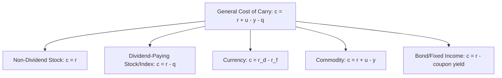
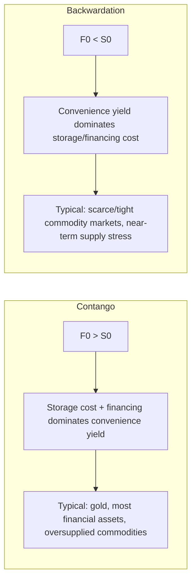

## Pricing Forwards and Futures Under Cost of Carry

### Overview

The cost-of-carry model is the unifying no-arbitrage framework for pricing forward and futures contracts across asset classes. It formalizes the total economic cost (and benefit) of holding the underlying asset from today until contract maturity, financing cost, storage cost, income received, and convenience yield, and shows that the forward/futures price must equal the spot price grossed up by this net carry cost, or a riskless arbitrage opportunity exists.

### The General Cost-of-Carry Formula

$$F_0 = S_0 \, e^{(c)T}$$

where $c$ is the net cost of carry per annum, continuously compounded, composed of:

$$c = r + u - y - q$$

with:

- $r$ = risk-free financing rate
- $u$ = storage/insurance costs (as a percentage yield, for physical commodities)
- $y$ = convenience yield (the non-monetary benefit of holding the physical asset)
- $q$ = income yield received by the asset holder (dividends, foreign interest rate, coupon)

Different asset classes activate different subsets of these terms, producing the asset-class-specific formulas that follow.

### Cost-of-Carry Decomposition by Asset Class

### Case 1: Non-Dividend-Paying Financial Asset

$$F_0 = S_0 \, e^{rT}$$

No storage cost (financial assets are not physically stored), no convenience yield (no physical inventory benefit), no income (by assumption). The full carry cost is simply the cost of financing the purchase, the risk-free rate.

**Derivation via Replication**: Borrow $S_0$ at rate $r$, buy the asset. At $T$, the loan has grown to $S_0 e^{rT}$; the asset (worth $S_T$) is delivered against the forward. No-arbitrage requires the forward price to equal the loan repayment amount, $F_0 = S_0 e^{rT}$, or the strategy generates riskless profit/loss.

### Case 2: Asset with Known Discrete Income (Dividends)

$$F_0 = (S_0 - I)e^{rT}$$

where $I$ is the present value of dividends expected to be paid during the contract's life. The dividend income accrues to the physical holder of the stock but not to the forward holder, so the forward price is reduced by the present value of forgone dividends.

**Alternative form using continuous dividend yield $q$**:

$$F_0 = S_0 \, e^{(r-q)T}$$

This continuous-yield form is standard for equity index futures, where the index comprises many stocks with staggered dividend dates, well-approximated as a continuous yield rather than discrete payments.

### Case 3: Currency Forwards (Covered Interest Rate Parity)

$$F_0 = S_0 \, e^{(r_d - r_f)T}$$

where $r_d$ is the domestic risk-free rate and $r_f$ is the foreign risk-free rate. The foreign currency, when held, earns interest at the foreign rate, functioning economically identically to a continuous dividend yield $q = r_f$. This relationship is known as **covered interest rate parity (CIP)** and is among the most tightly and reliably arbitraged relationships in global finance under normal market conditions.

**Interpretation**: If the domestic rate exceeds the foreign rate ($r_d > r_f$), the forward price of the foreign currency trades at a premium to spot (it costs more forward dollars per unit of foreign currency), compensating for the foreign currency's lower interest-earning capacity relative to the domestic currency.

### Case 4: Commodities with Storage Costs and Convenience Yield

$$F_0 = S_0 \, e^{(r+u-y)T}$$

Physical commodities introduce two carry-cost elements absent from financial assets:

- **Storage cost ($u$)**: The ongoing cost of physically storing and insuring the commodity (warehousing, tank rental, spoilage risk), which adds to the total carry cost, pushing $F_0$ higher.
- **Convenience yield ($y$)**: The non-monetary benefit that accrues to a party holding physical inventory, avoiding stockout risk, maintaining production flexibility, and capturing the option value of having physical supply on hand during scarcity. Convenience yield reduces the effective carry cost and, when sufficiently large, can push the futures curve into backwardation ($F_0 < S_0$).

Because convenience yield is not directly observable (unlike $r$ and $u$, which can be estimated from financing and storage markets), it is typically inferred residually from the observed relationship between $F_0$, $S_0$, $r$, and $u$:

$$y = r + u - \frac{1}{T}\ln\left(\frac{F_0}{S_0}\right)$$

### Contango and Backwardation

**Contango**: $F_0 > S_0$. Carry cost ($r + u$) exceeds convenience yield $y$; typical for gold and other easily-storable, non-consumed assets with low convenience yield, and for commodities in oversupplied conditions.

**Backwardation**: $F_0 < S_0$. Convenience yield $y$ exceeds carry cost; typical for commodities experiencing near-term scarcity or supply tightness, where the benefit of holding physical inventory outweighs financing and storage costs.

### Worked Numerical Example: Commodity Cost of Carry

A commodity trades at $S_0 = \$80$/unit. The annual risk-free rate is $r = 4\%$, storage costs are $u = 3\%$ per annum (as a yield on spot value), and the contract matures in $T = 0.5$ years (6 months).

**Scenario A: No convenience yield (y = 0)**

$$F_0 = 80 \times e^{(0.04 + 0.03 - 0) \times 0.5} = 80 \times e^{0.035} \approx 80 \times 1.03562 \approx \$82.85$$

The market is in contango.

**Scenario B: High convenience yield (y = 6%, tight supply)**

$$F_0 = 80 \times e^{(0.04 + 0.03 - 0.06) \times 0.5} = 80 \times e^{0.005} \approx 80 \times 1.00501 \approx \$80.40$$

Net carry cost is much lower, and the futures price sits only slightly above spot, illustrating how rising convenience yield compresses (and can invert) the contango structure.

**Scenario C: Very high convenience yield (y = 10%, severe scarcity)**

$$F_0 = 80 \times e^{(0.04 + 0.03 - 0.10) \times 0.5} = 80 \times e^{-0.015} \approx 80 \times 0.98511 \approx \$78.81$$

The market flips into backwardation: $F_0 < S_0$.

### Futures vs. Forward Prices Under Cost of Carry: A Technical Note

Under the idealized assumption of constant, deterministic interest rates, forward and futures prices on the same underlying with the same maturity are theoretically identical. When interest rates are stochastic and correlated with the underlying's price, futures and forward prices can diverge slightly due to the interest-rate implications of daily mark-to-market cash flows (the reinvestment of daily variation margin gains/losses at a rate that may differ from the rate embedded in the forward price). [Inference: this divergence is generally small for most underlyings over typical contract maturities and is more of a theoretical refinement than a practically significant pricing gap for most standard applications, though it becomes more material for long-dated contracts on underlyings with strong price-interest rate correlation, such as interest rate futures themselves.] For most practical purposes in standard curricula and applications, forward and futures prices are treated as equal.

### Cost-of-Carry Pricing Summary Table

| Asset Class | Formula | Key Carry Component |
| --- | --- | --- |
| Non-dividend stock/index | $F_0 = S_0 e^{rT}$ | Financing only |
| Dividend-paying stock/index | $F_0 = S_0 e^{(r-q)T}$ | Financing net of dividend yield |
| Currency | $F_0 = S_0 e^{(r_d - r_f)T}$ | Interest rate differential |
| Commodity | $F_0 = S_0 e^{(r+u-y)T}$ | Financing + storage net of convenience yield |
| Bond (coupon-bearing) | $F_0 = (S_0 - I)e^{rT}$ | Financing net of PV of coupons |

### Key Points

- The cost-of-carry model expresses the forward/futures price as the spot price grossed up by the net cost of holding the underlying asset until maturity: financing cost plus storage cost, minus income received and convenience yield.
- Each asset class activates a different subset of carry components: pure financing for non-dividend financial assets, interest rate differentials for currencies (covered interest rate parity), and the full storage/convenience-yield framework for physical commodities.
- Convenience yield, unlike the other carry components, is not directly observable and must be inferred from the observed forward-spot relationship; it is the primary driver of whether a commodity market trades in contango or backwardation.
- The cost-of-carry formula is a direct application of no-arbitrage/replication logic: any deviation between the observed futures price and the cost-of-carry fair value permits a cash-and-carry or reverse cash-and-carry arbitrage strategy, which is the economic mechanism enforcing the relationship in liquid markets.

### Related Topics

- Arbitrage, Short Selling, and No-Arbitrage Pricing
- Forward Contract Mechanics and Payoff Profiles
- Futures Contract Specifications and Standardization
- Covered Interest Rate Parity and FX Forward Pricing
- Contango, Backwardation, and Roll Yield in Commodity Futures
- Convenience Yield Estimation and Commodity Curve Analysis
- Interest Rate Futures and the Forward-Futures Price Divergence