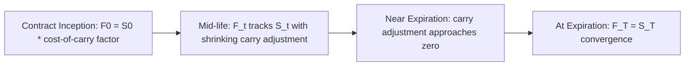

## Convergence of Futures and Spot Prices

### Overview

As a futures contract approaches its expiration date, its price must converge toward the spot price of the underlying asset. This convergence property is not an empirical regularity but a direct, near-mechanical consequence of no-arbitrage pricing: at the instant of expiration, a futures contract and an immediate spot transaction become economically indistinguishable, so any persistent price gap at that moment would represent a riskless arbitrage opportunity.

### Why Convergence Must Occur

**The Zero-Maturity Argument**

The cost-of-carry formula $F_t = S_t \, e^{c(T-t)}$ shows that the carry adjustment term shrinks toward zero as $t \to T$ (i.e., as $T - t \to 0$):

$$\lim_{t \to T} F_t = \lim_{t \to T} S_t \, e^{c(T-t)} = S_T \, e^{0} = S_T$$

At the instant of expiration, there is no remaining time over which to finance, store, or earn convenience yield on the underlying, so the carry cost term vanishes and the futures price must equal the spot price.

**Arbitrage Enforcement**

If $F_T \neq S_T$ at (or immediately before) expiration:

- If $F_T > S_T$: An arbitrageur simultaneously buys the underlying spot and sells the futures contract (which, at expiration, is essentially a spot transaction), locking in the difference $F_T - S_T$ as riskless profit with no meaningful time exposure remaining.
- If $F_T < S_T$: The arbitrageur executes the reverse, buys the futures (obtaining the underlying at $F_T$ via delivery) and simultaneously sells the underlying spot at $S_T$, capturing $S_T - F_T$.

Because this arbitrage requires essentially no capital commitment period and no meaningful residual risk at the point of expiration, the enforcement mechanism is extremely tight, convergence failures at true expiration are rare and typically small, quickly closed by high-frequency and algorithmic arbitrage activity in liquid markets.

### Convergence Pattern Over the Contract's Life

The basis, defined as $\text{Basis}_t = S_t - F_t$, follows a predictable pattern: it starts at a value determined by the initial cost of carry and theoretically shrinks toward zero as expiration approaches (subject to the caveats on physical delivery contracts discussed below), assuming carry-cost parameters ($r$, $u$, $y$, $q$) remain roughly stable over the contract's remaining life.

**Convergence Diagram (svg_diagram)**

<svg xmlns="http://www.w3.org/2000/svg" viewBox="0 0 640 320">
<text x="320" y="20" font-size="14" text-anchor="middle" font-family="sans-serif" font-weight="bold">Futures-Spot Convergence Toward Expiration (svg_diagram)</text>
<line x1="60" y1="280" x2="600" y2="280" stroke="black" stroke-width="1" />
<line x1="60" y1="280" x2="60" y2="40" stroke="black" stroke-width="1" />
<text x="600" y="295" font-size="11" text-anchor="end" font-family="sans-serif">Time (approaching T)</text>
<text x="65" y="50" font-size="11" font-family="sans-serif">Price</text>
<path d="M 80 260 Q 300 230 580 150" fill="none" stroke="#2b6cb0" stroke-width="2" />
<text x="400" y="200" font-size="11" fill="#2b6cb0" font-family="sans-serif">Spot Price (S_t)</text>
<path d="M 80 160 Q 300 190 580 150" fill="none" stroke="#c53030" stroke-width="2" />
<text x="400" y="140" font-size="11" fill="#c53030" font-family="sans-serif">Futures Price (F_t)</text>
<circle cx="580" cy="150" r="4" fill="black" />
<text x="560" y="175" font-size="10" font-family="sans-serif">Convergence at T</text>
</svg>

### Convergence for Cash-Settled vs. Physically-Settled Contracts

**Cash-Settled Futures**

For cash-settled contracts (most equity index and many financial futures), the final settlement price is explicitly *defined* to equal a specified measure of the spot price at expiration (e.g., the official closing index value, or a volume-weighted average over a defined settlement window). Convergence is therefore built into the contract's settlement mechanism by construction, rather than relying purely on market arbitrage forces, though arbitrage still keeps the futures price tracking spot closely in the period leading up to that final, definitionally-convergent settlement.

**Physically-Settled Futures**

For physically-settled contracts, convergence is enforced by the arbitrage mechanism described above, holding the futures contract to expiration results in an obligation to make or take delivery of the actual underlying at the delivery price, which must equal the prevailing spot price (net of any grade/location adjustments) or arbitrage would be immediately available. Convergence for physical-delivery contracts can, in practice, exhibit somewhat more idiosyncratic behavior around expiration due to delivery logistics, warehouse capacity constraints, and the cheapest-to-deliver optionality embedded in some contracts (notably Treasury bond futures), which can cause the futures price to converge to the cheapest-to-deliver instrument's price rather than a single simple spot reference.

### Historical Illustration: The 2020 Negative WTI Crude Oil Event

[Unverified: the following is a widely reported market event; specific settlement price details should be confirmed against contemporaneous exchange records if precise figures are required.] In April 2020, the expiring May WTI crude oil futures contract traded to a deeply negative settlement price shortly before expiration, an extreme illustration of convergence dynamics breaking down under exceptional circumstances: collapsing demand from pandemic-related lockdowns combined with severely constrained physical storage capacity at the Cushing, Oklahoma delivery point meant that market participants holding long futures positions approaching physical delivery obligations were, in effect, willing to pay counterparties to take the contractual delivery obligation off their hands rather than face the logistical and financial burden of taking physical delivery with no available storage. This episode is frequently cited as a case study in how physical delivery mechanics, storage capacity constraints, and contract-specific settlement rules can produce extreme, non-intuitive convergence behavior at expiration when normal cost-of-carry arbitrage assumptions (notably, the assumption of freely available storage) break down.

### Basis Risk and Convergence

**The Practical Importance of Convergence for Hedgers**

Hedgers using futures contracts rely on convergence to ensure their hedge becomes increasingly effective as the hedge horizon approaches the contract's expiration. If a hedger's physical transaction date coincides with (or is close to) the futures contract's expiration date, the basis at the hedge's unwind date will be small (theoretically zero for a matched cash-settled contract), minimizing residual basis risk.

**When the Hedge Horizon Does Not Match Contract Expiration**

If a hedger closes out a futures position before expiration (common when the hedger's need doesn't align with a listed contract month, or when rolling a hedge across multiple contract periods), the basis at the point of unwind will generally not have fully converged to zero, leaving residual basis risk that depends on the remaining carry-cost term at that point in time. This is a key practical distinction from the "clean" convergence-at-expiration case.

### Convergence and the Term Structure of Futures Prices

At any given moment, an exchange typically lists multiple contract months for the same underlying, each with a different time to expiration and therefore a different carry-cost adjustment relative to spot. As the nearest ("front-month") contract approaches its expiration and converges to spot, the next contract month becomes the new front-month and itself begins its own convergence process toward the (then-current) spot price as its own expiration approaches. This rolling, sequential convergence process across the futures curve is the mechanism underlying futures curve roll dynamics and roll yield.

### Key Points

- Futures and spot prices must converge toward each other as contract expiration approaches, a direct mathematical consequence of the cost-of-carry formula's time-to-maturity term shrinking to zero, not merely an empirical tendency.
- Convergence is enforced by arbitrage (buying spot/selling futures or vice versa when a gap persists) for physically-settled contracts, and is built directly into the settlement price definition for cash-settled contracts.
- Convergence failures, while rare in liquid, well-functioning markets, can occur under extreme conditions where a core cost-of-carry assumption breaks down, as illustrated by the 2020 negative WTI crude event, where physical storage capacity constraints invalidated the standard "storage is freely available" assumption underlying normal convergence behavior.
- Convergence is practically important for hedgers because it determines how effectively a futures hedge eliminates basis risk; a hedge unwound at or very near contract expiration benefits from minimal basis, while a hedge closed well before expiration, or rolled across contract months, retains meaningful residual basis risk.

### Related Topics

- Pricing Forwards and Futures Under Cost of Carry
- Futures Contract Specifications and Standardization
- Basis Risk and Cross-Hedging Strategies
- Cheapest-to-Deliver and Physical Delivery Mechanics
- Contango, Backwardation, and Roll Yield in Commodity Futures
- The 2020 Negative Oil Prices Event: Physical Delivery and Storage Constraints
- Hedge Ratio Calculation and Rolling Hedge Strategies