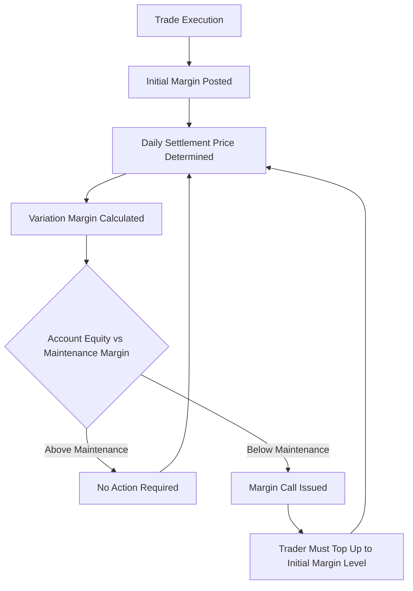
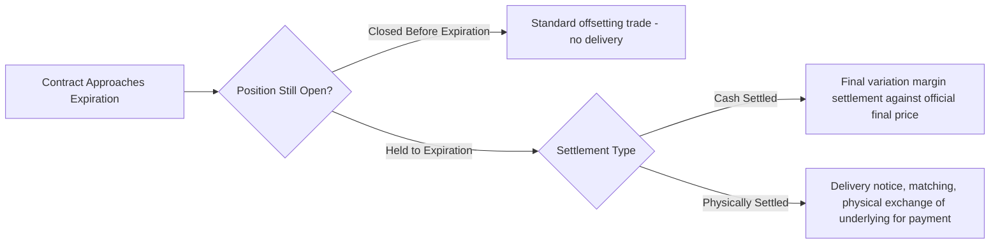

## Margining, Marking to Market, and Settlement

### Overview

Margining and daily mark-to-market settlement are the operational risk-management mechanisms that make exchange-traded futures fundamentally safer, from a counterparty risk perspective, than uncollateralized OTC forwards. Rather than allowing gains and losses to accumulate unrealized until a single maturity date, futures markets settle profit and loss in cash every trading day, backed by collateral (margin) sized to cover potential losses over a short liquidation horizon. This item details the mechanics of initial margin, variation margin, maintenance margin, margin call procedures, and the settlement process at expiration.

### The Margining Framework

### Initial Margin

**Definition**

Initial margin is the collateral a trader must deposit with their broker (which in turn typically posts corresponding margin with the clearinghouse) before opening a futures position. It is not a down payment toward the contract's value, but a **performance bond** designed to cover the maximum probable loss on the position over a defined short liquidation horizon (commonly one trading day) at a specified confidence level.

**Calculation Methodology: SPAN Margining**

Most major derivatives clearinghouses use a risk-based margining methodology, historically pioneered by the CME's **SPAN (Standard Portfolio Analysis of Risk)** system. Rather than margining each position independently, SPAN evaluates the entire portfolio under a defined set of scenario shocks (combinations of price moves and volatility changes across a specified range) and sets margin equal to the worst-case portfolio loss across those scenarios, net of offsetting/correlated positions. [Inference: many major clearinghouses now use proprietary evolved variants of, or alternatives to, the original SPAN methodology (such as SPAN 2 or other value-at-risk-based approaches); the specific current margining methodology in use at any given CCP should be confirmed against that CCP's published risk methodology documentation, as this is an area of ongoing evolution across clearinghouses.]

**Typical Magnitude**

Initial margin is typically a small percentage of the contract's total notional value, commonly in the range of 2-15% depending on the underlying's volatility, though this varies substantially by asset class and market conditions (margin requirements are dynamically adjusted upward during periods of elevated volatility).

### Variation Margin

**Definition**

Variation margin is the daily cash settlement of the position's gain or loss, calculated by comparing the current day's official settlement price to the prior day's settlement price (or the trade execution price, for a position opened during the day).

$$\text{Daily Variation Margin} = (\text{Settlement Price}_t - \text{Settlement Price}_{t-1}) \times \text{Contract Multiplier} \times N$$

where $N$ is the number of contracts held (positive for long positions, negative for short).

**Cash Flow Mechanics**

- If the settlement price moves favorably for a position, variation margin is credited to that account (paid by the clearinghouse, ultimately sourced from the losing side's account).
- If the settlement price moves adversely, variation margin is debited from the account (paid to the clearinghouse, to be passed to the gaining side).

This process realizes gains and losses in cash on a daily basis, in contrast to a forward contract's single payoff realized only at maturity.

### Maintenance Margin

**Definition**

Maintenance margin is the minimum account equity level that must be preserved after initial margin is posted. It is typically set below the initial margin level (commonly around 75-90% of initial margin, though this varies by exchange and product).

**Margin Call Mechanism**

If daily variation margin losses reduce account equity below the maintenance margin threshold, the broker issues a **margin call**, requiring the trader to deposit additional funds to restore the account to the full initial margin level (not merely back up to the maintenance threshold). Failure to meet a margin call within the specified timeframe typically results in the broker liquidating some or all of the position to protect against further loss.

### Worked Numerical Example: Margining Mechanics

A trader buys 1 contract of a futures product with contract multiplier $50/point, at an entry price of 4,500.00. Initial margin = $12,000; maintenance margin = $9,600.

| Day | Settlement Price | Daily Change | Variation Margin | Account Equity | Margin Call? |
| --- | --- | --- | --- | --- | --- |
| 0 (entry) | 4,500.00 | — | — | $12,000 | No |
| 1 | 4,480.00 | -20.00 | -$1,000 | $11,000 | No (above $9,600) |
| 2 | 4,450.00 | -30.00 | -$1,500 | $9,500 | **Yes** (below $9,600) |
| 2 (after call) | — | — | Deposit $2,500 | $12,000 | Restored to initial margin |
| 3 | 4,470.00 | +20.00 | +$1,000 | $13,000 | No |

On Day 2, the account equity ($9,500) falls below the $9,600 maintenance margin threshold, triggering a margin call. The trader must deposit enough to restore the account to the full **initial** margin level of $12,000 (a deposit of $2,500), not merely back to the $9,600 maintenance threshold.

### Settlement at Contract Expiration

**Final Settlement Price**

Every futures contract's final settlement is based on an officially determined **final settlement price**, computed according to methodology precisely specified in the contract's rules (e.g., a volume-weighted average price over a defined closing window, or a specific index closing value), designed to be difficult to manipulate and closely representative of the true market-clearing spot price at expiration.

**Cash-Settled Contract Expiration**

For cash-settled contracts, the final day's variation margin settlement (computed against the final settlement price rather than a subsequent day's settlement price) effectively closes out all open positions in cash; no further action is required from position holders.

**Physically-Settled Contract Expiration**

For physically-settled contracts, positions still open at expiration proceed into the delivery process:

1. The clearinghouse matches long and short position holders for delivery (via an assignment process, often randomized or based on position seniority per exchange rules).
2. The short position delivers the specified underlying (meeting contract-specified grade/quality/location requirements) to the long position.
3. The long position pays the final settlement price (or, for certain contracts, the original contract price with appropriate settlement adjustments) for the delivered quantity.
4. Most speculative and financial participants close out (offset) their positions before the delivery notice period begins specifically to avoid engaging in the physical delivery process, which is operationally intended primarily for commercial participants with genuine physical delivery needs or capabilities.

### Settlement Process Flow

### Comparison: Futures Margining vs. Forward Contract Settlement

| Feature | Futures (Margined) | Forward (Typically Uncollateralized) |
| --- | --- | --- |
| Cash flow timing | Daily (variation margin) | Single payment at maturity |
| Counterparty risk exposure | Limited to one day's potential loss (covered by margin) | Full accumulated gain/loss exposed until maturity |
| Collateral requirement | Mandatory initial + variation margin | None, unless a CSA specifically requires it |
| Loss realization | Realized in cash daily | Unrealized (paper) until maturity |
| Central counterparty | Yes (CCP via novation) | No (bilateral, unless centrally cleared) |

### Why Daily Margining Reduces Systemic Risk

By settling gains and losses daily and requiring immediate replenishment of any margin shortfall, the futures margining system prevents the large, uncollateralized exposure accumulation that characterized much of the pre-2008 uncollateralized OTC derivatives landscape. A defaulting party's maximum potential loss to the clearinghouse (and, by extension, to the broader financial system) is limited to at most one day's adverse price movement (plus any gap risk beyond the posted margin in extreme conditions), rather than the full accumulated maturity-date exposure possible under an unmargined forward contract. This is a principal reason post-2008 regulatory reform pushed standardized OTC derivatives toward mandatory central clearing, which imposes futures-style daily margining on instruments that were previously uncollateralized bilateral forwards/swaps.

### Key Points

- Initial margin is a performance bond covering potential future exposure (not a down payment), typically calculated via risk-based scenario methodologies such as SPAN, while variation margin is the daily cash settlement of realized gain/loss against the official daily settlement price.
- Maintenance margin sets the minimum equity threshold that triggers a margin call; when triggered, the trader must restore the account to the full initial margin level, not merely to the maintenance threshold.
- Daily mark-to-market settlement is the core structural feature distinguishing futures from forwards, converting a single, unrealized maturity-date payoff into a stream of realized daily cash flows, which sharply limits the maximum uncollateralized exposure any party can accumulate.
- Final settlement follows either a cash-settlement process (closing via a final official settlement price) or a physical delivery process (matching, delivery, and payment), with most non-commercial participants closing positions before delivery obligations begin.
- The daily margining framework, by limiting maximum potential counterparty loss to roughly one day's price movement, was a central template motivating post-2008 mandatory central clearing requirements for previously uncollateralized OTC derivatives.

### Related Topics

- Futures Contract Specifications and Standardization
- Forward Contract Mechanics and Payoff Profiles
- Convergence of Futures and Spot Prices
- Central Clearing and CCP Default Waterfalls
- SPAN Margining Methodology and Portfolio Risk Scenarios
- Counterparty Credit Risk and CVA in Uncollateralized OTC Contracts
- Uncleared Margin Rules (UMR) and Post-Crisis Bilateral Collateralization