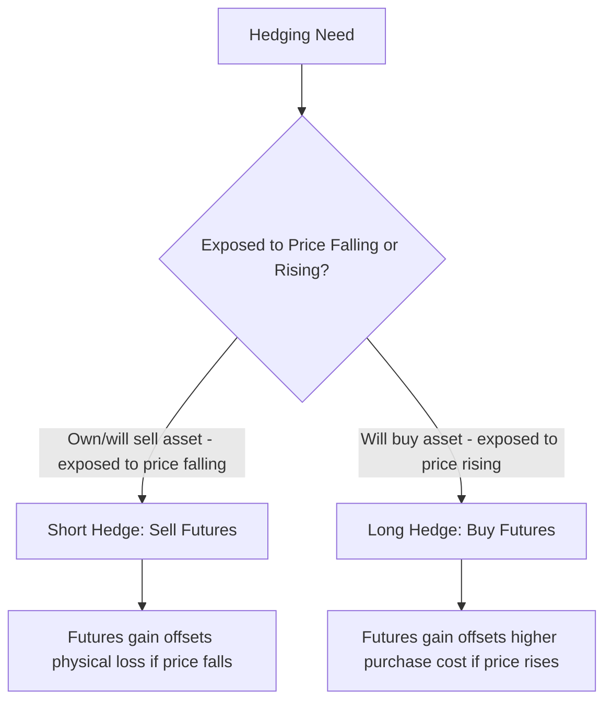

## Hedging With Forwards and Futures

### Overview

Hedging with forwards and futures is the practical application of the linear payoff profile these instruments provide: by taking a derivative position that moves inversely to an existing (or anticipated) exposure, a hedger converts an uncertain future price or cash flow into a substantially more predictable one. This item covers short and long hedges, the mechanics of hedge ratio determination, cross-hedging, rolling hedges, and the practical limitations that prevent hedges from achieving perfect risk elimination.

### Short Hedge vs. Long Hedge

**Short Hedge**

A short hedge involves selling (going short) futures or forward contracts to protect against a decline in the value of an asset the hedger already owns or will produce/sell in the future.

- *Typical user*: A producer or holder of an asset who is exposed to price declines, a farmer with a future harvest, an oil producer with future production, a portfolio manager holding a long equity position.
- *Mechanism*: If the underlying's price falls, the physical/portfolio position loses value, but the short futures position gains, offsetting the loss.

**Long Hedge**

A long hedge involves buying (going long) futures or forward contracts to protect against a rise in the value of an asset the hedger will need to purchase in the future.

- *Typical user*: A manufacturer needing a raw material input, an airline needing future fuel, an investor planning a future equity purchase who wants to lock in today's price level.
- *Mechanism*: If the underlying's price rises, the future purchase becomes more expensive, but the long futures position gains, offsetting the higher cost.

### Worked Example: Short Hedge

A wheat farmer expects to harvest 50,000 bushels in three months. Current spot price: $6.00/bushel. Three-month wheat futures price: $6.20/bushel (contract size 5,000 bushels; 10 contracts needed for a full hedge).

The farmer sells 10 futures contracts.

| Scenario | Spot at Harvest | Futures P&L (per bushel) | Physical Sale Revenue | Net Effective Price |
| --- | --- | --- | --- | --- |
| Price falls to $5.50 | $5.50 | +$0.70 (short gain) | $5.50 | $6.20 |
| Price unchanged | $6.20 | $0.00 | $6.20 | $6.20 |
| Price rises to $7.00 | $7.00 | -$0.80 (short loss) | $7.00 | $6.20 |

Regardless of the spot price movement, the short hedge locks in an effective sale price close to the original futures price of $6.20/bushel (subject to basis risk, discussed below).

### Worked Example: Long Hedge

An airline expects to purchase 420,000 gallons of jet fuel in two months. Current spot price: $2.40/gallon. Two-month jet fuel futures price: $2.45/gallon.

The airline buys futures contracts covering the equivalent notional exposure.

| Scenario | Spot at Purchase | Futures P&L (per gallon) | Physical Purchase Cost | Net Effective Cost |
| --- | --- | --- | --- | --- |
| Price falls to $2.10 | $2.10 | -$0.35 (long loss) | $2.10 | $2.45 |
| Price unchanged | $2.45 | $0.00 | $2.45 | $2.45 |
| Price rises to $2.80 | $2.80 | +$0.35 (long gain) | $2.80 | $2.45 |

The long hedge locks in an effective purchase cost close to $2.45/gallon regardless of the spot price at the time of physical purchase.

### Determining the Hedge Ratio

**Naive (One-to-One) Hedge**

The simplest approach matches the notional value of the futures position to the notional value of the exposure being hedged, implicitly assuming a hedge ratio of 1.0 and perfect correlation between the hedging instrument and the exposure.

$$N^* = \frac{\text{Notional Value of Exposure}}{\text{Notional Value of One Futures Contract}}$$

**Minimum-Variance Hedge Ratio**

When the futures contract does not perfectly track the exposure (a cross-hedge, or even a direct hedge with basis risk), the variance-minimizing hedge ratio is:

$$h^* = \rho \, \frac{\sigma_S}{\sigma_F}$$

where $\rho$ is the correlation coefficient between changes in the spot price of the exposure ($\Delta S$) and changes in the futures price ($\Delta F$), $\sigma_S$ is the standard deviation of $\Delta S$, and $\sigma_F$ is the standard deviation of $\Delta F$. This is mathematically equivalent to the slope coefficient from an OLS regression of $\Delta S$ on $\Delta F$.

**Number of Contracts**

$$N^* = h^* \times \frac{Q_A}{Q_F}$$

where $Q_A$ is the size of the position being hedged and $Q_F$ is the size of one futures contract.

**Hedge Effectiveness**

The proportion of variance in the unhedged position that is eliminated by the optimal hedge is given by $\rho^2$ (the coefficient of determination from the regression), providing a direct, interpretable measure of how effective a given hedge is expected to be.

### Worked Example: Minimum-Variance Hedge Ratio

An airline wants to hedge jet fuel exposure using heating oil futures (no direct jet fuel futures contract is available in this illustrative scenario, requiring a cross-hedge). Historical analysis of weekly price changes gives: $\sigma_S = 0.032$ (jet fuel), $\sigma_F = 0.040$ (heating oil futures), $\rho = 0.85$.

$$h^* = 0.85 \times \frac{0.032}{0.040} = 0.85 \times 0.80 = 0.68$$

If the airline needs to hedge exposure equivalent to 42,000 barrels, and one heating oil futures contract represents 1,000 barrels:

$$N^* = 0.68 \times \frac{42{,}000}{1{,}000} = 28.56 \approx 29 \text{ contracts}$$

Hedge effectiveness: $\rho^2 = 0.85^2 = 0.7225$, indicating the hedge is expected to eliminate approximately 72% of the variance in unhedged jet fuel cost exposure.

### Cross-Hedging

When no futures contract exists on the exact underlying being hedged, a hedger uses the most closely correlated available contract, a **cross-hedge**. This is common for:

- Jet fuel (hedged via heating oil or crude oil futures)
- Specific bond portfolios (hedged via Treasury futures with imperfect duration/curve match)
- Regional or specialty commodity grades (hedged via the nearest standardized benchmark contract)

Cross-hedging necessarily introduces additional basis risk beyond what exists in a direct hedge, since the correlation $\rho$ between the exposure and the hedging instrument is, by definition, less than perfect.

### Rolling Hedges

When the hedging horizon extends beyond the maturity of available futures contracts (e.g., hedging a five-year exposure using futures contracts that only extend liquidly to one year), hedgers use a **rolling hedge** or **stack-and-roll** strategy: maintain a hedge position in the nearest liquid contract month, and roll it forward into the next contract month as expiration approaches, repeating until the full hedge horizon is covered.

**Key risk**: Rolling hedges introduce **rollover basis risk** and exposure to changes in the shape of the futures curve (contango/backwardation) at each roll date, since the price relationship between the expiring and new contract is not fixed in advance. A well-known cautionary case study is Metallgesellschaft's 1993 losses on a stack-and-roll oil hedging program, frequently cited in risk management literature as illustrating how rolling hedge strategies can generate substantial interim cash-flow/margin strain even when the underlying hedge is economically sound over the full horizon. [Unverified: specific figures and causal details of this case are widely discussed in academic and industry literature but vary somewhat by source; consult primary case-study analyses for precise figures if required.]

### Sources of Residual Hedge Risk

**Key Points**

- **Basis risk**: The hedging instrument's price does not move in perfect lockstep with the exposure being hedged, whether because the contract references a slightly different underlying (cross-hedge), because delivery location/grade differs, or simply because the hedge is closed before the futures contract's expiration (incomplete convergence).
- **Quantity/timing mismatch**: The hedger's exact exposure size or timing may not align precisely with available contract sizes or expiration dates, requiring rounding of contract numbers and accepting some residual mismatch.
- **Rollover risk**: For hedges extending beyond a single contract's maturity, the shape and evolution of the futures curve at each roll date introduces additional uncertainty not present in a single-period hedge.
- **Margin/liquidity risk**: Even a "successful" hedge (positive net economic outcome) can generate substantial interim variation margin calls if the futures leg moves adversely before the offsetting physical gain is realized, potentially straining short-term liquidity even when the hedge is fundamentally sound.

### Hedging Outcome Illustration (svg_diagram)

<svg xmlns="http://www.w3.org/2000/svg" viewBox="0 0 640 300">
<text x="320" y="20" font-size="14" text-anchor="middle" font-family="sans-serif" font-weight="bold">Unhedged vs Hedged Cost Outcome (svg_diagram)</text>
<line x1="60" y1="260" x2="600" y2="260" stroke="black" stroke-width="1" />
<line x1="60" y1="260" x2="60" y2="40" stroke="black" stroke-width="1" />
<text x="600" y="275" font-size="11" text-anchor="end" font-family="sans-serif">Spot Price at Purchase</text>
<text x="65" y="50" font-size="11" font-family="sans-serif">Effective Cost</text>
<line x1="80" y1="240" x2="580" y2="60" stroke="#c53030" stroke-width="2" stroke-dasharray="4,3" />
<text x="450" y="100" font-size="11" fill="#c53030" font-family="sans-serif">Unhedged Cost</text>
<line x1="80" y1="150" x2="580" y2="150" stroke="#2b6cb0" stroke-width="2" />
<text x="450" y="140" font-size="11" fill="#2b6cb0" font-family="sans-serif">Hedged Cost (locked-in)</text>
</svg>

### Key Points

- A short hedge (selling futures) protects a holder or producer against price declines; a long hedge (buying futures) protects a future buyer against price increases, in both cases the futures position's gain/loss offsets the opposite movement in the physical exposure.
- The minimum-variance hedge ratio $h^* = \rho(\sigma_S/\sigma_F)$ generalizes the naive one-to-one hedge to account for imperfect correlation between the hedging instrument and the exposure, and its square, $\rho^2$, directly measures expected hedge effectiveness.
- Cross-hedging (using a correlated but non-identical futures contract) and rolling hedges (extending a hedge beyond a single contract's maturity via sequential contract rolls) are common practical necessities that introduce additional basis and rollover risk beyond a simple, direct, single-period hedge.
- Even a well-designed, ultimately successful hedge can generate significant interim margin/liquidity strain due to daily mark-to-market settlement, a risk management consideration distinct from, but as important as, the hedge's expected final economic outcome, as illustrated by well-known cases such as Metallgesellschaft's 1993 rolling hedge losses.

### Related Topics

- Market Participants: Hedgers, Speculators, and Arbitrageurs
- Futures Contract Specifications and Standardization
- Margining, Marking to Market, and Settlement
- Convergence of Futures and Spot Prices
- Basis Risk and Cross-Hedging Strategies in Depth
- Contango, Backwardation, and Roll Yield in Commodity Futures
- The Metallgesellschaft Case: Stack-and-Roll Hedging Risk