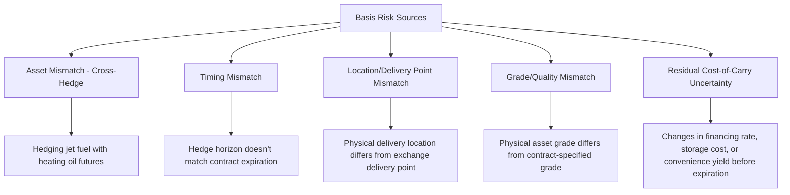

## Basis Risk and Cross Hedging

### Overview

Basis risk is the residual risk that remains in a hedged position because the hedging instrument's price does not move in perfect lockstep with the price of the exposure being hedged. It is the single most important practical limitation on hedging effectiveness: even a well-constructed hedge using futures or forwards rarely eliminates risk entirely, it transforms outright price risk into the generally smaller, but not zero, risk that the *relationship* between spot and futures prices changes unexpectedly. Cross-hedging, using a correlated but non-identical instrument to hedge an exposure lacking its own liquid, direct hedging instrument, is the primary practical circumstance under which basis risk becomes most pronounced.

### Defining Basis

$$\text{Basis} = S_t - F_t$$

where $S_t$ is the spot price of the asset being hedged and $F_t$ is the futures price of the contract used to hedge it. For a **direct hedge** (the futures contract's underlying exactly matches the exposure), basis arises purely from the cost-of-carry term and theoretically converges to zero as the contract approaches expiration. For a **cross-hedge** (the futures underlying differs from the exposure), basis includes an additional component reflecting the price relationship between the two distinct assets, which need not converge to zero even at the futures contract's expiration.

### Basis Risk in a Short Hedge

For a hedger who is long the physical asset and short the futures (a short hedge), the effective price realized is:

$$\text{Effective Price} = S_2 + (F_1 - F_2) = F_1 + (S_2 - F_2) = F_1 + b_2$$

where $S_2$ is the spot price at the time the hedge is closed, $F_1$ is the futures price when the hedge was initiated, $F_2$ is the futures price when the hedge is closed, and $b_2 = S_2 - F_2$ is the basis at the time the hedge is closed. The hedger locks in the initial futures price $F_1$, **adjusted by the basis prevailing at the time the hedge is unwound**, rather than achieving a perfectly fixed price. If $b_2$ were known with certainty in advance, the hedge would be perfect; because $b_2$ is itself uncertain at the time the hedge is initiated, basis risk exists.

### Basis Risk in a Long Hedge

For a hedger who will buy the physical asset in the future and is long the futures (a long hedge):

$$\text{Effective Cost} = S_2 - (F_2 - F_1) = F_1 + (S_2 - F_2) = F_1 + b_2$$

The same structural result holds: the effective cost is the initial futures price adjusted by the closing basis, again leaving the hedger exposed to uncertainty in $b_2$ rather than the full, unhedged uncertainty in $S_2$. Critically, basis risk is *smaller* than the unhedged price risk in nearly all practical cases, hedging substantially reduces risk even when it does not eliminate it, because basis (the difference between two related prices) is typically far less volatile than either price in isolation.

### Sources of Basis Risk

**Asset Mismatch (Cross-Hedging)**

When no futures contract exists on the exact underlying, the hedger selects the most closely correlated available contract. The basis then reflects the entire price relationship between two economically related but distinct assets (e.g., jet fuel vs. heating oil), which can shift due to factors specific to one asset but not the other (refining margin shifts, regional supply disruptions, regulatory changes affecting one product but not the other).

**Timing Mismatch**

If the hedger's actual transaction date does not coincide with the futures contract's expiration (either because no contract expires on the needed date, or because the hedger closes the position early for liquidity or operational reasons), the basis at the time of hedge unwind reflects whatever carry-cost conditions prevail at that intermediate date, rather than the fully-converged, zero (or near-zero) basis achieved only at true expiration.

**Location Basis**

Futures contracts specify a particular delivery location (e.g., WTI crude oil futures deliver at Cushing, Oklahoma); a hedger whose physical exposure is priced at a different location faces basis risk arising from the price differential between the two locations, which can vary with local supply/demand, transportation costs, and infrastructure constraints.

**Grade/Quality Basis**

Physical commodities vary in grade and quality; if the hedger's physical exposure does not exactly match the contract's specified deliverable grade, the price differential between grades (which can fluctuate based on relative supply/demand for each grade) introduces additional basis risk.

### Cross-Hedging: Selecting the Hedging Instrument

**Selection Criterion**

The ideal cross-hedge instrument maximizes the correlation $\rho$ between changes in the exposure's price and changes in the hedging instrument's price, since (per the minimum-variance hedge ratio framework) hedge effectiveness is directly proportional to $\rho^2$.

**Common Cross-Hedge Pairings**

| Exposure | Common Cross-Hedge Instrument | Basis Risk Driver |
| --- | --- | --- |
| Jet fuel | Heating oil futures, crude oil futures | Refining margin/crack spread shifts |
| Specific corporate bond portfolio | Treasury futures | Credit spread changes, duration mismatch |
| Regional natural gas | Henry Hub futures | Regional basis differentials, pipeline constraints |
| Diversified equity portfolio | Broad index futures (e.g., S&P 500) | Portfolio-specific idiosyncratic performance vs. index |
| Specialty/local commodity grade | Nearest standardized benchmark contract | Grade/location price differential |

### Worked Example: Basis Risk Quantification

A refiner needs to hedge 100,000 barrels of a specialty crude grade priced at a location without a direct futures contract. The refiner uses WTI futures as a cross-hedge. Historical basis data (specialty grade price minus WTI futures price) over the past 24 months shows a mean basis of $2.10/barrel with a standard deviation of $0.85/barrel.

If the refiner initiates the hedge when the basis is $2.10 (the historical mean) and the basis remains exactly at $2.10 when the hedge is closed, the hedge is effectively perfect (locks in the intended price with no basis surprise). However, because the basis has historically varied with a standard deviation of $0.85/barrel, the refiner should expect the *realized* effective price to deviate from the intended target by roughly this magnitude in either direction under normal historical variability, substantially smaller than the outright price volatility of the specialty crude itself, but not zero.

### Basis Risk Illustration (svg_diagram)

<svg xmlns="http://www.w3.org/2000/svg" viewBox="0 0 640 300">
<text x="320" y="20" font-size="14" text-anchor="middle" font-family="sans-serif" font-weight="bold">Basis Risk: Spot vs Futures Price Paths (svg_diagram)</text>
<line x1="60" y1="260" x2="600" y2="260" stroke="black" stroke-width="1" />
<text x="600" y="275" font-size="11" text-anchor="end" font-family="sans-serif">Time</text>
<path d="M 80 150 Q 250 100 400 130 T 580 90" fill="none" stroke="#2b6cb0" stroke-width="2" />
<text x="450" y="75" font-size="11" fill="#2b6cb0" font-family="sans-serif">Spot (exposure)</text>
<path d="M 80 170 Q 250 130 400 160 T 580 110" fill="none" stroke="#c53030" stroke-width="2" />
<text x="450" y="195" font-size="11" fill="#c53030" font-family="sans-serif">Futures (hedge instrument)</text>

<text x="80" y="235" font-size="9" font-family="sans-serif">Basis fluctuates over the hedge horizon</text>

<line x1="80" y1="150" x2="80" y2="170" stroke="black" stroke-width="1" />

<line x1="580" y1="90" x2="580" y2="110" stroke="black" stroke-width="1" />

</svg>

### Strengthening or Weakening Basis

Hedgers and traders commonly describe basis movements using directional terminology:

- **Basis strengthens**: The basis ($S - F$) increases (becomes more positive or less negative), benefiting a short hedger (who is long spot, short futures) and disadvantaging a long hedger.
- **Basis weakens**: The basis decreases (becomes more negative or less positive), benefiting a long hedger and disadvantaging a short hedger.

Understanding which direction of basis movement helps or hurts a given hedge position is essential for hedgers monitoring and managing an active hedge program, since basis risk, unlike outright price risk, has a clear directional relationship to the hedger's specific position type (short vs. long hedge).

### Managing Basis Risk

**Key Points**

- **Instrument selection**: Choosing the futures contract with the highest historical correlation to the specific exposure being hedged, even when this means accepting a cross-hedge rather than a non-existent direct hedge.
- **Contract month selection**: Selecting a futures expiration as close as practical to the actual exposure date minimizes the time-mismatch component of basis risk.
- **Basis monitoring**: Actively tracking the historical distribution (mean, standard deviation, seasonal patterns) of the relevant basis to better anticipate and budget for potential hedge slippage.
- **Dynamic hedge ratio adjustment**: Some sophisticated hedging programs periodically re-estimate the minimum-variance hedge ratio $h^*$ as new data on the spot-futures relationship becomes available, rather than fixing it once at hedge inception.

### Key Points

- Basis risk is the residual risk remaining after a hedge is placed, arising because the hedging instrument's price does not move in perfect lockstep with the exposure's price; it transforms outright price risk into the generally smaller risk of the spot-futures relationship itself changing.
- The effective hedged price/cost in both short and long hedges reduces algebraically to the initial futures price adjusted by the basis prevailing when the hedge is closed ($F_1 + b_2$), directly showing that hedge effectiveness depends on the predictability of the closing basis, not on price predictability itself.
- Cross-hedging, using a correlated but non-identical instrument due to the absence of a direct futures contract on the exact exposure, is the most common circumstance generating substantial basis risk, and the correlation between the cross-hedge instrument and the exposure directly determines hedge effectiveness via $\rho^2$.
- Basis risk sources include asset mismatch (cross-hedging), timing mismatch, delivery location mismatch, and grade/quality mismatch; understanding whether a given position benefits from a strengthening or weakening basis is essential to actively managing an ongoing hedge program.

### Related Topics

- Hedging With Forwards and Futures
- Pricing Forwards and Futures Under Cost of Carry
- Convergence of Futures and Spot Prices
- Futures Contract Specifications and Standardization
- Contango, Backwardation, and Roll Yield in Commodity Futures
- Minimum-Variance Hedge Ratio Estimation and Regression Methods
- The Metallgesellschaft Case: Stack-and-Roll Hedging Risk