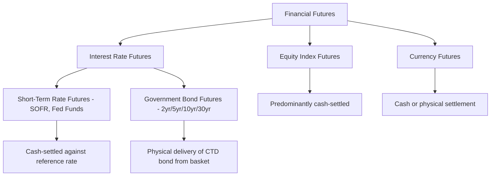

## Futures on Equity Indices, Currencies, and Rates

### Overview

Financial futures, contracts on equity indices, currencies, and interest rates, constitute the largest segment of exchange-traded derivatives by trading volume and represent the direct legacy of the 1970s financial futures revolution. Unlike commodity futures, these contracts reference purely financial underlyings with no storage or physical delivery complications (in most cases), allowing cleaner application of the cost-of-carry pricing framework and, for many contracts, mandatory cash settlement.

### Equity Index Futures

**Structure**

Equity index futures reference a broad market index (S&P 500, Nasdaq-100, Euro Stoxx 50, Nikkei 225, FTSE 100) via a fixed contract multiplier applied to the index level.

$$\text{Contract Value} = \text{Index Level} \times \text{Multiplier}$$

**Pricing**

Following the dividend-adjusted cost-of-carry formula:

$$F_0 = S_0 \, e^{(r-q)T}$$

where $q$ is the continuous dividend yield of the index. Because index constituents pay dividends on a staggered schedule throughout the year, this continuous-yield approximation is generally appropriate for index futures, in contrast to single-stock futures/options, where discrete dividend dates often require the discrete-dividend formula for precision.

**Settlement**

The overwhelming majority of equity index futures are **cash-settled**, since physical delivery of a diversified basket of hundreds of underlying stocks in precise index-weighted proportions would be operationally impractical for most participants. Final settlement price is typically defined via a special opening or closing quotation methodology specified by the exchange.

**Primary Uses**

- Portfolio managers adjusting overall market (beta) exposure quickly without trading the full underlying basket.
- **Cash equitization**: Deploying newly received cash into market exposure immediately via futures while the underlying stock portfolio is being constructed, avoiding uninvested "cash drag."
- Speculators expressing broad market directional views with a single, highly liquid instrument.
- Program/index arbitrage: exploiting temporary divergences between the futures price and the fair value implied by the underlying cash basket.

### Currency (FX) Futures

**Structure**

Currency futures are exchange-traded contracts on the exchange rate between two currencies, standardized by contract size (e.g., a fixed notional of the base currency per contract) and typically quoted in the price of the base currency per unit of the quote currency (or vice versa, depending on the specific contract convention).

**Pricing: Covered Interest Rate Parity**

$$F_0 = S_0 \, e^{(r_d - r_f)T}$$

where $r_d$ is the domestic (quote currency) interest rate and $r_f$ is the foreign (base currency) interest rate. This relationship, covered interest rate parity, is one of the most tightly arbitraged pricing relationships across global financial markets under normal conditions, since the arbitrage (borrowing in one currency, converting spot, investing in the other currency, and locking in the reconversion via a forward/future) is straightforward and low-risk for major, liquid currency pairs.

**Exchange-Traded vs. OTC FX**

While the FX spot and forward markets are overwhelmingly OTC (interbank and electronic platform-based), exchange-traded currency futures (pioneered by the CME's International Monetary Market in 1972) provide a standardized, centrally cleared alternative, particularly used by participants who prefer exchange-traded margining and CCP guarantee over bilateral OTC credit exposure, or who need the price transparency and liquidity of a centralized order book.

**Settlement**

Currency futures can settle either physically (actual exchange of the two currencies at the contract-specified exchange rate) or in cash, depending on the specific contract; many major currency futures contracts do permit physical settlement for positions held to expiration, though the vast majority of speculative and hedging positions are closed out before delivery.

### Interest Rate Futures

Interest rate futures form a broad and structurally diverse category, encompassing both short-term money-market rate futures and longer-dated government bond futures, each with distinct pricing and delivery mechanics.

**Short-Term Interest Rate (STIR) Futures**

Reference short-term money-market reference rates. Following the post-LIBOR transition, the dominant USD short-term rate future references **SOFR (Secured Overnight Financing Rate)**, with equivalent contracts in other currencies referencing their respective risk-free reference rates (€STR, SONIA, TONA).

- **Quotation convention**: Many STIR futures are quoted as $100 - \text{rate}$ (the "IMM index" convention), so that a rising futures price corresponds to a falling interest rate, and vice versa, a convention originating with the CME's Eurodollar futures and carried forward to SOFR futures.
- **Settlement**: Predominantly cash-settled against the realized reference rate (or a compounded average of the reference rate, for term-SOFR-linked products) over the relevant period.
- **Primary use**: Hedging and speculating on near-term central bank policy rate expectations; STIR futures prices are widely monitored by market participants and analysts as a real-time, market-implied gauge of expected future policy rate paths.

**Government Bond Futures**

Reference longer-dated government bonds (e.g., U.S. Treasury futures across the 2-year, 5-year, 10-year, and 30-year segments of the curve).

- **Deliverable basket mechanism**: Rather than referencing a single specific bond, government bond futures typically specify a range of eligible bonds meeting defined maturity criteria (the "deliverable basket"), with a **conversion factor** applied to each eligible bond to notionally standardize it to the contract's notional coupon rate.
- **Cheapest-to-Deliver (CTD)**: Because the conversion factor system does not perfectly equalize the economic cost of delivering each eligible bond, the short position (who has delivery discretion) rationally selects the bond that is cheapest to acquire and deliver, the "cheapest-to-deliver" bond. This CTD dynamic is a distinctive and important feature of bond futures pricing, since the futures price effectively tracks the CTD bond (adjusted by its conversion factor) rather than a single fixed reference bond throughout the contract's life, and the identity of the CTD bond can itself shift as yields move (particularly as yields diverge from the contract's notional coupon rate).
- **Settlement**: Physical delivery of an eligible bond from the deliverable basket, though the overwhelming majority of speculative and hedging positions are closed out before the delivery notice period.

### Comparative Summary Table

| Contract Type | Underlying | Typical Settlement | Key Pricing Driver |
| --- | --- | --- | --- |
| Equity Index Futures | Broad market index | Cash | Dividend-adjusted cost of carry |
| Currency Futures | FX exchange rate | Cash or physical (varies) | Covered interest rate parity |
| STIR Futures (e.g., SOFR) | Short-term reference rate | Cash | Market-implied policy rate expectations |
| Government Bond Futures | Deliverable bond basket | Physical (CTD bond) | Yield curve level, CTD dynamics |

### Financial Futures Taxonomy

### Illustrative Pricing Example: SOFR Futures

A 3-month SOFR futures contract is quoted using the IMM index convention. If the market expects the average compounded SOFR rate over the contract's reference period to be 4.25%, the futures price would be quoted as:

$$\text{Futures Price} = 100 - 4.25 = 95.75$$

If market expectations shift such that the expected average SOFR rate falls to 4.00% (e.g., following a dovish central bank signal), the futures price rises to $100 - 4.00 = 96.00$, illustrating the inverse price-rate relationship inherent in this quotation convention, and the reason a "long SOFR futures" position is, in interest-rate terms, a bet on falling rates.

### Illustrative Pricing Example: Government Bond Futures CTD

[Inference: a precise numerical CTD worked example requires current, specific bond and conversion factor data; the following illustrates the conceptual mechanism rather than live market figures.] Suppose the deliverable basket for a 10-year Treasury futures contract includes several eligible bonds, each with an exchange-assigned conversion factor reflecting its coupon and maturity relative to the contract's notional 6% coupon standard. The short position calculates the net cost of delivering each eligible bond (purchase price minus the proceeds from delivery, i.e., futures settlement price times that bond's conversion factor) and selects the bond with the lowest net delivery cost as the CTD. As market yields move away from the notional 6% standard, bonds with different coupon/maturity characteristics can become relatively cheaper or more expensive to deliver, causing the CTD bond identity to shift, a dynamic market participants actively monitor when trading or hedging with bond futures.

### Key Points

- Equity index futures use the dividend-adjusted cost-of-carry formula and are predominantly cash-settled due to the operational impracticality of physically delivering a diversified index basket.
- Currency futures are priced via covered interest rate parity, one of the most tightly arbitraged relationships in global finance, and provide an exchange-traded, centrally cleared alternative to the predominantly OTC FX forward and spot markets.
- Interest rate futures split structurally into short-term reference-rate futures (now predominantly SOFR-based post-LIBOR transition, cash-settled, and closely watched as a market-implied policy rate gauge) and government bond futures (physically settled against a deliverable basket, with cheapest-to-deliver dynamics materially shaping pricing behavior).
- The cheapest-to-deliver mechanism in bond futures is a distinctive pricing complexity not present in equity index or currency futures, arising from the conversion factor system's imperfect standardization across a range of eligible deliverable bonds.

### Related Topics

- Pricing Forwards and Futures Under Cost of Carry
- Futures Contract Specifications and Standardization
- Covered Interest Rate Parity and FX Forward Pricing
- The SOFR Transition and Post-LIBOR Reference Rate Architecture
- Cheapest-to-Deliver Mechanics and Conversion Factors in Bond Futures
- Hedging With Forwards and Futures
- Underlying Asset Classes and Market Structure