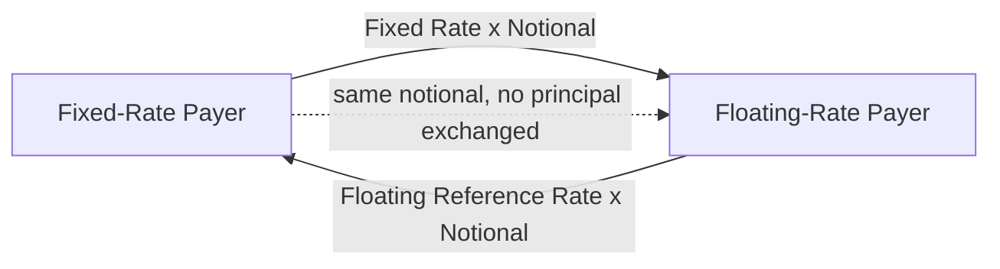
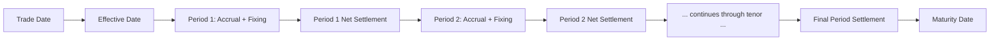

## Interest Rate Swap Structure and Cash Flows

### Definition and Basic Structure

An interest rate swap (IRS) is an OTC agreement between two counterparties to exchange interest payment streams calculated on a common notional principal, typically one party pays a fixed rate while the other pays a floating rate that resets periodically against a reference benchmark. The notional principal itself is never exchanged, it exists purely as the calculation base for determining each period's interest cash flows. This structure allows two counterparties to transform the effective interest rate character of an existing exposure (fixed to floating, or floating to fixed) without altering, refinancing, or renegotiating the underlying loan or asset itself.

### The Plain Vanilla Fixed-for-Floating Swap

**Structural Diagram**

**Parties**

- **Fixed-rate payer (swap "buyer" by market convention)**: Pays a predetermined fixed rate on the notional; receives the floating rate. This party benefits if rates rise (their fixed obligation becomes relatively cheaper vs. the floating rate they receive).
- **Floating-rate payer (swap "seller")**: Pays the periodically resetting floating rate; receives the fixed rate. This party benefits if rates fall.

**Netting in Practice**

Although conceptually two separate payment streams are exchanged, in practice only the **net difference** between the fixed and floating amounts is typically paid by whichever party owes the larger amount for that period, reducing operational settlement risk and cash flow volume.

### Key Structural Parameters

**Notional Principal**

The reference amount used to calculate interest payments; can be constant over the swap's life or follow a predetermined amortization/accretion schedule matched to an underlying exposure (e.g., an amortizing loan).

**Fixed Rate (Swap Rate)**

The fixed rate is set at inception such that the swap has zero net present value to both parties, it is the rate that equates the present value of the fixed leg's cash flows to the present value of the expected floating leg's cash flows, given the current forward curve.

**Floating Rate Reference**

Historically LIBOR-based; following the post-LIBOR transition (largely completed by mid-2023 across major currencies), the dominant floating reference is now an overnight risk-free rate (SOFR in USD, €STR in EUR, SONIA in GBP, TONA in JPY), typically compounded in arrears over each accrual period rather than set as a forward-looking term rate at the start of the period.

**Payment Frequency**

How often each leg's cash flows are calculated and exchanged; the fixed and floating legs frequently have different payment frequencies (e.g., fixed leg semi-annual, floating leg quarterly), a structural feature requiring careful cash-flow schedule alignment in swap documentation and valuation.

**Day Count Convention**

The method for calculating accrued interest over each period (e.g., Actual/360, Actual/365, 30/360), which can differ between the fixed and floating legs of the same swap and materially affects the precise cash flow amount for a given rate and notional.

**Tenor**

The overall life of the swap, from a few months (money-market swaps) to 30+ years for long-dated liability-hedging swaps.

### Cash Flow Calculation Mechanics

**Fixed Leg Payment for a Period**

$$\text{Fixed Payment} = \text{Notional} \times \text{Fixed Rate} \times \frac{\text{Days in Period}}{\text{Day Count Basis}}$$

**Floating Leg Payment for a Period (SOFR-based, compounded in arrears)**

Under the now-standard compounded-in-arrears convention for SOFR-linked swaps, the floating rate for a period is calculated using the actual realized daily SOFR fixings observed *during* that accrual period (rather than a rate set in advance at the period's start, as was standard under LIBOR):

$$\text{Compounded Rate} = \left[ \prod_{i=1}^{n} \left(1 + r_i \times \frac{d_i}{360}\right) - 1 \right] \times \frac{360}{D}$$

where $r_i$ is the SOFR rate on day $i$, $d_i$ is the number of calendar days that rate applies (typically 1, except over weekends/holidays), $n$ is the number of business days in the period, and $D$ is the total number of calendar days in the period. This compounding-in-arrears methodology is a structurally significant difference from the LIBOR-era forward-looking term-rate convention, meaning the floating payment amount is not known with certainty until very close to (or at) the end of the accrual period, rather than being fixed at its start.

### Worked Numerical Example

A 2-year interest rate swap: notional = $50,000,000, fixed rate = 4.20% (semi-annual, Actual/360), floating leg pays compounded SOFR (semi-annual, Actual/360). Consider the first semi-annual period (182 days).

**Fixed Leg Payment**

$$50{,}000{,}000 \times 0.0420 \times \frac{182}{360} = \$1{,}061{,}666.67$$

**Floating Leg Payment (assuming realized compounded SOFR for the period = 3.95%)**

$$50{,}000{,}000 \times 0.0395 \times \frac{182}{360} = \$997{,}638.89$$

**Net Settlement**

Since the fixed payment ($1,061,666.67) exceeds the floating payment ($997,638.89), the fixed-rate payer owes the net difference to the floating-rate payer:

$$\$1{,}061{,}666.67 - \$997{,}638.89 = \$64{,}027.78$$

The fixed-rate payer pays this net amount to the floating-rate payer for this period, in this scenario the fixed payer is worse off than if they had remained floating, since realized SOFR (3.95%) came in below the fixed rate locked in (4.20%).

### Swap Cash Flow Timeline

### Economic Motivation for Entering a Swap

**Converting Floating-Rate Debt to Fixed**

A corporation with floating-rate bank debt, concerned about rising rates, enters a swap as the fixed-rate payer: it pays fixed on the swap (offsetting its now-effectively-fixed total cost) and receives floating (which offsets the floating payments owed on the underlying loan), synthetically converting its floating-rate liability into a fixed-rate one without refinancing the original loan.

**Converting Fixed-Rate Debt to Floating**

Conversely, a corporation with fixed-rate debt believing rates will fall, or wanting to reduce borrowing costs in the near term, enters a swap as the floating-rate payer, synthetically converting fixed exposure to floating.

**Asset-Liability Matching**

Financial institutions (particularly banks and insurers) use interest rate swaps extensively to align the interest rate sensitivity of their asset and liability portfolios, a core application within broader asset-liability management (ALM), converting the duration/rate-sensitivity profile of one side of the balance sheet to better match the other without needing to trade the underlying assets or liabilities directly.

### Comparative Table: Interest Rate Swap vs. Other Rate Instruments

| Feature | Interest Rate Swap | Interest Rate Futures | FRN (Floating Rate Note) |
| --- | --- | --- | --- |
| Venue | OTC (increasingly centrally cleared) | Exchange-traded | Primary/secondary bond market |
| Principal exchange | None (notional only) | N/A | Full principal at issuance/maturity |
| Customization | High (tenor, notional schedule, day count) | Low (standardized contract) | Moderate (issuance terms) |
| Settlement frequency | Periodic (matches payment schedule) | Daily mark-to-market | Periodic coupon payments |

### Key Points

- An interest rate swap exchanges fixed and floating interest payment streams on a common notional principal that is never itself exchanged, allowing synthetic conversion of an existing exposure's rate character (fixed-to-floating or floating-to-fixed) without refinancing the underlying obligation.
- The fixed rate is set at inception so the swap has zero initial net present value, equating the present value of the fixed leg to the present value of the (forward-curve-implied) expected floating leg cash flows.
- The post-LIBOR transition to compounded-in-arrears overnight reference rates (SOFR and equivalents) represents a structural change from the prior forward-looking term-rate convention, meaning the floating payment amount is now typically only known with certainty near the end, rather than at the start, of each accrual period.
- In practice, swap cash flows are typically net-settled (only the difference between the fixed and floating amounts changes hands each period), reducing settlement risk and operational cash flow volume relative to gross bilateral exchange of both legs.

### Related Topics

- History and Evolution of Derivatives Markets
- Derivatives Terminology and Contract Specifications
- Swap Valuation and Par Swap Rate Determination
- The SOFR Transition and Post-LIBOR Reference Rate Architecture
- Currency Swaps and Cross-Currency Basis
- ISDA Master Agreements and OTC Documentation Standards
- Asset-Liability Management and Duration Matching