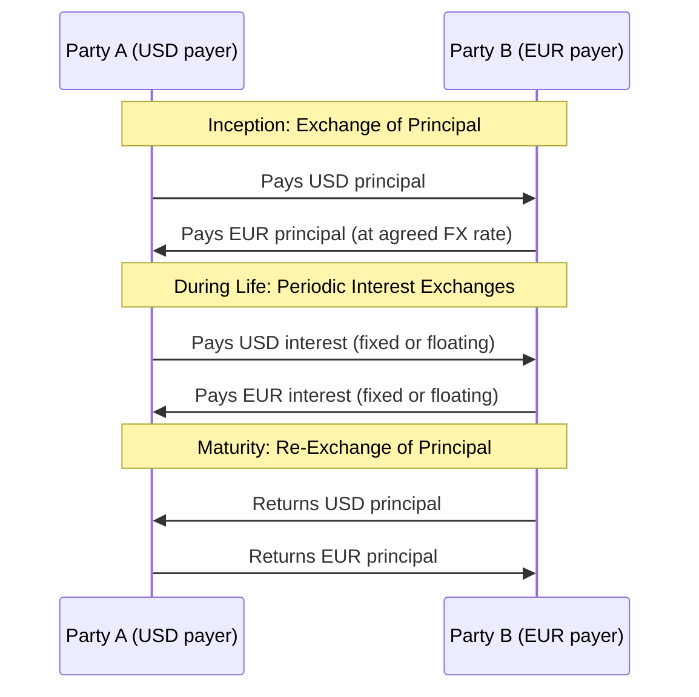

## Currency Swaps and Cross-Currency Basis

### Overview

A currency swap (cross-currency swap) is an OTC agreement between two counterparties to exchange principal and interest payments denominated in two different currencies. Unlike an interest rate swap, where notional exists only as a calculation reference, currency swaps typically involve actual exchange of the principal amounts, both at the start and at the end of the swap, because a genuine economic exchange of currency exposure, not merely an interest-rate exposure conversion, is the instrument's purpose. Cross-currency basis, the persistent deviation from theoretical covered interest rate parity observed in the swap market, is a critical, actively monitored pricing and market-structure phenomenon layered on top of the basic swap mechanics.

### Basic Structure of a Currency Swap

**Three Distinct Exchange Legs**

1. **Initial principal exchange**: At inception, the two counterparties exchange principal amounts in their respective currencies, typically at the prevailing spot exchange rate.
2. **Periodic interest exchanges**: Throughout the swap's life, each party pays interest (fixed or floating, depending on the swap's structure) on the principal amount it received, in that currency.
3. **Final principal re-exchange**: At maturity, the original principal amounts are exchanged back, at the *same* exchange rate used at inception (not the prevailing spot rate at maturity), a structurally important feature that fixes the FX conversion rate for the principal re-exchange in advance.

### Types of Currency Swaps by Rate Structure

- **Fixed-for-fixed**: Both legs pay a fixed rate in their respective currencies.
- **Fixed-for-floating**: One leg pays fixed, the other floating (a cross-currency variant analogous to a standard interest rate swap but across two currencies).
- **Floating-for-floating (basis swap)**: Both legs pay a floating reference rate in their respective currencies; this is the structure most directly associated with the cross-currency basis phenomenon discussed below.

### Economic Purpose

**Raising Financing in a Foreign Market at Favorable Terms**

A classic and historically foundational use case (exemplified by the landmark 1981 IBM-World Bank swap) involves two entities each having a comparative financing advantage in their *own* domestic market but needing exposure in the *other's* currency. Each borrows in its own market (where it obtains the best terms), then swaps the resulting cash flow obligations, effectively achieving the other currency's financing at a better rate than direct foreign borrowing would have provided.

**Hedging Foreign Currency Debt or Assets**

A corporation with foreign-currency-denominated debt (e.g., a USD-based company that issued EUR bonds to access European investors) can use a currency swap to convert the EUR interest and principal obligations back into USD, eliminating FX risk on the debt service and principal repayment.

**Multinational Corporate Treasury Management**

Multinational corporations use currency swaps to manage cross-border cash flows, fund foreign subsidiaries, and hedge translation and transaction FX exposure arising from international operations.

### Covered Interest Rate Parity: The Theoretical Benchmark

Covered interest rate parity (CIP) states that the forward FX rate should be determined entirely by the spot rate and the interest rate differential between the two currencies:

$$F_0 = S_0 \, e^{(r_d - r_f)T}$$

Equivalently, in the context of a currency swap, this implies that borrowing in currency A, swapping into currency B, and investing in currency B should yield exactly the same return as investing directly in currency A, no arbitrage opportunity should exist between the two routes.

### Cross-Currency Basis: The Persistent Deviation from CIP

**Definition**

Cross-currency basis is the additional spread, typically quoted in basis points, that must be added to (or subtracted from) the interest rate differential to make the observed market cross-currency swap pricing consistent with actual traded levels, i.e., the empirical deviation from the theoretical CIP relationship:

$$F_0^{\text{market}} \neq S_0 \, e^{(r_d - r_f)T} \quad \Rightarrow \quad \text{Cross-Currency Basis} \neq 0$$

**Why Basis Exists Despite Theoretical No-Arbitrage**

CIP is one of the most historically reliable no-arbitrage relationships in finance, yet persistent, sometimes substantial, cross-currency basis has been widely documented in academic and market research, particularly since the 2008 financial crisis. [Inference: this persistence is generally attributed in the literature to post-crisis constraints on bank balance sheet capacity, regulatory capital charges on FX swap and cross-currency swap positions (which make the theoretically riskless CIP arbitrage costly to execute at scale for regulated banks), and structural imbalances in the supply and demand for USD funding among non-US financial institutions, rather than to a breakdown of the underlying no-arbitrage logic itself; specific current basis levels and their precise attributed drivers should be checked against current market commentary and research, as this is an actively evolving area of market structure research.]

**USD Funding Basis and Its Significance**

Cross-currency basis, particularly the USD basis against major currencies (EUR, JPY, GBP), is closely monitored as an indicator of relative USD funding stress in global financial markets. A more negative (widening) basis against the USD (meaning it becomes more expensive to swap into USD funding via the FX swap/cross-currency swap market) has historically been associated with periods of global dollar funding pressure, notably during the 2008 crisis and various subsequent stress episodes, making the cross-currency basis a market-based signal that central banks and market participants track for financial stability purposes.

### Cross-Currency Basis Diagram (svg_diagram)

<svg xmlns="http://www.w3.org/2000/svg" viewBox="0 0 640 300">
<text x="320" y="20" font-size="14" text-anchor="middle" font-family="sans-serif" font-weight="bold">Cross-Currency Basis: Theoretical vs Market Pricing (svg_diagram)</text>
<rect x="60" y="60" width="220" height="100" fill="none" stroke="#2b6cb0" stroke-width="1.5" />
<text x="170" y="85" font-size="11" text-anchor="middle" font-family="sans-serif" font-weight="bold" fill="#2b6cb0">CIP Theoretical Rate</text>
<text x="75" y="110" font-size="10" font-family="sans-serif">F0 = S0 * e^((rd-rf)T)</text>
<text x="75" y="130" font-size="10" font-family="sans-serif">No basis assumed</text>
<rect x="360" y="60" width="220" height="100" fill="none" stroke="#c53030" stroke-width="1.5" />
<text x="470" y="85" font-size="11" text-anchor="middle" font-family="sans-serif" font-weight="bold" fill="#c53030">Observed Market Rate</text>
<text x="375" y="110" font-size="10" font-family="sans-serif">F0_market = F0_CIP + basis</text>
<text x="375" y="130" font-size="10" font-family="sans-serif">Basis: funding/balance-sheet</text>
<text x="375" y="145" font-size="10" font-family="sans-serif">constraints, not risk-free arb</text>
<line x1="280" y1="110" x2="360" y2="110" stroke="black" stroke-width="1.5" marker-end="url(#arrow)" />
<text x="320" y="100" font-size="9" text-anchor="middle" font-family="sans-serif">Gap = Basis</text>
</svg>

### Worked Illustrative Example: Currency Swap Cash Flows

A U.S. company and a European company enter a 5-year fixed-for-fixed currency swap. Notional: $100 million / €92 million (at an initial spot rate of 1.0870 USD/EUR). The U.S. company pays EUR fixed at 3.10%; the European company pays USD fixed at 4.50%.

**At Inception**

- U.S. company delivers $100 million to the European company.
- European company delivers €92 million to the U.S. company.

**Each Annual Period**

- U.S. company (now holding EUR principal) pays: €92,000,000 x 3.10% = €2,852,000 to the European company.
- European company (now holding USD principal) pays: $100,000,000 x 4.50% = $4,500,000 to the U.S. company.

**At Maturity (Year 5)**

- U.S. company returns €92 million to the European company.
- European company returns $100 million to the U.S. company.

Note that the principal re-exchange at maturity uses the *original* 1.0870 rate, not the prevailing spot rate at maturity, this is a defining structural feature that fully hedges the FX risk on the principal amounts for the duration of the swap, distinguishing it clearly from a rolling series of FX forwards, which would instead reference prevailing forward rates at each roll date.

### Currency Swap vs. Interest Rate Swap vs. FX Forward

| Feature | Currency Swap | Interest Rate Swap | FX Forward |
| --- | --- | --- | --- |
| Principal exchanged | Yes (initial + final) | No (notional only) | Yes (at maturity) |
| Currencies involved | Two | One | Two |
| Interest payments exchanged | Yes, periodically | Yes, periodically | No |
| Typical tenor | Medium to long (1-30+ years) | Medium to long (1-30+ years) | Short to medium (days to 1-2 years) |
| Primary use | Cross-currency financing/hedging | Rate-character conversion (fixed/float) | Simple FX hedging, single date |

### Key Points

- A currency swap involves genuine exchange of principal in two different currencies, both at inception and (at the original exchange rate) at maturity, in addition to periodic interest exchanges, distinguishing it structurally from an interest rate swap's notional-only reference basis.
- The classic economic rationale for currency swaps is comparative financing advantage: each party borrows where it has the best terms in its own market, then swaps the resulting obligations to achieve effectively lower-cost financing in the currency it actually needs.
- Cross-currency basis is the persistent, empirically observed deviation between market-traded cross-currency swap/FX forward pricing and the theoretical covered interest rate parity benchmark, generally attributed in the literature to post-crisis balance-sheet and regulatory capital constraints on the banks that would otherwise arbitrage the relationship fully closed.
- The USD cross-currency basis is closely monitored as a real-time indicator of relative global USD funding stress, with a more negative/widening basis historically associated with periods of dollar funding pressure across the global banking system.

### Related Topics

- Interest Rate Swap Structure and Cash Flows
- Arbitrage, Short Selling, and No-Arbitrage Pricing
- Covered Interest Rate Parity and FX Forward Pricing
- Underlying Asset Classes and Market Structure
- The 2008 Financial Crisis and Global Dollar Funding Stress
- ISDA Master Agreements and Credit Support Annexes
- Swap Valuation and Par Swap Rate Determination