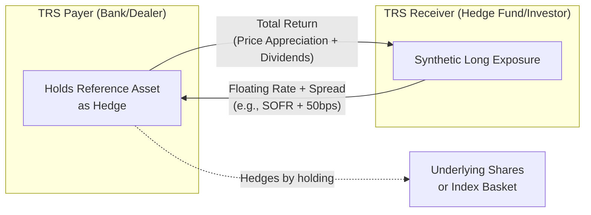

## Equity Swaps and Total Return Swaps

### Definition and Core Concept

An equity swap is a derivative contract in which two counterparties exchange cash flows over a specified period, where at least one leg is linked to the return of an equity asset (a single stock, a basket, or an index), and the other leg is typically a floating interest rate (e.g., SOFR, Term SOFR, or historically LIBOR) plus or minus a spread. No principal changes hands; the notional amount is used solely to calculate cash flows.

A total return swap (TRS) is a specific and dominant form of equity swap in which the "equity payer" (or "TRS payer") pays the total return of the reference asset — capital appreciation/depreciation plus any dividends or coupons — to the "TRS receiver," who in turn pays a financing rate (floating rate plus spread) on the notional. The TRS receiver obtains full economic exposure to the reference asset without owning it.

**Key Points**

- Equity swaps transfer *economic* exposure without transferring legal ownership of the underlying shares.
- The party receiving the equity return is synthetically "long" the asset; the party paying the equity return is synthetically "short."
- Total return swaps are the most common structural template used for single-stock and index equity swaps in practice — the terms are often used interchangeably, though "equity swap" is the broader category (which can include price-return-only swaps, dividend swaps, or variance swaps as adjacent structures).

### Structure and Cash Flow Mechanics

A standard TRS involves two legs, both denominated on a common notional $N$:

**Equity (Total Return) Leg** — paid by the TRS payer to the TRS receiver:

$$TR = \frac{S_1 - S_0 + D}{S_0}$$

Where $S_0$ is the reference price at the start of the period, $S_1$ is the reference price at the end of the period, and $D$ represents dividends or cash distributions paid on the underlying during the period.

**Financing Leg** — paid by the TRS receiver to the TRS payer:

$$Financing = N \times (r_{float} + spread) \times \frac{days}{360 \text{ or } 365}$$

Where $r_{float}$ is the reference floating rate (SOFR, EURIBOR, etc.) observed over the accrual period, and *spread* reflects the payer's funding cost, credit risk, and desired margin.

At each reset/payment date, the two legs are netted, and only the net amount is exchanged. If the equity leg's total return exceeds the financing cost, the TRS receiver receives the net difference; if the reference asset underperforms the financing rate, the TRS receiver pays the net difference to the TRS payer.

**Example**

A hedge fund enters a 3-month TRS as receiver on $10,000,000 notional of Stock XYZ, referencing SOFR + 50bps, with SOFR at 5.30%.

- Stock XYZ appreciates 4% over the period and pays a $0.50/share dividend (assume a starting price of $100, so dividend yield ≈ 0.5%).
- Total equity return ≈ 4.5%.
- Financing cost ≈ (5.30% + 0.50%) × (90/360) ≈ 1.45%.
- Net payment to the TRS receiver ≈ (4.5% − 1.45%) × $10,000,000 ≈ $305,000.

If instead the stock had fallen 6%, the equity leg would be −6% + 0.5% dividend = −5.5%, and the TRS receiver would owe the payer 5.5% + 1.45% ≈ 6.95% of notional, i.e., approximately $695,000.

### Counterparty Roles and Motivations

**TRS Receiver (Long Equity Exposure)**

- Gains synthetic long exposure without purchasing the underlying shares, avoiding upfront capital outlay (only margin/collateral is posted).
- Commonly used by hedge funds and leveraged investors to achieve capital-efficient leverage.
- Avoids direct ownership issues: no need to settle physical trades, no direct voting rights, and in many jurisdictions, reduced or altered disclosure obligations (though large TRS positions can still trigger regulatory disclosure thresholds depending on jurisdiction — see regulatory section below).
- May access markets otherwise restricted (foreign ownership limits, withholding tax inefficiencies, or operational barriers to direct share ownership).

**TRS Payer (Short Equity Exposure / Financing Provider)**

- Typically a bank or broker-dealer that hedges its swap exposure by holding the actual reference shares (a "delta-one" hedge), effectively acting as a synthetic prime broker.
- Earns the spread over its funding rate as compensation for balance sheet usage, hedging costs, and counterparty credit risk.
- May use TRS to transfer market risk off its balance sheet while retaining the underlying position for other purposes (e.g., voting rights, tax basis).

### Equity Swap Variants

**Single-Stock Equity Swaps**

Reference a single company's shares. Common in delta-one trading desks for providing leveraged directional exposure or synthetic prime brokerage financing.

**Index Swaps**

Reference a broad equity index (S&P 500, EURO STOXX 50, etc.). Used for portfolio-level exposure adjustments, asset allocation shifts, or tactical hedging without disturbing an underlying physical portfolio.

**Basket Swaps**

Reference a custom basket of securities, often used for thematic exposure (sector baskets, ESG baskets, custom factor baskets) that don't map to a standard index.

**Portfolio Swaps**

Reference an actively-managed or client-specified portfolio, frequently used to synthetically replicate a fund's own strategy off-balance-sheet (common in synthetic prime brokerage arrangements for hedge funds).

**Price Return Swaps vs. Total Return Swaps**

A price return swap pays only capital appreciation/depreciation, excluding dividends — less common, since dividend treatment is usually a key value driver and clients typically want (or the payer wants to hedge) the full economic return.

### Diagram: Total Return Swap Cash Flow Structure

### Valuation Framework

At inception, a TRS is typically structured to have zero net present value, meaning the spread is calibrated so that the expected present value of the financing leg equals the expected present value of the equity leg (under a risk-neutral framework, the expected equity return should approximate the risk-free rate plus dividend yield, consistent with cost-of-carry / forward pricing logic).

Mark-to-market valuation between reset dates uses the standard forward-pricing relationship:

$$F = S_0 \times e^{(r-q)T}$$

Where $r$ is the risk-free/financing rate, $q$ is the dividend yield, and $T$ is time to the next reset. The swap's value to the receiver at any point is approximately:

$$V \approx N \times \left(\frac{S_t}{S_0} - \frac{F_t}{S_0}\right)$$

Reflecting the divergence between the actual observed spot price path and the implied forward/financing curve. [Inference] In practice, dealers use proprietary delta-one pricing models that also incorporate borrow cost, repo rates for the underlying stock, and dividend timing risk, which can cause deviations from this simplified formula.

### Reset Frequency and Mark-to-Market Conventions

- **Reset dates**: TRS contracts specify periodic reset dates (monthly, quarterly) at which accrued P&L is calculated and settled, and the floating rate is refixed for the next period.
- **Interim mark-to-market**: Between resets, unrealized P&L accrues based on the price movement of the reference asset relative to $S_0$ (the last reset price).
- **Collateralization**: Most TRS are subject to daily or periodic variation margin under an ISDA Credit Support Annex (CSA), meaning the receiver posts/receives collateral reflecting the swap's current mark-to-market value — this substantially reduces counterparty credit risk despite the absence of principal exchange.

### Documentation and Legal Framework

Equity swaps and TRS are governed by:

- **ISDA Master Agreement** — the standard bilateral derivatives contract governing events of default, termination, netting, and general legal terms.
- **ISDA Equity Derivatives Definitions** (2002, with subsequent supplements) — define standard terms for equity swap confirmations, including corporate action adjustments, valuation dates, dividend treatment, and settlement mechanics.
- **Confirmation** — the trade-specific document specifying notional, reference asset(s), floating rate index, spread, reset dates, and any bespoke terms.
- **Credit Support Annex (CSA)** — governs collateral posting terms.

### Corporate Actions and Adjustments

Because the TRS payer typically hedges via physical share ownership, corporate actions on the reference asset require contractual adjustment provisions:

| Corporate Action | Typical Adjustment Mechanism |
| --- | --- |
| Cash dividend | Passed through to TRS receiver (net of applicable withholding tax treatment per confirmation) |
| Stock split/reverse split | Adjust notional shares and reference price proportionally |
| Rights issue | Adjustment to reference price or notional to neutralize dilution effect |
| Merger/acquisition | Calculation agent determines successor reference asset or cash settlement |
| Spin-off | Adjustment or inclusion of spin-off entity as additional reference asset |

The **calculation agent** (usually the dealer/TRS payer) has contractual discretion, per the ISDA Equity Derivatives Definitions, to determine adjustments "in a commercially reasonable manner," which can create potential conflicts of interest given the calculation agent is typically also a counterparty. [Inference] This dual role is a recurring point of negotiation in bespoke TRS confirmations, particularly for large or contentious corporate actions.

### Risk Considerations

**Market Risk**

The TRS receiver bears full price risk of the reference asset, identical in economic terms to direct ownership (excluding financing rate risk, which is separate).

**Counterparty Credit Risk**

Despite collateralization, gap risk exists between reset/margin dates — if the reference asset moves sharply and the counterparty defaults before collateral is called or posted, the surviving party faces replacement cost risk.

**Financing/Basis Risk**

The floating rate spread is fixed at inception; if the TRS payer's actual funding costs rise relative to the reference floating rate, the payer's hedging economics deteriorate over the life of a longer-dated swap (this is a primary reason many equity swaps are structured with periodic resets rather than as single long-dated contracts).

**Dividend Risk**

Uncertainty around future dividend payments (timing, amount, potential cuts) creates risk for the TRS payer, since the payer's obligation to pass through dividends is contractual, while actual dividend receipts (if hedged via physical shares) may differ in timing or tax treatment (withholding tax leakage).

**Liquidity/Unwind Risk**

Unwinding a TRS before maturity requires either a negotiated termination payment (based on then-current mark-to-market) or an offsetting swap, and liquidity in bespoke or large-notional single-stock swaps can be limited.

**Synthetic Ownership / Disclosure Risk**

[Unverified] The use of TRS to accumulate large economic stakes without triggering ownership disclosure thresholds has drawn regulatory scrutiny in multiple jurisdictions — this is a facts-and-circumstances area that depends heavily on jurisdiction-specific beneficial ownership and disclosure rules, and market participants should not treat any general description as current compliance guidance.

### Regulatory Context

- **Dodd-Frank (US)**: Equity swaps are generally classified as "security-based swaps" under Title VII, placing them under SEC (rather than CFTC) jurisdiction, with associated reporting, clearing consideration, and margin requirements for certain market participants.
- **EMIR (EU)**: Equity swaps fall under EMIR's OTC derivatives reporting and risk mitigation requirements, including mandatory trade reporting to trade repositories.
- **Beneficial ownership disclosure**: Various jurisdictions (notably following high-profile cases of TRS-based stake accumulation) have moved to require aggregation of "long" derivative exposure (including TRS) with direct share ownership for purposes of substantial shareholder disclosure thresholds. [Inference] Specific thresholds and aggregation rules vary significantly by jurisdiction and are subject to periodic regulatory change, so practitioners should consult current local rules rather than rely on general market practice descriptions.

### Comparison: Equity Swap vs. Physical Share Ownership vs. Futures

| Feature | Physical Shares | Equity Swap (TRS) | Equity Index Future |
| --- | --- | --- | --- |
| Upfront capital | Full notional | Margin/collateral only | Initial margin only |
| Dividend exposure | Direct, full | Passed through per confirmation | Not directly (embedded in forward pricing) |
| Voting rights | Yes | No (retained by hedge holder) | N/A |
| Counterparty risk | None (settled asset) | Yes (bilateral OTC) | Central counterparty (cleared) |
| Financing cost | N/A (cash purchase) | Explicit floating + spread | Implicit in futures basis |
| Customization | N/A | High (bespoke basket, tenor) | Standardized contracts only |
| Tax/withholding treatment | Direct | Contractually defined, dealer-dependent | Index-level, no direct dividend pass-through |

### Use Cases in Practice

**Synthetic Prime Brokerage**: Hedge funds use TRS extensively to obtain leveraged, capital-efficient exposure to equity positions while banks retain physical custody and hedging, effectively functioning as an alternative to traditional margin lending.

**Cross-Border Access**: Investors facing foreign ownership restrictions or unfavorable withholding tax treatment on direct holdings may use TRS with a locally-domiciled dealer as an efficient access route.

**Balance Sheet Management**: Corporations or institutional holders with large concentrated equity positions may use equity swaps to hedge market risk (paying away the total return) while retaining legal/tax ownership of shares (e.g., for control, tax basis, or regulatory reasons).

**Index Rebalancing and Transition Management**: Asset managers use index TRS to gain or reduce broad market exposure quickly during portfolio transitions without executing large physical basket trades.

**Structured Product Wrappers**: TRS often serve as the underlying hedging mechanism inside structured notes and funds that reference equity performance without the issuer holding physical stock directly.

**Next Steps**

- Dividend swaps and variance/volatility swaps as related equity derivative structures
- Delta-one trading desks and synthetic prime brokerage economics
- ISDA Equity Derivatives Definitions: detailed corporate action adjustment methodologies
- Credit Support Annex (CSA) mechanics and collateral/margin methodology (initial margin vs. variation margin)
- Regulatory treatment of security-based swaps under Dodd-Frank Title VII
- Cross-currency equity swaps and quanto adjustment mechanics
- Repo and stock-borrow markets as the hedging foundation for TRS payers