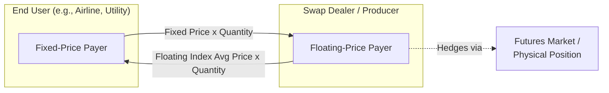
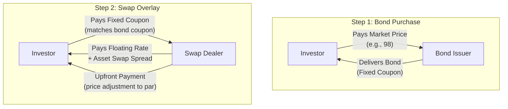

## Commodity and Asset Swaps

<syllabot_broad_topic/>

### Definition and Core Concept

A commodity swap is a derivative contract in which two counterparties exchange cash flows over a specified period, where one leg is tied to the price of a commodity (fixed or floating, referencing a spot or index price) and the other leg is typically a fixed price or a different floating rate/index. No physical commodity delivery occurs; settlement is cash-based on the price differential applied to a notional quantity.

An asset swap, in its most common usage, refers to a package combining a fixed-rate bond with an interest rate swap, converting the bond's fixed coupon into a floating-rate cash flow stream (or vice versa). Asset swaps are primarily an interest-rate/credit product built on top of a cash bond, and are a distinct category from commodity swaps, though both fall under the "swaps markets" umbrella as exchanges of cash flow streams referencing a specified underlying asset or price index.

**Key Points**

- Commodity swaps are almost universally cash-settled and used for hedging price risk in physical commodity businesses (energy, metals, agriculture) without requiring physical delivery logistics.
- Asset swaps decompose a bond's credit and interest rate risk into separately tradable components, commonly used to isolate credit spread exposure.
- Both structures rely on a **fixed-for-floating** exchange logic analogous to interest rate swaps, but with the floating leg referencing a commodity price index or a bond coupon rather than a benchmark rate alone.

---

## Commodity Swaps

### Structure and Cash Flow Mechanics

The standard commodity swap involves two counterparties:

**Fixed-Price Payer** — pays a pre-agreed fixed price per unit of the commodity, calculated over the notional quantity:

$$Fixed\ Payment = Q \times P_{fixed}$$

**Floating-Price Payer** — pays based on the average or spot reference price observed over the settlement period:

$$Floating\ Payment = Q \times P_{floating,avg}$$

Where $Q$ is the notional quantity (e.g., barrels of oil, MMBtu of gas, metric tons of metal) and $P_{floating,avg}$ is typically an arithmetic average of a published reference price (e.g., Platts, Argus, NYMEX settlement) over the period, rather than a single spot observation — this averaging feature is standard in commodity swaps and reduces exposure to single-day price manipulation or spikes.

At settlement, only the net difference is exchanged:

$$Net\ Payment = Q \times (P_{floating,avg} - P_{fixed})$$

If $P_{floating,avg} > P_{fixed}$, the fixed-price payer pays the floating-price payer the difference (and vice versa).

**Example**

An airline hedges jet fuel costs via a 12-month commodity swap on 1,200,000 gallons/month, paying fixed at $2.50/gallon against the monthly average of the Gulf Coast jet fuel index.

- In a given month, the average floating index price settles at $2.80/gallon.
- Net payment: 1,200,000 × ($2.80 − $2.50) = $360,000 received by the airline (as fixed-price payer) from the swap counterparty.
- This offsets the airline's higher actual fuel purchase cost in the physical market, achieving the hedge objective.

Conversely, if the floating index settles at $2.20/gallon, the airline pays 1,200,000 × ($2.50 − $2.20) = $360,000 to the counterparty — the cost of having locked in price certainty.

### Commodity Swap Variants

**Fixed-for-Floating Swaps**

The standard structure described above — one party pays fixed, receives floating, used to lock in a price for budgeting/hedging purposes.

**Basis Swaps**

Exchange two different floating price references for the same or related commodity (e.g., WTI vs. Brent crude, or Henry Hub vs. a regional gas hub price), used to hedge locational or grade basis risk rather than outright price risk.

**Commodity-for-Interest Rate Swaps**

Exchange a commodity-linked cash flow for a floating interest rate payment, less common but used in structured financing contexts (e.g., commodity-linked notes or project finance structures where revenue is commodity-linked but debt service is rate-based).

**Swaptions on Commodity Swaps**

Options granting the right to enter into a commodity swap at a pre-agreed fixed price, used for optionality-embedded hedging programs.

**Calendar Spread Swaps**

Reference the price differential between two delivery months of the same commodity futures contract, used to hedge or speculate on the shape of the forward curve (contango/backwardation dynamics).

### Diagram: Commodity Swap Cash Flow Structure

### Participants and Motivations

**Commodity Consumers (Airlines, Utilities, Manufacturers)**

Enter as fixed-price payers to lock in input costs and protect margins against rising commodity prices — a classic consumer hedge.

**Commodity Producers (Oil & Gas Companies, Miners, Agricultural Producers)**

Enter as floating-price payers (receiving fixed) to lock in a guaranteed sale price for output, protecting revenue against falling prices.

**Swap Dealers/Banks**

Act as intermediaries, warehousing and netting exposure across their client book, hedging residual net exposure in the underlying futures or physical forward markets. Dealers earn the bid-offer spread and manage basis risk between the swap's reference index and their futures hedge.

**Speculators/Hedge Funds**

Take directional or relative-value positions (e.g., basis swaps, calendar spreads) without any underlying physical commodity business.

### Valuation Framework

A commodity swap can be decomposed into a strip of forward contracts, one for each settlement period. The fixed price is set such that the swap has zero value at inception:

$$P_{fixed} = \frac{\sum_{i=1}^{n} F_i \times DF_i}{\sum_{i=1}^{n} DF_i}$$

Where $F_i$ is the forward price for settlement period $i$ (derived from the futures curve or forward curve for the reference commodity) and $DF_i$ is the discount factor applicable to that period. This is effectively a notional-weighted average of forward prices across the swap's tenor, discounted to present value.

Mark-to-market value to the fixed-price payer at any point after inception:

$$V = \sum_{i=1}^{n} Q_i \times (F_i^{current} - P_{fixed}) \times DF_i$$

Reflecting the shift in the forward curve since inception. [Inference] In practice, commodity forward curves are frequently illiquid or sparsely quoted beyond the first 12–24 months for many commodities, requiring interpolation or extrapolation techniques that introduce model risk into longer-dated swap valuations.

### Documentation

- **ISDA Master Agreement** with the **ISDA Commodity Derivatives Definitions** governing standard terms, price source fallback provisions, and disruption events.
- Alternatively, many energy commodity swaps (particularly in North American power and gas markets) use **ISDA + Master Confirmation Agreements** referencing specific industry templates.
- **Price source and disruption fallback language** is critical: contracts specify what happens if the primary reference price (e.g., a Platts assessment) is unavailable, delayed, or materially changed in methodology.

### Risk Considerations

**Price Risk**: The core risk being hedged/transferred; residual basis risk exists if the swap's reference index does not perfectly match the hedger's actual physical exposure (e.g., regional price differences, quality/grade differences).

**Basis Risk**: Divergence between the swap's floating reference price and the hedger's actual realized commodity cost/revenue (e.g., a swap referencing NYMEX WTI hedging a refiner's regional crude grade purchase).

**Credit/Counterparty Risk**: Bilateral OTC commodity swaps carry counterparty default risk, mitigated via ISDA CSAs, though commodity markets have historically had less consistent collateralization practices than rates/FX markets, particularly for corporate end-users who often negotiate uncollateralized or partially collateralized facilities with dealer banks.

**Liquidity Risk**: Longer-dated or less liquid commodity swaps (e.g., beyond 2–3 years, or in niche commodities) can be difficult to unwind or novate.

**Regulatory Classification Risk**: [Unverified] Whether a specific commodity swap qualifies for end-user hedging exemptions from mandatory clearing (e.g., under Dodd-Frank's commercial end-user exception) depends on facts-and-circumstances analysis and is subject to periodic regulatory interpretation — this should not be treated as a general presumption.

### Regulatory Context

- **Dodd-Frank (US)**: Commodity swaps are generally "swaps" under CFTC jurisdiction (as opposed to security-based swaps under SEC jurisdiction). Commercial end-users hedging physical commercial risk may qualify for the end-user clearing exception, subject to specific conditions.
- **Position Limits**: The CFTC and exchanges impose position limits on certain physical commodity derivatives (including swaps that are economically equivalent to futures) to prevent excessive speculation, with rules that have evolved significantly and are subject to ongoing rulemaking.
- **EMIR (EU)**: Similar reporting and risk mitigation obligations apply, with commodity derivatives subject to specific thresholds for the clearing obligation determination.

---

## Asset Swaps

### Definition and Core Concept

An asset swap combines the purchase of a fixed-rate bond with an interest rate swap that converts the bond's fixed coupons into floating-rate payments. The investor holds the bond (retaining full credit exposure to the issuer) while receiving a floating-rate cash flow stream, effectively isolating the bond's credit spread from underlying interest rate risk.

The structure allows investors to buy credit risk (the bond) while stripping out interest rate risk (via the swap), a technique heavily used by relative-value credit investors, banks, and structured product desks.

### Structure and Cash Flow Mechanics

**Par Asset Swap** (the standard/most common structure):

1. The investor buys the bond at its market price (which may be above or below par).
2. The investor simultaneously enters an interest rate swap, paying the bond's fixed coupon and receiving floating rate (e.g., SOFR) plus/minus a spread — the **asset swap spread**.
3. Critically, in a *par* asset swap, the notional of the swap is set to the bond's **par value**, and an upfront payment is exchanged to adjust for the difference between the bond's market price and par (the investor pays or receives the price difference upfront).

The asset swap spread ($ASW$) is the key output — it represents the credit and liquidity premium over the risk-free/swap curve embedded in the bond, expressed as a spread over the floating reference rate:

$$Investor\ receives: \ r_{float} + ASW$$

$$Investor\ pays: \ Bond\ coupon\ (fixed)$$

### Example

An investor buys a 5-year corporate bond with a 6% annual coupon, trading at a market price of 98 (i.e., $980,000 for $1,000,000 face value), while the equivalent 5-year swap rate is 5.20%.

1. The investor pays $980,000 for $1,000,000 face value of bonds.
2. The investor enters a swap with $1,000,000 notional (par), paying the 6% fixed coupon and receiving floating (SOFR + spread).
3. Because the bond was purchased below par, the investor receives an upfront payment (from the swap counterparty structuring the package) equal to the discount ($20,000, roughly, adjusted for present value), which compensates for effectively "overpaying" fixed at 6% versus the 5.20% market swap rate on par notional.
4. The resulting asset swap spread might calculate to approximately 100–120 basis points over SOFR — reflecting compensation for credit risk, liquidity, and any structural features of the bond, after removing the interest rate component.

[Inference] The precise asset swap spread calculation involves solving for the spread that equates the present value of the fixed coupon stream (at the bond's actual coupon) to the present value of a floating stream of SOFR-plus-spread payments on par notional, incorporating the upfront price adjustment — the exact market convention (ISDA/ISMA asset swap spread formula) can vary slightly by market and bond type, so practitioners typically use standardized calculation tools or Bloomberg's ASW function rather than deriving it manually for trading purposes.

### Diagram: Par Asset Swap Structure

### Asset Swap Variants

**Par Asset Swap**: Notional set to bond par value; upfront payment adjusts for price-to-par difference (described above; the dominant convention in practice).

**Market Value (Proceeds) Asset Swap**: Notional set to the bond's actual market purchase price rather than par; no upfront payment is exchanged, but the resulting floating spread calculation differs mechanically from the par convention. Less commonly used but relevant in certain distressed or deep-discount bond contexts.

**Cross-Currency Asset Swaps**: Combine a foreign-currency-denominated bond with a cross-currency swap, converting both the interest rate basis and currency exposure to the investor's desired floating reference currency.

### Participants and Motivations

**Credit Relative-Value Investors**: Use asset swaps to isolate and compare credit spreads across bonds with different coupons, maturities, and structures on a consistent floating-spread basis, enabling apples-to-apples relative value analysis.

**Banks and Structured Product Desks**: Use asset swap packages as building blocks for structured notes, CDO collateral, and other credit-linked products, since floating-rate exposure is often easier to fund and hedge on a bank's balance sheet than fixed-rate bond holdings.

**Convertible Bond Arbitrage (Asset Swap of Convertibles)**: A specific application where an investor strips the credit/floating-rate component of a convertible bond via an asset swap, isolating the embedded equity option for separate trading — this is a well-established technique in convertible bond arbitrage strategies.

### Comparison: Commodity Swap vs. Asset Swap

| Feature | Commodity Swap | Asset Swap |
| --- | --- | --- |
| Underlying | Physical commodity price index | Fixed-rate bond + interest rate swap |
| Primary purpose | Hedge commodity price risk | Isolate credit spread from rate risk |
| Settlement | Cash, based on price differential | Coupon exchange + upfront price adjustment |
| Typical users | Producers, consumers, commodity traders | Credit investors, banks, structured desks |
| Underlying asset ownership | None (pure derivative) | Yes (investor holds the bond) |
| Governing documentation | ISDA Commodity Definitions | ISDA (swap) + bond documentation (separate legal instruments) |

### Risk Considerations for Asset Swaps

**Credit Risk (Bond Issuer)**: The investor retains full credit exposure to the bond issuer — the swap does not hedge default risk on the underlying bond; if the issuer defaults, the investor still holds the (now-impaired) bond while remaining obligated on the swap's fixed leg, creating a mismatch that must be separately managed (often via a "asset swap with credit default provisions" or by unwinding the swap upon a credit event, per contractual terms).

**Swap Counterparty Risk**: Separate from the bond issuer, the swap counterparty (typically a bank) carries its own credit risk, mitigated via CSA collateralization.

**Termination/Unwind Mismatch**: If the underlying bond defaults, is called, or otherwise terminates early, the swap does not automatically terminate, potentially leaving the investor with an off-market swap position — asset swap confirmations typically include specific default/termination linkage provisions to address this, and the precise mechanics are a key negotiation point in the confirmation.

**Basis/Spread Risk**: The asset swap spread itself fluctuates with market credit conditions; while it isolates rate risk, it does not eliminate mark-to-market volatility driven by changing credit perceptions of the issuer.

**Next Steps**

- Forward curve construction and interpolation methods for commodity swap valuation
- ISDA Commodity Definitions: price source disruption and fallback provisions
- Convertible bond arbitrage using asset swaps to isolate embedded equity optionality
- Credit default swaps (CDS) as a complementary tool for hedging the residual issuer credit risk in asset swap packages
- Cross-currency swaps and their integration into cross-currency asset swap structures
- Commodity swaption structures and volatility considerations in commodity options markets
- CFTC position limits and the commercial end-user clearing exception under Dodd-Frank