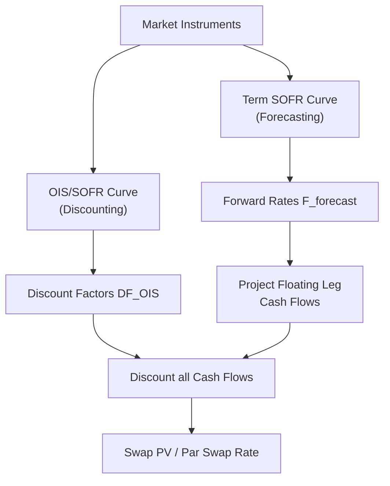

## Swap Valuation and Par Swap Rates

### Definition and Core Concept

Swap valuation is the process of determining the present value (PV) of a swap's future cash flows using discount factors derived from market interest rate data, allowing calculation of both the swap's mark-to-market value at any point after inception and the **par swap rate** — the fixed rate at which a swap has zero value at initiation.

The par swap rate is the fixed rate that equates the present value of the fixed leg to the present value of the floating leg, such that the net value of the swap to either counterparty is exactly zero at the trade date. This is the rate quoted in the interbank market and is the building block for constructing the swap curve used throughout fixed income and derivatives valuation.

**Key Points**

- Modern swap valuation (post-2008 financial crisis) uses **multi-curve discounting**, separating the curve used for forecasting floating rate cash flows from the curve used for discounting all cash flows to present value.
- A swap's value at inception is zero by construction (assuming no off-market spread); its value becomes non-zero over time as market rates move away from the original fixed rate.
- Par swap rates are the primary observable market data points used to bootstrap the entire discount curve.

### Single-Curve Valuation Framework (Legacy/Simplified Approach)

**Fixed Leg Present Value**

$$PV_{fixed} = N \times R_{fixed} \times \sum_{i=1}^{n} \tau_i \times DF_i$$

Where $N$ is notional, $R_{fixed}$ is the fixed rate, $\tau_i$ is the accrual fraction (day count) for period $i$, and $DF_i$ is the discount factor for the payment date of period $i$.

**Floating Leg Present Value**

Under the single-curve assumption (using one curve for both projecting forward rates and discounting), the floating leg has a well-known simplification: a floating-rate note (and by extension, the floating leg of a swap, if the discounting and forecasting curve are identical) is worth par at each reset date. This leads to:

$$PV_{floating} = N \times (1 - DF_n)$$

Where $DF_n$ is the discount factor at the final maturity date. This elegant simplification only holds when the floating leg resets exactly at the discounting curve's own implied forward rates — an assumption that breaks down under multi-curve frameworks.

**Par Swap Rate (Single-Curve)**

Setting $PV_{fixed} = PV_{floating}$ and solving for $R_{fixed}$:

$$R_{par} = \frac{1 - DF_n}{\sum_{i=1}^{n} \tau_i \times DF_i}$$

This is the standard textbook formula, and it remains conceptually useful for understanding swap mechanics, though it is no longer used directly in production pricing systems since the 2008 shift to multi-curve frameworks.

### Multi-Curve Valuation Framework (Current Market Standard)

**Rationale for Multi-Curve Discounting**

Prior to 2008, LIBOR (and by extension, other interbank offered rates) was treated as a reasonable proxy for a risk-free rate, and a single curve derived from LIBOR-based instruments (swaps, deposits, futures) was used both to project forward LIBOR rates and to discount cash flows. The 2008 financial crisis exposed significant credit and liquidity risk embedded in LIBOR (visible in the widening LIBOR-OIS spread), making a single curve inadequate. The market shifted to:

- A **discounting curve**, typically built from overnight index swap (OIS) rates (referencing SOFR in the US post-LIBOR transition, €STR in the Eurozone, SONIA in the UK), reflecting the closest available proxy to a risk-free/collateral rate — consistent with the fact that most swaps are collateralized under a CSA with daily variation margin, typically remunerated at the overnight rate.
- One or more **forecasting curves**, used to project the floating rate index cash flows (e.g., Term SOFR at various tenors, or historically LIBOR at 1M/3M/6M tenors), which may differ from the discounting curve.

**Multi-Curve Fixed Leg**

$$PV_{fixed} = N \times R_{fixed} \times \sum_{i=1}^{n} \tau_i \times DF_i^{OIS}$$

Discounting uses the OIS/SOFR-based discount curve exclusively.

**Multi-Curve Floating Leg**

$$PV_{floating} = N \times \sum_{i=1}^{n} \tau_i \times F_i^{forecast} \times DF_i^{OIS}$$

Where $F_i^{forecast}$ is the forward rate for period $i$ implied by the relevant forecasting curve (e.g., Term SOFR forward curve), and discounting again uses the OIS curve. The forward rate is derived from the forecasting curve's own discount factors:

$$F_i^{forecast} = \frac{1}{\tau_i}\left(\frac{DF_{i-1}^{forecast}}{DF_i^{forecast}} - 1\right)$$

**Par Swap Rate (Multi-Curve)**

$$R_{par} = \frac{\sum_{i=1}^{n} \tau_i \times F_i^{forecast} \times DF_i^{OIS}}{\sum_{i=1}^{n} \tau_i \times DF_i^{OIS}}$$

This is a discounted-average of the forward rates from the forecasting curve, weighted by the OIS discount factors — a materially different (and generally more accurate) result than the single-curve simplification, particularly when the spread between the forecasting index and the discounting rate (e.g., Term SOFR vs. SOFR OIS) is volatile or wide.

### Diagram: Multi-Curve Valuation Architecture

### Bootstrapping the Discount Curve

Par swap rates observed in the market (at standard tenors: 1Y, 2Y, 5Y, 10Y, 30Y, etc.) are used to **bootstrap** the discount curve — an iterative process of solving for discount factors sequentially from the shortest to longest maturity such that each observed par swap rate is exactly reproduced by the resulting curve.

**Bootstrapping Procedure (Simplified)**

1. Start with short-end instruments (overnight rate, deposit rates, or short futures) to establish the first few discount factors.
2. For each successive par swap maturity, use the already-solved discount factors for earlier periods, and solve for the single unknown discount factor at the new maturity such that the par swap rate equation holds exactly.
3. Repeat sequentially out to the longest observed maturity.
4. Interpolate between bootstrapped nodes (using log-linear, cubic spline, or monotone convex interpolation methods) to obtain discount factors for non-standard dates.

**Example**

Given a 2-year par swap rate of 4.00% (annual fixed payments, act/360 day count, simplified for illustration) and a known 1-year discount factor $DF_1 = 0.9615$ (implying a 1-year rate of ~4.00%):

$$4.00\% = \frac{1 \times 0.04 \times DF_1 + 1 \times 0.04 \times DF_2}{1 \times DF_1 + 1 \times DF_2}$$

Note that in this simplified single-curve illustration, if the par rate is exactly the average of period rates weighted by discount factors, solving yields $DF_2$ directly. In practice, with unequal fixed/floating frequencies and full multi-curve mechanics, this is solved via root-finding (Newton-Raphson) algorithms in production curve-building software (e.g., QuantLib, Bloomberg's curve builder, or proprietary bank systems) rather than by hand.

[Inference] Real-world curve construction involves dozens of input instruments (deposits, futures/FRAs, and swaps across the maturity spectrum) with careful handling of overlapping maturities, and the choice of interpolation method can materially affect forward rates implied between nodes — this is an area of ongoing methodological refinement rather than a single universally agreed standard.

### Mark-to-Market Valuation After Inception

Once a swap is on the books, its value fluctuates as market rates move. For the fixed-rate payer:

$$V_{fixed\ payer} = PV_{floating,remaining} - PV_{fixed,remaining}$$

Using the current (updated) discount and forecasting curves for the remaining cash flows.

**Example**

A 5-year payer swap was executed at a par rate of 3.50%. Two years later, with 3 years remaining, the prevailing 3-year par swap rate has risen to 4.20%. Since the fixed-rate payer is paying a below-market rate (3.50% vs. the current 4.20% market rate for the same remaining tenor), the swap has positive value to the fixed-rate payer — intuitively, they are "underpaying" relative to current market terms, and could unwind the swap by receiving a payment reflecting this favorable positioning, approximately:

$$V \approx N \times (R_{current} - R_{original}) \times \sum \tau_i \times DF_i$$

$$V \approx N \times (0.0420 - 0.0350) \times Annuity_{3yr}$$

Where $Annuity_{3yr}$ is the present value of a 3-year stream of $1 payments (the sum of discount factors weighted by accrual fractions) — this is the standard "PVBP" or "DV01"-based approximation for a swap's mark-to-market value driven by parallel rate shifts.

### The Swap Curve as a Benchmark

The par swap curve (the set of par swap rates across all observed maturities) serves several critical market functions:

- **Discounting benchmark**: Used to discount virtually all collateralized derivatives cash flows (via the OIS/SOFR curve specifically).
- **Relative value benchmark**: Corporate and government bond yields are frequently quoted as a spread to the swap curve ("swap spread") rather than to government bonds alone, particularly in markets or periods where government bond supply/demand technicals distort the government curve.
- **Hedging benchmark**: Fixed income portfolio managers use swaps to hedge interest rate duration without needing to trade the underlying government bond market.

### Day Count Conventions and Payment Frequency Mismatches

Swap valuation must carefully account for the fact that fixed and floating legs typically have different payment frequencies and day count conventions:

| Leg | Typical Frequency | Typical Day Count (USD) |
| --- | --- | --- |
| Fixed Leg | Semi-annual or annual | 30/360 |
| Floating Leg (Term SOFR/LIBOR legacy) | Quarterly | Act/360 |
| Floating Leg (SOFR OIS-style) | Daily compounding, paid periodically | Act/360 |

These mismatches mean the par swap rate formula must independently sum accrual-weighted discount factors for each leg according to its own schedule and day count — the fixed and floating leg summations in the par rate formula above are not simply "the same $n$ periods" in practice, requiring careful schedule generation for each leg.

### SOFR Compounding Conventions (Post-LIBOR Transition)

With the transition from LIBOR to overnight rates like SOFR, floating leg cash flow calculation changed from a simple forward-looking term rate observation to backward-looking daily compounding:

$$Compounded\ SOFR = \left(\prod_{i=1}^{d} (1 + r_i \times \frac{n_i}{360}) - 1\right) \times \frac{360}{D}$$

Where $r_i$ is the daily SOFR rate, $n_i$ is the number of calendar days that rate applies (accounting for weekends/holidays), $d$ is the number of business days in the period, and $D$ is the total number of calendar days in the period. Standard market convention typically includes an **observation shift** or **lookback period** (commonly 2 business days) to allow sufficient time for payment calculation before the period ends. [Inference] Exact conventions (lookback vs. lockout vs. payment delay methodologies) vary by product type and jurisdiction and continue to be an area where market practice has been converging over time following the LIBOR transition, so current ISDA/market convention references should be checked for specific product types.

### Comparison: Single-Curve vs. Multi-Curve Approach

| Feature | Single-Curve (Pre-2008) | Multi-Curve (Current Standard) |
| --- | --- | --- |
| Discounting basis | LIBOR-derived curve | OIS/SOFR-derived curve |
| Forecasting basis | Same curve as discounting | Separate forecasting curve(s) per index/tenor |
| Floating leg PV shortcut | $N(1-DF_n)$ valid | Shortcut invalid; requires explicit forward projection |
| Accuracy | Adequate when credit/liquidity spreads are negligible | Required when basis spreads are material |
| Complexity | Lower | Higher (multiple curves, cross-curve calibration) |

### Risk Considerations in Swap Valuation

**Model Risk**: Curve construction methodology (interpolation choice, bootstrapping order, instrument selection) can produce materially different valuations for the same market data, particularly for forward rates between liquid maturity nodes.

**Curve Basis Risk**: The spread between different forecasting curves (e.g., 1M vs. 3M Term SOFR) and the discounting curve can widen or narrow, affecting relative valuations of swaps referencing different tenors even with identical notional and maturity.

**Collateral/CSA Terms Risk**: The choice of discounting curve is directly tied to the collateral remuneration rate specified in the governing CSA; a swap collateralized in a currency different from its notional currency, or with non-standard collateral terms, requires bespoke discounting curve adjustments (cross-currency basis considerations).

**Behavioral disclaimer**: [Unverified] The specific curve-building methodology, interpolation scheme, and instrument universe used varies by institution and vendor system; valuations for the same swap can differ meaningfully between counterparties' internal models, which is why independent valuation/reconciliation processes and standardized CSA discounting terms are important in practice.

**Next Steps**

- OIS discounting and the SOFR transition: detailed mechanics and legacy LIBOR fallback provisions
- Curve bootstrapping algorithms: interpolation methods (log-linear, monotone convex, cubic spline) and their impact on forward rates
- Swap spreads as a relative value and macro indicator (swap spread vs. government bond yields)
- Cross-currency basis swaps and multi-currency discounting frameworks
- DV01/PVBP and duration-based hedging using interest rate swaps
- CSA optionality and the impact of collateral currency choice on discounting curve selection
- SOFR compounding conventions: lookback, lockout, and payment delay methodologies in practice