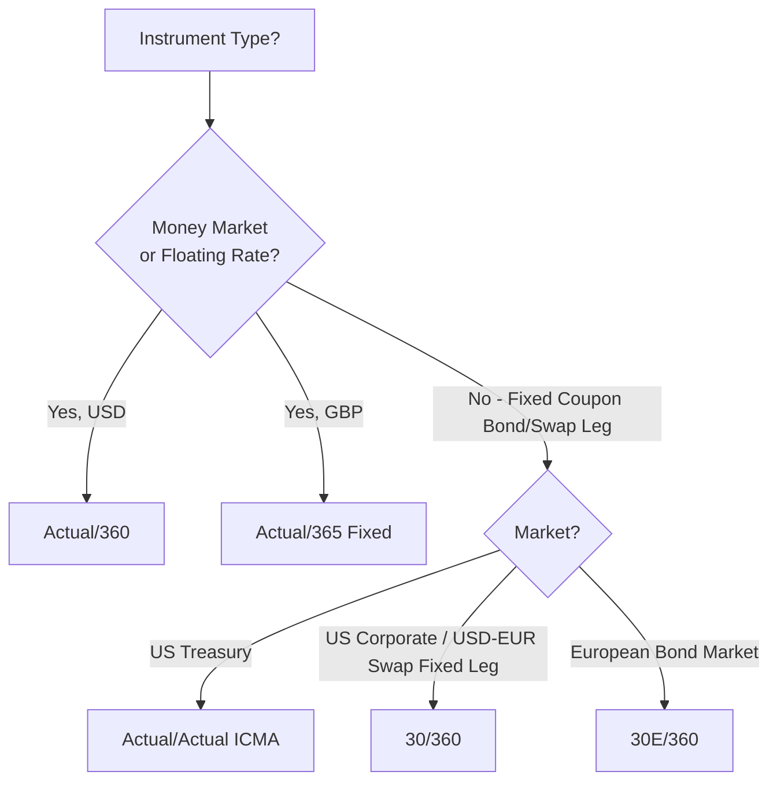
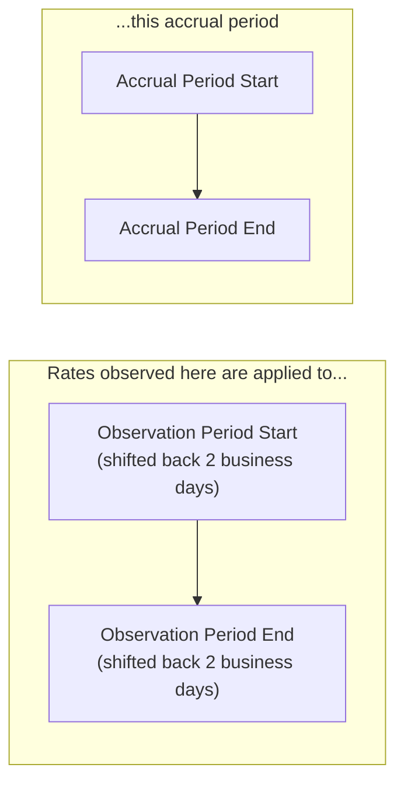

## Day Count Conventions and Compounding Methods

### Definition and Core Concept

A day count convention is a standardized methodology for calculating the fraction of a year (the "accrual fraction" or "year fraction") between two dates, used to determine interest accrual for bonds, loans, and derivatives. A compounding method defines how periodic interest amounts combine over time to produce a total accrued or effective rate, particularly relevant for overnight-rate-based floating legs.

Both conventions are foundational, seemingly mechanical details that materially affect cash flow amounts, swap valuations, and rate comparisons across instruments — small differences in convention can produce meaningfully different payment amounts on large notionals, making precise convention specification a critical (and heavily negotiated) element of derivative confirmations.

**Key Points**

- Day count conventions determine the year fraction $\tau$ used in virtually every interest calculation formula throughout fixed income and derivatives.
- Different markets and instrument types have different standard conventions by long-established convention (US Treasuries, US corporate bonds, USD swaps, EUR swaps, and money markets all differ).
- The shift from LIBOR to overnight rates (SOFR, €STR, SONIA) introduced new compounding mechanics (backward-looking daily compounding) that did not exist under the older forward-looking term-rate paradigm.

### Standard Day Count Conventions

**Actual/Actual (ISDA / ICMA variants)**

Uses the actual number of days in the accrual period divided by the actual number of days in the relevant reference year (with variations in how leap years and the reference period are handled between the ISDA and ICMA definitions). Common for:

- US Treasury bonds (ICMA-style, sometimes called Actual/Actual (Bond))
- Certain swap and derivative fixed legs under specific ISDA definitions

$$\tau = \frac{Actual\ Days\ in\ Period}{Actual\ Days\ in\ Year}$$

**Actual/360**

Uses the actual number of calendar days in the period, divided by a standardized 360-day year. Common for:

- Money market instruments (US commercial paper, T-bills, bank deposits)
- USD LIBOR-based (legacy) and SOFR-based floating legs
- Most floating legs of USD interest rate swaps

$$\tau = \frac{Actual\ Days\ in\ Period}{360}$$

**Actual/365 (Fixed)**

Uses the actual number of calendar days, divided by a fixed 365-day year (ignoring leap years in the denominator). Common for:

- GBP money markets and GBP-denominated floating legs (SONIA-based)
- Certain other sterling and Commonwealth-market instruments

$$\tau = \frac{Actual\ Days\ in\ Period}{365}$$

**30/360 (Bond Basis / 30E/360 variants)**

Assumes each month has exactly 30 days and each year has 360 days, with specific rules for adjusting month-end dates (the "30/360" and "30E/360" — European variant — differ in their end-of-month date adjustment rules). Common for:

- US corporate and municipal bonds
- Fixed legs of most USD, EUR interest rate swaps

$$\tau = \frac{360 \times (Y_2-Y_1) + 30 \times (M_2-M_1) + (D_2-D_1)}{360}$$

Where $Y$, $M$, $D$ represent year, month, and day of the start and end dates, with specific adjustment rules applied to $D_1$ and $D_2$ when either falls on the 31st (or, for 30E/360, the last day of February).

**Example: 30/360 Calculation**

Calculate the year fraction between January 31, 2026 and July 31, 2026 under 30/360 (US) convention.

- Per standard 30/360 (US) rules, if $D_1 = 31$, it is adjusted to $D_1 = 30$.
- If $D_2 = 31$ and $D_1$ (after adjustment) $= 30$, then $D_2$ is also adjusted to 30.
- Adjusted dates: $D_1 = 30$, $D_2 = 30$; $M_1 = 1$, $M_2 = 7$; $Y_1 = Y_2 = 2026$.
- $\tau = \frac{360(0) + 30(7-1) + (30-30)}{360} = \frac{180}{360} = 0.5$

This matches the intuitive expectation of exactly half a year between two 6-month-apart dates, which is precisely the design intent of 30/360 conventions — to produce clean, predictable fractions for regular semi-annual/annual bond coupon schedules regardless of actual calendar irregularities (weekends, month lengths, leap years).

**Example: Actual/360 Calculation**

Calculate the year fraction for a 3-month (92 actual calendar days) USD SOFR floating rate period.

$$\tau = \frac{92}{360} = 0.2556$$

This is used directly in the floating leg formula: $Payment = N \times R_{SOFR} \times \tau$.

### Comparison Table: Day Count Conventions by Market/Instrument

| Convention | Typical Use | Denominator Logic |
| --- | --- | --- |
| Actual/Actual (ICMA) | US Treasury bonds | Actual days / actual days in reference period |
| Actual/360 | Money markets, USD swap floating legs, USD SOFR OIS | Actual days / fixed 360 |
| Actual/365 (Fixed) | GBP money markets, SONIA floating legs | Actual days / fixed 365 |
| 30/360 (Bond Basis) | US corporate bonds, USD/EUR swap fixed legs | Stylized 30-day months / 360 |
| 30E/360 | European bond markets, EUR-denominated instruments | Stylized 30-day months / 360 (European end-of-month rule) |

### Diagram: Day Count Convention Selection Logic

### Compounding Methods

**Simple Interest**

Interest accrues linearly without reinvestment of interim interest, standard for single-period money market instruments and most fixed-rate bond coupons within a single accrual period:

$$Interest = N \times R \times \tau$$

**Compound Interest (Periodic)**

Interest is calculated and reinvested at each compounding sub-period within a longer accrual period, standard for multi-year zero-coupon-equivalent calculations and effective annual rate conversions:

$$FV = N \times (1 + \frac{R}{m})^{m \times T}$$

Where $m$ is the number of compounding periods per year and $T$ is time in years.

**Continuous Compounding**

The limiting case as compounding frequency approaches infinity, standard in derivatives pricing theory (Black-Scholes framework, option pricing models) for mathematical convenience:

$$FV = N \times e^{RT}$$

### Overnight Rate Compounding (SOFR, €STR, SONIA) — Backward-Looking Daily Compounding

With the transition from forward-looking term rates (LIBOR) to overnight rates, floating rate cash flows for a period are no longer based on a single rate observed at the start of the period. Instead, the realized daily overnight rates observed *throughout* the period are compounded together — a fundamentally backward-looking calculation only fully known at (or near) the end of the accrual period.

**Compounded Daily Rate Formula**

$$Compounded\ Rate = \left(\prod_{i=1}^{d} \left(1 + r_i \times \frac{n_i}{360}\right) - 1\right) \times \frac{360}{D}$$

Where:

- $r_i$ = the overnight rate applicable on business day $i$
- $n_i$ = the number of calendar days that rate applies for (typically 1, but 3 over a weekend, more over a holiday cluster, since Friday's rate typically applies through the weekend)
- $d$ = number of business days in the period
- $D$ = total number of calendar days in the period

**Example**

Consider a simplified 5-business-day SOFR compounding period (ignoring weekends for simplicity) with daily SOFR rates of 5.30%, 5.31%, 5.29%, 5.30%, 5.32%, each applying for 1 day:

$$\left(\prod_{i=1}^{5}(1 + r_i \times \frac{1}{360}) - 1\right) \times \frac{360}{5}$$

Each daily factor is very close to 1 (e.g., $1 + 0.0530/360 = 1.0001472$), so the product of five such factors, minus 1, annualized by $360/5$, produces a compounded rate very close to the simple average of the daily rates (approximately 5.304%) but not exactly identical, due to the compounding effect — the difference is typically small (a few tenths of a basis point) over short periods but becomes more material over longer accrual periods or in high-rate environments.

### Lookback, Lockout, and Payment Delay Conventions

Because the fully compounded overnight rate for a period is only known at (or very near) the period's end, market convention has converged on several methods to allow sufficient operational time to calculate and process payments before the actual payment date:

**Lookback (Observation Shift)**

The rate observation period is shifted backward by a fixed number of business days (commonly 2, sometimes 5) relative to the actual accrual/payment period, meaning the *rates* used are from an earlier window than the *accrual dates* they are nominally applied to. This is the most common convention for SOFR-based swaps.

**Lockout**

The rate for the final few days of the accrual period is "locked" at the rate observed on an earlier date (rather than shifting the whole observation window), with the rest of the period using actual daily observed rates. Common in certain SOFR-based floating rate notes.

**Payment Delay**

The accrual period and rate observation period align exactly (no shift), but the actual payment date is delayed by a fixed number of business days after the accrual period ends, allowing calculation time without altering which rates apply to which accrual dates. Less commonly used in swaps due to operational cash flow timing complexity, but used in some cash market floating rate note structures.

[Inference] The specific convention adopted (lookback vs. lockout vs. payment delay) and the number of days used varies by currency, product type (swaps vs. FRNs vs. loans), and has evolved through industry working group recommendations (e.g., ARRC in the US, working groups in other jurisdictions) during and after the LIBOR transition — current market-standard conventions for a specific product should be verified against current ISDA definitions or relevant market body guidance rather than assumed to be static.

### Diagram: Lookback Period Mechanics

### Impact on Valuation and Cash Flows

**Fixed vs. Floating Leg Convention Mismatch**

As covered in swap valuation mechanics, fixed legs (commonly 30/360) and floating legs (commonly Actual/360) of the same swap use different day count conventions, meaning direct period-by-period comparison of accrual fractions is not meaningful without full schedule generation for each leg independently.

**Basis Point Value Impact**

[Inference] For very large notional swap books, small differences arising from day count convention choice (particularly 30/360 vs. Actual/Actual in leap years, or Actual/360 vs. Actual/365 for GBP vs. USD legs in cross-currency structures) can accumulate to material P&L or reconciliation differences, which is why day count convention is always explicitly specified in trade confirmations rather than assumed from market defaults alone.

**Leap Year Effects**

Actual/365 (Fixed) conventions do not adjust for leap years, meaning a period spanning February 29 accrues one additional day's worth of interest relative to what an Actual/Actual convention would calculate (since Actual/Actual would divide by 366 in the leap year portion), creating small but calculable discrepancies between conventions in leap years.

### Documentation and Standardization

- **ISDA Definitions** (2006 ISDA Definitions, and subsequent supplements covering SOFR/RFR fallback language) specify standard day count fractions and their precise calculation methodologies for use in confirmations, including detailed treatment of edge cases (month-end adjustments, stub periods).
- **ICMA Rule Book** governs day count conventions for international bond markets, with specific actual/actual methodologies that differ subtly from ISDA's actual/actual definitions used in derivatives.
- Trade confirmations always explicitly specify the day count convention by name (e.g., "Act/360," "30/360," "Act/Act ICMA") to eliminate ambiguity, since multiple conventions may be plausible defaults depending on currency and instrument type.

### Risk Considerations

**Operational/Reconciliation Risk**: Mismatched assumptions about day count convention between counterparties' systems (or between a firm's front-office and back-office systems) can produce cash flow discrepancies that require manual reconciliation — a common source of "nostro breaks" or payment disputes in practice.

**Model Risk in Curve Construction**: Using an incorrect day count convention when bootstrapping discount curves or calculating forward rates produces systematically biased curves, compounding across all dependent valuations.

**Behavioral disclaimer**: [Unverified] While day count conventions are among the most standardized elements of fixed income and derivatives markets, edge cases (stub periods, month-end date adjustments, holiday calendar interactions with lookback periods) can still produce implementation differences between systems, so specific numerical outputs should be verified against the relevant ISDA definitions or confirmation language for a given trade rather than assumed universally consistent.

**Next Steps**

- Multi-curve swap valuation and the role of day count conventions in curve bootstrapping
- ISDA 2006 Definitions and RFR (Risk-Free Rate) fallback supplement provisions
- SOFR compounding conventions in practice: ARRC recommendations and market adoption patterns
- Stub period calculation methods (short/long stubs, front/back stubs) in swap schedule generation
- Business day conventions (Modified Following, Following, Preceding) and holiday calendar interactions
- Cross-currency basis swaps: reconciling differing day count conventions across currency legs