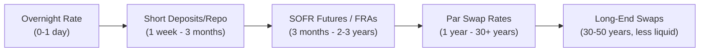
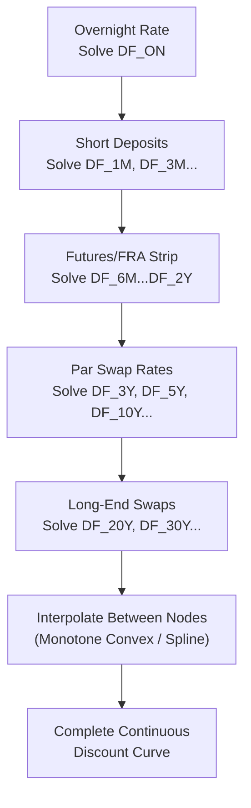

## Swap Curve Construction and Bootstrapping

### Definition and Core Concept

Swap curve construction is the process of building a continuous term structure of discount factors (and by extension, zero rates and forward rates) from a discrete set of observable market instruments — deposits, futures/FRAs, and par swap rates — such that the curve exactly reprices every input instrument. Bootstrapping is the specific sequential algorithm used to solve for these discount factors, working outward from the shortest maturity to the longest, using previously-solved discount factors as inputs to solve for each subsequent unknown.

The resulting curve is the foundational input for virtually all interest rate derivative valuation: discounting cash flows to present value, projecting future floating rate resets, calculating forward rates, and pricing swaptions, caps/floors, and other rate-contingent instruments.

**Key Points**

- Bootstrapping is fundamentally a sequential root-finding process — each new instrument added to the curve introduces exactly one new unknown discount factor, solved using all previously bootstrapped points.
- Since the 2008 financial crisis, curve construction operates within a **multi-curve framework**, requiring separate (but jointly consistent) discounting and forecasting curves.
- Interpolation method choice between bootstrapped nodes is not a minor implementation detail — it materially affects forward rates implied between input maturities and is an active area of quantitative methodology.

### Input Instrument Universe

A typical USD SOFR curve construction uses a layered set of instruments across the maturity spectrum, chosen for liquidity and reliable market observability at each tenor:

**Short End (Overnight to ~3 Months)**

- SOFR overnight rate (or equivalent overnight index)
- Short-dated deposits or repo rates, where used as supplementary short-end anchors

**Money Market / Futures Segment (~3 Months to ~2-3 Years)**

- SOFR futures (3-month SOFR futures, analogous to legacy Eurodollar futures) provide market-implied forward rate expectations
- Forward Rate Agreements (FRAs), where liquid, for specific forward periods

**Swap Segment (~1 Year to 30+ Years)**

- Par swap rates at standard tenors: 1Y, 2Y, 3Y, 5Y, 7Y, 10Y, 15Y, 20Y, 30Y (and sometimes 40Y, 50Y in some markets)
- These are overwhelmingly the dominant, most liquid instruments determining the curve shape beyond the front end

**Basis Instruments (Cross-Tenor and Cross-Currency)**

- Tenor basis swaps (e.g., 1M SOFR vs. 3M Term SOFR, where relevant) to calibrate consistency between different forecasting curves
- Cross-currency basis swaps, needed when constructing curves for discounting non-domestic-currency collateralized trades

### Diagram: Instrument Layering Across the Curve

### The Bootstrapping Algorithm

**Step 1: Anchor the Short End**

Establish discount factors for the shortest maturities directly from overnight and short-term deposit/repo rates using simple interest conversion:

$$DF_T = \frac{1}{1 + r \times \tau}$$

Where $r$ is the observed short-term rate and $\tau$ is the corresponding day-count-adjusted year fraction.

**Step 2: Sequential Solving Through the Curve**

For each successive input instrument (futures, FRA, or par swap) at increasing maturities, solve for the single new unknown discount factor that makes the curve consistent with that instrument's observed market rate, holding all previously-solved discount factors fixed.

For a par swap at maturity $T_n$, given already-known discount factors $DF_1, ..., DF_{n-1}$ for earlier payment dates, the par swap rate equation:

$$R_{par,n} = \frac{\sum_{i=1}^{n} \tau_i \times F_i \times DF_i}{\sum_{i=1}^{n} \tau_i \times DF_i}$$

contains only $DF_n$ as an unknown (since $F_n$, the final period's forward rate, is itself a function of $DF_{n-1}$ and $DF_n$ under the forecasting curve). This is solved numerically — typically via Newton-Raphson or a similar root-finding method, since the equation is not generally solvable in closed form once forward-rate dependencies are included.

**Step 3: Handling Multi-Curve Dependencies**

When a forecasting curve (e.g., Term SOFR) differs from the discounting curve (SOFR OIS), the two curves must often be bootstrapped jointly or iteratively, since the par swap rate equation for the forecasting curve's instruments still requires OIS discount factors, while OIS curve construction may itself depend on basis swap instruments referencing the forecasting index. This interdependency is typically resolved via:

- **Sequential bootstrapping** when the curve hierarchy is clean (discounting curve built first and independently, then forecasting curves built using it as a fixed input), or
- **Global/simultaneous calibration** using iterative numerical methods when curves are mutually dependent (common in full cross-currency, multi-tenor curve sets).

**Step 4: Interpolation Between Nodes**

Since bootstrapped discount factors exist only at the discrete maturities of input instruments, a continuous curve requires interpolation to price cash flows falling on non-standard dates between nodes.

### Interpolation Methods

**Log-Linear Interpolation (on Discount Factors)**

Interpolates linearly on the natural logarithm of discount factors, which is equivalent to linear interpolation on the zero rate (continuously compounded) between nodes. Widely used for its simplicity and the fact that it guarantees positive, monotonically appropriate discount factors, but produces forward rates that are piecewise constant between nodes with discontinuous jumps at each node — a known limitation.

$$\ln(DF(t)) = \ln(DF(t_1)) + \frac{t-t_1}{t_2-t_1} \times (\ln(DF(t_2)) - \ln(DF(t_1)))$$

**Linear Interpolation (on Zero Rates)**

Similar in spirit to log-linear on discount factors but applied directly to the zero rate curve; produces similar piecewise-forward-rate discontinuities.

**Cubic Spline Interpolation**

Fits smooth piecewise cubic polynomials between nodes, ensuring continuity of both the curve and its first derivative (and often second derivative), producing smoother forward rate curves without the sharp discontinuities of linear methods. However, cubic splines can introduce spurious oscillations ("wiggles") in forward rates, particularly in regions with sparse input data or sharp curvature changes.

**Monotone Convex Interpolation (Hagan-West Method)**

A specialized method designed specifically for interest rate curve construction, ensuring the interpolated forward rate curve remains smooth, avoids negative rates artifacts (in contexts where this was historically important), and avoids the oscillation problems of naive cubic splines while still producing continuous forward rates. [Inference] This method (or close variants) has become a widely adopted industry standard specifically because it addresses the forward-rate-smoothness problem that both linear and naive cubic spline methods struggle with, though exact implementation details and enhancements vary across vendor and proprietary systems.

### Comparison: Interpolation Method Trade-offs

| Method | Forward Rate Smoothness | Oscillation Risk | Computational Complexity |
| --- | --- | --- | --- |
| Log-Linear (on DF) | Piecewise constant, discontinuous | Low | Low |
| Linear (on Zero Rates) | Piecewise constant, discontinuous | Low | Low |
| Cubic Spline | Smooth, continuous | Moderate-High | Moderate |
| Monotone Convex | Smooth, continuous | Low (by design) | Moderate-High |

### Worked Bootstrapping Example (Simplified, Single-Curve Illustration)

Consider building a simplified curve using annual par swap rates (ignoring the full multi-curve mechanics for illustrative clarity):

- 1-year par swap rate: 4.00% (annual payment, assume Act/360 ≈ treated as annual for simplicity)
- 2-year par swap rate: 4.20%

**Step 1**: Solve $DF_1$ from the 1-year rate.

Since a 1-year swap has a single fixed payment, it is equivalent to a simple deposit-like instrument:

$$DF_1 = \frac{1}{1+0.0400} = 0.9615$$

**Step 2**: Solve $DF_2$ using the 2-year par rate and the known $DF_1$.

$$0.0420 = \frac{0.0420 \times DF_1 + 0.0420 \times DF_2}{DF_1 + DF_2}$$

In this simplified single-period-fixed-rate illustration, the par rate equation can be rearranged:

$$0.0420 \times (DF_1 + DF_2) = 0.0420 \times DF_1 + 0.0420 \times DF_2 \times 1$$

More precisely, using the standard par swap relationship where the final period's cash flow also returns notional-equivalent value at maturity (the standard bond-equivalent par swap derivation):

$$DF_2 = \frac{1 - R_2 \times DF_1}{1 + R_2} = \frac{1 - 0.0420 \times 0.9615}{1.0420} \approx 0.9226$$

The resulting zero rates: 1-year zero rate ≈ 4.00%, 2-year zero rate ≈ 4.10% (derived from $DF_2$), illustrating how bootstrapping extracts the pure zero-coupon rate structure from coupon-bearing (par) swap rate inputs — a process directly analogous to bootstrapping a zero curve from coupon bond prices in the bond market.

### Curve Quality Checks and Validation

**Reprising Check**: The fundamental validation of any bootstrapped curve is that every input instrument's rate, when repriced using the constructed curve, exactly reproduces the original observed market rate (to within numerical tolerance) — this is a necessary but not sufficient condition for curve quality.

**Forward Rate Smoothness Inspection**: Practitioners routinely plot the implied forward rate curve (not just the discount factor or zero rate curve) to visually inspect for unrealistic oscillations, negative forward rates (where economically implausible), or discontinuities that may indicate interpolation artifacts or input data quality issues.

**Cross-Instrument Consistency**: Where overlapping instruments exist at similar maturities (e.g., a futures contract and an FRA covering similar periods), curve construction must handle potential inconsistencies between these instruments' implied rates, often via weighted blending, instrument selection priority rules, or exclusion of less liquid overlapping instruments.

### Diagram: Bootstrapping Sequential Process

### Multi-Curve Bootstrapping Architecture

**Discounting Curve (OIS/SOFR)**: Bootstrapped first (or independently) from overnight-indexed instruments — OIS swaps referencing the overnight rate directly — since this curve underpins discounting for all collateralized trades regardless of which floating index they reference.

**Forecasting Curve(s)**: Bootstrapped using the already-established discounting curve to discount cash flows, while solving for the forecasting curve's own discount factors such that the forecasting curve's implied forward rates correctly reprice instruments referencing that specific index (e.g., 3-month Term SOFR swaps, or historically 3-month LIBOR swaps).

**Basis Curve Consistency**: Tenor basis swaps (exchanging one floating index for another, e.g., 1M vs. 3M SOFR) are used to ensure multiple forecasting curves for the same underlying rate family remain mutually consistent, since in principle a 3-month rate compounded should relate closely to three consecutive 1-month rates, with the basis swap capturing any residual market-observed spread between the two.

### Practical Implementation Considerations

**Software and Tooling**: Production curve construction is implemented in specialized quantitative libraries (e.g., QuantLib, an open-source library widely used as a reference implementation and embedded in many commercial systems) or proprietary bank/vendor systems (Bloomberg, Numerix, Murex, Calypso), given the computational complexity of joint multi-curve, multi-instrument bootstrapping with appropriate interpolation.

**Holiday Calendars and Business Day Conventions**: Accurate curve construction requires precise handling of currency-specific holiday calendars and business day adjustment conventions (Modified Following, Following, Preceding) for every cash flow date in every input instrument, since date errors propagate directly into discount factor errors.

**Curve Update Frequency**: In active trading environments, curves are typically rebuilt intraday (sometimes continuously or at high frequency) as market rates move, requiring computationally efficient bootstrapping and interpolation algorithms suitable for real-time or near-real-time recalculation.

### Risk Considerations

**Model Risk**: [Inference] Different interpolation methods or instrument selection choices applied to identical market data can produce materially different forward rates in regions between liquid input nodes, representing a genuine source of valuation disagreement between market participants even when using the same raw market data — this is a recognized and actively managed model risk in derivatives valuation functions.

**Stale or Illiquid Input Risk**: Using stale, illiquid, or thinly-traded instrument quotes as curve inputs (particularly at longer maturities or in less liquid currencies) can distort the entire curve shape at and beyond that maturity, given the sequential nature of bootstrapping.

**Curve Discontinuity at Instrument Transitions**: Transition points where the input instrument type changes (e.g., from futures to swaps around the 2-3 year mark) can sometimes exhibit minor curve artifacts if the transition is not handled carefully, particularly regarding convexity adjustments needed when using futures rates (which differ subtly from FRA/forward rates due to the daily margining feature of futures contracts) as curve inputs.

**Behavioral disclaimer**: [Unverified] Specific curve construction methodologies, instrument universes, and interpolation choices vary meaningfully across institutions and vendor platforms, and reasonable practitioners can produce different valuations for the same underlying market data — this is why standardized CSA discounting terms, independent price verification, and curve methodology documentation are important governance practices in derivatives operations.

**Next Steps**

- Multi-curve valuation framework: detailed fixed and floating leg PV mechanics
- SOFR futures convexity adjustments and their role as curve-building inputs
- Cross-currency basis curve construction and its interaction with domestic discounting curves
- Swaption and cap/floor volatility surface construction as a downstream application of the discount curve
- QuantLib or vendor-specific curve-building implementation architecture
- Negative rate environments and their historical impact on interpolation method selection (relevant to certain non-USD curve histories)