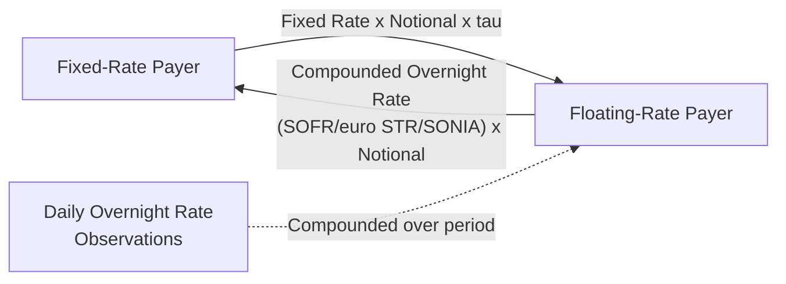
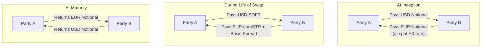

## Overnight Index Swaps and Basis Swaps

### Definition and Core Concept

An overnight index swap (OIS) is an interest rate swap in which the floating leg references a compounded overnight interest rate (SOFR in the US, €STR in the Eurozone, SONIA in the UK, TONAR in Japan) rather than a term rate like LIBOR or Term SOFR, exchanged against a fixed rate over the life of the swap. OIS rates are widely regarded as the closest proxy to a "risk-free" or minimal-credit-risk rate available in the market, since overnight lending carries negligible credit exposure duration.

A basis swap (or tenor basis swap) exchanges two different floating rate indices against each other, typically two rates of different tenors within the same currency (e.g., 1-month SOFR vs. 3-month Term SOFR) or, in a broader sense, rates referencing different underlying benchmarks. Basis swaps isolate and trade the spread between two floating indices without any fixed-rate component.

**Key Points**

- OIS is the standard instrument used to construct the discounting curve in the post-2008 multi-curve valuation framework, since most derivatives are collateralized and collateral is typically remunerated at the overnight rate.
- Basis swaps exist because different floating rate tenors and benchmarks do not move in perfect lockstep — the spread between them reflects credit, liquidity, and term-premium differences that fluctuate with market conditions.
- Both instrument types are central "plumbing" of the interest rate derivatives market rather than directional bets in the way that longer-dated fixed-for-floating swaps often are used.

### Overnight Index Swaps (OIS)

#### Structure and Cash Flow Mechanics

**Fixed Leg**

$$Fixed\ Payment = N \times R_{fixed} \times \tau$$

Typically paid at maturity for shorter OIS (under 1 year) or periodically (e.g., annually) for longer-dated OIS, with day count conventions varying by currency (Act/360 for USD, Act/365 for GBP, Act/360 for EUR).

**Floating Leg (Compounded Overnight Rate)**

$$Floating\ Payment = N \times \left[\left(\prod_{i=1}^{d}(1+r_i \times \frac{n_i}{360}) - 1\right) \times \frac{360}{D}\right]$$

Where $r_i$ is the overnight rate on business day $i$, $n_i$ accounts for weekend/holiday day-count carry-forward, $d$ is the number of business days, and $D$ is total calendar days in the period — this is the same backward-looking daily compounding mechanic used for SOFR-based swap floating legs generally, since OIS and SOFR swap floating legs are mechanically similar (both reference the same overnight rate; the distinction is more about maturity/purpose convention than a fundamentally different calculation).

At maturity (or each periodic reset for longer OIS), only the net difference between the fixed and compounded floating amounts is exchanged.

**Example**

A bank enters a 3-month USD OIS as the fixed-rate payer on $50,000,000 notional, with a fixed rate of 5.25%, referencing daily SOFR.

- Actual compounded SOFR over the 91-day period comes in at 5.31% (annualized equivalent).
- Net floating leg amount: $50,000,000 × 5.31% × (91/360) ≈ $670,675
- Net fixed leg amount: $50,000,000 × 5.25% × (91/360) ≈ $663,542
- Net payment: the fixed-rate payer receives approximately $7,133 from the floating-rate payer (since realized floating exceeded fixed).

#### OIS vs. Term Rate Swaps: Key Distinctions

| Feature | OIS (Overnight Index Swap) | Term Rate Swap (Term SOFR / Legacy LIBOR) |
| --- | --- | --- |
| Floating rate basis | Daily compounded overnight rate | Forward-looking term rate (or now, compounded backward-looking daily rate under SOFR swaps too, depending on convention) |
| Known at period start? | No — only fully known at/near period end | Legacy LIBOR: yes, known at start; SOFR-based term swaps: typically also backward-looking |
| Credit/liquidity risk embedded | Minimal | Historically embedded bank credit risk (LIBOR); largely absent in SOFR-based rates |
| Primary use | Discounting curve construction, short-term rate hedging, central bank policy rate exposure | Longer-dated fixed-floating exposure management, loan/asset-liability matching |
| Typical tenor range | Overnight to 2 years (most liquid); longer tenors traded but less liquid | Full curve, 1 year to 30+ years |

[Inference] With the broad market shift to SOFR (and other overnight-rate-based benchmarks) as the primary floating reference even for longer-dated swaps, the mechanical distinction between "OIS" and "SOFR swap" has narrowed considerably compared to the pre-transition era when OIS (referencing Fed Funds) was distinctly different from LIBOR-based term swaps — in current market usage, "OIS" often refers more to the specific product convention (shorter-dated, used for discounting/central-bank-rate-expression) than to a fundamentally different floating rate calculation methodology from other SOFR swaps.

#### Uses of OIS

**Discount Curve Construction**: As established in the multi-curve valuation framework, OIS rates are the standard input for building the discounting curve used to present-value all collateralized derivative cash flows.

**Central Bank Rate Expectations**: OIS rates are widely used by market participants and central bank watchers as a direct market-implied expression of expected policy rate paths, since the overnight rate closely tracks the central bank's target rate — OIS forward rates are a common tool for gauging market expectations of future rate hikes or cuts.

**Short-Term Interest Rate Risk Management**: Money market desks, treasury functions, and banks use OIS to hedge or express views on short-term interest rate movements with minimal credit risk contamination, cleaner than using term-rate-based instruments.

**Collateral/Funding Cost Hedging**: Since posted collateral under a CSA is typically remunerated at the overnight rate, OIS provides a natural hedge for funding cost exposure related to collateral management.

### Diagram: OIS Cash Flow Structure

### Basis Swaps

#### Structure and Cash Flow Mechanics

A basis swap exchanges two floating rate cash flow streams, both typically calculated on the same notional, with the net spread between the two indices being the economically traded quantity:

$$Net\ Payment = N \times (F_{index\ A} - F_{index\ B} \pm Spread) \times \tau$$

Where the *spread* (also called the "basis") is quoted in the market and represents the compensation one party requires to exchange one index for the other, reflecting relative credit, liquidity, or term-structure differences between the two reference rates.

**Tenor Basis Swaps** (Same Currency, Different Tenors)

Exchange, for example, 1-month compounded SOFR against 3-month Term SOFR (or, historically, 3-month LIBOR against 6-month LIBOR):

$$Party\ A: \ pays\ 1M\ SOFR\ (compounded)$$

$$Party\ B: \ pays\ 3M\ Term\ SOFR + spread$$

The spread compensates for the fact that a series of shorter-tenor fixings and a single longer-tenor fixing carry different roll/refixing risk and historically different embedded credit/liquidity premia (though this premium is far smaller and more stable for SOFR-based tenor differences than it was for LIBOR tenor basis, since SOFR lacks the bank credit risk component that made LIBOR tenor basis historically volatile, particularly during stress periods).

**Cross-Currency Basis Swaps** (Different Currencies)

Exchange floating rate payments in two different currencies (e.g., USD SOFR vs. EUR €STR), typically including an exchange of notional at inception and maturity (unlike single-currency swaps), with a basis spread added to one leg reflecting relative currency funding demand/supply imbalances — often driven by hedging flows, cross-border capital flows, and regulatory/balance-sheet considerations of major currency-swapping institutions (typically banks).

$$Cross\text{-}Currency\ Basis\ Payment_{USD\ leg} = N_{USD} \times SOFR \times \tau$$

$$Cross\text{-}Currency\ Basis\ Payment_{EUR\ leg} = N_{EUR} \times (\text{\euro}STR + basis\ spread) \times \tau$$

**Example**

A corporate treasury with EUR-denominated debt but USD-denominated revenue enters a cross-currency basis swap, paying EUR floating (€STR + basis) and receiving USD floating (SOFR flat), on notional amounts of €90,000,000 and $100,000,000 respectively (reflecting the prevailing EUR/USD spot rate at inception).

If the EUR/USD cross-currency basis is quoted at -15 basis points (meaning EUR floating payers must pay €STR minus 15bps, or equivalently the USD receiver requires a discount, reflecting typically stronger structural demand to receive USD funding via this route), the actual EUR leg payment would be calculated at €STR − 0.15% rather than flat €STR — this negative basis is a persistent, closely-watched market phenomenon reflecting USD funding demand dynamics in global capital markets. [Unverified] The sign and magnitude of the cross-currency basis fluctuates with market conditions, regulatory balance sheet costs, and relative monetary policy stances, and should not be assumed static or predictable from historical levels alone.

### Diagram: Cross-Currency Basis Swap Structure

### Comparison: Tenor Basis Swap vs. Cross-Currency Basis Swap

| Feature | Tenor Basis Swap | Cross-Currency Basis Swap |
| --- | --- | --- |
| Currencies involved | Single currency | Two different currencies |
| Notional exchange | None (like standard IRS) | Yes, at inception and maturity |
| Basis spread driver | Tenor-related credit/liquidity/roll risk | Cross-border currency funding supply/demand |
| Typical magnitude (SOFR-era) | Small, often single-digit to low double-digit basis points | Can range more widely (several bps to tens of bps), currency-pair dependent |
| Primary users | Curve construction, relative value desks | Corporate treasuries, cross-border funding, FX-hedged bond investors |

### Participants and Motivations

**OIS Market Participants**

- **Dealers/Banks**: Use OIS extensively for discounting curve construction and to hedge collateral funding costs.
- **Asset Managers/Macro Funds**: Trade OIS to express views on central bank policy rate paths with minimal credit risk noise.
- **Corporate Treasuries**: Use short-dated OIS for cash management and short-term rate hedging.

**Basis Swap Market Participants**

- **Curve Construction Desks**: Use tenor basis swaps to maintain internal consistency between multiple forecasting curves referencing different tenors of the same underlying rate family.
- **Corporate Treasuries and Bond Issuers**: Use cross-currency basis swaps extensively to hedge foreign-currency-denominated debt issuance back into domestic currency funding, or vice versa (a very large and active use case, particularly for non-US issuers raising USD debt).
- **FX-Hedged Fixed Income Investors**: Use cross-currency basis swaps (or economically similar FX swaps) to hedge currency risk on foreign bond holdings while capturing the basis as an additional return/cost component.
- **Relative Value/Arbitrage Desks**: Trade basis swaps directionally based on views about future basis movement, funding market dynamics, or regulatory-driven balance sheet effects on specific currency pairs.

### Valuation Considerations

**OIS Valuation**: Straightforward application of the multi-curve framework where, notably, for OIS specifically, the discounting curve and the forecasting curve for the floating leg are frequently the *same* curve (since OIS references the overnight rate that itself defines the discounting curve) — this makes OIS one of the few instruments where single-curve-style valuation simplifications remain directly applicable in the current framework.

**Basis Swap Valuation**: Requires the joint use of two forecasting curves (one for each leg's referenced index) plus the common discounting curve, with the basis spread itself typically being a direct market-quoted input used in curve calibration (i.e., basis swaps are often curve *inputs* rather than instruments requiring separate valuation from an already-built curve) — for a portfolio of basis swaps or a mark-to-market on an existing position, the same multi-curve PV framework applies using the currently prevailing forecasting curves for each leg.

### Regulatory and Market Structure Context

- **Clearing**: Both OIS and standard tenor basis swaps in major currencies are typically subject to mandatory central clearing under Dodd-Frank (US) and EMIR (EU) requirements for many market participant categories, given their status as liquid, standardized interest rate derivatives.
- **Benchmark Transition**: The overnight rates used in OIS (SOFR, €STR, SONIA, TONAR) are the direct products of the global LIBOR transition, each administered by a distinct central bank or industry body with its own methodology (SOFR is secured, based on Treasury repo transactions administered by the Federal Reserve Bank of New York; €STR and SONIA are unsecured, based on interbank/wholesale deposit transactions).
- **Basis Spread as Regulatory Indicator**: [Inference] Cross-currency basis spreads are sometimes cited by market commentators as an indicator of dollar funding stress or regulatory balance-sheet constraints on major dealer banks, though attributing basis movements to a single cause is an oversimplification given the many structural and flow-driven factors involved.

### Risk Considerations

**Basis Risk (Tenor)**: Portfolios hedged using different-tenor floating instruments (e.g., a loan referencing 1-month SOFR hedged with a swap referencing 3-month Term SOFR) carry residual basis risk if the tenor spread moves, even though both ultimately reference the same underlying overnight rate family.

**Cross-Currency Basis Volatility**: The cross-currency basis can move significantly during periods of market stress (as seen historically during the 2008 crisis and other liquidity stress episodes), meaning hedgers using cross-currency basis swaps face potential mark-to-market volatility on the hedge itself even if the underlying currency/rate exposure is well-matched in principal terms.

**Roll/Refixing Risk**: Shorter-tenor floating exposures (e.g., 1-month resets) refix more frequently, creating more frequent (though typically smaller) rate reset uncertainty compared to longer-tenor references, relevant when comparing hedge effectiveness across different tenor choices.

**Collateral Currency Mismatch**: For cross-currency swaps, the currency in which variation margin is posted (per the governing CSA) affects which discounting curve applies, and mismatches between the swap's currencies and its collateral currency introduce additional valuation complexity (a specialized area sometimes termed "collateral choice optionality").

**Behavioral disclaimer**: [Unverified] Basis spread levels and volatility patterns are highly sensitive to prevailing market structure, regulatory capital rules, and central bank policy, all of which evolve over time — historical basis levels should not be treated as a reliable predictor of future basis behavior.

**Next Steps**

- Multi-curve valuation framework and the role of OIS as both a discounting curve input and standalone instrument
- Cross-currency basis swap mechanics: notional exchange conventions and mark-to-market notional reset variants
- SOFR, euro STR, and SONIA administration methodologies and their credit-risk-free design rationale
- Central clearing requirements for interest rate swaps under Dodd-Frank and EMIR
- FX swaps vs. cross-currency basis swaps: structural differences and use case distinctions
- Historical LIBOR-OIS spread behavior during the 2008 financial crisis as a case study in basis risk