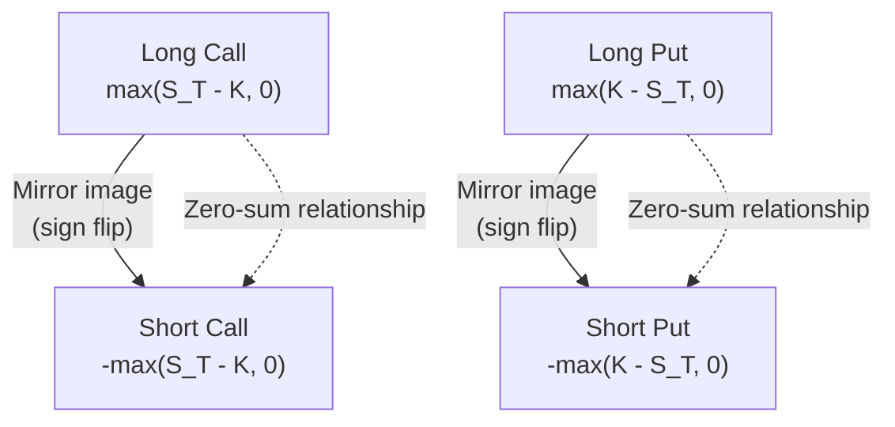

## Call and Put Payoffs and Profit Diagrams

<syllabot_broad_topic/>

### Definition and Core Concept

An option is a contract granting its holder the right, but not the obligation, to buy (call option) or sell (put option) an underlying asset at a predetermined strike price ($K$) on or before a specified expiration date. The payoff of an option describes its value at expiration as a function of the underlying asset's price, while the profit diagram additionally incorporates the premium paid or received, showing the net economic outcome across the range of possible underlying prices.

Four basic option positions exist — long call, short call, long put, short put — each with a distinct payoff and profit profile that forms the foundation for understanding all more complex option strategies.

**Key Points**

- Payoff refers to the option's value at expiration only, ignoring the premium paid; profit incorporates the premium and represents the net gain or loss.
- Long option positions (call or put) have defined, limited maximum loss (the premium paid) but asymmetric profit potential.
- Short option positions have limited maximum gain (the premium received) but asymmetric, potentially large loss exposure (unlimited for short calls, substantial though bounded for short puts).

### Call Option Payoff and Profit

**Long Call (Call Buyer)**

The payoff at expiration for a long call with strike $K$, given underlying price $S_T$ at expiration:

$$Payoff_{long\ call} = \max(S_T - K, 0)$$

The profit incorporates the premium paid ($c$):

$$Profit_{long\ call} = \max(S_T - K, 0) - c$$

**Key characteristics:**

- Maximum loss: limited to the premium paid ($c$), occurring when $S_T \leq K$ (option expires worthless).
- Maximum gain: theoretically unlimited, as $S_T$ has no upper bound.
- Breakeven point: $S_T = K + c$ (the underlying must rise above the strike by at least the premium amount for the position to be profitable).

**Example**

An investor buys a call option on a stock with strike $K = \$50$, paying a premium of $c = \$3$ per share.

- If $S_T = \$45$ at expiration: payoff = $\max(45-50, 0) = \$0$; profit = $0 - 3 = -\$3$ (maximum loss, option expires worthless).
- If $S_T = \$50$ at expiration: payoff = $\$0$; profit = $-\$3$ (still at maximum loss, at-the-money).
- If $S_T = \$53$ at expiration: payoff = $\max(53-50,0) = \$3$; profit = $3 - 3 = \$0$ (breakeven).
- If $S_T = \$60$ at expiration: payoff = $\$10$; profit = $10 - 3 = \$7$.

**Short Call (Call Writer/Seller)**

The payoff (from the writer's perspective, who is obligated rather than entitled) is the mirror image of the long call:

$$Payoff_{short\ call} = -\max(S_T - K, 0)$$

$$Profit_{short\ call} = c - \max(S_T - K, 0)$$

**Key characteristics:**

- Maximum gain: limited to the premium received ($c$), occurring when $S_T \leq K$.
- Maximum loss: theoretically unlimited, as $S_T$ can rise without bound.
- Breakeven point: identical to the long call, $S_T = K + c$.

**Example (continuing above)**

The option writer who sold the same call for $3 premium:

- If $S_T = \$45$: profit = $3 - 0 = \$3$ (keeps full premium).
- If $S_T = \$53$: profit = $3 - 3 = \$0$ (breakeven).
- If $S_T = \$60$: profit = $3 - 10 = -\$7$ (loss grows as underlying rises further).

### Put Option Payoff and Profit

**Long Put (Put Buyer)**

$$Payoff_{long\ put} = \max(K - S_T, 0)$$

$$Profit_{long\ put} = \max(K - S_T, 0) - p$$

Where $p$ is the premium paid for the put.

**Key characteristics:**

- Maximum loss: limited to the premium paid ($p$), occurring when $S_T \geq K$ (option expires worthless).
- Maximum gain: bounded but substantial — limited to $K - p$ (occurring in the theoretical case where $S_T = 0$), since the underlying price cannot fall below zero.
- Breakeven point: $S_T = K - p$.

**Example**

An investor buys a put option with strike $K = \$50$, paying premium $p = \$2.50$.

- If $S_T = \$55$: payoff = $\max(50-55,0) = \$0$; profit = $0 - 2.50 = -\$2.50$ (maximum loss).
- If $S_T = \$50$: payoff = $\$0$; profit = $-\$2.50$.
- If $S_T = \$47.50$: payoff = $\max(50-47.50,0) = \$2.50$; profit = $2.50 - 2.50 = \$0$ (breakeven).
- If $S_T = \$40$: payoff = $\$10$; profit = $10 - 2.50 = \$7.50$.
- If $S_T = \$0$ (theoretical extreme): payoff = $\$50$; profit = $50 - 2.50 = \$47.50$ (maximum possible gain).

**Short Put (Put Writer/Seller)**

$$Payoff_{short\ put} = -\max(K - S_T, 0)$$

$$Profit_{short\ put} = p - \max(K - S_T, 0)$$

**Key characteristics:**

- Maximum gain: limited to the premium received ($p$), occurring when $S_T \geq K$.
- Maximum loss: substantial but bounded — limited to $K - p$ (in the theoretical case where $S_T = 0$).
- Breakeven point: identical to the long put, $S_T = K - p$.

**Example (continuing above)**

The put writer who sold the same put for $2.50 premium:

- If $S_T = \$55$: profit = $2.50 - 0 = \$2.50$ (keeps full premium).
- If $S_T = \$47.50$: profit = $2.50 - 2.50 = \$0$ (breakeven).
- If $S_T = \$40$: profit = $2.50 - 10 = -\$7.50$.
- If $S_T = \$0$: profit = $2.50 - 50 = -\$47.50$ (maximum possible loss).

### Comparison Table: Four Basic Positions

| Position | Max Gain | Max Loss | Breakeven | Directional View |
| --- | --- | --- | --- | --- |
| Long Call | Unlimited | Premium paid ($c$) | $K + c$ | Bullish |
| Short Call | Premium received ($c$) | Unlimited | $K + c$ | Bearish/Neutral |
| Long Put | $K - p$ (bounded) | Premium paid ($p$) | $K - p$ | Bearish |
| Short Put | Premium received ($p$) | $K - p$ (bounded) | $K - p$ | Bullish/Neutral |

### Profit Diagram Illustrations (SVG)

**Long Call Profit Diagram (svg_diagram)**

<svg xmlns="http://www.w3.org/2000/svg" viewBox="0 0 500 320">
<text x="150" y="20" font-size="14" font-weight="bold" text-anchor="middle">Long Call Profit Diagram (svg_diagram)</text>
<line x1="50" y1="160" x2="470" y2="160" stroke="black" stroke-width="1.5" />
<line x1="50" y1="280" x2="50" y2="40" stroke="black" stroke-width="1.5" />
<text x="470" y="175" font-size="12" text-anchor="end">S_T (Underlying Price at Expiration)</text>
<text x="30" y="45" font-size="12" text-anchor="end">Profit</text>
<line x1="50" y1="190" x2="250" y2="190" stroke="#c0392b" stroke-width="2.5" />
<line x1="250" y1="190" x2="430" y2="70" stroke="#27ae60" stroke-width="2.5" />
<line x1="250" y1="160" x2="250" y2="200" stroke="gray" stroke-dasharray="4,3" />
<text x="250" y="215" font-size="11" text-anchor="middle">K (Strike)</text>
<line x1="290" y1="160" x2="290" y2="200" stroke="gray" stroke-dasharray="4,3" />
<text x="290" y="230" font-size="11" text-anchor="middle">Breakeven (K+c)</text>
<text x="60" y="185" font-size="11" fill="#c0392b">Max Loss = Premium (c)</text>
<text x="350" y="90" font-size="11" fill="#27ae60">Unlimited Gain</text>
</svg>

**Long Put Profit Diagram (svg_diagram)**

<svg xmlns="http://www.w3.org/2000/svg" viewBox="0 0 500 320">
<text x="150" y="20" font-size="14" font-weight="bold" text-anchor="middle">Long Put Profit Diagram (svg_diagram)</text>
<line x1="50" y1="160" x2="470" y2="160" stroke="black" stroke-width="1.5" />
<line x1="50" y1="280" x2="50" y2="40" stroke="black" stroke-width="1.5" />
<text x="470" y="175" font-size="12" text-anchor="end">S_T (Underlying Price at Expiration)</text>
<text x="30" y="45" font-size="12" text-anchor="end">Profit</text>
<line x1="50" y1="80" x2="250" y2="190" stroke="#27ae60" stroke-width="2.5" />
<line x1="250" y1="190" x2="430" y2="190" stroke="#c0392b" stroke-width="2.5" />
<line x1="250" y1="160" x2="250" y2="200" stroke="gray" stroke-dasharray="4,3" />
<text x="250" y="215" font-size="11" text-anchor="middle">K (Strike)</text>
<line x1="210" y1="160" x2="210" y2="200" stroke="gray" stroke-dasharray="4,3" />
<text x="150" y="230" font-size="11" text-anchor="middle">Breakeven (K-p)</text>
<text x="60" y="70" font-size="11" fill="#27ae60">Gain (bounded by K-p)</text>
<text x="330" y="185" font-size="11" fill="#c0392b">Max Loss = Premium (p)</text>
</svg>

### Diagram: Payoff Symmetry Between Long and Short Positions

### Put-Call Parity Relationship

The four basic positions are linked by put-call parity, a no-arbitrage relationship connecting call price ($c$), put price ($p$), strike ($K$), underlying price ($S_0$), risk-free rate ($r$), and time to expiration ($T$), for European options on a non-dividend-paying underlying:

$$c + K e^{-rT} = p + S_0$$

This relationship implies that a long call plus a short put at the same strike synthetically replicates a long forward position on the underlying:

$$c - p = S_0 - K e^{-rT}$$

This is a foundational no-arbitrage identity used to check for mispricing and to construct synthetic positions (e.g., synthetic long stock via long call + short put).

### Moneyness Terminology

| Term | Call Option | Put Option |
| --- | --- | --- |
| In-the-Money (ITM) | $S_T > K$ | $S_T < K$ |
| At-the-Money (ATM) | $S_T = K$ | $S_T = K$ |
| Out-of-the-Money (OTM) | $S_T < K$ | $S_T > K$ |

Moneyness at expiration directly determines whether the option is exercised: a rational holder exercises only when doing so produces a positive payoff (i.e., when ITM), which is precisely why the payoff formulas use the $\max(\cdot, 0)$ function — the holder simply lets the option expire worthless (exercising the "not to exercise" right) when it is OTM or exactly ATM.

### Intrinsic Value vs. Time Value

Prior to expiration, an option's market price decomposes into two components:

$$Option\ Price = Intrinsic\ Value + Time\ Value$$

**Intrinsic value** is the payoff the option would have if exercised immediately: $\max(S_t - K, 0)$ for a call, $\max(K - S_t, 0)$ for a put.

**Time value** represents the additional premium market participants are willing to pay for the possibility that the option becomes more valuable before expiration, reflecting remaining time and volatility. Time value is always non-negative for options and decays to zero exactly at expiration (a phenomenon known as time decay or theta decay), which is why the payoff diagrams above (drawn strictly at expiration, $T=0$ remaining) show only the intrinsic value component — the kinked, piecewise-linear payoff lines — rather than the smoother, curved price function that exists prior to expiration.

### Practical Applications of Each Position

**Long Call**: Used for leveraged bullish speculation (controlling exposure to a larger notional value of the underlying for a smaller upfront cost than outright share purchase) or for capped-risk directional bets where the investor wants defined maximum loss.

**Short Call**: Commonly used as part of a **covered call** strategy (selling a call against an already-owned underlying position) to generate income and provide limited downside cushioning, rather than as a standalone "naked" position, given the unlimited loss exposure of an uncovered short call.

**Long Put**: Used for bearish speculation with defined maximum loss, or very commonly as a **protective put** (portfolio insurance) — buying a put against an already-held long position in the underlying to hedge downside risk while retaining upside participation.

**Short Put**: Commonly used to express a view that the underlying will not fall below the strike, generating income; also frequently used as a mechanism to potentially acquire the underlying at an effective price below current market levels (the strike minus premium received) if assigned, a strategy sometimes termed a **cash-secured put**.

### Risk Considerations

**Long Option Positions**: While maximum loss is capped at the premium, the probability of losing the entire premium (option expiring worthless) can be substantial, particularly for out-of-the-money options — defined risk does not mean low-probability risk.

**Short Call Exposure**: An uncovered (naked) short call carries theoretically unlimited loss potential, since there is no ceiling on how high the underlying price can rise; this is generally regarded as one of the higher-risk basic option strategies and is subject to significant margin requirements at most brokerages.

**Short Put Exposure**: While bounded (since the underlying cannot fall below zero), the maximum loss on a short put can still be very large in absolute terms relative to the premium received, particularly for puts on volatile or high-priced underlyings — a common source of outsized losses during sharp market downturns for underprepared sellers.

**Behavioral disclaimer**: [Unverified] The payoff and profit formulas presented describe the contractual/mathematical outcome at expiration under standard (European-style, cash or physical settlement) option terms; actual realized outcomes in practice can be affected by early exercise features (American-style options), assignment risk timing, transaction costs, tax treatment, and margin/liquidation dynamics for short positions, none of which are captured in the simplified payoff diagrams.

**Next Steps**

- Put-call parity: arbitrage strategies and synthetic position construction
- Option Greeks (delta, gamma, theta, vega, rho) and their relationship to the payoff/profit curves prior to expiration
- Covered call and protective put strategies in detail
- American vs. European option exercise style and early exercise considerations
- Combination strategies: straddles, strangles, spreads (vertical, calendar, diagonal) built from the four basic positions
- Implied volatility and its role in time value pricing