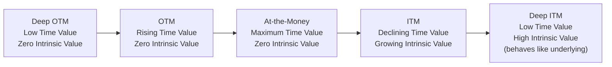

## Moneyness Intrinsic Value and Time Value

### Definition and Core Concept

Moneyness describes the relationship between an option's strike price and the current price of the underlying asset, categorizing options as in-the-money, at-the-money, or out-of-the-money. Intrinsic value is the portion of an option's premium attributable to this immediate exercise value, while time value is the residual premium reflecting the market's assessment of the probability that the option's value will increase before expiration.

Together, these concepts explain how and why option prices decompose, why options lose value as expiration approaches (time decay), and why options with identical intrinsic value can trade at very different total premiums depending on time remaining and volatility expectations.

**Key Points**

- Moneyness is defined relative to the *current* underlying price for an unexpired option, and relative to the underlying price *at expiration* when evaluating final payoff.
- Intrinsic value can never be negative — it is floored at zero via the $\max(\cdot, 0)$ function, regardless of how far out-of-the-money an option is.
- Time value is generally positive prior to expiration and decays to exactly zero at expiration, a process known as time decay or theta decay, which is typically (though not always uniformly) non-linear, accelerating as expiration approaches.

### Moneyness Classification

**For Call Options**

| Moneyness | Condition (Current Underlying $S$ vs. Strike $K$) |
| --- | --- |
| In-the-Money (ITM) | $S > K$ |
| At-the-Money (ATM) | $S = K$ (or very close, in practice) |
| Out-of-the-Money (OTM) | $S < K$ |

**For Put Options**

| Moneyness | Condition (Current Underlying $S$ vs. Strike $K$) |
| --- | --- |
| In-the-Money (ITM) | $S < K$ |
| At-the-Money (ATM) | $S = K$ (or very close, in practice) |
| Out-of-the-Money (OTM) | $S > K$ |

Note that moneyness classification is inverted between calls and puts by construction: a call gains value as the underlying rises above the strike, while a put gains value as the underlying falls below the strike.

**Deep ITM and Deep OTM**

Market participants also commonly use "deep in-the-money" and "deep out-of-the-money" informally to describe options substantially away from at-the-money, though no universally fixed numerical threshold defines "deep" — usage varies by underlying volatility, strike spacing, and market convention.

### Intrinsic Value

**Definition and Formula**

Intrinsic value represents the value an option would have if exercised immediately at the current underlying price, ignoring any remaining time to expiration:

**Call intrinsic value:**

$$Intrinsic\ Value_{call} = \max(S - K, 0)$$

**Put intrinsic value:**

$$Intrinsic\ Value_{put} = \max(K - S, 0)$$

**Key characteristics:**

- Always non-negative — an option holder is never obligated to exercise, so intrinsic value cannot be negative regardless of how unfavorable the strike is relative to the current price.
- Exactly zero for at-the-money and out-of-the-money options.
- Grows linearly (dollar-for-dollar) with favorable underlying price movement once in-the-money.

**Example**

A stock trades at $S = \$72$.

- A call with strike $K = \$65$: intrinsic value = $\max(72-65, 0) = \$7$ (ITM call).
- A call with strike $K = \$75$: intrinsic value = $\max(72-75, 0) = \$0$ (OTM call, despite being only $3 away from the money).
- A put with strike $K = \$65$: intrinsic value = $\max(65-72, 0) = \$0$ (OTM put).
- A put with strike $K = \$78$: intrinsic value = $\max(78-72, 0) = \$6$ (ITM put).

### Time Value

**Definition and Formula**

Time value (also called extrinsic value) is the portion of an option's total market price exceeding its intrinsic value:

$$Time\ Value = Option\ Price - Intrinsic\ Value$$

Since option prices must be at least equal to intrinsic value for European options at expiration (and generally, in practice, options trade at or above intrinsic value prior to expiration to avoid arbitrage — an option priced below intrinsic value could be bought and immediately exercised for a riskless profit, an opportunity market participants would arbitrage away), time value is generally non-negative throughout an option's life and collapses to precisely zero at expiration.

**Example**

Continuing the prior example, suppose the $65-strike call (intrinsic value $7) is actually trading in the market at a premium of $9.50:

$$Time\ Value = 9.50 - 7.00 = \$2.50$$

This $2.50 reflects the market's assessment of the additional value from the possibility that the stock rises further before expiration, net of the possibility it falls back below $65.

For the $75-strike call (intrinsic value $0) trading at $3.20:

$$Time\ Value = 3.20 - 0 = \$3.20$$

For an out-of-the-money option, the *entire* premium consists of time value, since there is no intrinsic value component — this is a defining characteristic of OTM options.

### Drivers of Time Value

**Time to Expiration**: All else equal, more time remaining generally means more time value, since there is more opportunity for the underlying to move favorably before expiration. This relationship is not linear — time value typically decays faster as expiration approaches (a phenomenon captured by the option Greek theta), often described loosely as accelerating decay, particularly pronounced for at-the-money options in their final weeks.

**Implied Volatility**: Higher expected volatility of the underlying increases time value, since greater potential price swings increase the probability of the option finishing significantly in-the-money, without a symmetric downside to the option holder (who can never lose more than the premium). Implied volatility is the single most influential driver of time value differences across otherwise similar options.

**Underlying Price Relative to Strike (Moneyness)**: Time value is generally maximized for at-the-money options and decreases for options that are either deep in-the-money or deep out-of-the-money. Deep ITM options behave increasingly like the underlying itself (delta approaching 1 for calls, -1 for puts) with correspondingly less time value; deep OTM options have a low probability of finishing in-the-money, which compresses their time value despite the theoretical unlimited (for calls) or bounded-but-large (for puts) payoff potential.

**Interest Rates**: Affect time value through the cost-of-carry relationship embedded in option pricing models (e.g., higher rates generally increase call time value and decrease put time value, all else equal, reflecting the financing cost/benefit of holding versus not holding the underlying).

**Dividends (for equity options)**: Expected dividends reduce call time value and increase put time value, since anticipated dividend payments are expected to reduce the underlying's price on the ex-dividend date, an effect priced into the option premium.

### Diagram: Intrinsic Value and Time Value Across Moneyness

### SVG Illustration: Total Premium Decomposition Across Strikes (Call Option)

**Call Option Value Decomposition vs. Strike (svg_diagram)**

<svg xmlns="http://www.w3.org/2000/svg" viewBox="0 0 520 340">
<text x="160" y="20" font-size="14" font-weight="bold" text-anchor="middle">Call Option Value Decomposition vs. Strike (svg_diagram)</text>
<line x1="60" y1="280" x2="480" y2="280" stroke="black" stroke-width="1.5" />
<line x1="60" y1="280" x2="60" y2="40" stroke="black" stroke-width="1.5" />
<text x="480" y="300" font-size="12" text-anchor="end">Strike Price (K), fixed S</text>
<text x="40" y="35" font-size="12" text-anchor="end">Value</text>
<line x1="60" y1="180" x2="270" y2="280" stroke="#2980b9" stroke-width="2.5" />
<text x="90" y="200" font-size="11" fill="#2980b9">Intrinsic Value (linear, ITM only)</text>
<path d="M 60 240 Q 270 60 480 260" stroke="#e67e22" stroke-width="2.5" fill="none" />
<text x="300" y="100" font-size="11" fill="#e67e22">Time Value (peaks near ATM)</text>
<line x1="270" y1="280" x2="270" y2="240" stroke="gray" stroke-dasharray="4,3" />
<text x="270" y="300" font-size="11" text-anchor="middle">ATM (S=K)</text>
</svg>

### The Special Case of American Options and Early Exercise

For American-style options (exercisable at any time before expiration, common for most listed equity options), the relationship between price, intrinsic value, and time value carries an important nuance: an American option's price must always be at least its intrinsic value (otherwise arbitrage via immediate exercise would be possible), but under specific circumstances, the *optimal* strategy can involve exercising early, effectively "giving up" remaining time value.

[Inference] Early exercise of American calls is generally suboptimal in the absence of dividends (since exercising forfeits remaining time value with no offsetting benefit), but becomes potentially optimal for American calls on dividend-paying stocks shortly before an ex-dividend date if the dividend is large enough. Early exercise of American puts, particularly deep ITM puts, can be optimal even without dividends when time value becomes small enough that the benefit of receiving the intrinsic value immediately (and reinvesting it, or avoiding further downside) outweighs the remaining (small) time value — this reflects the interest-rate/time-value-of-money benefit of receiving cash sooner.

### Time Decay (Theta) Behavior

**General Pattern**: Time value typically decays in a non-linear fashion as expiration approaches, often characterized as accelerating — the often-cited "theta decay curve" shows relatively slow time value erosion when there is substantial time remaining (many months), with the rate of decay increasing meaningfully in the final 30-45 days before expiration, particularly pronounced for at-the-money options.

**Weekend/Holiday Decay**: [Unverified] Some practitioners describe options as experiencing time decay over calendar days including weekends and holidays (since less trading time remains relative to expiration regardless of whether markets are open), though the precise practical treatment can vary by pricing model convention (calendar-day vs. trading-day time measures) and is a topic of ongoing discussion among practitioners regarding which convention best matches observed market behavior.

**At-the-Money vs. Away-from-the-Money Decay**: At-the-money options generally exhibit the highest absolute time value and correspondingly experience the largest absolute theta decay in dollar terms, since they have the most time value to lose; deep ITM and deep OTM options have comparatively little time value remaining to decay away.

### Comparison Table: Value Composition by Moneyness Category

| Moneyness | Intrinsic Value | Time Value (typical pattern) | Total Premium Behavior |
| --- | --- | --- | --- |
| Deep OTM | Zero | Low (low probability of finishing ITM) | Low, mostly speculative premium |
| OTM (near strike) | Zero | Moderate | Entirely time value |
| At-the-Money | Zero (or near-zero) | Highest (maximum uncertainty about final moneyness) | Peak time value, minimal intrinsic |
| ITM (near strike) | Positive, growing | Moderate | Mix of intrinsic and time value |
| Deep ITM | High, near-linear with $S$ | Low (behaves like underlying, delta near ±1) | Mostly intrinsic value |

### Practical Applications

**Option Selection for Strategies**: Traders selecting strikes for a given strategy explicitly weigh the intrinsic/time value trade-off — for example, sellers of covered calls often choose OTM strikes to retain more upside participation in the underlying while collecting a premium that is entirely time value (no intrinsic value at risk of immediate assignment).

**Assignment Risk Assessment**: Understanding intrinsic value helps option sellers assess assignment risk — deep ITM short options carry high assignment probability since the holder has strong economic incentive to exercise (particularly for American-style options near dividend dates for calls, or generally for deep ITM puts).

**Volatility Trading**: Since time value is highly sensitive to implied volatility, traders seeking to express a pure volatility view (rather than a directional view) often favor at-the-money options or option combinations (straddles, strangles) precisely because these structures maximize sensitivity to time-value/volatility changes relative to intrinsic-value/directional changes.

**Option Pricing Model Calibration**: The observed time value across strikes and expirations is the primary data used to back out implied volatility (via option pricing models such as Black-Scholes), making time value analysis foundational to constructing and interpreting the implied volatility surface/smile.

### Risk Considerations

**Time Decay as a Structural Headwind for Long Option Holders**: Buyers of options face a persistent, largely predictable erosion of time value as expiration approaches, meaning a long option position can lose value even if the underlying price does not move at all — a critical consideration distinct from directional risk.

**Deep ITM Option Liquidity**: [Unverified] Deep ITM and deep OTM options often exhibit lower trading volume and wider bid-ask spreads than near-the-money options, which can affect the practical cost of establishing or unwinding positions at these strikes, though liquidity patterns vary by underlying and specific market conditions.

**Early Exercise Assignment Risk**: Sellers of American-style ITM options face the risk of unexpected early assignment, particularly around dividend dates for short calls, which can disrupt hedging or strategy assumptions if not anticipated.

**Behavioral disclaimer**: [Unverified] The general patterns described for time value decay and its relationship to moneyness reflect typical/textbook behavior under standard option pricing model assumptions; actual market-observed time value and decay patterns can deviate due to supply/demand imbalances, skew/smile effects in implied volatility, upcoming known events (earnings, dividends), and liquidity conditions specific to a given option series.

**Next Steps**

- Option Greeks in depth: theta as the formal measure of time decay, and its interaction with gamma and vega
- Implied volatility surface construction: smile and skew patterns across strikes and expirations
- Black-Scholes-Merton pricing model and its decomposition of price into components
- Early exercise decision framework for American options (dividends, interest rates, deep ITM puts)
- Straddle and strangle strategies as pure time-value/volatility plays
- Covered call and cash-secured put strike selection based on intrinsic/time value trade-offs