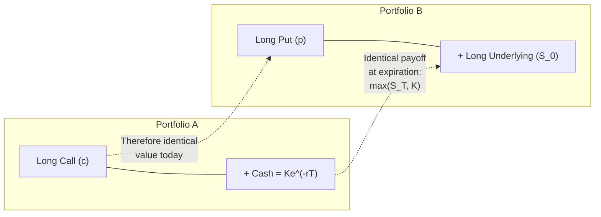
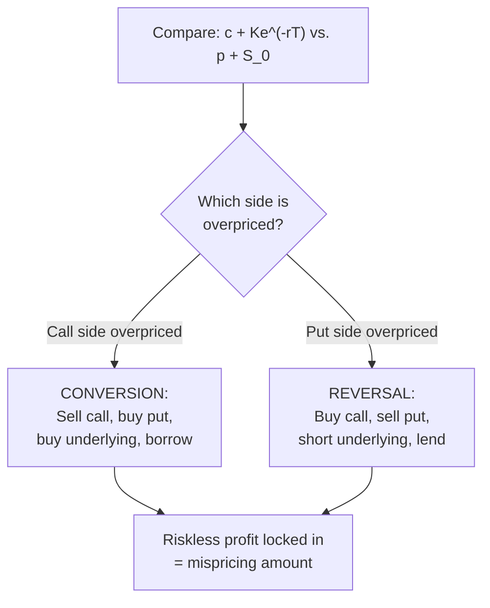

## Put Call Parity and Its Applications

### Definition and Core Concept

Put-call parity is a fundamental no-arbitrage relationship linking the prices of European call and put options with the same strike price and expiration date, the current underlying price, and the present value of the strike price. It establishes that a specific combination of a call, a put, cash, and/or the underlying asset must all have equivalent value, since any deviation would permit a riskless arbitrage profit.

The relationship is one of the most important identities in options theory because it is model-independent — it holds regardless of the specific option pricing model used (Black-Scholes or otherwise) and regardless of assumptions about volatility, since it derives purely from no-arbitrage logic rather than any particular distributional assumption about the underlying asset's price.

**Key Points**

- Put-call parity applies strictly to European-style options (exercisable only at expiration); American-style options (exercisable early) exhibit a modified inequality relationship rather than a strict equality, due to early exercise value.
- The relationship enables construction of synthetic positions — replicating a call, put, or the underlying asset itself using combinations of the other instruments.
- Deviations from put-call parity, when they occur and are large enough to exceed transaction costs, represent arbitrage opportunities that sophisticated market participants would typically act on quickly, which is why persistent, exploitable violations are uncommon in liquid markets.

### The Put-Call Parity Formula

**Standard Form (Non-Dividend-Paying Underlying)**

$$c + K e^{-rT} = p + S_0$$

Where:

- $c$ = price of the European call option
- $p$ = price of the European put option (same strike $K$, same expiration $T$)
- $K$ = strike price
- $S_0$ = current price of the underlying asset
- $r$ = risk-free interest rate (continuously compounded)
- $T$ = time to expiration (in years)
- $Ke^{-rT}$ = present value of the strike price

**Intuition**: The left side ($c + Ke^{-rT}$) represents a portfolio consisting of a long call plus enough cash (invested at the risk-free rate) to exactly cover the strike price at expiration — this portfolio pays off $\max(S_T, K)$ at expiration (either you exercise the call and use the cash to pay for it, receiving the stock, or the call expires worthless and you keep the cash equal to $K$... more precisely, this portfolio's value at expiration is $\max(S_T-K,0) + K = \max(S_T, K)$).

The right side ($p + S_0$) represents a portfolio consisting of a long put plus one share of the underlying — this portfolio also pays off $\max(S_T, K)$ at expiration (either the underlying is worth more than $K$ and the put expires worthless, leaving just the share worth $S_T$, or the underlying falls below $K$ and the put is exercised, delivering the share for $K$; either way, the payoff is $\max(S_T, K)$).

Since both portfolios have identical payoffs in every possible future state, they must have identical current value — this is the no-arbitrage argument underlying the formula, requiring no assumption about the probability distribution of $S_T$.

### Adjustments for Dividends

**Discrete (Known Cash) Dividends**

For an underlying paying known discrete dividends with present value $PV(D)$ during the option's life:

$$c + K e^{-rT} = p + S_0 - PV(D)$$

The subtraction of $PV(D)$ reflects that a shareholder receives dividends that an option holder does not, so the "effective" current price relevant for parity is reduced by the present value of dividends the underlying will pay before expiration.

**Continuous Dividend Yield (Common for Index Options)**

For an underlying with a continuous dividend yield $q$ (a standard simplifying assumption for broad equity indices):

$$c + K e^{-rT} = p + S_0 e^{-qT}$$

### Example Calculation

Given: $S_0 = \$100$, $K = \$100$, $r = 5\%$, $T = 1$ year, no dividends, and a call price $c = \$10.45$.

Solve for the theoretical put price using put-call parity:

$$p = c + Ke^{-rT} - S_0$$

$$p = 10.45 + 100 \times e^{-0.05 \times 1} - 100$$

$$p = 10.45 + 100 \times 0.9512 - 100$$

$$p = 10.45 + 95.12 - 100 = \$5.57$$

If the put is actually observed trading in the market at $5.57, parity holds exactly and no arbitrage exists. If the put were instead trading at $6.20, an arbitrage opportunity would exist (detailed in the arbitrage section below).

### Diagram: Put-Call Parity Portfolio Equivalence

### Deriving Synthetic Positions

Put-call parity can be algebraically rearranged to express any one of the four components (long call, long put, long underlying, cash/bond position) in terms of the other three, enabling construction of **synthetic positions**:

**Synthetic Long Call**

$$c = p + S_0 - Ke^{-rT}$$

Constructed as: long put + long underlying + short a bond (borrowing $Ke^{-rT}$)

**Synthetic Long Put**

$$p = c - S_0 + Ke^{-rT}$$

Constructed as: long call + short underlying + long a bond (lending $Ke^{-rT}$)

**Synthetic Long Underlying (Synthetic Stock)**

$$S_0 = c - p + Ke^{-rT}$$

Constructed as: long call + short put (same strike/expiration) + long a bond

This is one of the most practically important synthetic relationships: **long call + short put at the same strike and expiration replicates a long forward/futures position** on the underlying (approximately, ignoring the cash/bond financing leg nuance, and exactly when the strike equals the forward price):

$$c - p = S_0 - Ke^{-rT}$$

**Synthetic Short Underlying**

$$-S_0 = p - c - Ke^{-rT}$$

Constructed as: short call + long put + short a bond

### Comparison Table: Synthetic Position Construction

| Desired Synthetic Position | Constructed From |
| --- | --- |
| Synthetic Long Call | Long Put + Long Underlying + Borrow $Ke^{-rT}$ |
| Synthetic Long Put | Long Call + Short Underlying + Lend $Ke^{-rT}$ |
| Synthetic Long Underlying | Long Call + Short Put + Lend $Ke^{-rT}$ |
| Synthetic Short Underlying | Short Call + Long Put + Borrow $Ke^{-rT}$ |
| Synthetic Long Bond/Cash | Long Call + Short Put... rearranged, less commonly used in this form directly |

### Arbitrage Strategies When Parity Is Violated

**Case 1: Call Overpriced Relative to Parity (Conversion Arbitrage)**

If $c + Ke^{-rT} > p + S_0$ (the call side is overpriced relative to the put side), an arbitrageur can:

1. Sell the (relatively overpriced) call.
2. Buy the (relatively underpriced) put.
3. Buy the underlying asset.
4. Borrow $Ke^{-rT}$ at the risk-free rate.

This combination locks in a riskless profit equal to the mispricing amount, since the resulting position's payoff at expiration is guaranteed to be zero (the long put + long underlying exactly offsets the short call obligation, regardless of where $S_T$ ends up) while the arbitrageur pockets the initial mispricing as immediate profit. This specific strategy is traditionally called a **conversion**.

**Case 2: Put Overpriced Relative to Parity (Reverse Conversion / Reversal)**

If $p + S_0 > c + Ke^{-rT}$ (the put side is overpriced relative to the call side), the arbitrageur reverses each leg:

1. Buy the (relatively underpriced) call.
2. Sell the (relatively overpriced) put.
3. Short the underlying asset.
4. Lend the proceeds at the risk-free rate.

This is traditionally called a **reversal** (or reverse conversion), again locking in a riskless profit from the initial mispricing.

**Example: Numerical Arbitrage Illustration**

Using the earlier example ($S_0=100$, $K=100$, $r=5\%$, $T=1$, $c=\$10.45$, fair put value = $5.57), suppose the put is actually mispriced and trading at $6.20 (overpriced relative to parity).

An arbitrageur executes a reversal:

- Sell put at $6.20 (receive $6.20)
- Buy call at $10.45 (pay $10.45)
- Short the stock at $100 (receive $100)
- Net cash received upfront: $6.20 - 10.45 + 100 = \$95.75$
- Lend this $95.75 at 5% for one year: grows to $95.75 \times e^{0.05} \approx \$100.65$

At expiration, regardless of $S_T$:

- If $S_T > K$: the call is exercised, buying the stock at $100 to close the short position; the put expires worthless.
- If $S_T < K$: the put is assigned, requiring purchase of the stock at $100, which is used to close the short position; the call expires worthless.
- Either way, the stock position nets to exactly buying back at $100, funded by the $100.65 accumulated from lending, leaving a riskless profit of approximately $0.65 per share — precisely reflecting the initial $0.63 mispricing ($6.20 actual vs. $5.57 fair value), compounded at the risk-free rate.

### Diagram: Conversion vs. Reversal Arbitrage Logic

### Put-Call Parity for American Options (Inequality, Not Equality)

Because American options permit early exercise, the strict equality of put-call parity does not generally hold; instead, a bounded inequality applies (for a non-dividend-paying underlying):

$$S_0 - K \leq C - P \leq S_0 - Ke^{-rT}$$

Where $C$ and $P$ denote American call and put prices respectively. [Inference] This inequality reflects the fact that early exercise flexibility has value that is difficult to price without a full American-option pricing model (such as a binomial tree or finite-difference method), and the exact bounds and their tightness can depend on dividend assumptions and the specific early-exercise characteristics of calls versus puts discussed in option time-value theory — practitioners generally rely on numerical American option pricing models rather than a parity-style closed-form equality when precise American option relative value analysis is required.

### Applications Beyond Arbitrage Detection

**Implied Dividend/Interest Rate Extraction**: Since put-call parity links option prices to $r$ and dividend assumptions, market participants can invert the formula using observed liquid option prices to back out the market-implied dividend yield or financing rate embedded in options pricing, useful when direct dividend forecasts or specific financing rates are uncertain.

**Volatility Skew/Smile Cross-Checking**: Since put-call parity is volatility-model-independent, it provides a useful consistency check when constructing implied volatility surfaces — a call and put at the same strike/expiration should reflect the *same* implied volatility when correctly priced consistent with parity (any apparent difference typically stems from dividend/rate assumption errors in the calculation rather than a genuine volatility discrepancy).

**Constructing Structured Products and Combination Strategies**: Understanding synthetic equivalences allows structurers and traders to select the most capital-efficient or liquidity-favorable way to achieve a desired payoff — for example, achieving synthetic long stock exposure via options when direct stock borrowing/shorting (for the opposite side) is costly or restricted, or when options markets are more liquid than certain underlying instruments.

**Box Spread Construction**: A box spread (combining a bull call spread and a bear put spread at the same two strikes) is directly derived from put-call parity logic and produces a position with a fixed, known payoff at expiration regardless of the underlying's price — effectively synthesizing a risk-free zero-coupon bond position using options, sometimes used as an alternative financing/borrowing mechanism in options markets.

**Risk Management and Position Reconciliation**: Trading desks use put-call parity as an internal consistency check on options pricing models and risk systems, since any persistent, non-trivial deviation from parity in a firm's own marked prices (absent a clear dividend/rate explanation) typically signals a data or model error requiring investigation rather than a genuine market opportunity.

### Risk Considerations and Practical Limitations

**Transaction Costs**: Real-world arbitrage strategies based on parity violations must overcome bid-ask spreads, commissions, and margin costs; small theoretical mispricings may not be economically exploitable after accounting for these frictions, which is why observed market prices can exhibit minor, persistent parity deviations without genuine arbitrage opportunity existing.

**Early Exercise Complications**: As noted, American-style options (the majority of listed equity options in many markets) do not satisfy strict parity, meaning naive application of the European parity formula to American option prices can produce misleading conclusions about mispricing.

**Dividend Uncertainty**: Since dividend assumptions directly enter the parity formula, uncertainty or unexpected changes in dividend policy (special dividends, dividend cuts) can cause apparent parity violations that are actually attributable to dividend forecast error rather than genuine mispricing.

**Borrowing/Lending Rate Asymmetry**: The theoretical arbitrage strategies assume borrowing and lending occur at the same risk-free rate; in practice, most market participants face a borrowing rate higher than the lending/investing rate, which creates a band around the theoretical parity price within which no profitable arbitrage is actually executable — this is a standard real-world friction distinct from a genuine parity violation.

**Behavioral disclaimer**: [Unverified] While put-call parity is a robust theoretical no-arbitrage relationship, real-world observed option prices can exhibit apparent deviations due to stale quotes, wide bid-ask spreads in less liquid options, borrow costs for shorting the underlying, and other market microstructure factors — practitioners should distinguish genuine, economically exploitable arbitrage from these frictional or data-quality-driven apparent deviations before concluding a mispricing exists.

**Next Steps**

- Box spreads: construction, use as synthetic financing instruments, and risk-free payoff mechanics
- American option early exercise theory and the put-call parity inequality bounds
- Implied volatility surface construction and consistency checks using put-call parity
- Conversion and reversal arbitrage strategies in institutional options market-making
- Synthetic stock and synthetic option positions in portfolio construction and hedging
- Dividend forecasting and its role in options pricing model accuracy