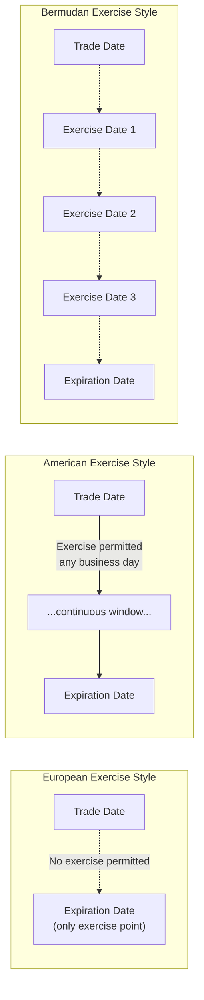
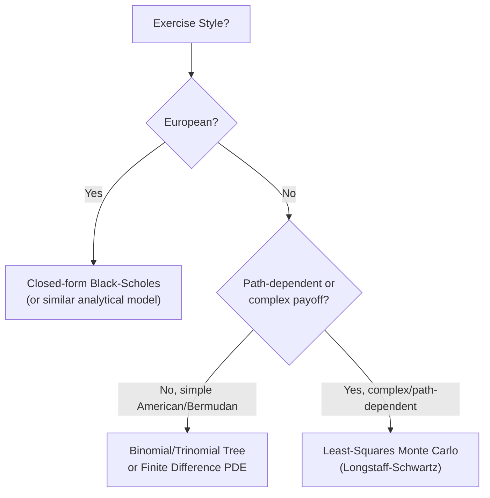

## American European and Bermudan Exercise Styles

<syllabot_broad_topic/>

### Definition and Core Concept

Exercise style refers to the contractual rules governing when an option holder may exercise their right to buy or sell the underlying asset. The three principal exercise styles — American, European, and Bermudan — differ in the timing flexibility granted to the holder, which directly affects both the option's valuation (through the added value, if any, of early exercise flexibility) and the computational complexity required to price it.

Despite the geographic naming convention, these terms describe contractual features rather than where an option trades — American-style options are traded globally, as are European-style options, and the naming is purely historical/conventional rather than indicative of jurisdiction.

**Key Points**

- European options may only be exercised at expiration, making them generally simpler to price (often via closed-form solutions like Black-Scholes) since there is only one exercise decision point.
- American options may be exercised at any time up to and including expiration, requiring pricing models that account for the optimal early exercise decision at every point in time, generally increasing computational complexity.
- Bermudan options occupy a middle ground, permitting exercise only on a specified discrete set of dates before expiration, common in interest rate derivatives (particularly swaptions) and increasingly in structured products.

### European Exercise Style

**Definition**: The option can be exercised only at the expiration date, with no earlier exercise permitted under any circumstances.

**Valuation Characteristics**: European options are generally easier to price precisely because the payoff structure requires evaluating only a single terminal condition. The Black-Scholes-Merton model, one of the most widely used closed-form option pricing formulas, applies specifically to European-style options (with dividend adjustments as needed).

$$c_{European} = S_0 N(d_1) - Ke^{-rT}N(d_2)$$

$$p_{European} = Ke^{-rT}N(-d_2) - S_0 N(-d_1)$$

Where $N(\cdot)$ is the cumulative standard normal distribution function, and $d_1$, $d_2$ are standard Black-Scholes intermediate terms incorporating volatility, time to expiration, strike, underlying price, and risk-free rate.

**Common Instruments**: Most index options (e.g., S&P 500 index options, SPX) are European-style. Most OTC (over-the-counter) options, including FX options and many interest rate options, are also typically structured as European-style by market convention, given their cleaner valuation properties for institutional pricing and risk management.

**Put-Call Parity Applicability**: As established in put-call parity theory, the strict equality relationship $c + Ke^{-rT} = p + S_0$ holds precisely for European options, since there is no early exercise value to complicate the no-arbitrage argument.

### American Exercise Style

**Definition**: The option can be exercised at any time from the purchase date up to and including the expiration date, at the holder's sole discretion.

**Valuation Characteristics**: American options must be worth at least as much as their European counterparts (with identical strike, expiration, and underlying), since the American option provides all the rights of the European option plus the additional flexibility of early exercise:

$$C_{American} \geq c_{European}$$

$$P_{American} \geq p_{European}$$

Pricing American options generally requires numerical methods rather than closed-form solutions, since the optimal exercise decision must be evaluated at every point in time (or at every node in a discretized time grid), comparing the value of immediate exercise against the value of continuing to hold the option. Standard methods include:

**Binomial/Trinomial Tree Models**: Discretize time into steps and, working backward from expiration, compare the intrinsic value of exercising at each node against the discounted expected value of continuation, taking the maximum at each node.

**Finite Difference Methods**: Solve the underlying partial differential equation (the Black-Scholes PDE) numerically on a discretized grid of underlying price and time, incorporating an early-exercise boundary condition.

**Least-Squares Monte Carlo (Longstaff-Schwartz Method)**: A simulation-based approach that estimates the continuation value at each potential exercise point via regression across simulated paths, widely used for American-style options embedded in more complex, path-dependent structured products where tree/PDE methods become impractical.

### When Early Exercise Is (and Is Not) Optimal

**American Calls on Non-Dividend-Paying Underlying**: [Inference] It is a well-established theoretical result that early exercise of an American call on a non-dividend-paying stock is never optimal, since exercising forfeits remaining time value with no offsetting benefit (the holder always does at least as well by selling the option in the market rather than exercising it early) — as a direct consequence, an American call on a non-dividend-paying underlying has the same theoretical value as an otherwise identical European call.

**American Calls on Dividend-Paying Underlying**: Early exercise can become optimal shortly before an ex-dividend date if the dividend is sufficiently large, since exercising just before the ex-dividend date allows the holder to capture the dividend (as the new shareholder) — a benefit that must be weighed against the remaining time value forfeited by exercising early.

**American Puts**: Early exercise of American puts can be optimal even without dividends, particularly for deep in-the-money puts, reflecting the time-value-of-money benefit of receiving the exercise proceeds (the strike price) sooner rather than later — this asymmetry between calls and puts regarding early exercise (dividends drive early call exercise; interest rates alone can drive early put exercise even without dividends) is a foundational result in options theory.

### Diagram: Exercise Style Timing Comparison

### Bermudan Exercise Style

**Definition**: The option can be exercised only on a specified, discrete set of dates prior to and including expiration, rather than continuously (as with American) or solely at expiration (as with European). The name derives from Bermuda's geographic position between the United States and Europe, reflecting the style's position "between" American and European exercise flexibility.

**Common Instruments**:

- **Swaptions**: Options on interest rate swaps are frequently structured as Bermudan, permitting exercise into the underlying swap on specified dates that typically align with the underlying swap's own payment/reset dates (e.g., a Bermudan swaption on a 10-year swap might permit exercise annually).
- **Callable Bonds and Structured Notes**: Many callable bonds and structured products embed Bermudan-style call features, allowing the issuer to redeem the instrument on specified coupon dates rather than continuously.
- **Certain Convertible Bonds**: Some convertible securities include Bermudan-style conversion or call/put features tied to specific dates.

**Valuation Characteristics**: Bermudan option valuation shares methodological similarity with American option valuation (both require evaluating an early-exercise decision against continuation value), but the computation is simplified relative to true American-style continuous exercise, since the exercise decision need only be evaluated at the finite set of specified dates rather than at every possible instant. Binomial/trinomial trees, finite difference methods, and least-squares Monte Carlo are all commonly adapted for Bermudan-style valuation, typically by restricting the early-exercise comparison step to only the specified Bermudan exercise dates within the broader numerical framework.

$$Bermudan\ Value \geq European\ Value$$

$$Bermudan\ Value \leq American\ Value\ (with\ same\ terms)$$

This ordering follows directly from the nested nature of exercise rights: European rights are a strict subset of Bermudan rights (a single exercise date is a degenerate case of a discrete date set), and Bermudan rights are in turn a strict subset of American rights (a discrete date set is a subset of the continuous exercise window).

### Comparison Table: Exercise Style Characteristics

| Feature | European | Bermudan | American |
| --- | --- | --- | --- |
| Exercise timing | Expiration only | Specified discrete dates | Any time up to expiration |
| Relative value (same terms) | Lowest (or equal) | Middle | Highest (or equal) |
| Typical pricing method | Closed-form (Black-Scholes) | Numerical (tree, PDE, LSM) | Numerical (tree, PDE, LSM) |
| Put-call parity | Strict equality holds | Does not hold (inequality) | Does not hold (inequality) |
| Common instruments | Index options, most FX/OTC options | Swaptions, callable bonds | Most listed US equity options |
| Computational complexity | Low | Moderate | Moderate-High |

### Valuation Complexity and Computational Considerations

**European**: Generally the least computationally intensive, often solvable via closed-form analytical formulas (Black-Scholes-Merton and its variants), making European options attractive building blocks for large derivative books requiring fast, real-time pricing and risk calculation across many positions.

**Bermudan**: Requires backward induction (in tree or PDE frameworks) or simulation-based regression techniques (in Monte Carlo frameworks) evaluated at each specified exercise date, but benefits computationally from the finite, discrete nature of the exercise opportunity set compared to full American-style continuous monitoring.

**American**: Generally the most computationally demanding of the three for precise valuation, since the early-exercise boundary (the underlying price level at which exercise becomes optimal, which itself varies with remaining time to expiration) must be determined or approximated across a continuous time domain — approximation methods (such as the Barone-Adesi-Whaley approximation for American options) exist to provide faster approximate solutions where full numerical methods are computationally prohibitive.

### Diagram: Numerical Pricing Approach Selection

### Applications and Market Context

**Equity Options**: The majority of listed equity options in major markets (such as US-listed single-stock options) are American-style, granting holders maximum flexibility, which is generally viewed as a benefit to retail and institutional option buyers, though this flexibility is reflected in a (potentially) higher premium relative to an otherwise identical European option.

**Index Options**: Broad-based index options (such as SPX in the US) are commonly European-style, partly because cash settlement (rather than physical delivery of an entire index basket) is the norm for index options, and partly reflecting historical market structure and hedging convenience for market makers.

**Interest Rate Derivatives**: Bermudan exercise is particularly prevalent in the swaption and callable structured note markets, reflecting the natural alignment between exercise decision points and the periodic reset/payment schedule of the underlying interest rate swap or bond.

**Corporate Finance Applications**: Callable and putable bonds represent embedded American or Bermudan option features from an issuer's or investor's perspective respectively, requiring the same early-exercise valuation frameworks as standalone listed options when assessing the bond's fair value.

### Risk and Practical Considerations

**Pricing Model Risk**: Since American and Bermudan options require numerical methods rather than simple closed-form formulas, model risk (arising from discretization error, choice of numerical method, or number of simulation paths/tree steps) is inherently greater than for European options, requiring careful model validation and convergence testing in practice.

**Assignment/Exercise Timing Risk for Sellers**: Sellers (writers) of American-style options face uncertainty about *when* they might be assigned, which can complicate hedging and cash/position management compared to the certainty of a European option's single exercise/expiration date.

**Liquidity and Market Convention Differences**: [Unverified] The prevalence of American vs. European exercise style varies meaningfully by asset class, exchange, and geography due to historical market convention and regulatory/product design choices rather than any inherent superiority of one style, and market participants should verify the specific exercise style of any given listed or OTC option rather than assume based on general asset-class patterns alone.

**Behavioral disclaimer**: [Unverified] The theoretical early-exercise optimality results described (e.g., non-optimality of early call exercise absent dividends) are standard results under idealized, frictionless market assumptions; real-world factors such as transaction costs, tax considerations, liquidity needs, and market participant behavior can lead to exercise decisions that deviate from the theoretically "optimal" pattern in practice.

**Next Steps**

- Binomial and trinomial tree option pricing methodology in detail
- Least-Squares Monte Carlo (Longstaff-Schwartz) method for American/Bermudan option valuation
- Swaptions: structure, Bermudan exercise features, and valuation using interest rate models
- Barone-Adesi-Whaley and other analytical approximation methods for American options
- Callable and putable bond valuation using embedded option frameworks
- Put-call parity limitations for American and Bermudan options (inequality bounds)