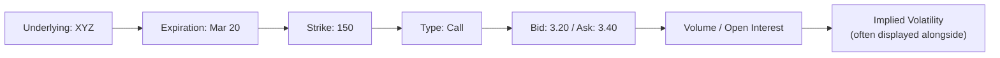
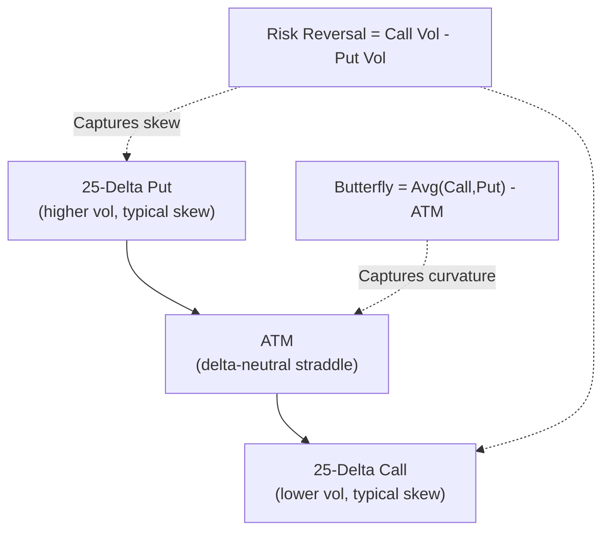

## Option Market Conventions and Quoting

### Definition and Core Concept

Option market conventions and quoting encompass the standardized practices exchanges, dealers, and market participants use to express, communicate, and transact option prices, sizes, and contract terms. These conventions vary meaningfully across asset classes (equity, FX, interest rate, commodity options) and between listed/exchange-traded versus OTC (over-the-counter) markets, reflecting each market's specific structural needs, historical development, and participant base.

Understanding these conventions is essential for correctly interpreting quoted prices, executing trades at intended sizes and terms, and translating between different quoting bases used across markets (e.g., volatility quoting in FX options versus premium quoting in equity options).

**Key Points**

- Listed equity and index options are typically quoted directly in premium terms (dollars/currency units per share or index point), while OTC markets — particularly FX options — often quote in implied volatility terms rather than premium.
- Contract specifications (multiplier, expiration cycle, strike interval, settlement type) are standardized by exchanges for listed options but negotiated bilaterally for OTC options.
- Bid-ask spreads, quote conventions, and minimum tick sizes vary significantly by underlying liquidity, moneyness, and time to expiration.

### Listed Equity and Index Option Conventions

**Contract Specifications**

Standard US-listed equity options typically follow these conventions:

- **Contract multiplier**: 100 shares per contract (i.e., an option quoted at $2.50 represents $250 of premium per contract).
- **Strike price intervals**: Vary by underlying price level — narrower intervals (e.g., $0.50 or $1) for lower-priced or heavily-traded underlyings, wider intervals (e.g., $5 or $10) for higher-priced underlyings, with exchanges periodically adding strikes as the underlying price moves.
- **Expiration cycles**: Standard monthly expirations (typically the third Friday of the month, historically, though same-day/weekly expirations have become increasingly common), plus weekly and, for many liquid underlyings, daily expirations in current markets.
- **Settlement type**: Physical settlement (delivery of shares) is standard for single-stock options; cash settlement is standard for most broad-based index options.

**Quoting Convention**

Equity options are quoted directly as a **premium per share** (which, multiplied by the contract multiplier, gives the total premium per contract):

$$Total\ Premium = Quoted\ Price \times Multiplier \times Number\ of\ Contracts$$

**Example**

A call option quoted at a bid-ask of $3.20 / $3.40 on a stock with the standard 100-share multiplier:

- Buying 10 contracts at the ask: $3.40 \times 100 \times 10 = \$3,400$ total premium paid.
- Selling 10 contracts at the bid: $3.20 \times 100 \times 10 = \$3,200$ total premium received.
- The $0.20 bid-ask spread represents $20 per contract, or $200 for the 10-contract trade — a direct, transparent transaction cost embedded in the quote.

**Tick Sizes**: Minimum price increments (ticks) for listed options are exchange-specified and often tiered by option price level — for example, a common convention is a $0.05 minimum tick for options trading below $3.00 and a $0.10 minimum tick for options trading at or above $3.00, though specific tick regimes vary by exchange and specific program (e.g., penny pilot programs that allow $0.01 ticks for certain highly liquid names).

### Diagram: Listed Option Quote Anatomy

### OTC FX Option Conventions

FX options exhibit some of the most distinctive quoting conventions in the options market, primarily because they are quoted predominantly in **implied volatility terms** rather than direct premium terms, and use a **delta-based strike convention** rather than quoting fixed absolute strikes.

**Volatility Quoting**

Rather than quoting a dollar premium, FX options are typically quoted as an implied volatility percentage, which market participants then convert to a premium using an agreed pricing model (typically Garman-Kohlhagen, the FX-adapted variant of Black-Scholes) and agreed market data inputs (spot rate, forward points/interest rate differential).

**Delta-Based Strike Convention**

Rather than specifying a strike price directly, standard FX option market quotes reference specific **delta points**:

- **25-delta put** and **25-delta call**: options whose Black-Scholes delta (in absolute value) equals 0.25, used as standard "wings" of the volatility smile.
- **10-delta put** and **10-delta call**: further out-of-the-money reference points, used for extreme tail/skew observation.
- **At-the-money (ATM)**: conventionally defined not as spot-equals-strike, but typically as the **delta-neutral straddle strike** (the strike at which a call and put of the same strike have offsetting deltas), which differs subtly from simple spot-strike equality once interest rate differentials and volatility skew are incorporated.

**The Volatility Smile/Skew Quoting Triangle**

A standard FX volatility surface at a given tenor is typically quoted using three key market observables:

1. **ATM volatility** (the delta-neutral straddle implied volatility)
2. **Risk reversal (RR)**: the volatility difference between the 25-delta call and 25-delta put ($\sigma_{25\Delta call} - \sigma_{25\Delta put}$), capturing skew (asymmetry in the smile).
3. **Butterfly/Strangle (BF)**: a measure of the smile's curvature, typically the average of the 25-delta call and put volatilities minus the ATM volatility.

**Example**

A EUR/USD 3-month volatility surface might be quoted as:

- ATM: 7.50%
- 25-delta Risk Reversal: -0.30% (indicating puts trade at slightly higher implied volatility than calls, a common skew pattern reflecting relative demand for downside protection)
- 25-delta Butterfly: 0.25%

From these three quotes, the individual 25-delta call and put volatilities can be derived:

$$\sigma_{25\Delta call} = ATM + BF + \frac{RR}{2} = 7.50 + 0.25 + (-0.15) = 7.60\%$$

$$\sigma_{25\Delta put} = ATM + BF - \frac{RR}{2} = 7.50 + 0.25 - (-0.15) = 7.90\%$$

[Inference] The precise algebraic convention for combining ATM, risk reversal, and butterfly quotes into individual strike volatilities can vary slightly by market convention (some use a "market strangle" versus "smile strangle" distinction for the butterfly quote), so practitioners typically rely on standardized industry pricing conventions or established quoting system documentation rather than a single universal formula for precise trading purposes.

### Diagram: FX Volatility Smile Quoting Structure

### Interest Rate Option (Cap/Floor and Swaption) Conventions

**Swaptions**: Conventionally quoted in terms of implied (normal or lognormal) volatility applied to the forward swap rate, or increasingly in **basis points of normal volatility** (particularly in low or negative rate environments where lognormal volatility becomes problematic, since lognormal models are undefined or poorly behaved for zero/negative rates).

**Caps and Floors**: Similarly quoted in volatility terms (often "flat volatility," a single volatility applied uniformly across all caplets/floorlets in the structure, versus "forward volatility," which allows a distinct volatility for each individual caplet/floorlet period) — flat volatility is a common simplified market quoting convention even though the underlying economic exposure is genuinely a strip of distinct caplets each potentially warranting its own volatility.

**Normal vs. Lognormal Volatility**: [Unverified] Following historically low and, in some markets, negative interest rate environments, market convention has shifted meaningfully toward normal (Bachelier-style) volatility quoting for interest rate options rather than lognormal (Black-76-style) volatility, since normal volatility remains well-defined even for negative underlying rates — the specific prevailing convention can vary by currency and market segment, and current practitioner references should be consulted for the standard in a specific market at a specific time.

### Commodity Option Conventions

Commodity options (on futures contracts, predominantly) are generally quoted directly in premium terms per unit of the underlying commodity (e.g., cents per bushel for agricultural options, dollars per barrel for crude oil options), following exchange-specific tick and contract size conventions similar in spirit to equity option listing conventions, but denominated in the relevant commodity's natural pricing unit rather than a currency-per-share basis.

### Comparison Table: Quoting Conventions by Asset Class

| Asset Class | Primary Quoting Basis | Strike Reference | Typical Venue |
| --- | --- | --- | --- |
| Equity/Index Options | Premium (currency per share/index point) | Fixed absolute strike | Listed exchange |
| FX Options | Implied volatility | Delta-based (25-delta, ATM, etc.) | Predominantly OTC |
| Interest Rate Swaptions/Caps | Implied volatility (normal or lognormal) | Relative to forward swap/forward rate | OTC |
| Commodity Options | Premium (per unit of commodity) | Fixed absolute strike | Listed exchange (predominantly futures-based) |

### Bid-Ask Spread Conventions and Liquidity Signaling

**Spread Width as a Liquidity Indicator**: Tighter bid-ask spreads generally indicate greater liquidity and market maker competition for a given option series; wider spreads are typical for deep ITM/OTM options, longer-dated expirations, or less actively traded underlyings.

**Displayed vs. Effective Spread**: [Unverified] The publicly displayed bid-ask spread on an exchange quote does not always represent the size or price at which a large order can actually be executed — larger orders may need to "walk the book" across multiple price levels, or may be more efficiently executed via a negotiated block trade or through a market maker's request-for-quote (RFQ) mechanism, particularly in less liquid OTC markets.

**Multi-Leg/Combination Order Quoting**: Many option strategies (spreads, straddles, combinations) can be quoted and executed as a single "combo" order at a net price, rather than executing each leg separately, which can reduce execution risk (the risk of only partially filling a multi-leg strategy) and sometimes achieve better net pricing than executing legs independently, since market makers may offer tighter effective pricing on the net combination than on the sum of individually-quoted legs.

### Standard Option Symbology (OCC/OSI Convention)

US-listed equity and index options generally follow the Options Clearing Corporation's standardized symbology (the Options Symbology Initiative, OSI format), which encodes the underlying ticker, expiration date, option type, and strike price into a single standardized identifier — for example, a format resembling:

$$Root\ Symbol + YYMMDD + C/P + Strike\ Price\ (8\ digits, \times 1000)$$

**Example**: An option symbol might encode a call option on ticker "XYZ" expiring on March 20, 2026, with a $150 strike, using the standardized concatenation of these elements per OCC formatting rules — this standardization allows consistent, unambiguous identification of specific option series across trading platforms, clearing systems, and market data providers. [Unverified] The precise character-level formatting details of the OSI standard are a technical specification maintained by the OCC and relevant exchanges, and practitioners building or integrating systems that parse option symbols should consult current official OCC documentation rather than infer the exact format from general description.

### Practical Applications

**Cross-Market Communication**: Understanding quoting convention differences (premium vs. volatility, absolute strike vs. delta) is essential for traders and risk managers operating across multiple asset classes, since a "25-delta put" in FX options land has no direct equivalent phrase in typical equity options trading, despite both being methods of specifying a strike.

**Volatility Surface Construction**: FX and interest rate options' native volatility quoting convention directly facilitates construction and communication of volatility surfaces (smile/skew across strikes and tenors), whereas equity options' premium-based quoting requires an additional conversion step (via an option pricing model) to extract implied volatility for surface construction and cross-strike comparison.

**Systematic Trading and Data Infrastructure**: Firms building systematic options trading or risk systems must carefully handle the conversion between quoting conventions (volatility-to-premium, delta-to-strike) consistently across their pricing, risk, and execution systems, since inconsistent conversions (e.g., differing interest rate or spot reference assumptions) between systems can produce reconciliation discrepancies.

### Risk Considerations

**Convention Mismatch Risk**: Miscommunication or system errors arising from confusing quoting conventions (e.g., treating a volatility quote as if it were a premium quote, or misinterpreting a delta-strike reference) represent a genuine operational risk in cross-asset-class trading and risk management contexts.

**Stale Quote Risk**: [Unverified] Displayed quotes, particularly in less liquid option series or during periods of rapid underlying price movement, may not reflect immediately executable prices, and market participants should be aware that quoted prices can become stale relative to fast-moving underlying markets.

**Model Dependency in Volatility-Quoted Markets**: Since FX and interest rate options are quoted in volatility terms that require a pricing model (and specific input assumptions such as spot rate, forward points, and discounting curve) to convert to an actual premium, two counterparties using slightly different model inputs could compute different premiums from the identical volatility quote — a source of potential trade reconciliation friction that standardized market conventions and shared reference data sources aim to minimize.

**Behavioral disclaimer**: [Unverified] Specific tick sizes, contract multipliers, expiration cycles, and quoting conventions described here reflect general, commonly observed market practice; exact specifications vary by exchange, jurisdiction, specific underlying, and are subject to periodic revision by exchanges and regulatory bodies, so current official exchange or venue documentation should be consulted for precise, currently applicable contract specifications.

**Next Steps**

- Implied volatility surface construction: smile, skew, and term structure across strikes and tenors
- Delta-based strike conventions in FX options and their conversion to absolute strikes
- Garman-Kohlhagen model as the FX-adapted Black-Scholes variant
- Normal (Bachelier) vs. lognormal (Black-76) volatility models for interest rate options
- Multi-leg option order types and combination/spread execution mechanics
- OCC/OSI option symbology standard and its role in market data and clearing infrastructure