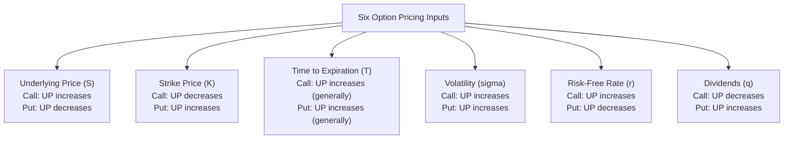

## Factors Affecting Option Premiums

### Definition and Core Concept

Option premiums are determined by the interaction of six primary inputs — underlying price, strike price, time to expiration, volatility, risk-free interest rate, and dividends — each of which affects call and put values in distinct, and sometimes opposite, ways. Understanding how each factor influences premium is foundational to interpreting option pricing models, anticipating how an option's value will change as market conditions shift, and understanding the option Greeks, which formally quantify each of these sensitivities.

**Key Points**

- The six standard inputs to an option pricing model (typically Black-Scholes-Merton or its variants) are: underlying price ($S$), strike price ($K$), time to expiration ($T$), volatility ($\sigma$), risk-free rate ($r$), and dividends ($q$ or discrete dividend amounts).
- Some factors affect calls and puts in the same direction (e.g., volatility increases both call and put premiums); others affect them in opposite directions (e.g., higher underlying price increases call premiums but decreases put premiums).
- The Greeks (delta, gamma, theta, vega, rho) formalize these relationships as precise partial derivatives of the option pricing formula with respect to each input.

### Underlying Asset Price ($S$)

**Effect on Calls**: Higher underlying price increases call premium, since a call's payoff ($\max(S_T-K,0)$) directly benefits from a higher underlying price at expiration — this sensitivity is measured by **delta**, which for calls ranges from 0 to 1.

**Effect on Puts**: Higher underlying price decreases put premium, since a put's payoff ($\max(K-S_T,0)$) benefits from a *lower* underlying price — put delta ranges from -1 to 0.

**Example**

A call option with strike $K=\$100$ trades at $5.00 when the underlying is at $98. If the underlying rises to $102 (all else equal), the call premium would be expected to rise — the magnitude of the increase is approximated by delta (e.g., if delta is 0.55 at the original price, a $4 move might increase the premium by roughly $2.20, though this is a linear approximation valid only for small moves, since delta itself changes with the underlying price, a curvature effect captured by gamma).

### Strike Price ($K$)

**Effect on Calls**: Higher strike price decreases call premium — a call with a higher strike requires a larger underlying price move to reach the same level of intrinsic value, making it less likely to finish in-the-money and reducing its payoff potential at any given underlying price.

**Effect on Puts**: Higher strike price increases put premium — a put with a higher strike provides protection/payoff at a higher underlying price threshold, making it more valuable (more likely to be in-the-money at a given underlying price level, and with greater intrinsic value if it is).

**Example**

At a fixed underlying price of $100 and fixed expiration, a call with $K=\$95$ will trade at a higher premium than a call with $K=\$105$, since the $95 strike call is already in-the-money (with $5 of intrinsic value) while the $105 strike call is out-of-the-money. Conversely, a put with $K=\$105$ will trade at a higher premium than a put with $K=\$95$ under the same underlying price.

### Time to Expiration ($T$)

**Effect on Both Calls and Puts (Generally)**: More time to expiration generally increases both call and put premiums, since additional time increases the range of possible underlying price outcomes and, correspondingly, the probability of a larger favorable move before expiration — this relationship is captured by **theta** (the rate of time decay), which is typically negative for long option positions (value erodes as time passes, all else equal).

**Nuance for European Puts**: [Inference] While more time to expiration generally increases option value, this relationship can, in specific circumstances, be non-monotonic for deep in-the-money European puts on non-dividend-paying underlyings — a longer time to expiration delays receipt of the (likely) exercise proceeds, and the time-value-of-money cost of this delay can, in certain parameter combinations, outweigh the benefit of additional optionality, theoretically causing a longer-dated deep ITM European put to be worth *less* than a shorter-dated one. This is a recognized theoretical edge case in option pricing theory rather than the typical pattern observed for most options.

**Time Decay Pattern**: As established in the discussion of intrinsic and time value, time value generally decays in a non-linear, often accelerating fashion as expiration approaches, with the largest absolute dollar decay typically occurring for at-the-money options in the final weeks before expiration.

### Volatility ($\sigma$)

**Effect on Both Calls and Puts**: Higher expected volatility of the underlying increases both call and put premiums. This is one of the most important and universally consistent relationships in options pricing: since option payoffs are asymmetric (a long option holder benefits from large favorable moves but has losses capped at the premium paid regardless of how unfavorable the move is), greater volatility increases the probability of a large favorable payoff without a symmetric increase in downside, making the option more valuable — this sensitivity is measured by **vega**.

**Historical vs. Implied Volatility**: Option premiums are driven by the market's *expectation* of future volatility (implied volatility, backed out from observed option prices via a pricing model), which may differ substantially from realized historical volatility of the underlying — implied volatility often incorporates a premium (sometimes called the "volatility risk premium") reflecting demand for optionality, particularly downside protection, beyond what historical volatility alone would suggest.

**Example**

Two otherwise identical call options (same strike, same expiration, same underlying price) — one priced assuming 20% annualized volatility, the other assuming 35% annualized volatility — will show materially different premiums, with the 35% volatility option commanding a substantially higher price, all else held equal, reflecting the wider range of plausible outcomes for the underlying.

### Risk-Free Interest Rate ($r$)

**Effect on Calls**: Higher risk-free rates generally increase call premiums. This effect stems from the cost-of-carry logic embedded in option pricing: a call option can be thought of, in part, as a substitute for holding the underlying while deferring payment of the strike price, and higher interest rates increase the value of deferring that payment (since $Ke^{-rT}$, the present value of the strike, decreases as $r$ rises).

**Effect on Puts**: Higher risk-free rates generally decrease put premiums, following the same cost-of-carry logic but in the opposite direction — this sensitivity for both calls and puts is measured by **rho**.

**Relative Magnitude**: [Inference] The interest rate sensitivity of option premiums (rho) is generally considered a secondary factor relative to volatility (vega) and underlying price (delta) for most standard equity and index options, particularly for shorter-dated options, though rho's importance increases for longer-dated options (LEAPS) and becomes especially significant for interest-rate-sensitive derivatives such as swaptions, where the interest rate is itself the primary underlying variable rather than a secondary pricing input.

### Dividends ($q$ or Discrete Dividends)

**Effect on Calls**: Expected dividends decrease call premiums. Anticipated dividend payments are expected to reduce the underlying's price on the ex-dividend date (as the distributed cash leaves the company), and since call holders do not receive dividends paid on the underlying, higher expected dividends reduce the expected future value the call can capture.

**Effect on Puts**: Expected dividends increase put premiums, following the same logic in reverse — the anticipated ex-dividend price decline increases the probability and magnitude of a favorable outcome for put holders.

**Example**

Comparing two otherwise identical calls on stocks with the same current price, volatility, and time to expiration, but where Stock A pays no dividend and Stock B pays a 3% annualized dividend yield: the call on Stock B will generally trade at a lower premium than the call on Stock A, reflecting the expected downward drift in Stock B's price from dividend payments over the option's life; the corresponding puts would show the opposite ranking.

### Diagram: Six Factors and Their Directional Effects

### Comparison Table: Directional Impact Summary

| Factor | Increase in Factor → Call Premium | Increase in Factor → Put Premium | Associated Greek |
| --- | --- | --- | --- |
| Underlying Price ($S$) | Increases | Decreases | Delta |
| Strike Price ($K$) | Decreases | Increases | (embedded in model, not a standalone Greek) |
| Time to Expiration ($T$) | Increases (generally) | Increases (generally, with rare exceptions) | Theta (decay = negative of this sensitivity) |
| Volatility ($\sigma$) | Increases | Increases | Vega |
| Risk-Free Rate ($r$) | Increases | Decreases | Rho |
| Dividends ($q$) | Decreases | Increases | (embedded in model as a carry adjustment) |

### The Greeks as Formal Sensitivity Measures

Each of the qualitative relationships above corresponds to a precisely defined partial derivative of the option pricing formula:

$$\Delta = \frac{\partial V}{\partial S} \quad \Gamma = \frac{\partial^2 V}{\partial S^2} \quad \Theta = \frac{\partial V}{\partial T} \quad \nu (Vega) = \frac{\partial V}{\partial \sigma} \quad \rho = \frac{\partial V}{\partial r}$$

Where $V$ represents the option's value (premium). These derivatives allow precise, quantitative estimation of how much an option's premium will change for a small change in each underlying input, and collectively form the basis of option risk management (hedging a portfolio of options by managing its aggregate delta, gamma, vega, theta, and rho exposure).

### Interaction Effects Between Factors

**Volatility and Time (Vega-Theta Relationship)**: [Inference] Vega (volatility sensitivity) and the magnitude of theta (time decay) are generally correlated in their behavior across the option's life — options with more time remaining tend to have higher vega (since there is more time for volatility to manifest in price movement) but relatively lower theta in dollar terms per unit time, while the reverse holds as expiration approaches, though the precise relationship depends on moneyness and the specific shape of the volatility surface.

**Moneyness Amplifies or Dampens Sensitivities**: As established in moneyness and time value discussions, at-the-money options generally exhibit the highest vega and theta (in absolute terms) since their value is most uncertain and most composed of time value, while deep ITM or OTM options show progressively lower sensitivity to volatility and time as their value becomes more dominated by (relatively fixed) intrinsic value or approaches zero, respectively.

**Rate and Dividend Interaction**: Since both interest rates and dividends enter the option pricing formula through the cost-of-carry term (effectively, the forward price of the underlying, $S_0 e^{(r-q)T}$), a rise in rates and a rise in expected dividends have partially offsetting effects on this combined carry term, meaning the *net* effect on a specific option's premium depends on the relative magnitude of the rate change versus the dividend change.

### Practical Applications

**Options Trading Strategy Selection**: Traders explicitly select strategies based on which factor(s) they wish to express a view on — for example, a trader with a strong view on volatility increasing (regardless of direction) might favor a long straddle or strangle (maximizing vega exposure while attempting to minimize net directional delta exposure), while a trader with a pure directional view might prefer simple long calls/puts or vertical spreads.

**Earnings and Event-Driven Volatility**: Options on stocks approaching known catalysts (earnings announcements, FDA approval decisions, regulatory rulings) typically show elevated implied volatility ahead of the event, reflecting the market's anticipation of a potentially large price move, followed by a characteristic volatility decline ("volatility crush") immediately after the event resolves and uncertainty is removed — a well-documented pattern that event-driven options strategies specifically attempt to exploit or must account for.

**Dividend Timing and Strategy Adjustment**: Traders holding or considering short call positions on dividend-paying stocks must account for the possibility of early assignment around ex-dividend dates (as covered in exercise style discussions), while long call holders on high-dividend-yield underlyings should recognize the structural premium discount embedded in the option relative to an equivalent option on a non-dividend-paying stock.

**Interest Rate Environment Awareness**: In periods of significant interest rate change (such as central bank tightening or easing cycles), the rho sensitivity of longer-dated options (LEAPS) becomes more practically relevant than it might be during stable-rate environments, warranting explicit attention in the risk management of large or long-dated options books.

### Risk Considerations

**Model Dependency of Sensitivity Estimates**: The Greeks and directional relationships described are derived from specific option pricing models (predominantly Black-Scholes-Merton and its variants) that rely on simplifying assumptions (constant volatility, continuous trading, no transaction costs, lognormal price distribution); actual observed option price sensitivities can deviate from model-predicted values, particularly during periods of market stress or for options with pronounced volatility skew.

**Volatility Risk Premium Uncertainty**: [Unverified] The tendency for implied volatility to trade above subsequently realized volatility (the "volatility risk premium") is a widely observed historical pattern in many options markets, but its magnitude and consistency vary over time and across underlyings, and should not be treated as a guaranteed or stable source of return for volatility-selling strategies.

**Simultaneous Factor Movement**: In practice, multiple factors typically move simultaneously (e.g., a market sell-off often coincides with both a falling underlying price and rising implied volatility), making it important to consider the *combined* effect of correlated factor movements rather than analyzing each factor's effect in isolation, particularly for risk management of complex, multi-position options portfolios.

**Behavioral disclaimer**: [Unverified] The directional relationships and Greek sensitivities described represent standard theoretical results under conventional option pricing model assumptions; actual market-observed premium behavior can be affected by supply/demand imbalances, liquidity constraints, and other market microstructure factors not captured in standard pricing models, so realized premium changes may deviate from model-predicted sensitivities, particularly for large moves or illiquid option series.

**Next Steps**

- Option Greeks in depth: delta, gamma, theta, vega, rho formulas and portfolio-level aggregation
- Implied volatility vs. historical volatility: the volatility risk premium and its trading implications
- Volatility skew and smile: why implied volatility varies systematically across strikes
- Earnings-related volatility patterns: implied volatility run-up and post-event volatility crush
- Black-Scholes-Merton model assumptions and their practical limitations
- Delta-hedging and dynamic hedging strategies for managing multi-Greek option portfolio risk