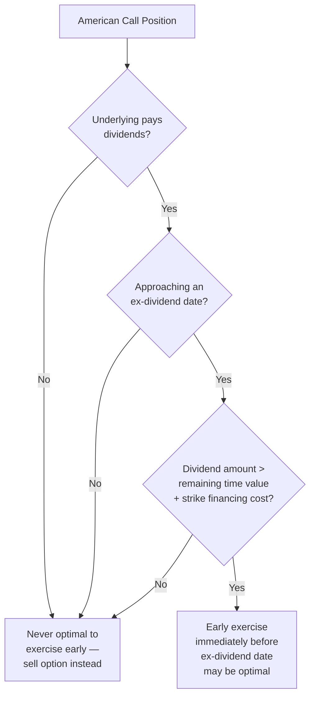
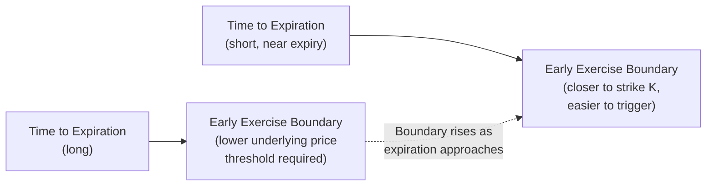

## Early Exercise of American Options

<syllabot_broad_topic/>

### Definition and Core Concept

Early exercise refers to an American-style option holder's decision to exercise their right to buy or sell the underlying asset before the contract's expiration date, rather than waiting until expiration or selling the option in the market. Unlike European options, which permit exercise only at expiration, American options grant this timing flexibility throughout the option's life — but flexibility to exercise early does not mean early exercise is always, or even usually, the economically optimal choice.

The decision of whether and when early exercise is optimal is one of the most nuanced topics in options theory, with materially different conclusions for calls versus puts, and with dividends playing a pivotal role in the analysis for calls specifically.

**Key Points**

- Early exercise forfeits any remaining time value in the option, so it is only rational when the benefit gained from exercising (immediate intrinsic value realization, dividend capture, or time-value-of-money benefit) exceeds the time value being sacrificed.
- For American calls on non-dividend-paying underlyings, early exercise is never optimal — a foundational, well-established result in options theory.
- For American puts, early exercise can be optimal even without dividends, particularly for deep in-the-money puts, driven by the time-value-of-money benefit of receiving cash sooner.

### The Fundamental Trade-off in Early Exercise

When a holder exercises an American option early, they receive the intrinsic value immediately but simultaneously give up two things:

1. **Remaining time value**: the portion of the option's premium reflecting the possibility of further favorable movement before expiration.
2. **Optionality against adverse movement**: by exercising, the holder converts a limited-risk option position into direct exposure to the underlying (via delivery or receipt of shares), losing the protection against the underlying moving unfavorably that the unexercised option would have retained.

Rational early exercise, therefore, only occurs when some specific, quantifiable benefit outweighs this cost — the two primary drivers of such a benefit are **dividend capture** (relevant mainly for calls) and the **time-value-of-money benefit of receiving cash sooner** (relevant mainly for puts).

### American Calls on Non-Dividend-Paying Underlyings: Never Optimal to Exercise Early

**The Core Result**

It is a foundational, well-established theoretical result that an American call option on a non-dividend-paying stock should never be exercised early. The intuitive argument proceeds as follows:

- If the holder exercises early, they receive $S_t - K$ (intrinsic value) and immediately own the stock, forfeiting the option's remaining time value.
- If instead the holder simply **sells the option** in the market (rather than exercising), they receive the option's full market price, which — since the option must be worth at least its intrinsic value plus some non-negative time value prior to expiration — is worth at least as much as, and typically strictly more than, the intrinsic value alone.
- Additionally, if the holder wants to maintain long stock exposure, they could sell the option and use part of the proceeds to buy the stock outright, retaining any leftover cash (the time value) — a strictly better outcome than exercising, since exercising requires paying the full strike price $K$ immediately, whereas buying the stock in the open market and retaining the un-exercised option's cash value is more capital-efficient.

$$C_{American} \geq c_{European} \geq S_t - Ke^{-r(T-t)} > S_t - K \quad (\text{for } r > 0)$$

This chain of inequalities shows that the American call's value (which must be at least the European call's value, which itself must be at least $S_t - Ke^{-r(T-t)}$ by standard no-arbitrage bounds) exceeds the immediate exercise value $S_t - K$ whenever the risk-free rate is positive, confirming that holding (or selling) the option is always at least as good as, and generally strictly better than, exercising immediately.

**Direct Consequence**: Since early exercise is never optimal for calls on non-dividend-paying stocks, the American call has exactly the same theoretical value as an otherwise identical European call — the early exercise "feature" is valueless in this specific case, since it is never rationally used.

### American Calls on Dividend-Paying Underlyings: Early Exercise Can Become Optimal

**The Dividend Capture Motivation**

When the underlying pays dividends, the calculus changes. Anticipated dividend payments cause the underlying's price to be expected to fall by approximately the dividend amount on the ex-dividend date (since the distributed cash leaves the company). A call holder does **not** receive dividends paid on shares they don't yet own — only actual shareholders receive dividends. This creates an incentive: exercising the call **immediately before** the ex-dividend date allows the holder to become a shareholder of record and capture the upcoming dividend, an opportunity forfeited if the holder waits.

**The Decision Framework**

Early exercise of an American call becomes potentially optimal only immediately before an ex-dividend date (never at other times, since between dividend dates the "never exercise early absent dividends" logic still applies), and only when the following approximate condition holds:

$$D > K \times (1 - e^{-r\delta t})$$

Where $D$ is the anticipated dividend amount, $K$ is the strike price, $r$ is the risk-free rate, and $\delta t$ is the (typically short) time remaining to the option's actual expiration after the ex-dividend date. Intuitively, this compares the dividend to be captured against the time-value-of-money cost of paying the strike price $K$ early rather than waiting — early exercise is more likely to be optimal when the dividend is large relative to the strike and remaining time value.

**Example**

A call option with strike $K = \$100$, with the underlying about to pay a $3.00 dividend (large relative to typical quarterly dividends, chosen for illustrative clarity) one day before the option's expiration.

- If the call is deep in-the-money (say, underlying at $115) and has very little remaining time value (since expiration is imminent), the holder faces a choice: exercise now and capture the $3.00 dividend as a new shareholder, or hold the unexercised call through the ex-dividend date and watch the underlying (and thus the call's intrinsic value) drop by approximately $3.00 when the dividend is paid, with essentially no offsetting time value benefit remaining to compensate for that expected drop.
- In this scenario, if the remaining time value is smaller than the dividend amount, early exercise becomes optimal — the holder is better off capturing the $3.00 dividend than retaining an option position that is expected to lose approximately that same amount in intrinsic value with no meaningful offsetting time value cushion.

**Practical Rule of Thumb**: [Inference] Early exercise of American calls is generally only a relevant consideration for options that are already meaningfully in-the-money, with a dividend that is large relative to the remaining time value, and typically only immediately before the relevant ex-dividend date — options that are at-the-money or out-of-the-money essentially never warrant early exercise even with dividends, since there is no intrinsic value to protect and the holder would simply be forfeiting time value for no offsetting benefit.

### Diagram: American Call Early Exercise Decision Logic

### American Puts: Early Exercise Can Be Optimal Even Without Dividends

**The Time-Value-of-Money Motivation**

Unlike calls, American puts can rationally be exercised early even on a non-dividend-paying underlying. The driving factor here is different from the dividend-capture logic for calls: it is the **time value of money** associated with receiving the strike price (cash) sooner rather than later.

When a put is exercised, the holder delivers the underlying and receives the strike price $K$ in cash immediately. If the put is deep in-the-money (very likely to remain in-the-money through expiration) and has very little remaining time value, the benefit of receiving $K$ now — which can then be invested at the risk-free rate — can outweigh the small remaining time value being forfeited, plus the (now small) remaining optionality value of waiting in case the underlying recovers.

**The Theoretical Extreme Case**

Consider the limiting case where the underlying price falls to zero (or near zero) with time remaining before expiration: a European put holder must wait until expiration to receive the maximum payoff of $K$, losing the time-value-of-money benefit of receiving that cash sooner. An American put holder, by contrast, can exercise immediately, receive $K$ now, and begin earning interest on it — this is a clear, unambiguous benefit with essentially no offsetting cost (since the underlying is already at or near zero, there is minimal remaining optionality value being sacrificed). This extreme case illustrates why American puts can have strictly greater value than European puts, and why deep ITM American puts are frequently exercised early in practice.

**General Decision Framework**

Early exercise of an American put tends to become optimal when the put is sufficiently deep in-the-money and the remaining time to expiration is such that the time-value-of-money benefit of receiving $K$ immediately exceeds the combined value of (a) remaining time value and (b) the insurance-like benefit of retained optionality against the underlying recovering above the strike.

[Inference] There is a specific "early exercise boundary" — a critical underlying price level, which itself varies with time remaining to expiration — below which early exercise of an American put becomes optimal; this boundary is generally not available in closed form and must be determined via numerical methods (binomial/trinomial trees, finite difference methods), one of the primary reasons American put valuation is more computationally involved than European put valuation, which does have a closed-form Black-Scholes solution.

### Diagram: American Put Early Exercise Boundary Concept

### Comparison: Early Exercise Drivers for Calls vs. Puts

| Feature | American Calls | American Puts |
| --- | --- | --- |
| Early exercise possible without dividends? | No (never optimal) | Yes (can be optimal, especially deep ITM) |
| Primary driver of early exercise | Dividend capture | Time-value-of-money benefit of receiving cash sooner |
| Typical timing | Immediately before ex-dividend date | Can occur any time once deep enough ITM, more likely as expiration nears |
| Effect of higher interest rates | Increases dividend threshold needed for early exercise less directly; primarily a dividend-driven decision | Increases the incentive for early exercise (higher rates mean more benefit from receiving cash sooner) |
| Value relative to European equivalent | Equal (absent dividends); potentially greater (with dividends) | Generally greater (even absent dividends) |

### Numerical Valuation Approaches Accounting for Early Exercise

**Binomial and Trinomial Trees**: At each node, working backward from expiration, the model compares the immediate exercise value (intrinsic value at that node) against the discounted expected continuation value, taking the maximum — this directly and naturally incorporates the early exercise decision at every discretized time step and underlying price level.

**Finite Difference Methods**: Solve the Black-Scholes partial differential equation on a discretized grid, applying an early-exercise constraint (the option value cannot fall below intrinsic value at any grid point) that effectively identifies the early exercise boundary as part of the numerical solution process.

**Analytical Approximations**: Methods such as the Barone-Adesi-Whaley approximation provide faster, closed-form-like approximate solutions for American option values by approximating the early exercise premium (the additional value of the American option over its European counterpart) using a quadratic approximation technique, useful when full numerical methods are computationally too slow for the required application (e.g., real-time risk calculation across large options portfolios).

### Practical Implications for Market Participants

**Option Holders (Long Positions)**: Should generally evaluate, particularly for ITM positions approaching known dividend dates (for calls) or when deep ITM with limited remaining time value (for puts), whether early exercise or selling the option in the open market produces a better economic outcome — as a general practical guideline, selling the option is very often preferable to early exercise when meaningful time value remains, since exercising forfeits that value entirely while selling captures it.

**Option Writers (Short Positions)**: Face **assignment risk** — the possibility of being assigned (having the option exercised against them) at an inconvenient or unexpected time. This is a particular concern for:

- Short call writers around ex-dividend dates on high-dividend-yield underlyings, especially for deep ITM short calls with little remaining time value.
- Short put writers on deep ITM positions generally, particularly as expiration approaches or during periods of elevated interest rates (which increase the economic incentive for the put holder to exercise early).

**Covered Call Writers Specifically**: [Unverified] Investors writing covered calls (holding the underlying stock while selling calls against it) on dividend-paying stocks should be particularly attentive to early assignment risk around ex-dividend dates, since early assignment would mean losing the underlying shares (and thus the anticipated dividend) earlier than the call seller might have planned — the specific probability and timing of assignment cannot be predicted with certainty and depends on the option holder's own economic calculation, which the writer does not directly observe.

### Risk Considerations

**Assignment Timing Uncertainty for Writers**: Because early exercise decisions are made unilaterally by option holders based on their own economic calculations (and sometimes for reasons outside pure economic optimality, such as portfolio rebalancing needs or tax considerations), option writers cannot predict with certainty when or whether assignment will occur, even when the theoretical framework suggests early exercise "should" be optimal — some holders exercise suboptimally, and others may delay exercise even when theoretically optimal, for reasons outside a simplified pricing model's scope.

**Model Risk in Early Exercise Boundary Estimation**: Since no closed-form solution exists for the American option early exercise boundary, different numerical methods (or different parameter choices within the same method, such as the number of tree steps or grid points) can produce slightly different estimates of both the option's value and the associated optimal exercise boundary, representing a genuine source of model risk in American option valuation and risk management.

**Suboptimal Exercise Behavior**: [Unverified] Empirical observation suggests that not all market participants exercise American options in a manner consistent with pure economic optimality (some exercise too early, forfeiting time value unnecessarily; others fail to exercise when theoretically optimal) — this observed behavioral deviation from theoretical predictions is a recognized phenomenon in options markets, though its precise causes (transaction costs, tax considerations, operational constraints, or genuine suboptimal decision-making) are not always clearly attributable in any specific instance.

**Behavioral disclaimer**: [Unverified] The early exercise frameworks and decision rules described reflect standard theoretical results under idealized, frictionless market assumptions (no transaction costs, no tax considerations, rational and fully-informed decision-making); actual early exercise decisions and assignment patterns observed in real markets can deviate from these theoretical predictions due to these excluded real-world factors.

**Next Steps**

- Binomial and trinomial tree methods for American option valuation in detail
- Barone-Adesi-Whaley and other analytical approximation methods for American options
- Assignment risk management for covered call and cash-secured put writers
- Dividend forecasting accuracy and its impact on early exercise decision modeling
- American vs. European vs. Bermudan exercise style comparison and instrument prevalence by asset class
- Put-call parity inequality bounds for American options and their relationship to early exercise value