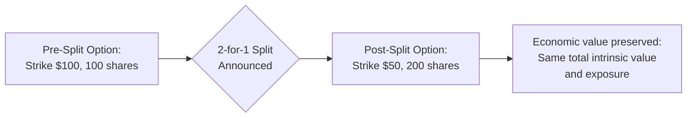
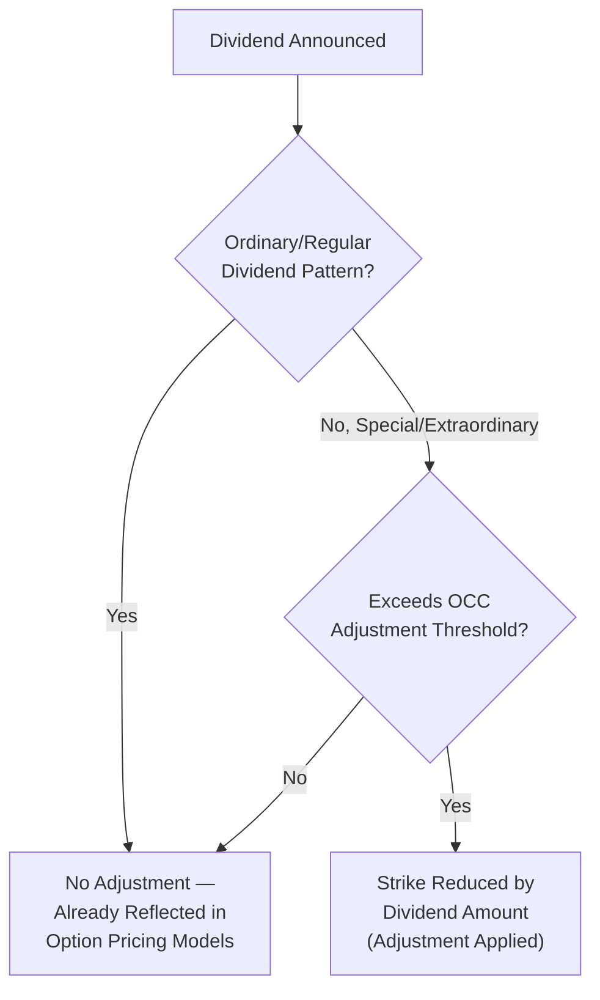
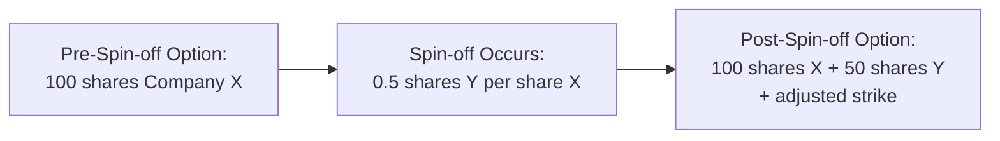

## Option Adjustments for Corporate Actions

### Definition and Core Concept

Option adjustments for corporate actions refer to the standardized procedures options clearinghouses and exchanges use to modify the terms of existing listed option contracts — strike price, contract multiplier, deliverable underlying, or number of contracts — when the underlying company undergoes a corporate action that would otherwise distort the option's economic value or delivery mechanics. These adjustments preserve the pre-existing economic value and rights of both option holders and writers as closely as possible, preventing corporate actions from creating windfall gains or unexpected losses unrelated to genuine market price movement.

In the US, these adjustments are administered by the **Options Clearing Corporation (OCC)**, which maintains standardized rules applied consistently across all listed option contracts on affected underlyings; other jurisdictions have analogous central clearing/adjustment bodies governed by their own exchange rules.

**Key Points**

- The overarching principle guiding adjustments is to keep option holders and writers in essentially the same economic position they held immediately before the corporate action, neither better nor worse off due to the action itself.
- Adjustments vary systematically by corporate action type: stock splits, special dividends, mergers/acquisitions, spin-offs, and rights offerings each trigger distinct, specific adjustment mechanics.
- Adjusted options are typically identified with special deliverable symbols or notations distinguishing them from standard, unadjusted contracts, since the underlying deliverable may no longer be simply "100 shares of the original stock."

### Stock Splits

**Standard (Forward) Stock Splits**

When a company executes a forward stock split (e.g., a 2-for-1 split), each existing option contract's strike price and multiplier are adjusted proportionally to preserve the pre-split economic exposure.

**Adjustment Formula**

$$New\ Strike = \frac{Old\ Strike}{Split\ Ratio}$$

$$New\ Multiplier/Deliverable\ Shares = Old\ Shares \times Split\ Ratio$$

**Example**

An investor holds a call option with a $100 strike, standard 100-share deliverable, on a stock trading at $105 before a 2-for-1 stock split.

- Post-split, the stock price adjusts to approximately $52.50 (half of $105).
- The option's strike is adjusted: $New\ Strike = 100/2 = \$50$.
- The deliverable is adjusted: $New\ Deliverable = 100 \times 2 = 200\ shares$.
- The option's economic exposure is preserved: pre-split, the option controlled 100 shares with $5 of intrinsic value per share ($500 total); post-split, the option controls 200 shares with $2.50 of intrinsic value per share (still $500 total) — the adjustment is designed to be value-neutral at the moment of the split.

**Odd-Ratio Splits (e.g., 3-for-2)**

For split ratios that do not produce whole-share/whole-dollar results cleanly (e.g., a 3-for-2 split), the OCC adjustment process typically results in a non-round-lot deliverable (e.g., 150 shares instead of a clean multiple of 100) and a strike price adjusted to a precise, sometimes non-round-number fractional value, since the priority is exact economic preservation rather than maintaining clean, round contract terms.

### Diagram: Stock Split Adjustment Mechanics

### Reverse Stock Splits

A reverse stock split (e.g., 1-for-5, consolidating five old shares into one new share) triggers the same proportional logic in the opposite direction:

$$New\ Strike = Old\ Strike \times Consolidation\ Ratio$$

$$New\ Deliverable\ Shares = Old\ Shares / Consolidation\ Ratio$$

**Example**

A put option with a $10 strike and 100-share deliverable, on a stock undergoing a 1-for-5 reverse split (stock price rises approximately 5x):

- New strike: $10 \times 5 = \$50$
- New deliverable: $100 / 5 = 20\ shares$

### Cash Dividends: Ordinary vs. Special

**Ordinary (Regular) Cash Dividends**

Standard, regularly scheduled cash dividends within normal historical parameters for the issuer typically do **not** trigger an adjustment to listed option contracts. This is a deliberate design choice: ordinary dividends are considered a normal, anticipated part of the underlying's expected price behavior and are already reflected in option pricing models (via the dividend yield or discrete dividend inputs discussed in premium-factor analysis) rather than treated as an extraordinary event requiring contract modification.

**Special (Extraordinary) Cash Dividends**

A special or extraordinary cash dividend — one that is unusually large relative to the company's regular dividend pattern — can trigger an adjustment, since such a distribution represents a significant, often unanticipated transfer of value out of the company that could otherwise unfairly disadvantage call holders (whose options do not receive dividends) or advantage put holders in a way disconnected from normal option pricing expectations.

**Adjustment Mechanism**

When a special dividend triggers an adjustment (subject to specific threshold criteria set by the OCC or relevant exchange, often based on the dividend's size relative to the stock price), the strike price is typically reduced by the per-share dividend amount:

$$New\ Strike = Old\ Strike - Special\ Dividend\ Amount$$

**Example**

A stock trading at $80 announces a special cash dividend of $5.00 per share (well above its normal quarterly dividend pattern, triggering adjustment eligibility).

- A call option with an $80 strike would have its strike adjusted downward: $New\ Strike = 80 - 5 = \$75$.
- This adjustment approximately offsets the expected $5 drop in the underlying's price on the ex-dividend date, keeping the option's moneyness and intrinsic value approximately consistent with its pre-announcement state.

[Unverified] The specific quantitative threshold used to distinguish an "ordinary" dividend from a "special" dividend requiring adjustment is set by the OCC's dividend adjustment policy and can involve specific percentage-of-price thresholds or absolute dollar criteria that are subject to periodic review — practitioners should consult current OCC dividend adjustment bulletins for the precise, currently applicable criteria rather than assume a fixed universal threshold.

### Diagram: Dividend Type and Adjustment Decision

### Mergers and Acquisitions

**Cash Mergers**

When a company is acquired entirely for cash, outstanding options on that company's stock are typically adjusted so that the deliverable becomes the cash merger consideration per share, effectively converting the option into a cash-settled instrument fixed at the merger price — since the underlying stock will cease to exist/trade following deal closing, this adjustment allows the option's economic terms to be preserved through to a defined cash settlement rather than leaving the option referencing a security that no longer exists.

**Example**

A company is acquired for $60.00 cash per share. Outstanding call options with a $50 strike would, upon deal completion, generally be adjusted such that the deliverable becomes $60.00 cash per share (times the contract's share deliverable), with the option effectively becoming deep in-the-money by a fixed, known amount ($10 per share intrinsic value, with no further time value relevance once the deliverable is fixed cash) — market participants typically exercise or the option is automatically settled for this fixed cash intrinsic value at or before expiration/deal completion, per specific OCC adjustment bulletin terms for that transaction.

**Stock-for-Stock Mergers**

When Company A acquires Company B in an all-stock deal (shareholders of B receive shares of A at a specified exchange ratio), options on Company B's stock are typically adjusted so the deliverable becomes the appropriate number of Company A shares per the exchange ratio, rather than the now-defunct Company B shares.

**Example**

Company A acquires Company B at an exchange ratio of 0.75 shares of A for each share of B. An option on Company B with a 100-share deliverable would be adjusted so the deliverable becomes 75 shares of Company A (100 × 0.75), with the strike price typically remaining unchanged in a pure stock-for-stock deal (since the adjustment is to the deliverable quantity/security rather than the strike, reflecting the direct share-for-share substitution).

**Cash-and-Stock Mergers**

For deals combining both cash and stock consideration, the adjustment reflects the blended deliverable — a combination of a specified cash amount plus a specified number of the acquirer's shares per original underlying share, mirroring exactly what actual shareholders of the acquired company receive in the transaction.

### Spin-offs

When a company spins off a subsidiary or division into a separate, independently-traded public company, shareholders typically receive shares of the new spin-off entity in addition to retaining their original shares (often at a reduced adjusted price reflecting the value that has "left" the parent company via the spin-off). Options on the parent company are adjusted to reflect this, typically by adding the spin-off company's shares (in the appropriate ratio) to the option's deliverable, alongside an adjustment to the strike price of the original option reflecting the parent's reduced value.

**Example**

Company X spins off Division Y as a new independent company, with each Company X shareholder receiving 0.5 shares of new Company Y stock for each share of X held. Following the spin-off, Company X's stock price might be expected to decline (reflecting the value transferred to the new Company Y shares).

- An outstanding option on Company X would typically be adjusted to have a deliverable of 100 shares of X *plus* 50 shares of Y (100 × 0.5), with the strike price adjusted downward to reflect the reduced value remaining in Company X — the specific magnitude of strike adjustment is generally determined based on the relative value allocation between the parent and spin-off at the time of the corporate action, per OCC-published adjustment terms for that specific transaction.

### Diagram: Spin-off Adjustment Structure

### Rights Offerings and Other Dilutive Events

Rights offerings (where existing shareholders are granted the right to purchase additional shares, typically at a discount to market price) can dilute existing shareholders' proportional ownership and depress the stock price, and may trigger option adjustments reflecting the dilutive impact — the specific mechanics depend on the terms of the rights offering (subscription price, ratio) and are generally addressed via OCC information memoranda specific to the triggering event, following the same overarching principle of preserving pre-existing option holders' economic position.

### Comparison Table: Corporate Action Adjustment Summary

| Corporate Action | Strike Adjustment | Deliverable Adjustment |
| --- | --- | --- |
| Forward stock split (e.g., 2:1) | Divided by split ratio | Multiplied by split ratio |
| Reverse stock split (e.g., 1:5) | Multiplied by consolidation ratio | Divided by consolidation ratio |
| Ordinary cash dividend | None | None |
| Special/extraordinary cash dividend | Reduced by dividend amount | Typically unchanged |
| Cash merger | Typically unchanged (option becomes deep ITM/OTM at fixed cash value) | Becomes fixed cash consideration per share |
| Stock-for-stock merger | Typically unchanged | Becomes acquirer shares per exchange ratio |
| Spin-off | Adjusted downward (parent value reduction) | Adds spin-off entity shares |

### Adjusted Option Identification and Trading Considerations

**Special Symbols/Notation**: Adjusted option contracts are typically identified with distinct ticker symbols or notations (distinguishing them from standard, unadjusted "regular way" options on the same underlying), alerting market participants that the contract's deliverable differs from the current standard 100-share (or other standard multiplier) convention.

**Reduced Liquidity Post-Adjustment**: [Unverified] Adjusted option series often experience meaningfully reduced trading liquidity compared to standard, unadjusted series, since new option listings following a corporate action typically default to standard terms, concentrating ongoing trading activity in the new standard series while older, adjusted series become comparatively illiquid "legacy" contracts held primarily by pre-existing position holders rather than actively traded by new market entrants.

**Verification Responsibility**: Market participants holding options through an announced corporate action bear responsibility for understanding the specific adjustment terms applicable to their position, since adjustment mechanics can involve transaction-specific nuances beyond the general patterns described here — the OCC publishes detailed information memoranda for each specific corporate action affecting listed options, which represent the authoritative source for exact adjustment terms.

### Regulatory and Governance Framework

- **OCC Rules**: In the US, Options Clearing Corporation rules (specifically its bylaws and rules regarding contract adjustments) govern the standardized adjustment process, informed by input from listed exchanges and, in some cases, industry adjustment committees or panels that determine specific treatment for novel or complex corporate action structures.
- **ISDA Equity Derivatives Definitions**: For OTC equity options and equity swaps (as opposed to listed options), the ISDA Equity Derivatives Definitions govern analogous adjustment provisions, typically granting the calculation agent (usually the dealer counterparty) discretion to determine adjustments "in a commercially reasonable manner" — a framework distinct from, though conceptually parallel to, the OCC's standardized listed-option adjustment rules.
- **International Equivalents**: Other jurisdictions maintain analogous option clearing and adjustment infrastructure (e.g., various European and Asian clearinghouses), generally following similar economic-preservation principles though with jurisdiction-specific procedural and threshold differences.

### Risk Considerations

**Adjustment Complexity in Multi-Step Transactions**: Complex corporate actions involving multiple simultaneous or sequential steps (e.g., a spin-off combined with a subsequent merger of the spin-off entity) can produce correspondingly complex, multi-part option adjustments that require careful review of the specific OCC information memorandum rather than reliance on simplified general patterns.

**Timing and Announcement Risk**: [Unverified] The precise timing of when an adjustment becomes effective relative to key corporate action dates (record date, ex-date, effective date) can affect option positions held across these dates, and market participants should be attentive to official adjustment effective dates rather than assuming adjustments align precisely with the corporate action's own announced timeline.

**Valuation Discontinuity Risk**: Even with adjustments designed to preserve economic value, the adjustment process itself (and the resulting adjusted contract's often non-standard deliverable) can affect the option's subsequent liquidity and bid-ask spread, representing a practical (if not strictly theoretical) risk to holders of adjusted contracts.

**Behavioral disclaimer**: [Unverified] The adjustment mechanics and examples described reflect general, standard OCC adjustment principles and illustrative calculations; actual adjustment terms for any specific corporate action are determined by official OCC information memoranda (or the equivalent governing body in other jurisdictions) applicable to that specific transaction, and can include transaction-specific nuances not captured in these general illustrative examples.

**Next Steps**

- OCC information memoranda: how to research and interpret official adjustment terms for a specific corporate action
- ISDA Equity Derivatives Definitions: calculation agent discretion and adjustment provisions for OTC equity derivatives
- Merger arbitrage strategies involving options on target and acquirer companies
- Special dividend adjustment thresholds and historical case studies
- Total return swap corporate action adjustments as a comparative OTC analog to listed option adjustments
- Options on spin-off "regular way" vs. "when-issued" trading periods and their interaction with adjustment timing