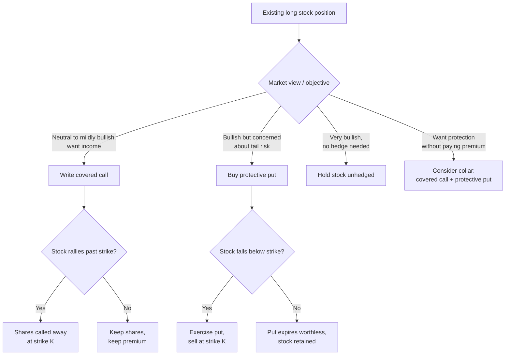

## Covered Calls and Protective Puts

### Definitions

**Covered Call**: A position combining a long position in an underlying asset with a short (written) call option on that same asset, in equal quantity (typically one contract per 100 shares). The writer collects the option premium in exchange for capping upside participation above the strike price.

**Protective Put**: A position combining a long position in an underlying asset with a long put option on that same asset. The put buyer pays a premium to establish a floor below which losses on the underlying are offset by gains on the put.

Both are the two canonical "one stock plus one option" hedged strategies, and both can be analyzed through put-call parity, since each is synthetically equivalent to a simpler options position.

### Covered Call: Construction and Payoff

**Position**: Long 100 shares of underlying at price $S_0$, short 1 call option with strike $K$ and premium received $c$.

**Payoff at expiration** (per share), where $S_T$ is the underlying price at expiration:

$$\Pi(S_T) = (S_T - S_0) + c - \max(S_T - K, 0)$$

This simplifies into two regimes:

$$\Pi(S_T) = \begin{cases} (S_T - S_0) + c & S_T \leq K \\ (K - S_0) + c & S_T > K \end{cases}$$

**Key Points**:

- Maximum profit is capped at $(K - S_0) + c$, realized when $S_T \geq K$
- Maximum loss is $S_0 - c$ (occurs if $S_T \to 0$), identical in structure to a naked long stock position but cushioned by the premium
- Breakeven is $S_0 - c$
- The premium $c$ provides a limited buffer against downside but does not protect against large declines

**Synthetic equivalence (put-call parity)**: A covered call is synthetically equivalent to a short put at the same strike, plus a risk-free bond position reflecting the net cost basis. Formally, from parity:

$$c - p = S_0 - Ke^{-rT}$$

Rearranged, long stock + short call $\approx$ short put + $Ke^{-rT}$ (a cash position). This means a covered call's risk profile mirrors that of a cash-secured short put at the same strike — both have capped upside and substantial downside exposure, differing mainly in margin treatment and dividend/financing effects.

### Protective Put: Construction and Payoff

**Position**: Long 100 shares of underlying at price $S_0$, long 1 put option with strike $K$ and premium paid $p$.

**Payoff at expiration** (per share):

$$\Pi(S_T) = (S_T - S_0) - p + \max(K - S_T, 0)$$

Two regimes:

$$\Pi(S_T) = \begin{cases} (K - S_0) - p & S_T \leq K \\ (S_T - S_0) - p & S_T > K \end{cases}$$

**Key Points**:

- Maximum loss is capped at $(S_0 - K) + p$, realized when $S_T \leq K$
- Upside is uncapped, reduced only by the premium paid $p$
- Breakeven is $S_0 + p$
- Functions as portfolio insurance: the put premium is the cost of the floor, analogous to an insurance policy premium

**Synthetic equivalence**: A protective put is synthetically equivalent to a long call at the same strike plus a bond position. From the same parity relationship:

$$p - c = Ke^{-rT} - S_0$$

Long stock + long put $\approx$ long call + $Ke^{-rT}$ (cash). This is why protective puts are sometimes called "synthetic calls" — the payoff shape (capped downside, uncapped upside) is identical to holding a call option outright, but the protective put retains actual share ownership (useful for voting rights, dividend capture, or index tracking mandates that require holding the underlying).

### Payoff Diagram (svg_diagram)

<svg xmlns="http://www.w3.org/2000/svg" viewBox="0 0 780 420">
<text x="390" y="24" text-anchor="middle" font-size="16" font-weight="bold" fill="#1a1a1a">Covered Call vs Protective Put — Payoff at Expiration (svg_diagram)</text>

<line x1="80" y1="360" x2="740" y2="360" stroke="#333" stroke-width="1.5" />
<line x1="80" y1="60" x2="80" y2="360" stroke="#333" stroke-width="1.5" />
<text x="410" y="395" text-anchor="middle" font-size="13" fill="#333">Underlying Price at Expiration ($S_T$)</text>
<text x="30" y="210" text-anchor="middle" font-size="13" fill="#333" transform="rotate(-90 30 210)">Profit / Loss</text>

<line x1="80" y1="240" x2="740" y2="240" stroke="#999" stroke-width="1" stroke-dasharray="4,4" />
<text x="65" y="244" text-anchor="end" font-size="11" fill="#666">0</text>

<line x1="410" y1="60" x2="410" y2="360" stroke="#aaa" stroke-width="1" stroke-dasharray="3,3" />
<text x="410" y="375" text-anchor="middle" font-size="12" fill="#555">K</text>

<polyline points="100,320 410,180 740,180" fill="none" stroke="#1f6fd6" stroke-width="3" />
<text x="600" y="165" font-size="13" fill="#1f6fd6" font-weight="bold">Covered Call</text>

<polyline points="100,270 410,270 740,90" fill="none" stroke="#d6291f" stroke-width="3" />
<text x="600" y="105" font-size="13" fill="#d6291f" font-weight="bold">Protective Put</text>

<polyline points="100,340 740,60" fill="none" stroke="#999" stroke-width="1.5" stroke-dasharray="6,3" />
<text x="600" y="55" font-size="12" fill="#777">Long Stock (unhedged)</text>

<text x="420" y="195" font-size="11" fill="`#1f6fd6`">Capped upside</text>

<text x="420" y="260" font-size="11" fill="`#d6291f`">Floored downside</text>

</svg>

### Comparative Analysis

| Dimension | Covered Call | Protective Put |
| --- | --- | --- |
| Option leg | Short call (collect premium) | Long put (pay premium) |
| Net cost vs. stock alone | Reduced (premium received) | Increased (premium paid) |
| Upside | Capped at $K$ | Uncapped |
| Downside | Reduced by premium, otherwise unhedged | Floored at $K$ |
| Synthetic equivalent | Short put + cash | Long call + cash |
| Primary use case | Income generation, mild bearish/neutral view | Downside insurance, bullish long-term holder |
| Theta (time decay) | Favorable to position holder (short option) | Unfavorable to position holder (long option) |
| Vega exposure | Negative (short option; benefits from IV decline) | Positive (long option; benefits from IV rise) |

### Greeks of the Combined Position

For a covered call, treating share delta as $+1.0$ per share and the call's delta as $\Delta_c \in [0,1]$:

$$\Delta_{\text{covered call}} = 1 - \Delta_c$$

This is always between 0 and 1, meaning the position behaves like a fraction of a full long-stock position, becoming more "delta-neutral-like" as the call moves further in-the-money.

For a protective put, with put delta $\Delta_p \in [-1, 0]$:

$$\Delta_{\text{protective put}} = 1 + \Delta_p$$

Since $\Delta_p$ is negative, this is also between 0 and 1, but approaches 1 (full stock exposure) as the underlying rallies and the put moves further out-of-the-money, and approaches 0 as the put moves deep in-the-money (position becomes insulated from further declines).

**Theta**: Covered calls harvest positive theta from the short call, which is the primary return driver in a flat or mildly rising market ("theta as income"). Protective puts bleed negative theta from the long put, representing the ongoing cost of insurance — analogous to an insurance premium amortizing over the holding period.

**Vega**: Covered call writers are short volatility — the strategy benefits when implied volatility contracts after the position is established (richer premium collected relative to realized moves). Protective put buyers are long volatility — the hedge becomes more valuable, and cheaper to have purchased in hindsight, when implied volatility was low at entry and later spikes.

### Strike Selection and Moneyness Trade-offs

**Covered calls**:

- **Out-of-the-money (OTM) strikes** ($K > S_0$): Smaller premium, more room for stock appreciation before the cap binds. Common for investors who want some upside participation alongside income.
- **At-the-money (ATM) strikes** ($K \approx S_0$): Maximizes time value (theta) captured per contract, since ATM options carry the highest extrinsic value for a given expiration.
- **In-the-money (ITM) strikes** ($K < S_0$): Larger premium with more downside cushion, but caps upside close to current price — used when the primary goal is downside protection rather than income.

**Protective puts**:

- **OTM puts** ($K < S_0$): Cheaper premium, but the floor is set further below current price, so more downside is absorbed before protection activates. Common for "tail-risk" hedges.
- **ATM puts** ($K \approx S_0$): Tightest protection, highest premium cost — protects nearly all downside from current levels.
- **ITM puts** ($K > S_0$): Rarely used standalone for hedging due to high cost, since intrinsic value dominates the premium.

### Worked Example — Covered Call

**Setup**: Investor holds 100 shares at $S_0 = \$50$. Writes 1 call, $K = \$55$, expiration in 30 days, receives premium $c = \$1.50$/share ($150 total).

**Scenario A** — Stock closes at $S_T = \$48$:

- Stock P&L: $(48 - 50) \times 100 = -\$200$
- Option P&L (short call expires worthless): $+\$150$
- Net: $-\$50$ (vs. $-\$200$ unhedged — premium cushioned the loss)

**Scenario B** — Stock closes at $S_T = \$58$:

- Stock P&L: $(58 - 50) \times 100 = +\$800$
- Option P&L (call assigned, effectively sells stock at $55): capped
- Net: $(55 - 50) \times 100 + 150 = \$650$ (vs. $\$800$ unhedged — opportunity cost of $\$150$)

**Scenario C** — Stock closes at $S_T = \$52$:

- Stock P&L: $(52 - 50) \times 100 = +\$200$
- Option expires worthless: $+\$150$
- Net: $+\$350$

### Worked Example — Protective Put

**Setup**: Investor holds 100 shares at $S_0 = \$50$. Buys 1 put, $K = \$45$, expiration in 60 days, pays premium $p = \$1.20$/share ($120 total).

**Scenario A** — Stock closes at $S_T = \$35$:

- Stock P&L: $(35 - 50) \times 100 = -\$1500$
- Put P&L (intrinsic value $= 45 - 35 = 10$): $(10 - 1.20) \times 100 = +\$880$
- Net: $-\$620$ (vs. $-\$1500$ unhedged — the floor at $K=45$ limited further loss)

**Scenario B** — Stock closes at $S_T = \$60$:

- Stock P&L: $(60 - 50) \times 100 = +\$1000$
- Put expires worthless: $-\$120$
- Net: $+\$880$ (full upside minus insurance cost)

### Decision Flow

### The Collar: Combining Both Strategies

A **collar** combines a covered call and a protective put simultaneously on the same underlying: long stock, short OTM call (strike $K_c$), long OTM put (strike $K_p$), with $K_p < S_0 < K_c$. The call premium received partially or fully offsets the put premium paid, often structured as a **zero-cost collar** where $c \approx p$.

**Payoff**:

$$\Pi(S_T) = \begin{cases} (K_p - S_0) + (c - p) & S_T \leq K_p \\ (S_T - S_0) + (c - p) & K_p < S_T < K_c \\ (K_c - S_0) + (c - p) & S_T \geq K_c \end{cases}$$

This creates a bounded profit/loss range — the trade-off for cheap or free downside protection is a hard cap on upside. Collars are common for concentrated stock positions (e.g., executives with large single-stock holdings subject to trading restrictions) seeking low-cost downside protection.

### Assignment Risk and Practical Mechanics

**Covered calls**:

- American-style calls can be assigned early, most commonly just before an ex-dividend date if the call is ITM and the extrinsic value remaining is less than the dividend — the holder exercises to capture the dividend.
- [Inference] Early assignment risk is generally considered highest for deep ITM calls with little time value remaining as expiration or an ex-dividend date approaches, though the exact threshold depends on prevailing interest rates, dividend size, and remaining extrinsic value at the time.
- Writers should track ex-dividend dates on covered positions to avoid unexpected assignment.

**Protective puts**:

- No assignment risk to the holder (long option holder chooses whether to exercise).
- Cost is a known, fixed drag (theta decay) unless the put is sold before expiration to recover residual time value.
- Rolling: many practitioners roll protective puts forward (closing the near-term put and buying a longer-dated one) to maintain continuous coverage, which layers ongoing premium costs over time — a key consideration for the total cost of a persistent hedging program.

### Tax and Regulatory Considerations

[Unverified] Tax treatment of covered calls and protective puts (e.g., qualified covered call rules, wash sale interactions, holding period suspension) varies by jurisdiction and is subject to change; specific tax outcomes should be verified against current local tax code or a tax professional rather than inferred from general strategy mechanics. In the U.S., IRS "qualified covered call" rules can affect whether writing a call suspends the holding period of the underlying stock for long-term capital gains purposes — this is a jurisdiction- and rule-specific detail that should not be assumed to generalize.

### Risk Management Notes

- **Covered calls do not eliminate downside risk** — they only cushion it by the premium amount. A common misconception is treating covered calls as a "safe" income strategy; the strategy remains fully exposed to a large decline in the underlying beyond the premium buffer.
- **Protective puts have a negative expected-value cost in normal market regimes** (the premium paid), similar to insurance — the strategy is a deliberate trade of expected return for reduced variance/tail risk, not a free source of alpha.
- Position sizing for both strategies typically assumes a 1:1 contract-to-100-share ratio; partial hedges (e.g., writing calls or buying puts on only a fraction of the share count) are common to fine-tune the effective delta of the combined position.

**Next Steps**:

- Collar strategies and zero-cost collar construction
- Put-call parity derivation and arbitrage bounds
- The Greeks in depth (delta, gamma, theta, vega, rho) for single-leg options
- Options assignment mechanics and early exercise theory
- Volatility skew and its effect on strike selection for hedges
- Cash-secured puts and the wheel strategy
- Portfolio-level hedging with index options vs. single-stock options
- Rolling strategies (rolling up, down, and out) for both covered calls and protective puts