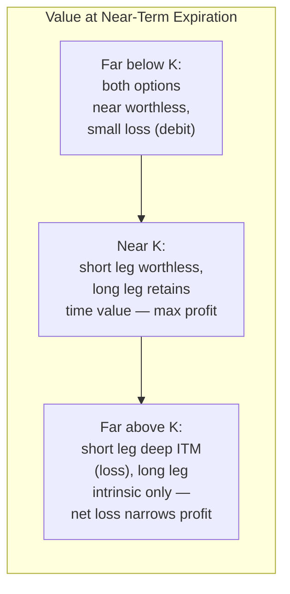

## Bull, Bear, and Calendar Spreads

### Overview

Spread strategies combine two or more options of the same underlying to shape a payoff profile with reduced cost, reduced risk, or both, relative to a single-leg position. **Vertical spreads** (bull and bear spreads) use options with the same expiration but different strikes. **Calendar spreads** (horizontal/time spreads) use options with the same strike but different expirations. Both categories trade unlimited profit or loss potential for a defined, bounded risk profile.

### Bull Call Spread (Debit Spread)

**Construction**: Buy 1 call at lower strike $K_1$, sell 1 call at higher strike $K_2$ ($K_1 < K_2$), same expiration. Net premium paid (debit) since the lower-strike call is more expensive.

$$\text{Net Debit} = c_1 - c_2, \quad c_1 > c_2$$

**Payoff at expiration**:

$$\Pi(S_T) = \max(S_T - K_1, 0) - \max(S_T - K_2, 0) - (c_1 - c_2)$$

$$\Pi(S_T) = \begin{cases} -(c_1 - c_2) & S_T \leq K_1 \\ (S_T - K_1) - (c_1 - c_2) & K_1 < S_T < K_2 \\ (K_2 - K_1) - (c_1 - c_2) & S_T \geq K_2 \end{cases}$$

**Key Points**:

- Maximum loss = net debit paid = $(c_1 - c_2)$, occurs if $S_T \leq K_1$
- Maximum profit = $(K_2 - K_1) - (c_1 - c_2)$, occurs if $S_T \geq K_2$
- Breakeven = $K_1 + (c_1 - c_2)$
- Used for a moderately bullish view; caps upside in exchange for reduced cost versus an outright long call

### Bear Put Spread (Debit Spread)

**Construction**: Buy 1 put at higher strike $K_2$, sell 1 put at lower strike $K_1$ ($K_1 < K_2$), same expiration. Net premium paid (debit).

$$\text{Net Debit} = p_2 - p_1, \quad p_2 > p_1$$

**Payoff at expiration**:

$$\Pi(S_T) = \max(K_2 - S_T, 0) - \max(K_1 - S_T, 0) - (p_2 - p_1)$$

$$\Pi(S_T) = \begin{cases} (K_2 - K_1) - (p_2 - p_1) & S_T \leq K_1 \\ (K_2 - S_T) - (p_2 - p_1) & K_1 < S_T < K_2 \\ -(p_2 - p_1) & S_T \geq K_2 \end{cases}$$

**Key Points**:

- Maximum profit = $(K_2 - K_1) - (p_2 - p_1)$, occurs if $S_T \leq K_1$
- Maximum loss = net debit = $(p_2 - p_1)$, occurs if $S_T \geq K_2$
- Breakeven = $K_2 - (p_2 - p_1)$
- Used for a moderately bearish view; caps downside profit in exchange for reduced cost versus an outright long put

### Bull Put Spread (Credit Spread)

**Construction**: Sell 1 put at higher strike $K_2$, buy 1 put at lower strike $K_1$ ($K_1 < K_2$), same expiration. Net premium received (credit) since the sold put is more expensive.

$$\text{Net Credit} = p_2 - p_1$$

**Payoff at expiration**:

$$\Pi(S_T) = (p_2 - p_1) - \max(K_2 - S_T, 0) + \max(K_1 - S_T, 0)$$

$$\Pi(S_T) = \begin{cases} (p_2 - p_1) - (K_2 - K_1) & S_T \leq K_1 \\ (p_2 - p_1) - (K_2 - S_T) & K_1 < S_T < K_2 \\ (p_2 - p_1) & S_T \geq K_2 \end{cases}$$

**Key Points**:

- This is economically equivalent in payoff shape to a bull call spread (both profit from a rising or flat market with capped risk and reward), but constructed with puts for a net credit rather than a net debit
- Maximum profit = net credit, occurs if $S_T \geq K_2$
- Maximum loss = $(K_2 - K_1) - (p_2 - p_1)$, occurs if $S_T \leq K_1$
- Breakeven = $K_2 - (p_2 - p_1)$

### Bear Call Spread (Credit Spread)

**Construction**: Sell 1 call at lower strike $K_1$, buy 1 call at higher strike $K_2$ ($K_1 < K_2$), same expiration. Net premium received (credit).

$$\text{Net Credit} = c_1 - c_2$$

**Payoff at expiration**:

$$\Pi(S_T) = (c_1 - c_2) - \max(S_T - K_1, 0) + \max(S_T - K_2, 0)$$

$$\Pi(S_T) = \begin{cases} (c_1 - c_2) & S_T \leq K_1 \\ (c_1 - c_2) - (S_T - K_1) & K_1 < S_T < K_2 \\ (c_1 - c_2) - (K_2 - K_1) & S_T \geq K_2 \end{cases}$$

**Key Points**:

- Economically equivalent in payoff shape to a bear put spread, constructed with calls for a net credit
- Maximum profit = net credit, occurs if $S_T \leq K_1$
- Maximum loss = $(K_2 - K_1) - (c_1 - c_2)$, occurs if $S_T \geq K_2$
- Breakeven = $K_1 + (c_1 - c_2)$

### Debit vs. Credit Spread Equivalence Table

| Strategy | Legs | Net Premium | Market View | Max Profit | Max Loss |
| --- | --- | --- | --- | --- | --- |
| Bull Call Spread | Long low-strike call, short high-strike call | Debit | Bullish | Capped (spread width − debit) | Capped (debit) |
| Bull Put Spread | Short high-strike put, long low-strike put | Credit | Bullish | Capped (credit) | Capped (spread width − credit) |
| Bear Put Spread | Long high-strike put, short low-strike put | Debit | Bearish | Capped (spread width − debit) | Capped (debit) |
| Bear Call Spread | Short low-strike call, long high-strike call | Credit | Bearish | Capped (credit) | Capped (spread width − credit) |

By put-call parity, the bull call spread and bull put spread at the same strikes and expiration have identical payoff diagrams; the choice between them in practice depends on which side offers better relative pricing, margin treatment, and whether the trader prefers paying a debit (defined cash outlay, no assignment risk on short legs until ITM) or collecting a credit (immediate cash inflow, assignment risk on the short leg from day one if it moves ITM).

### Payoff Diagram — Vertical Spreads (svg_diagram)

<svg xmlns="http://www.w3.org/2000/svg" viewBox="0 0 780 460">
<text x="390" y="24" text-anchor="middle" font-size="16" font-weight="bold" fill="#1a1a1a">Bull Call Spread vs Bear Put Spread — Payoff (svg_diagram)</text>
<line x1="80" y1="400" x2="740" y2="400" stroke="#333" stroke-width="1.5" />
<line x1="80" y1="60" x2="80" y2="400" stroke="#333" stroke-width="1.5" />
<text x="410" y="435" text-anchor="middle" font-size="13" fill="#333">Underlying Price at Expiration ($S_T$)</text>
<text x="30" y="230" text-anchor="middle" font-size="13" fill="#333" transform="rotate(-90 30 230)">Profit / Loss</text>
<line x1="80" y1="280" x2="740" y2="280" stroke="#999" stroke-width="1" stroke-dasharray="4,4" />
<text x="65" y="284" text-anchor="end" font-size="11" fill="#666">0</text>
<line x1="300" y1="60" x2="300" y2="400" stroke="#aaa" stroke-width="1" stroke-dasharray="3,3" />
<text x="300" y="415" text-anchor="middle" font-size="12" fill="#555">K1</text>
<line x1="520" y1="60" x2="520" y2="400" stroke="#aaa" stroke-width="1" stroke-dasharray="3,3" />
<text x="520" y="415" text-anchor="middle" font-size="12" fill="#555">K2</text>

<polyline points="100,340 300,340 520,180 740,180" fill="none" stroke="#1f6fd6" stroke-width="3" />
<text x="600" y="165" font-size="13" fill="#1f6fd6" font-weight="bold">Bull Call Spread</text>

<polyline points="100,150 300,150 520,340 740,340" fill="none" stroke="#d6291f" stroke-width="3" />
<text x="600" y="360" font-size="13" fill="#d6291f" font-weight="bold">Bear Put Spread</text>
</svg>

### Calendar Spread (Time / Horizontal Spread)

**Construction**: Sell 1 near-term option, buy 1 longer-term option, same strike $K$, same option type (both calls or both puts). Typically constructed for a net debit, since the longer-dated option has more time value.

**Mechanics**: The position profits from the differential rate of time decay (theta) between the two legs. The near-term short option decays faster than the longer-term long option (theta decay accelerates as expiration approaches, particularly for ATM options), so the spread's value tends to increase as the near-term expiration approaches, all else equal — provided the underlying remains near the strike.

**Payoff characteristics**:

- Unlike vertical spreads, the calendar spread payoff **cannot be expressed as a simple piecewise-linear function at expiration of the short leg**, because the long leg (the further-dated option) still has time value remaining at that date. The payoff must be computed via an option pricing model (e.g., Black-Scholes) applied to the remaining long option, conditional on the underlying price at the near-term expiration.
- Maximum profit is realized when the underlying is at or near the strike $K$ at the near-term expiration — the short option expires worthless (or near-worthless) while the long option retains substantial remaining time value.
- Loss is bounded by the net debit paid if both legs are eventually closed or expire, but losses can occur on either side (underlying moves too far above or below $K$) because the short leg's decay advantage diminishes while the long leg's extrinsic value also erodes with adverse moves.
- **Vega profile**: The calendar spread is net long vega (the longer-dated option has higher vega than the shorter-dated option at the same strike), making it a strategy that benefits from an increase in implied volatility, particularly in the back-month contract.

**Call Calendar vs. Put Calendar**: [Inference] At the same strike, a call calendar and put calendar spread are generally expected to behave very similarly under standard assumptions (frictionless markets, no early exercise considerations, negligible dividends), consistent with put-call parity linking same-strike, same-expiration calls and puts; in practice, results can diverge due to dividends, interest rate effects, and early-exercise risk on the short leg for American-style options.

### Calendar Spread Payoff Profile at Near-Term Expiration (Illustrative)

The characteristic "tent" shape reflects the residual time value of the long-dated leg:

### Diagonal Spread (Related Variant)

A **diagonal spread** combines elements of both vertical and calendar spreads: different strikes AND different expirations. For example, selling a near-term OTM call and buying a longer-term call at a different (often further OTM or ITM) strike. This is common in strategies like the "poor man's covered call," where a long-dated deep ITM call (acting as a stock surrogate, given its delta approaches 1) replaces outright stock ownership, against which near-term OTM calls are sold repeatedly to generate income at a fraction of the capital outlay of owning shares outright.

### Greeks Summary Across Spread Types

| Strategy | Net Delta | Net Theta | Net Vega |
| --- | --- | --- | --- |
| Bull Call Spread | Positive | Small, direction depends on strikes relative to spot | Small, near-neutral |
| Bear Put Spread | Negative | Small, direction depends on strikes relative to spot | Small, near-neutral |
| Bull Put Spread (credit) | Positive | Generally positive (net short premium) | Negative |
| Bear Call Spread (credit) | Negative | Generally positive (net short premium) | Negative |
| Calendar Spread (at strike) | Near-zero at inception if ATM | Positive (benefits from short-leg decay) | Positive (long back-month vega dominates) |

[Inference] The theta and vega signs shown for verticals are typical for spreads constructed near-the-money; the precise magnitude and even sign of net theta and vega for a given vertical spread depend on how far the strikes sit from the current underlying price and the shape of the implied volatility skew, so these should be treated as general tendencies rather than fixed rules for every strike combination.

### Worked Example — Bull Call Spread

**Setup**: Underlying at $S_0 = \$100$. Buy 1 call $K_1 = \$100$ for $c_1 = \$4.00$; sell 1 call $K_2 = \$110$ for $c_2 = \$1.50$. Net debit $= \$2.50$/share ($250 total, 1 contract = 100 shares).

- Max profit = $(110 - 100) - 2.50 = \$7.50$/share = $\$750$ total, if $S_T \geq 110$
- Max loss = $\$2.50$/share = $\$250$ total, if $S_T \leq 100$
- Breakeven = $100 + 2.50 = \$102.50$

At $S_T = \$106$: long call worth $\$6$, short call worth $\$0$ (OTM) → payoff $= 6 - 2.50 = \$3.50$/share = $\$350$ total.

### Worked Example — Calendar Spread

**Setup**: Underlying at $S_0 = \$50$. Sell 1 near-term call, $K = \$50$, 30 days to expiration, premium $c_{\text{near}} = \$1.20$. Buy 1 longer-term call, $K = \$50$, 90 days to expiration, premium $c_{\text{far}} = \$2.80$. Net debit $= \$1.60$/share.

At the 30-day mark, if $S_T = \$50$ (pinned at strike):

- Near-term call expires worthless
- Far-term call (now 60 days remaining, ATM) retains substantial time value — [Inference] a plausible re-pricing might place it in the vicinity of $\$2.00–\$2.40$/share depending on prevailing implied volatility at that time, though the exact value requires repricing under an option pricing model with the then-current volatility and rate inputs rather than a fixed assumption
- Approximate profit: remaining far-leg value minus the $\$1.60$ net debit

This example illustrates why calendar spread P&L cannot be computed with a simple closed-form payoff formula the way vertical spreads can — it depends on the volatility and pricing model inputs at the intermediate date, not just the terminal stock price.

### Risk Management and Practical Considerations

- **Vertical spreads**: Primary risks are directional (wrong-way move beyond the profitable strike range) and, for credit spreads, early assignment risk on the short leg if it goes deep ITM (particularly with American-style options near dividend dates for calls, or interest rate considerations for puts).
- **Calendar spreads**: Primary risks are volatility risk (an unexpected drop in implied volatility on the long-dated leg reduces its value more than proportionally) and large directional moves away from the strike, which erode the position's max-profit "sweet spot" advantage.
- **Pin risk**: Both bull/bear spreads and especially calendar spreads face elevated uncertainty when the underlying settles very close to a short strike at expiration, since assignment outcomes may not be known until after the position can be adjusted.
- **Liquidity**: Multi-leg spreads incur multiple bid-ask spreads; wide markets on any leg can erode the theoretical edge, particularly relevant for calendar and diagonal spreads on less liquid underlyings or further-dated expirations.

**Related Topics**:

- Iron condors and iron butterflies (combining bull put + bear call spreads)
- Diagonal spreads and the "poor man's covered call" in depth
- Ratio spreads and backspreads
- Volatility skew and term structure effects on spread pricing
- Put-call parity and synthetic position construction
- Greeks-based risk management for multi-leg positions
- Butterfly spreads (combining two verticals for a peaked payoff)
- Early exercise and assignment mechanics for American-style options