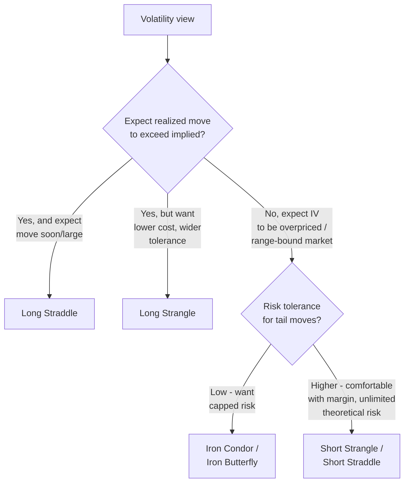

## Straddles, Strangles, and Volatility Trades

### Overview

Volatility trades are options strategies whose primary exposure is to the magnitude of underlying price movement (realized volatility) and/or the market's pricing of expected future movement (implied volatility), rather than to price direction per se. Straddles and strangles are the two foundational long/short volatility structures, built by combining calls and puts at the same expiration. Both are largely **delta-neutral at inception** (or close to it) and derive their P&L primarily from gamma, theta, and vega exposure rather than directional delta.

### Long Straddle

**Construction**: Buy 1 call and 1 put, same strike $K$ (typically ATM), same expiration. Net premium paid = $c + p$.

**Payoff at expiration**:

$$\Pi(S_T) = \max(S_T - K, 0) + \max(K - S_T, 0) - (c + p)$$

$$\Pi(S_T) = |S_T - K| - (c + p)$$

**Key Points**:

- Maximum loss = $(c + p)$, occurs only if $S_T = K$ exactly at expiration
- Unlimited profit potential in either direction (upside uncapped; downside capped at $K$ since the underlying cannot go below zero)
- Two breakevens: $K - (c+p)$ and $K + (c+p)$
- Profits from a **large move in either direction**; the market must move enough to exceed the combined premium paid
- This is a pure long volatility position: long gamma, long vega, negative theta (time decay works against the holder every day the underlying fails to move)

### Long Strangle

**Construction**: Buy 1 OTM call at strike $K_2$ and 1 OTM put at strike $K_1$ ($K_1 < S_0 < K_2$), same expiration. Net premium paid = $c + p$, generally lower than an equivalent straddle since both legs are OTM.

**Payoff at expiration**:

$$\Pi(S_T) = \max(S_T - K_2, 0) + \max(K_1 - S_T, 0) - (c + p)$$

$$\Pi(S_T) = \begin{cases} (K_1 - S_T) - (c+p) & S_T \leq K_1 \\ -(c+p) & K_1 < S_T < K_2 \\ (S_T - K_2) - (c+p) & S_T \geq K_2 \end{cases}$$

**Key Points**:

- Maximum loss = $(c+p)$, occurs anywhere in the flat zone $K_1 \leq S_T \leq K_2$ (a wider max-loss zone than a straddle's single point)
- Unlimited profit potential in either direction beyond the breakevens
- Two breakevens: $K_1 - (c+p)$ and $K_2 + (c+p)$
- Cheaper to establish than a straddle but requires a **larger move** to reach breakeven, since the strikes are already spread apart from the current price
- Same Greek exposure sign as a straddle (long gamma, long vega, negative theta), but generally smaller magnitude for the same premium outlay relative to a straddle at the same expiration

### Straddle vs. Strangle Comparison

| Dimension | Long Straddle | Long Strangle |
| --- | --- | --- |
| Strikes | Single strike, ATM | Two strikes, both OTM |
| Premium cost | Higher | Lower |
| Max loss zone | Single point ($S_T = K$) | Range ($K_1$ to $K_2$) |
| Breakeven distance from spot | Narrower | Wider |
| Move required to profit | Smaller | Larger |
| Gamma concentration | Higher, peaked at strike | Lower, spread across two strikes |
| Typical use case | Expect a large move, uncertain direction, event near current price | Cheaper bet on a large move, wider tolerance for "wrong" range |

### Short Straddle and Short Strangle

**Short Straddle**: Sell 1 call and 1 put at the same strike $K$. Payoff is the mirror image of the long straddle:

$$\Pi(S_T) = (c+p) - |S_T - K|$$

- Maximum profit = $(c+p)$ (net credit received), occurs if $S_T = K$ exactly
- **Unlimited loss potential** in either direction — this is the critical risk distinction from the long straddle
- Positive theta (income from time decay, the mirror of the long straddle's cost)
- Short gamma, short vega — the position loses value rapidly and non-linearly as the underlying moves away from $K$, and loses value if implied volatility rises

**Short Strangle**: Sell 1 OTM call and 1 OTM put. Same directional risk profile as the short straddle (unlimited loss beyond the breakevens) but with a **wider profit zone** (the range between $K_1$ and $K_2$), in exchange for a smaller net credit collected.

**Key Points (both short volatility structures)**:

- Primarily an income/premium-selling strategy, profiting from time decay and/or a decline in implied volatility, on the view that the underlying will remain range-bound
- Requires margin to support the theoretically unlimited risk (short naked options)
- Frequently paired with a hedge (converting to an **iron butterfly** or **iron condor** by buying further OTM wings) to cap the tail risk — see Related Topics

### Payoff Diagram — Straddle vs. Strangle (svg_diagram)

<svg xmlns="http://www.w3.org/2000/svg" viewBox="0 0 780 460">
<text x="390" y="24" text-anchor="middle" font-size="16" font-weight="bold" fill="#1a1a1a">Long Straddle vs Long Strangle — Payoff at Expiration (svg_diagram)</text>
<line x1="80" y1="400" x2="740" y2="400" stroke="#333" stroke-width="1.5" />
<line x1="80" y1="60" x2="80" y2="400" stroke="#333" stroke-width="1.5" />
<text x="410" y="435" text-anchor="middle" font-size="13" fill="#333">Underlying Price at Expiration ($S_T$)</text>
<text x="30" y="230" text-anchor="middle" font-size="13" fill="#333" transform="rotate(-90 30 230)">Profit / Loss</text>
<line x1="80" y1="330" x2="740" y2="330" stroke="#999" stroke-width="1" stroke-dasharray="4,4" />
<text x="65" y="334" text-anchor="end" font-size="11" fill="#666">0</text>
<line x1="410" y1="60" x2="410" y2="400" stroke="#aaa" stroke-width="1" stroke-dasharray="3,3" />
<text x="410" y="415" text-anchor="middle" font-size="12" fill="#555">K</text>
<line x1="330" y1="60" x2="330" y2="400" stroke="#ccc" stroke-width="1" stroke-dasharray="2,2" />
<text x="330" y="415" text-anchor="middle" font-size="11" fill="#777">K1</text>
<line x1="490" y1="60" x2="490" y2="400" stroke="#ccc" stroke-width="1" stroke-dasharray="2,2" />
<text x="490" y="415" text-anchor="middle" font-size="11" fill="#777">K2</text>

<polyline points="100,80 410,370 740,80" fill="none" stroke="#1f6fd6" stroke-width="3" />
<text x="600" y="105" font-size="13" fill="#1f6fd6" font-weight="bold">Long Straddle</text>

<polyline points="100,140 330,360 490,360 740,140" fill="none" stroke="#d6291f" stroke-width="3" />
<text x="600" y="160" font-size="13" fill="#d6291f" font-weight="bold">Long Strangle</text>
</svg>

### Greeks Deep Dive for Volatility Trades

**Gamma**: The rate of change of delta with respect to the underlying price. Long straddles/strangles are long gamma, meaning delta becomes increasingly positive as the underlying rises and increasingly negative as it falls — the position "self-adjusts" in the direction of the move, which is the source of profit on large moves. Gamma is highest for ATM, near-expiration options, which is why straddles are typically most gamma-intense close to expiration.

**Theta**: Time decay accelerates as expiration approaches, particularly for ATM options (the region where straddles are centered). This creates a structural tension for long straddle holders: the position needs the underlying to move, but every day that passes without a sufficient move erodes value at an accelerating rate into expiration.

**Vega**: Long straddles/strangles are long vega — their value rises with an increase in implied volatility, independent of the underlying's actual price movement. This makes them sensitive to volatility risk premium (VRP) dynamics: [Inference] since implied volatility has historically tended to trade above subsequently realized volatility across many markets and time periods, systematically long-volatility strategies like long straddles held to expiration are commonly understood to face a structural headwind from this premium, though this pattern is not guaranteed to hold in any specific period or market regime.

**Vanna and Volga** (second-order Greeks): For more advanced analysis, vanna (sensitivity of delta to volatility) and volga/vomma (sensitivity of vega to volatility) become relevant for straddles and strangles held through volatility regime changes, particularly around known event risk (earnings, macro releases). These are typically addressed in more advanced volatility trading contexts beyond basic straddle/strangle construction.

### Implied Volatility and Event-Driven Positioning

A central application of straddles and strangles is trading **implied volatility versus expected realized volatility**, particularly around known catalysts (earnings announcements, FDA decisions, macroeconomic releases):

- **Long straddle/strangle before an event**: Bet that the actual price move will exceed what is priced into the options (i.e., realized volatility will exceed implied volatility). Risk: **volatility crush** — implied volatility typically collapses sharply immediately after the event resolves (uncertainty is removed), which can cause a straddle to lose value even if the underlying moves, if the move is smaller than what was priced in.
- **Short straddle/strangle before an event**: Bet that implied volatility is overpriced relative to the likely actual move, seeking to collect elevated event-driven premium. Risk: unlimited loss if the actual move is much larger than anticipated.

**IV Rank / IV Percentile**: [Inference] Many practitioners commonly use metrics such as IV rank or IV percentile (comparing current implied volatility to its own historical range, often over the trailing 12 months) as a heuristic for whether options premium is "rich" or "cheap" before deciding between long and short volatility structures, though the appropriate lookback period and the predictive value of such metrics are debated and vary by underlying and market regime.

### Calendar/Diagonal Volatility Structures

Straddles and strangles are typically single-expiration structures, but volatility trades can also be built across expirations:

- **Double calendar**: A calendar spread (see prior chapter section) constructed with both a call calendar and a put calendar at different strikes straddling the current price — combines time decay harvesting with a wider profit range than a single calendar, while retaining long-vega exposure on the back month.
- **Term structure trades**: Positions that exploit the shape of the implied volatility term structure (e.g., selling elevated near-term IV around an event while buying relatively cheaper longer-dated IV) rather than betting on the direction of a single expiration's volatility.

### Worked Example — Long Straddle

**Setup**: Underlying at $S_0 = \$100$ ahead of an earnings release. Buy 1 ATM call, $K = \$100$, premium $c = \$4.50$. Buy 1 ATM put, $K = \$100$, premium $p = \$4.20$. Net debit = $\$8.70$/share ($870 total).

- Breakevens: $100 - 8.70 = \$91.30$ and $100 + 8.70 = \$108.70$
- The underlying must move more than **8.7%** in either direction by expiration for the position to be profitable at expiration.

**Scenario A** — Stock jumps to $S_T = \$115$ post-earnings:

- Call worth $\$15$, put worth $\$0$
- Payoff = $15 - 8.70 = \$6.30$/share = $\$630$ profit

**Scenario B** — Stock moves only to $S_T = \$103$ (smaller-than-priced-in move):

- Call worth $\$3$, put worth $\$0$
- Payoff = $3 - 8.70 = -\$5.70$/share = $\$570$ loss, despite the stock moving in a direction — illustrating the volatility crush risk

### Worked Example — Short Strangle

**Setup**: Underlying at $S_0 = \$100$, range-bound view. Sell 1 OTM call, $K_2 = \$110$, premium $c = \$1.80$. Sell 1 OTM put, $K_1 = \$90$, premium $p = \$1.60$. Net credit = $\$3.40$/share ($340 total).

- Max profit = $\$3.40$/share, if $90 \leq S_T \leq 110$
- Breakevens: $90 - 3.40 = \$86.60$ and $110 + 3.40 = \$113.40$
- Beyond these breakevens, losses are theoretically unlimited (upside) or limited only by the underlying reaching zero (downside)

### Decision Framework

### Risk Management Considerations

- **Long volatility positions** (long straddle/strangle): Defined risk (limited to premium paid), but subject to theta decay and volatility crush; position sizing should account for the likelihood that most premium is lost if no sufficient move occurs, which is common outside of major catalysts.
- **Short volatility positions** (short straddle/strangle): Undefined/large risk; require robust margin management, monitoring of gamma exposure as the underlying approaches or breaches strikes, and often a predefined stop-loss or adjustment plan (e.g., rolling the tested side, converting to a defined-risk structure) given the asymmetric payoff.
- **Assignment risk**: For short legs (in short straddles/strangles or the short legs of any spread), American-style options carry early assignment risk once ITM, which becomes more pronounced near ex-dividend dates for calls.
- **Liquidity and slippage**: Straddles/strangles require executing two legs simultaneously; in less liquid underlyings, the combined bid-ask cost of both legs can materially erode the theoretical edge of the trade, particularly for short-dated, event-driven positions where speed of execution matters.

**Next Steps**:

- Iron condors and iron butterflies (capped-risk short volatility structures)
- Volatility skew and smile — how strike-dependent IV affects strangle construction
- Implied vs. realized volatility spread trading and the volatility risk premium
- Gamma scalping and dynamic delta-hedging of long straddle positions
- Ratio spreads and backspreads as asymmetric volatility structures
- Volatility term structure and calendar-based volatility trades
- Options Greeks in depth (gamma, vega, vanna, volga)
- Earnings and event-driven options strategies