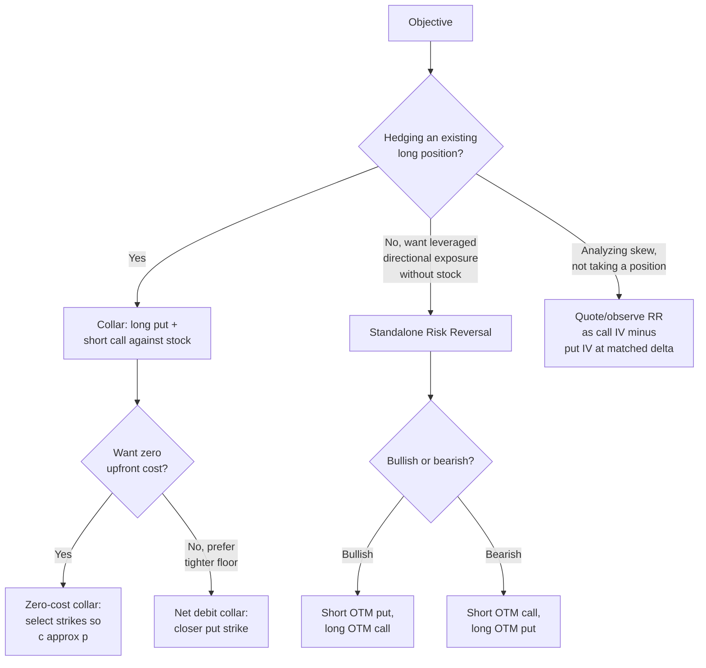

## Collars and Risk Reversals

### Overview

Collars and risk reversals are two-leg (or three-leg, including the underlying) options structures built from simultaneously buying one option and selling another of a different type at different strikes, same expiration. Both are fundamentally the same construction — long put + short call, or long call + short put — but are applied in different contexts and market views. A **collar** is applied against an existing long underlying position for hedging purposes; a **risk reversal** is typically a standalone directional or synthetic-exposure position, and the term is also used in the FX/vol markets to describe the skew relationship between OTM calls and puts.

### Collar: Construction and Payoff

**Position**: Long underlying at $S_0$, long 1 put at strike $K_p$ ($K_p < S_0$), short 1 call at strike $K_c$ ($K_c > S_0$), same expiration. This is the combination of a protective put and a covered call held simultaneously.

**Net cost** = $p - c$ (premium paid for the put minus premium received for the call). This can be a net debit, net credit, or approximately zero depending on strike selection.

**Payoff at expiration**:

$$\Pi(S_T) = (S_T - S_0) + \max(K_p - S_T, 0) - \max(S_T - K_c, 0) - (p - c)$$

$$\Pi(S_T) = \begin{cases} (K_p - S_0) - (p - c) & S_T \leq K_p \\ (S_T - S_0) - (p - c) & K_p < S_T < K_c \\ (K_c - S_0) - (p - c) & S_T \geq K_c \end{cases}$$

**Key Points**:

- Maximum loss = $(S_0 - K_p) + (p - c)$, floored at $K_p$
- Maximum profit = $(K_c - S_0) - (p - c)$, capped at $K_c$
- The position trades away upside beyond $K_c$ in exchange for downside protection below $K_p$, with the call premium subsidizing (partially or fully) the cost of the put
- Economically, a collar is a **bull put spread's mirror combined with underlying ownership** — its payoff shape between $K_p$ and $K_c$ tracks the stock 1:1, flattening outside that range on both sides

### Zero-Cost Collar

A **zero-cost collar** (also called a "costless collar") selects strikes such that the call premium received approximately equals the put premium paid:

$$c \approx p \implies \text{Net Cost} \approx 0$$

Because OTM calls and OTM puts at equal distance from spot do not generally have equal premiums (a function of volatility skew — see below), constructing a true zero-cost collar typically requires the call strike to be closer to the money than the put strike would otherwise suggest (or vice versa), given a typical downside skew common in equity index and many single-stock options markets.

**Key Points**:

- Widely used by holders of concentrated, often restricted, single-stock positions (e.g., corporate executives, founders with lock-up or trading-window constraints) to hedge downside without an immediate cash outlay
- The "cost" is opportunity cost — foregone upside beyond $K_c$ — rather than an explicit premium
- [Unverified] Regulatory and tax treatment of collars on restricted or insider-held stock (e.g., Rule 10b5-1 plan interactions, constructive sale rules under IRC §1259 in the U.S.) is jurisdiction- and fact-specific; the mechanics described here are the payoff structure only and should not be read as guidance on the legal or tax treatment of any specific collar arrangement.

### Payoff Diagram — Collar (svg_diagram)

<svg xmlns="http://www.w3.org/2000/svg" viewBox="0 0 780 440">
<text x="390" y="24" text-anchor="middle" font-size="16" font-weight="bold" fill="#1a1a1a">Collar — Payoff at Expiration (svg_diagram)</text>
<line x1="80" y1="380" x2="740" y2="380" stroke="#333" stroke-width="1.5" />
<line x1="80" y1="60" x2="80" y2="380" stroke="#333" stroke-width="1.5" />
<text x="410" y="415" text-anchor="middle" font-size="13" fill="#333">Underlying Price at Expiration ($S_T$)</text>
<text x="30" y="220" text-anchor="middle" font-size="13" fill="#333" transform="rotate(-90 30 220)">Profit / Loss</text>
<line x1="80" y1="260" x2="740" y2="260" stroke="#999" stroke-width="1" stroke-dasharray="4,4" />
<text x="65" y="264" text-anchor="end" font-size="11" fill="#666">0</text>
<line x1="280" y1="60" x2="280" y2="380" stroke="#aaa" stroke-width="1" stroke-dasharray="3,3" />
<text x="280" y="395" text-anchor="middle" font-size="12" fill="#555">Kp</text>
<line x1="540" y1="60" x2="540" y2="380" stroke="#aaa" stroke-width="1" stroke-dasharray="3,3" />
<text x="540" y="395" text-anchor="middle" font-size="12" fill="#555">Kc</text>

<polyline points="100,220 280,220 540,140 740,140" fill="none" stroke="#1f6fd6" stroke-width="3" />

<polyline points="100,340 740,60" fill="none" stroke="#999" stroke-width="1.5" stroke-dasharray="6,3" />
<text x="600" y="55" font-size="12" fill="#777">Long Stock (unhedged)</text>

<text x="150" y="205" font-size="11" fill="`#1f6fd6`">Floor</text>

<text x="620" y="125" font-size="11" fill="`#1f6fd6`">Cap</text>

</svg>

### Risk Reversal: Standalone Directional Structure

**Construction (bullish risk reversal)**: Sell 1 OTM put at $K_1$, buy 1 OTM call at $K_2$ ($K_1 < S_0 < K_2$), same expiration, **without** an underlying position. This is a risk reversal used as a standalone leveraged directional bet.

**Payoff at expiration**:

$$\Pi(S_T) = \max(S_T - K_2, 0) - \max(K_1 - S_T, 0) - (c - p)$$

$$\Pi(S_T) = \begin{cases} -(K_1 - S_T) - (c-p) & S_T \leq K_1 \\ -(c-p) & K_1 < S_T < K_2 \\ (S_T - K_2) - (c-p) & S_T \geq K_2 \end{cases}$$

**Key Points**:

- Structurally identical in shape to a collar's payoff diagram, but **without** the underlying stock leg netted in — it is a synthetic, leveraged proxy for a long stock position with a capped floor trade-off
- By put-call parity, a risk reversal (long call + short put, same strike, no stock) collapses toward a synthetic long forward/stock position as the strikes converge to the same value $K_1 = K_2$
- **Unlimited loss potential below $K_1$** (from the short put) if held without an underlying hedge, distinguishing standalone risk reversals from collars, where the underlying's long position offsets the short put's downside
- Often used as a capital-efficient way to express a bullish (or bearish, if legs reversed) view with less upfront premium than an outright long call, financed by selling the corresponding put

**Bearish risk reversal**: Mirror construction — sell 1 OTM call, buy 1 OTM put, expressing a bearish/hedging view without holding a short stock position outright.

### Risk Reversal as a Volatility Skew Metric

In derivatives and FX markets, "risk reversal" also refers to a **quoted volatility spread**, not just a position:

$$\text{RR}(\Delta) = \sigma_{\text{call}}(\Delta) - \sigma_{\text{put}}(\Delta)$$

where $\sigma_{\text{call}}(\Delta)$ and $\sigma_{\text{put}}(\Delta)$ are the implied volatilities of an OTM call and OTM put at the same delta magnitude (commonly 25-delta in FX and equity index vol quoting conventions).

**Key Points**:

- A **negative risk reversal** (put IV > call IV) is typical in equity index markets, reflecting persistent demand for downside protection (the "volatility skew" or "smirk") — puts trade at a volatility premium relative to calls of equivalent delta
- A **positive risk reversal** (call IV > put IV) is more commonly observed in certain commodity markets (e.g., some agricultural or energy contracts) where upside price spikes are the primary tail risk being hedged
- This skew is precisely why constructing a genuinely zero-cost equity collar typically requires asymmetric strike distances from spot (the put, carrying higher implied volatility, is relatively more expensive per unit of OTM-ness than the call)
- [Inference] The specific numerical level and even sign of the risk reversal for a given underlying and tenor is empirical, time-varying, and dependent on prevailing market conditions and positioning; it should be sourced from current market data rather than assumed from general skew patterns

### Collar vs. Risk Reversal Comparison

| Dimension | Collar | Risk Reversal (standalone) |
| --- | --- | --- |
| Underlying position | Long (required) | None |
| Downside protection | Floored via long put | Short put — unlimited loss if uncovered |
| Upside | Capped via short call | Uncapped above $K_2$ (long call) |
| Primary use case | Hedging existing holdings | Leveraged directional exposure, or skew trading |
| Net premium | Debit, credit, or ~zero (tunable) | Typically financed by the put leg |
| Risk without stock | N/A (stock provides the floor) | Substantial — short put is naked |

### Strike Selection and Skew Interaction

**For collars**:

- Wider strike spacing ($K_p$ further below spot, $K_c$ further above) reduces both the cost of protection and the cap on upside participation, but leaves a larger uninsured drawdown zone between spot and $K_p$
- Because of typical downside skew, moving $K_p$ closer to spot (buying more protection) increases put cost disproportionately relative to how much call premium is gained by moving $K_c$ closer to spot — this skew asymmetry is the practical reason zero-cost collars often have a call strike noticeably closer to spot than the put strike, rather than symmetric distances

**For risk reversals as skew trades**:

- Selling the put and buying the call, or vice versa, implicitly expresses a view on the skew itself (whether the current RR level is too steep or too flat relative to expectations), independent of a pure directional view on the underlying

### Decision Flow

### Worked Example — Zero-Cost Collar

**Setup**: Investor holds 1,000 shares at $S_0 = \$80$, wants downside protection with no net premium outlay. Market data: 60-day $K_p = \$72$ put trades at $p = \$2.10$; to offset this, the investor finds that a 60-day $K_c = \$88$ call trades at $c = \$2.05$ (close enough to treat as approximately zero-cost).

- Net cost ≈ $\$0.05$/share (negligible debit) × 1,000 shares ≈ $\$50$
- Floor: portfolio value protected at $\$72 \times 1{,}000 = \$72{,}000$ minimum (before the negligible net debit)
- Cap: upside capped at $\$88 \times 1{,}000 = \$88{,}000$

**Scenario A** — Stock falls to $S_T = \$60$:

- Stock loss: $(60-80) \times 1{,}000 = -\$20{,}000$
- Put payoff: $(72-60) \times 1{,}000 = +\$12{,}000$
- Net position value change: $-\$20{,}000 + \$12{,}000 - \$50 \approx -\$8{,}050$ (vs. $-\$20{,}000$ unhedged)

**Scenario B** — Stock rises to $S_T = \$95$:

- Stock gain: $(95-80) \times 1{,}000 = +\$15{,}000$
- Call assigned, caps gain at $K_c = 88$: effective gain $(88-80) \times 1{,}000 - 50 = \$7{,}950$ (vs. $\$15{,}000$ unhedged — the cost of the free protection)

### Worked Example — Bullish Risk Reversal (Standalone)

**Setup**: Underlying at $S_0 = \$50$, no stock position. Sell 1 put, $K_1 = \$45$, premium $p = \$1.30$. Buy 1 call, $K_2 = \$55$, premium $c = \$1.10$. Net credit = $\$0.20$/share (put sold for more than call cost, common when downside skew is present).

- Breakeven above $K_2$: $55 + 0.20 = \$55.20$ region begins uncapped profit; more precisely, profit = $(S_T - 55) + 0.20$ for $S_T > 55$
- Flat zone between $\$45$ and $\$55$: position holds $+\$0.20$/share (the small net credit) regardless of where price settles in between
- Below $\$45$: loss = $(45 - S_T) - 0.20$, growing linearly and without limit as $S_T \to 0$ — this is the uncovered risk that distinguishes the standalone risk reversal from a collar

### Risk Management Considerations

- **Collars**: The floor is only as good as the put strike selected; a collar does not eliminate all downside, only downside beyond $K_p$. Assignment risk exists on the short call leg (particularly near ex-dividend dates for American-style calls). Rolling a collar (closing and re-establishing at new strikes/expirations as the underlying moves or time passes) is common practice to maintain a hedge over an extended holding period, which layers transaction costs and potential premium drag over time.
- **Standalone risk reversals**: The short put leg carries substantial, in principle unlimited (down to zero), uncollateralized risk if not covered by an offsetting position — margin requirements reflect this. This structure should not be conflated with a collar's risk profile, since the protective "floor" that a collar gets from actual stock ownership is absent.
- **Skew risk**: Both structures are sensitive to changes in the volatility skew itself, not just the level of implied volatility or the underlying price — a steepening or flattening of skew after the position is established can affect the relative value of the two legs independent of price movement.

**Related Topics**:

- Iron condors and iron butterflies (defined-risk premium-selling structures)
- Put-call parity and synthetic position construction
- Volatility skew and smile modeling
- Structured products using collar-like payoffs (e.g., principal-protected notes, buffered ETFs)
- Delta-hedging and dynamic risk management for options books
- Corporate hedging programs and 10b5-1 plan interactions with collars
- FX risk reversal quoting conventions and cross-currency applications