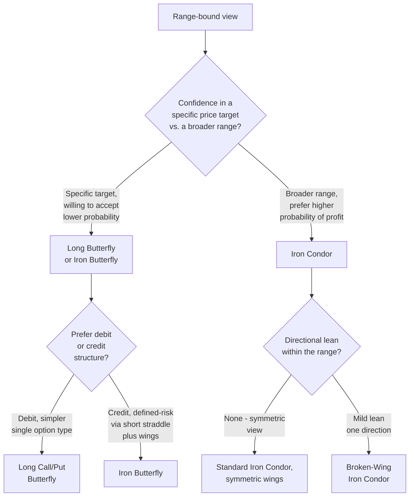

## Butterfly and Condor Structures

### Overview

Butterflies and condors are multi-leg (3- and 4-leg, respectively) options structures that combine two vertical spreads to produce a bounded, non-monotonic payoff profile with a defined maximum profit zone. Unlike straddles/strangles (pure volatility bets with unlimited risk on the short side) or simple vertical spreads (monotonic capped payoffs), butterflies and condors are designed to profit from the underlying **settling within a specific range**, with strictly limited risk on both sides. They can be constructed for either a net debit (long volatility-contraction bet) or a net credit (short volatility bet, economically similar to an iron version).

### Long Call Butterfly

**Construction**: Buy 1 call at $K_1$, sell 2 calls at $K_2$, buy 1 call at $K_3$, where $K_1 < K_2 < K_3$ and typically $K_2 - K_1 = K_3 - K_2$ (equal wing widths). Same expiration. Net debit paid.

$$\text{Net Debit} = c_1 - 2c_2 + c_3$$

**Payoff at expiration**:

$$\Pi(S_T) = \max(S_T - K_1, 0) - 2\max(S_T - K_2, 0) + \max(S_T - K_3, 0) - (c_1 - 2c_2 + c_3)$$

Piecewise:

$$\Pi(S_T) = \begin{cases} -\text{Net Debit} & S_T \leq K_1 \\ (S_T - K_1) - \text{Net Debit} & K_1 < S_T \leq K_2 \\ (K_3 - S_T) - \text{Net Debit} & K_2 < S_T < K_3 \\ -\text{Net Debit} & S_T \geq K_3 \end{cases}$$

**Key Points**:

- Maximum profit = $(K_2 - K_1) - \text{Net Debit}$, occurs precisely at $S_T = K_2$
- Maximum loss = Net Debit, occurs if $S_T \leq K_1$ or $S_T \geq K_3$
- Two breakevens: $K_1 + \text{Net Debit}$ and $K_3 - \text{Net Debit}$
- Economically equivalent to a long bull call spread ($K_1/K_2$) combined with a short bear call spread ($K_2/K_3$) — the position is long the lower spread and short the upper spread, both centered on $K_2$
- Represents a bet that the underlying will settle **near $K_2$** at expiration — a low-cost, defined-risk way to express a narrow-range price target

### Long Put Butterfly

**Construction**: Buy 1 put at $K_1$, sell 2 puts at $K_2$, buy 1 put at $K_3$, $K_1 < K_2 < K_3$, equal wing widths, same expiration. Net debit paid.

By put-call parity, a put butterfly at the same strikes and expiration produces an **identical payoff diagram** to a call butterfly — the max profit point, breakevens, and risk/reward are the same; the difference lies only in which options are used to construct it (relevant for pricing efficiency, margin, and assignment risk considerations).

### Iron Butterfly

**Construction**: Sell 1 ATM put at $K_2$, sell 1 ATM call at $K_2$ (same strike — this is a short straddle), buy 1 OTM put at $K_1$ ($K_1 < K_2$), buy 1 OTM call at $K_3$ ($K_3 > K_2$). Net **credit** received (the short straddle premium exceeds the cost of the protective wings).

$$\text{Net Credit} = (p_2 + c_2) - (p_1 + c_3)$$

**Payoff at expiration** — identical shape to the long call/put butterfly above, but expressed as a credit structure:

$$\Pi(S_T) = \begin{cases} -(K_2 - K_1) + \text{Net Credit} & S_T \leq K_1 \\ \text{Net Credit} - (K_2 - S_T) & K_1 < S_T \leq K_2 \\ \text{Net Credit} - (S_T - K_2) & K_2 < S_T < K_3 \\ -(K_3 - K_2) + \text{Net Credit} & S_T \geq K_3 \end{cases}$$

**Key Points**:

- Maximum profit = Net Credit, occurs at $S_T = K_2$
- Maximum loss = wing width minus Net Credit (i.e., $(K_2 - K_1) - \text{Net Credit}$, assuming symmetric wings), occurs at either tail
- The **iron butterfly is payoff-equivalent to the long butterfly** (call or put version) at the same strikes — it is simply constructed with a short straddle plus protective wings rather than a single option type across all three strikes, primarily differing in margin treatment (defined-risk credit structure vs. debit structure) and which legs are ITM/OTM at inception

### Payoff Diagram — Long Butterfly (svg_diagram)

<svg xmlns="http://www.w3.org/2000/svg" viewBox="0 0 780 440">
<text x="390" y="24" text-anchor="middle" font-size="16" font-weight="bold" fill="#1a1a1a">Long Butterfly — Payoff at Expiration (svg_diagram)</text>
<line x1="80" y1="380" x2="740" y2="380" stroke="#333" stroke-width="1.5" />
<line x1="80" y1="60" x2="80" y2="380" stroke="#333" stroke-width="1.5" />
<text x="410" y="415" text-anchor="middle" font-size="13" fill="#333">Underlying Price at Expiration ($S_T$)</text>
<text x="30" y="220" text-anchor="middle" font-size="13" fill="#333" transform="rotate(-90 30 220)">Profit / Loss</text>
<line x1="80" y1="340" x2="740" y2="340" stroke="#999" stroke-width="1" stroke-dasharray="4,4" />
<text x="65" y="344" text-anchor="end" font-size="11" fill="#666">0</text>
<line x1="230" y1="60" x2="230" y2="380" stroke="#ccc" stroke-width="1" stroke-dasharray="2,2" />
<text x="230" y="395" text-anchor="middle" font-size="11" fill="#777">K1</text>
<line x1="410" y1="60" x2="410" y2="380" stroke="#aaa" stroke-width="1" stroke-dasharray="3,3" />
<text x="410" y="395" text-anchor="middle" font-size="12" fill="#555">K2</text>
<line x1="590" y1="60" x2="590" y2="380" stroke="#ccc" stroke-width="1" stroke-dasharray="2,2" />
<text x="590" y="395" text-anchor="middle" font-size="11" fill="#777">K3</text>

<polyline points="100,320 230,320 410,120 590,320 740,320" fill="none" stroke="#1f6fd6" stroke-width="3" />
<text x="450" y="105" text-anchor="middle" font-size="13" fill="#1f6fd6" font-weight="bold">Max profit at K2</text>
</svg>

### Iron Condor

**Construction**: Sell 1 OTM put at $K_2$, buy 1 further OTM put at $K_1$ ($K_1 < K_2$) — a bull put spread — combined with sell 1 OTM call at $K_3$, buy 1 further OTM call at $K_4$ ($K_3 < K_4$) — a bear call spread. Four distinct strikes: $K_1 < K_2 < K_3 < K_4$. Net **credit** received.

$$\text{Net Credit} = (p_2 - p_1) + (c_3 - c_4)$$

**Payoff at expiration**:

$$\Pi(S_T) = \begin{cases} -(K_2 - K_1) + \text{Net Credit} & S_T \leq K_1 \\ \text{Net Credit} - (K_2 - S_T) & K_1 < S_T \leq K_2 \\ \text{Net Credit} & K_2 < S_T < K_3 \\ \text{Net Credit} - (S_T - K_3) & K_3 \leq S_T < K_4 \\ -(K_4 - K_3) + \text{Net Credit} & S_T \geq K_4 \end{cases}$$

**Key Points**:

- Maximum profit = Net Credit, occurs anywhere in the **flat zone** $K_2 \leq S_T \leq K_3$ (a range, unlike the butterfly's single-point maximum)
- Maximum loss = wing width minus Net Credit (assuming symmetric wings, $(K_2-K_1) - \text{Net Credit}$), occurs at either tail beyond $K_1$ or $K_4$
- Two breakevens: $K_2 - \text{Net Credit}$ and $K_3 + \text{Net Credit}$
- The defined-risk equivalent of a short strangle — combines a short strangle (short $K_2$ put, short $K_3$ call) with long further-OTM wings ($K_1$ put, $K_4$ call) purchased purely for risk containment

### Iron Butterfly vs. Iron Condor Comparison

| Dimension | Iron Butterfly | Iron Condor |
| --- | --- | --- |
| Short strikes | Same strike ($K_2$, short straddle) | Different strikes ($K_2$ put, $K_3$ call, short strangle) |
| Max profit zone | Single point ($S_T = K_2$) | Range ($K_2$ to $K_3$) |
| Net credit received | Higher (ATM short straddle) | Lower (OTM short strangle) |
| Probability of max profit | Lower (requires pinning exactly at $K_2$) | Higher (wider range of acceptable outcomes) |
| Max loss (given equal wing widths) | Higher relative to width | Lower relative to width |
| Gamma risk near short strikes | Higher, concentrated at one point | Lower, spread across two strikes |

### Broken-Wing (Skip-Strike) Butterflies and Condors

A **broken-wing butterfly** uses unequal distances between strikes (e.g., $K_2 - K_1 \neq K_3 - K_2$), which shifts the risk/reward asymmetrically — commonly constructed so that one side has no risk (or even a small credit) if the underlying moves in the "wrong" direction, at the cost of a larger loss if it moves in the unprotected direction. This converts a purely range-bound structure into one with a mild directional tilt while retaining a defined-risk, reduced-cost profile relative to a standard vertical spread.

[Inference] Broken-wing structures are generally understood as a way to reduce or eliminate the debit (or increase the credit) on one side of a butterfly/condor in exchange for accepting a specific, quantifiable directional risk; the precise strike selection depends on the trader's directional lean and the prevailing skew, and should be evaluated per-trade rather than through a fixed rule of thumb.

### Greeks Summary

| Structure | Net Delta (centered) | Net Gamma | Net Theta | Net Vega |
| --- | --- | --- | --- | --- |
| Long Butterfly | ~0 at $K_2$ | Negative near $K_2$ | Positive (benefits from time decay pinning toward $K_2$) | Negative |
| Iron Butterfly | ~0 at $K_2$ | Negative near $K_2$ | Positive | Negative |
| Iron Condor | ~0 between $K_2$/$K_3$ | Negative, smaller magnitude than butterfly | Positive | Negative |

**Key Points**:

- All four structures share the same broad Greek signature: **short gamma, short vega, long theta** in the profit zone — they are, in aggregate, short-volatility structures that benefit from the underlying remaining range-bound and from time decay/IV contraction
- The iron condor's Greeks are generally "softer" (lower magnitude gamma and vega near the center) than the iron butterfly's, because its short strikes are spread apart rather than stacked at a single point — this is the source of its wider, more forgiving profit zone but smaller maximum credit

### Worked Example — Long Call Butterfly

**Setup**: Underlying at $S_0 = \$100$. Buy 1 call $K_1=\$95$ for $c_1=\$7.00$; sell 2 calls $K_2=\$100$ for $c_2=\$4.00$ each; buy 1 call $K_3=\$105$ for $c_3=\$2.00$.

$$\text{Net Debit} = 7.00 - 2(4.00) + 2.00 = \$1.00/\text{share}$$

- Max profit = $(100-95) - 1.00 = \$4.00$/share = $\$400$, if $S_T = \$100$ exactly
- Max loss = $\$1.00$/share = $\$100$, if $S_T \leq 95$ or $S_T \geq 105$
- Breakevens: $95 + 1 = \$96$ and $105 - 1 = \$104$

At $S_T = \$102$: payoff $= (105 - 102) - 1.00 = \$2.00$/share = $\$200$ profit.

### Worked Example — Iron Condor

**Setup**: Underlying at $S_0 = \$100$. Sell put $K_2=\$95$ for $p_2=\$1.80$; buy put $K_1=\$90$ for $p_1=\$0.70$; sell call $K_3=\$105$ for $c_3=\$1.60$; buy call $K_4=\$110$ for $c_4=\$0.60$.

$$\text{Net Credit} = (1.80 - 0.70) + (1.60 - 0.60) = \$2.10/\text{share}$$

- Max profit = $\$2.10$/share = $\$210$, if $95 \leq S_T \leq 105$
- Max loss on either wing (assuming symmetric $5-wide wings) = $5 - 2.10 = \$2.90$/share = $\$290$, if $S_T \leq 90$ or $S_T \geq 110$
- Breakevens: $95 - 2.10 = \$92.90$ and $105 + 2.10 = \$107.10$
- Probability of max profit is generally higher than the butterfly example above, since the flat zone spans $\$95$–$\$105$ rather than requiring a pin at a single point

### Selection Framework

### Risk Management Considerations

- **Pin risk**: Both butterflies and iron butterflies concentrate maximum profit at or very near a single strike; last-minute moves close to expiration can swing the outcome significantly, and assignment uncertainty on ATM short legs at expiration is a practical execution risk.
- **Commission and execution drag**: With 3–4 legs, transaction costs (commissions plus bid-ask slippage across each leg) represent a larger proportional drag on these structures than on single- or two-leg positions, particularly for butterflies with a small net debit/credit relative to the number of legs traded.
- **Early assignment on short legs**: The short legs of an iron butterfly or iron condor (particularly ITM puts near ex-dividend dates, or any leg that moves ITM before expiration) carry early assignment risk for American-style options, which can disrupt the intended defined-risk structure if one leg is assigned while others remain open.
- **Adjustment and management**: Common practical approaches include closing the position early to capture a portion of maximum profit once a large fraction of it has been realized (rather than holding to expiration for pin risk reasons), or rolling a tested side (the wing closest to being breached) to adjust the range — [Inference] specific management rules (e.g., closing at 50% of max profit) are common practitioner heuristics rather than guaranteed optimal outcomes, and their effectiveness depends on transaction costs and the specific underlying's behavior.
- **Margin treatment**: Because these are defined-risk credit or debit structures with clearly bounded maximum loss, they typically receive more favorable margin treatment than undefined-risk structures like naked short strangles, an important practical consideration for capital efficiency.

**Next Steps**:

- Broken-wing butterfly construction and directional-tilt sizing
- Ratio spreads and backspreads (related asymmetric multi-leg structures)
- Volatility skew and its effect on iron condor strike selection
- Greeks-based position management for multi-leg, multi-strike structures
- Calendar and diagonal variations of butterflies (double diagonals)
- Probability of profit (POP) estimation using delta as a proxy
- Adjustment and rolling techniques for tested iron condors
- Margin and capital efficiency comparisons across defined-risk strategies