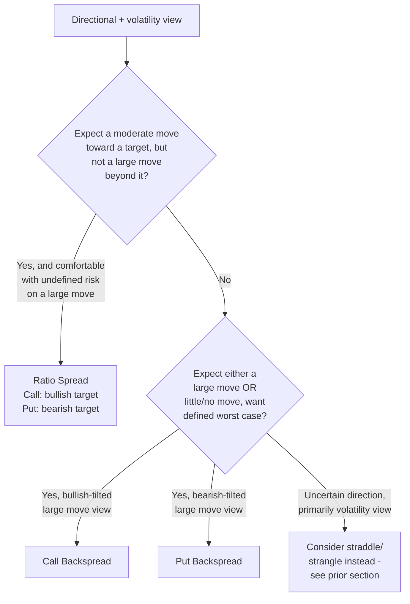

## Ratio Spreads and Backspreads

### Overview

Ratio spreads and backspreads are multi-leg options structures built from an unequal number of long and short options at different strikes, same expiration. Unlike vertical spreads (1:1 ratio), these structures deliberately use an unbalanced ratio — commonly 1:2, 2:3, or similar — to create asymmetric payoff profiles that combine directional exposure with a volatility view. A **ratio spread** typically sells more options than it buys (net short premium/gamma beyond a certain point), while a **backspread** typically buys more options than it sells (net long premium/gamma beyond a certain point). Both are extensions of the vertical spread concept, and both can carry undefined risk on one side, distinguishing them from the defined-risk butterflies and condors.

### Call Ratio Spread (Front Spread)

**Construction**: Buy 1 call at lower strike $K_1$, sell 2 (or more) calls at higher strike $K_2$ ($K_1 < K_2$), same expiration. The most common ratio is 1:2.

$$\text{Net Premium} = c_1 - 2c_2$$

This can be a net debit, net credit, or approximately zero, depending on strikes chosen and the skew of implied volatility between $K_1$ and $K_2$.

**Payoff at expiration**:

$$\Pi(S_T) = \max(S_T - K_1, 0) - 2\max(S_T - K_2, 0) - \text{Net Premium}$$

$$\Pi(S_T) = \begin{cases} -\text{Net Premium} & S_T \leq K_1 \\ (S_T - K_1) - \text{Net Premium} & K_1 < S_T \leq K_2 \\ (K_1 + 2K_2 - 2S_T) - \text{Net Premium}\ \text{(equivalently)} \; (K_2-K_1)-(S_T-K_2)-\text{Net Premium} & S_T > K_2 \end{cases}$$

**Key Points**:

- Maximum profit occurs precisely at $S_T = K_2$, equal to $(K_2 - K_1) - \text{Net Premium}$
- Below $K_1$: bounded loss/gain equal to $-\text{Net Premium}$ (small, since all options expire worthless)
- Above $K_2$: the position becomes **net short one call** beyond $K_2$ (2 short calls vs. 1 long call), so losses grow **unbounded** as $S_T \to \infty$
- This is the critical risk distinguishing a ratio spread from a butterfly: **the extra short option beyond the second wing is naked**, since there is no third long option to cap the far side
- Used for a moderately bullish view where the trader expects the underlying to rise toward $K_2$ but not dramatically beyond it — profits from a rise into the zone, with willingness to accept unlimited risk on an extreme rally

### Put Ratio Spread

**Construction (mirror of the call ratio spread)**: Buy 1 put at higher strike $K_2$, sell 2 (or more) puts at lower strike $K_1$ ($K_1 < K_2$), same expiration.

**Key Points**:

- Maximum profit occurs at $S_T = K_1$
- Above $K_2$: bounded loss equal to net premium
- Below $K_1$: net short one put, so losses grow **unbounded** as $S_T \to 0$ (bounded only by the underlying's floor at zero, but can still be very large)
- Used for a moderately bearish view — profit from a decline toward $K_1$, with unlimited-in-principle risk (down to zero) if the decline is much larger than expected

### Payoff Diagram — Call Ratio Spread 1:2 (svg_diagram)

<svg xmlns="http://www.w3.org/2000/svg" viewBox="0 0 780 440">
<text x="390" y="24" text-anchor="middle" font-size="16" font-weight="bold" fill="#1a1a1a">Call Ratio Spread (1:2) — Payoff at Expiration (svg_diagram)</text>
<line x1="80" y1="380" x2="740" y2="380" stroke="#333" stroke-width="1.5" />
<line x1="80" y1="60" x2="80" y2="380" stroke="#333" stroke-width="1.5" />
<text x="410" y="415" text-anchor="middle" font-size="13" fill="#333">Underlying Price at Expiration ($S_T$)</text>
<text x="30" y="220" text-anchor="middle" font-size="13" fill="#333" transform="rotate(-90 30 220)">Profit / Loss</text>
<line x1="80" y1="300" x2="740" y2="300" stroke="#999" stroke-width="1" stroke-dasharray="4,4" />
<text x="65" y="304" text-anchor="end" font-size="11" fill="#666">0</text>
<line x1="300" y1="60" x2="300" y2="380" stroke="#aaa" stroke-width="1" stroke-dasharray="3,3" />
<text x="300" y="395" text-anchor="middle" font-size="12" fill="#555">K1</text>
<line x1="480" y1="60" x2="480" y2="380" stroke="#aaa" stroke-width="1" stroke-dasharray="3,3" />
<text x="480" y="395" text-anchor="middle" font-size="12" fill="#555">K2</text>

<polyline points="100,290 300,290 480,170 740,370" fill="none" stroke="#1f6fd6" stroke-width="3" />
<text x="420" y="150" text-anchor="middle" font-size="13" fill="#1f6fd6" font-weight="bold">Max profit at K2</text>
<text x="640" y="390" text-anchor="middle" font-size="11" fill="#d6291f">Unbounded loss beyond K2</text>
</svg>

### Call Backspread (Reverse Ratio Spread)

**Construction**: Sell 1 call at lower strike $K_1$, buy 2 (or more) calls at higher strike $K_2$ ($K_1 < K_2$), same expiration — the inverse ratio of the front spread. Commonly constructed for a small net credit or near-zero cost by choosing strikes such that $c_1 \approx 2c_2$, leveraging the fact that the lower-strike call sold is more valuable per unit than each higher-strike call purchased.

$$\text{Net Premium} = c_1 - 2c_2$$

**Payoff at expiration**:

$$\Pi(S_T) = -\max(S_T - K_1, 0) + 2\max(S_T - K_2, 0) - \text{Net Premium}$$

$$\Pi(S_T) = \begin{cases} -\text{Net Premium} & S_T \leq K_1 \\ -(S_T - K_1) - \text{Net Premium} & K_1 < S_T \leq K_2 \\ (S_T - K_2) - (S_T - K_1) - \text{Net Premium} \; \text{simplified as growing linearly} & S_T > K_2 \end{cases}$$

**Key Points**:

- If established for a net credit ($c_1 > 2c_2$), the position profits (or at minimum breaks even at the credit amount) both far below $K_1$ **and** far above $K_2$ — the "worst case" is a moderate rise that stalls near $K_2$, the mirror-image risk zone of the ratio spread
- Maximum loss occurs at $S_T = K_2$, equal to $-(K_2 - K_1) - \text{Net Premium}$ (or $+\text{Net Premium} - (K_2-K_1)$ depending on sign convention), which is **bounded** — unlike the ratio spread's unbounded loss side, the backspread's worst case is capped
- Above $K_2$: net long one call, so gains grow **unbounded** as $S_T \to \infty$
- Below $K_1$: bounded gain/loss equal to net premium (small, potentially a small profit if established for a credit)
- This is fundamentally a **long volatility** structure with a directional (bullish) tilt — it wants either a large rally or, if established for a credit, is comfortable with the underlying going nowhere or falling, and its worst outcome is a moderate, stalled rise

### Put Backspread

**Construction (mirror of the call backspread)**: Sell 1 put at higher strike $K_2$, buy 2 (or more) puts at lower strike $K_1$ ($K_1 < K_2$), same expiration.

**Key Points**:

- Unbounded profit potential on a large decline (down toward zero)
- Bounded, defined maximum loss at $S_T = K_1$ (the "moderate decline that stalls" scenario)
- Small bounded gain/loss above $K_2$ if established for a net credit
- This is a **long volatility, bearish-tilted** structure — the mirror image of the call backspread, generally used when a trader expects either a sharp decline or a flat-to-rising market, but wants protection against the "worst case" of a moderate, stalled decline

### Ratio Spread vs. Backspread Comparison

| Dimension | Ratio Spread (Front Spread) | Backspread |
| --- | --- | --- |
| Option count | Buy fewer, sell more | Buy more, sell fewer |
| Max profit location | At the short strike ($K_2$ for calls) | Beyond the long strikes (unbounded) |
| Worst-case scenario | Large move past the short strike (unbounded loss) | Moderate move that stalls near the short strike (bounded loss) |
| Net Greek exposure near strikes | Net short gamma, net short vega beyond short strike | Net long gamma, net long vega beyond long strikes |
| Underlying view | Moderately directional, expects move toward — not past — target | Large move expected, or hedge against a large move; comfortable with "no move" |
| Risk profile | Undefined risk on the far side | Defined max loss; unbounded profit on far side |

### Greeks and Volatility Exposure

**Ratio spreads**: In the zone beyond the short strikes, the position is net short options, making it **net short gamma and net short vega** in that region — it benefits from time decay and declining implied volatility once past the max-profit point, but suffers accelerating losses (delta moves against the position rapidly) if the underlying continues moving through and beyond that zone.

**Backspreads**: In the zone beyond the long strikes, the position is net long options, making it **net long gamma and net long vega** in that region — the extra long option provides convexity that a simple vertical spread lacks, which is the source of the unbounded profit potential. Near the "trough" (around the short strike), the position can be closer to short gamma/vega on a smaller scale, which is why the bounded maximum loss occurs there rather than at the extremes.

[Inference] Because ratio spreads and backspreads combine long and short options of different strikes with unequal counts, their net Greek exposures are strike- and skew-dependent in ways that are harder to generalize than for symmetric structures like straddles or butterflies; precise sensitivities should be computed from the specific strikes, expiration, and prevailing implied volatilities of the position rather than assumed from the general directional tendencies described here.

### Skew and the "Free" or Credit Ratio/Backspread

Because OTM options at different strikes typically carry different implied volatilities (skew), it is sometimes possible to construct a ratio spread or backspread where the premium collected from the additional short (or sold) leg(s) offsets, or more than offsets, the cost of the long leg(s), producing a net credit or zero-cost structure. This is a key practical reason these strategies are used — skew-aware strike selection can materially change the breakeven and cost profile relative to what a flat-volatility assumption would suggest.

[Inference] The specific strike combinations that produce a credit or zero-cost ratio spread or backspread depend on the shape of the volatility skew for the particular underlying and expiration at the time of trade construction; such combinations are not fixed and must be evaluated against live market pricing rather than assumed to exist for any given underlying.

### Worked Example — Call Ratio Spread (1:2)

**Setup**: Underlying at $S_0 = \$50$. Buy 1 call $K_1=\$50$ for $c_1=\$2.50$; sell 2 calls $K_2=\$55$ for $c_2=\$1.00$ each.

$$\text{Net Premium} = 2.50 - 2(1.00) = \$0.50 \text{ (net debit)}$$

- Max profit at $S_T = 55$: $(55-50) - 0.50 = \$4.50$/share = $\$450$
- At $S_T = 45$ (below $K_1$): payoff $= -0.50$/share = $-\$50$
- At $S_T = 65$ (well above $K_2$): long call worth $15$, short calls (2×) worth $2 \times 10 = 20$; payoff $= 15 - 20 - 0.50 = -\$5.50$/share = $-\$550$ and continuing to worsen as $S_T$ rises further — illustrating the unbounded loss on a large rally

### Worked Example — Call Backspread (1:2)

**Setup**: Underlying at $S_0 = \$50$. Sell 1 call $K_1=\$50$ for $c_1=\$2.60$; buy 2 calls $K_2=\$55$ for $c_2=\$1.20$ each.

$$\text{Net Premium} = 2.60 - 2(1.20) = \$0.20 \text{ (net credit)}$$

- At $S_T \leq 50$: all calls worthless, position keeps the $\$0.20$/share credit = $\$20$ profit
- Max loss at $S_T = 55$: $-(55-50) + 0.20 = -\$4.80$/share = $-\$480$ (bounded worst case)
- At $S_T = 65$: short call worth $15$ (loss), 2 long calls worth $2 \times 10 = 20$ (gain); payoff $= -15 + 20 + 0.20 = \$5.20$/share = $\$520$ and continuing to grow as $S_T$ rises further — illustrating unbounded upside

### Selection Framework

### Risk Management Considerations

- **Ratio spreads carry undefined risk** beyond the short strikes; because the risk is asymmetric and can be substantial, position sizing and margin requirements should account for the theoretically unbounded (call side) or very large (put side, bounded by zero) loss potential — this is a materially different risk category from defined-risk structures like butterflies and condors.
- **Backspreads have a defined, calculable maximum loss** located at the short strike, making risk easier to quantify upfront, but require a genuinely large move to realize the unbounded profit potential — a moderate, drifting market that settles near the short strike produces the worst outcome, not the best.
- **Skew dependency**: Because these structures rely on relative pricing between different strikes to achieve favorable cost (credit or near-zero debit) construction, they are more sensitive to changes in the volatility skew after the position is established than symmetric structures; a flattening or steepening of skew can alter the position's mark-to-market value independent of the underlying's price.
- **Assignment risk**: Short legs carry early assignment risk for American-style options, particularly relevant for the naked short leg(s) in a ratio spread as they move ITM, or for the single short leg in a backspread.
- **Margin implications**: The undefined-risk leg(s) in a ratio spread typically require margin similar to a naked short option, which can be significantly more capital-intensive than the defined-risk butterflies and condors covered previously, despite superficial structural similarity (both use unequal or unbalanced multi-leg constructions).

**Related Topics**:

- Butterfly and condor structures (defined-risk relatives of ratio spreads)
- Volatility skew and its role in strike selection for credit ratio spreads/backspreads
- Straddles, strangles, and pure volatility trades
- Greeks-based risk management for asymmetric, unbalanced multi-leg positions
- Margin methodology for undefined-risk options structures
- Delta-neutral and gamma-scalping approaches using backspreads
- Diagonal and calendar variations combined with ratio structures