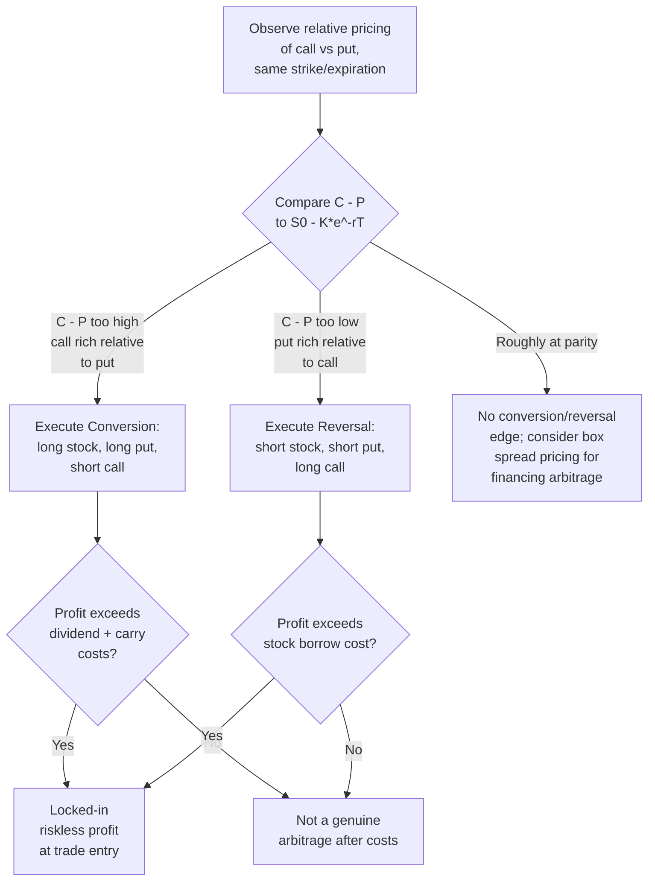

## Synthetic Positions and Conversion Arbitrage

### Overview

Synthetic positions are combinations of options (and sometimes the underlying) that replicate the payoff profile of a different, simpler instrument — a long stock, a short stock, a call, or a put — using an alternative combination of legs. This replication is possible because of **put-call parity**, the no-arbitrage relationship linking calls, puts, the underlying, and a risk-free bond at a given strike and expiration. Conversion and reversal (reverse conversion) arbitrage are trading strategies that directly exploit temporary violations or mispricings of this relationship, historically central to market-maker inventory management and options market microstructure.

### Put-Call Parity: The Foundation

For European-style options on a non-dividend-paying underlying, put-call parity states:

$$C - P = S_0 - Ke^{-rT}$$

where $C$ is the call premium, $P$ is the put premium, $S_0$ is the current underlying price, $K$ is the common strike, $r$ is the risk-free rate, and $T$ is time to expiration.

Rearranged, this identity underlies every synthetic relationship in options:

$$C = P + S_0 - Ke^{-rT} \qquad P = C - S_0 + Ke^{-rT} \qquad S_0 = C - P + Ke^{-rT}$$

**With dividends**, the relationship adjusts to account for the present value of expected dividends $D$ paid before expiration:

$$C - P = S_0 - D - Ke^{-rT}$$

**Key Points**:

- This relationship holds strictly for **European-style** options; American-style options introduce early-exercise value that can cause the identity to hold only as an inequality/bound rather than an exact equality, particularly for puts (early exercise of an American put can be optimal when deep ITM, since time value can be negative relative to immediate exercise proceeds)
- [Inference] In practice, transaction costs, bid-ask spreads, borrowing costs/rates for short stock, and dividend uncertainty mean observed market prices for American-style options typically trade within a band around the parity-implied relationship rather than at an exact equality, with the width of that band depending on the specific market's liquidity and financing conditions

### The Four Basic Synthetic Equivalents

| Synthetic Position | Constructed From | Replicates |
| --- | --- | --- |
| Synthetic Long Stock | Long call + Short put (same strike, same expiration) | Long underlying |
| Synthetic Short Stock | Short call + Long put (same strike, same expiration) | Short underlying |
| Synthetic Long Call | Long underlying + Long put (same strike) | Long call |
| Synthetic Long Put | Short underlying + Long call (same strike) | Long put |

**Synthetic Long Stock** (long call + short put, strike $K$):

$$\Pi(S_T) = \max(S_T - K, 0) - \max(K - S_T, 0) = S_T - K$$

This payoff is linear in $S_T$ with slope 1, identical in shape to owning the underlying outright (offset by a constant $K$), confirming the replication.

**Synthetic Long Put** (short stock + long call, strike $K$):

$$\Pi(S_T) = -(S_T - S_0) + \max(S_T - K, 0)$$

For $S_T < K$: $\Pi = -(S_T - S_0) = S_0 - S_T$, which rises as $S_T$ falls — matching a long put's payoff shape. For $S_T \geq K$: $\Pi = -(S_T - S_0) + (S_T - K) = S_0 - K$, a constant — matching a long put's capped loss above the strike.

### Payoff Diagram — Synthetic Long Stock (svg_diagram)

<svg xmlns="http://www.w3.org/2000/svg" viewBox="0 0 780 420">
<text x="390" y="24" text-anchor="middle" font-size="16" font-weight="bold" fill="#1a1a1a">Synthetic Long Stock: Long Call + Short Put (svg_diagram)</text>
<line x1="80" y1="360" x2="740" y2="360" stroke="#333" stroke-width="1.5" />
<line x1="80" y1="60" x2="80" y2="360" stroke="#333" stroke-width="1.5" />
<text x="410" y="395" text-anchor="middle" font-size="13" fill="#333">Underlying Price at Expiration ($S_T$)</text>
<text x="30" y="210" text-anchor="middle" font-size="13" fill="#333" transform="rotate(-90 30 210)">Profit / Loss</text>
<line x1="80" y1="210" x2="740" y2="210" stroke="#999" stroke-width="1" stroke-dasharray="4,4" />
<text x="65" y="214" text-anchor="end" font-size="11" fill="#666">0</text>
<line x1="410" y1="60" x2="410" y2="360" stroke="#aaa" stroke-width="1" stroke-dasharray="3,3" />
<text x="410" y="375" text-anchor="middle" font-size="12" fill="#555">K</text>

<polyline points="100,210 410,210 740,60" fill="none" stroke="#1f6fd6" stroke-width="2" stroke-dasharray="5,3" />
<text x="600" y="80" font-size="11" fill="#1f6fd6">Long Call</text>

<polyline points="100,60 410,210 740,210" fill="none" stroke="#d6291f" stroke-width="2" stroke-dasharray="5,3" />
<text x="150" y="80" font-size="11" fill="#d6291f">Short Put</text>

<line x1="100" y1="330" x2="740" y2="90" stroke="#1a8a3a" stroke-width="3" />
<text x="600" y="130" font-size="13" fill="#1a8a3a" font-weight="bold">Combined = Synthetic Long Stock</text>
</svg>

### Conversion (Conversion Arbitrage)

**Construction**: Long 100 shares of underlying + long 1 put at strike $K$ + short 1 call at strike $K$ (same expiration). This combines the actual underlying with a **synthetic short stock position** (long put + short call), which, if properly priced, should net to a riskless, fully hedged position locking in a specific return.

**Mechanics**: A conversion is executed when a trader observes that the call is priced **too expensive relative to the put** (i.e., $C - P$ exceeds $S_0 - Ke^{-rT}$ by more than transaction costs). The trader:

1. Buys the underlying stock
2. Buys the put (protective floor)
3. Sells the call (collects rich premium)

**Payoff at expiration** is locked in regardless of $S_T$, since the long stock + long put + short call combination is payoff-invariant to the underlying's terminal price:

$$\Pi(S_T) = (S_T - S_0) + \max(K - S_T, 0) - \max(S_T - K, 0) - (p - c)$$

This simplifies, for all $S_T$, to a constant:

$$\Pi = K - S_0 - (p - c) = K - S_0 - p + c$$

**Key Points**:

- The position is delta-neutral and, in the idealized no-dividend, no-carry-cost case, **risk-free** at initiation — the profit is locked in at trade entry, not dependent on the direction or magnitude of the underlying's subsequent move
- Profit arises purely from the mispricing: executing when $c$ is overpriced relative to $p$ (net credit from selling the call exceeds the net cost implied by fair parity)
- Historically central to market-maker and floor-trader activity — conversions (and reversals) are a core mechanism by which options market makers manage inventory risk while remaining largely direction-neutral

### Reversal (Reverse Conversion)

**Construction**: Short 100 shares of underlying + short 1 put at strike $K$ + long 1 call at strike $K$ (same expiration) — the mirror image of a conversion, combining a short stock position with a **synthetic long stock position** (long call + short put).

**Mechanics**: Executed when the put is priced **too expensive relative to the call** (i.e., $P$ exceeds fair value relative to $C$ under parity). The trader:

1. Shorts the underlying stock
2. Sells the put (collects rich premium)
3. Buys the call (establishes upside protection on the short)

**Payoff at expiration**, similarly constant regardless of $S_T$:

$$\Pi = S_0 - K - (c - p) = S_0 - K - c + p$$

**Key Points**:

- Like the conversion, this is a delta-neutral, theoretically riskless arbitrage position when properly constructed and when the mispricing exceeds transaction and carry costs
- Requires the ability to borrow and short the underlying stock, introducing **stock borrow cost** (hard-to-borrow fees, rebate rates) as a real-world friction not present in the idealized parity formula — this cost must be smaller than the mispricing for the reversal to be genuinely profitable
- [Inference] Stock borrow availability and cost vary significantly by underlying and over time (particularly for hard-to-borrow names), which is a primary reason observed reversal opportunities may not be as riskless or as easily captured in practice as the idealized formula suggests

### Conversion vs. Reversal Comparison

| Dimension | Conversion | Reversal |
| --- | --- | --- |
| Stock leg | Long | Short |
| Options legs | Long put + Short call (synthetic short stock) | Long call + Short put (synthetic long stock) |
| Executed when | Call rich relative to put ($C-P$ too high) | Put rich relative to call ($P-C$ too high, or equivalently $C-P$ too low) |
| Key friction | Dividend timing, carrying cost of long stock | Stock borrow cost/availability for the short leg |
| Net position | Fully hedged, locked payoff | Fully hedged, locked payoff |

### Box Spread (Related Arbitrage Structure)

A **box spread** combines a bull call spread and a bear put spread at the same two strikes ($K_1, K_2$) and same expiration:

$$\text{Box} = (\text{Long call } K_1 + \text{Short call } K_2) + (\text{Long put } K_2 + \text{Short put } K_1)$$

**Key Points**:

- The payoff at expiration is a **constant equal to the strike width** $(K_2 - K_1)$, regardless of $S_T$, making it a synthetic fixed-income instrument constructed entirely from options
- The theoretical fair value of a box spread is the present value of the strike width: $\text{Box Value} = (K_2 - K_1)e^{-rT}$
- Trading a box spread at a price that deviates meaningfully from this present-value relationship represents an arbitrage opportunity (effectively lending or borrowing at an implied rate that differs from the prevailing risk-free rate)
- [Inference] Box spreads are sometimes used in practice as a capital-efficient way to borrow or lend cash within an options account (an implied financing transaction), though the achievable implied rate depends on prevailing options market pricing, liquidity, and transaction costs at the time, and is not a guaranteed risk-free arbitrage after accounting for those frictions and margin/collateral requirements

### Why These Arbitrages Are Rare in Liquid Modern Markets

[Inference] In modern, highly liquid options markets with active market-maker participation and low-latency trading infrastructure, textbook conversion, reversal, and box-spread arbitrage opportunities of meaningful size are generally understood to be rare and typically captured within fractions of a second by automated market-making systems, rather than being persistently available to typical market participants; the concepts remain foundational for understanding fair-value pricing, market-maker hedging logic, and the theoretical boundaries within which options prices trade, even where large-scale riskless profit opportunities are uncommon in practice.

### Synthetic Positions for Practical Trading (Beyond Pure Arbitrage)

Beyond arbitrage, synthetic construction is used for practical position management:

- **Synthetic stock replacement**: Using a long call + short put (synthetic long stock) instead of owning actual shares can reduce capital outlay (margin on the options combination is often lower than the full cost of 100 shares) while replicating the same directional payoff and dividend-adjusted economics
- **Married puts vs. synthetic calls**: A protective put (long stock + long put) is synthetically equivalent to a long call at the same strike — a position manager evaluating whether to buy a call outright or construct a protective put may compare relative pricing and other considerations (voting rights, dividend capture, margin treatment, tax treatment) between the two economically-equivalent structures
- **Converting an existing position's risk profile**: A trader holding a covered call who wants to add downside protection can add a protective put, converting the position into a collar (see prior section) — recognizing this as adding a put to a synthetic short-put-equivalent (covered call) position, moving the aggregate exposure toward parity-neutral

### Decision Flow

### Worked Example — Conversion

**Setup**: Underlying at $S_0 = \$100$. 90-day options, $K = \$100$, risk-free rate $r = 5\%$ (continuously compounded), no dividends. Observed market prices: Call $C = \$5.50$, Put $P = \$4.00$.

**Fair value check**:

$$S_0 - Ke^{-rT} = 100 - 100 \times e^{-0.05 \times 0.25} = 100 - 98.76 = \$1.24$$

$$C - P \text{ (observed)} = 5.50 - 4.00 = \$1.50$$

Since observed $C-P$ ($1.50) exceeds fair value ($1.24) by $\$0.26$, the call is rich relative to the put — a conversion opportunity exists (before transaction costs).

**Execution**: Buy 100 shares at $\$100$; buy 1 put at $\$4.00$; sell 1 call at $\$5.50$.

**Locked-in payoff** (constant regardless of $S_T$):

$$\Pi = K - S_0 - p + c = 100 - 100 - 4.00 + 5.50 = \$1.50/\text{share} = \$150 \text{ total}$$

This $\$1.50$ compares to the theoretical fair-value carry cost of $\$1.24$, representing an arbitrage edge of $\$0.26$/share ($\$26$ total) before transaction costs — illustrating both the mechanism and how thin such edges typically are relative to real-world trading costs.

### Worked Example — Box Spread Fair Value

**Setup**: 60-day options, $K_1 = \$90$, $K_2 = \$100$, $r = 4\%$.

$$\text{Box Fair Value} = (K_2 - K_1)e^{-rT} = 10 \times e^{-0.04 \times (60/365)} = 10 \times 0.9934 \approx \$9.934$$

If the box spread can be constructed (bought) in the market for a net debit of $\$9.80$, this implies locking in $K_2 - K_1 = \$10.00$ at expiration for a cost of $\$9.80$ — an implied return of $\$0.20$ on $\$9.80$ over 60 days, which annualizes to a rate above the prevailing $4\%$ risk-free rate, representing a financing arbitrage before costs.

### Risk Management and Practical Considerations

- **Not truly riskless in practice**: Real-world conversions/reversals carry residual risks including early assignment on American-style short legs (which can force unwinding the position before expiration under different terms), dividend risk (unexpected dividend changes affecting the parity relationship), and financing/borrow cost uncertainty over the holding period.
- **Transaction costs dominate at scale**: Because these are typically thin-margin arbitrage opportunities, commissions, bid-ask spreads across three legs (conversion/reversal) or four legs (box spread), and margin/collateral costs can easily exceed the theoretical edge, which is a primary reason such opportunities are more actively captured by low-cost, high-speed market-making operations than by typical retail or even many institutional participants.
- **American-style early exercise risk**: For conversions/reversals on American-style options, the short option leg can be assigned early, which — particularly for the short call near an ex-dividend date — can alter the intended locked-in payoff and require active position management rather than a true "set and forget" arbitrage.
- **Capital and margin requirements**: Conversions and reversals require holding (or shorting) the full underlying position alongside the options legs, which is more capital-intensive than most other strategies in this chapter and is a key reason these structures are more commonly employed by market makers and proprietary trading desks with lower financing costs than by typical individual traders.

**Related Topics**:

- Put-call parity derivation and its extensions (with dividends, American-style bounds)
- Box spreads as implied financing instruments
- Options market-making and inventory hedging mechanics
- Dividend arbitrage and early-exercise decision theory for American options
- Collar and risk reversal structures (synthetic position applications)
- Interest rate parity and cost-of-carry models more broadly
- Stock loan/borrow markets and their interaction with options arbitrage