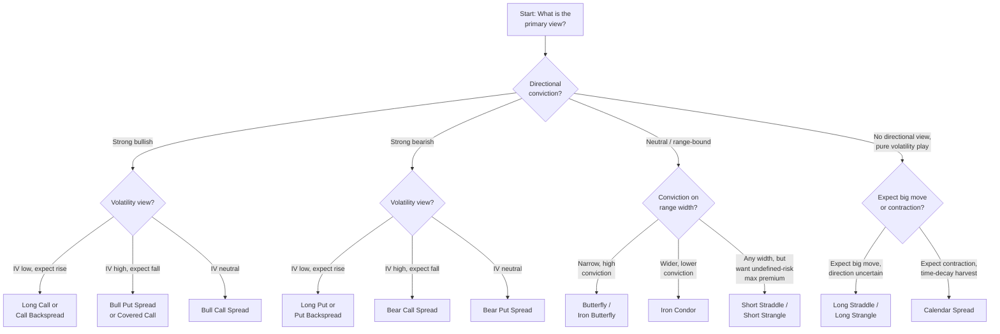

## Matching Strategies to Market Views

### Overview

Strategy selection in options trading is fundamentally a mapping problem: a trader holds a view along two largely independent axes — **direction** (bullish, bearish, or neutral) and **volatility expectation** (rising, falling, or stable, and realized vs. implied) — and must select the structure whose payoff and Greek exposure best matches that combined view, subject to constraints on capital, risk tolerance, and time horizon. This section synthesizes the strategies covered across this chapter into a unified selection framework.

### The Two-Axis View Framework

Every strategy in this chapter can be classified along two dimensions:

1. **Directional view**: Bullish, Bearish, or Neutral (range-bound)
2. **Volatility view**: Expect implied/realized volatility to rise (long vega), fall (short vega), or is indifferent

A third practical dimension — **risk definition** (defined vs. undefined maximum loss) — further separates otherwise similar structures and is often the deciding factor in real-world strategy choice given capital and margin constraints.

### Master Classification Table

| Strategy | Direction | Volatility | Risk Profile | Theta | Vega |
| --- | --- | --- | --- | --- | --- |
| Covered Call | Neutral-to-bullish | Short | Defined-ish (large downside, capped upside) | Positive | Negative |
| Protective Put | Bullish (insured) | Long | Defined (floored downside, uncapped upside) | Negative | Positive |
| Bull Call Spread | Bullish | Neutral/mixed | Defined | Small | Small |
| Bull Put Spread | Bullish | Short (net) | Defined | Positive | Negative |
| Bear Put Spread | Bearish | Neutral/mixed | Defined | Small | Small |
| Bear Call Spread | Bearish | Short (net) | Defined | Positive | Negative |
| Calendar Spread | Neutral (pinned) | Long (back month) | Defined (debit) | Positive | Positive |
| Long Straddle | Neutral direction, big move either way | Long | Defined (premium paid) | Negative | Positive |
| Long Strangle | Neutral direction, big move either way | Long | Defined (premium paid) | Negative | Positive |
| Short Straddle | Neutral, range-bound | Short | **Undefined** | Positive | Negative |
| Short Strangle | Neutral, range-bound | Short | **Undefined** | Positive | Negative |
| Collar | Bullish (hedged) | Mixed | Defined | Mixed | Mixed |
| Risk Reversal (standalone) | Directional | Mixed | **Undefined** on naked side | Mixed | Mixed |
| Long Butterfly | Neutral, pinned target | Short | Defined | Positive | Negative |
| Iron Butterfly | Neutral, pinned target | Short | Defined | Positive | Negative |
| Iron Condor | Neutral, range | Short | Defined | Positive | Negative |
| Ratio Spread | Moderately directional, capped target | Short beyond short strike | **Undefined** on far side | Positive (in zone) | Negative (in zone) |
| Backspread | Directional, large move | Long beyond long strikes | Defined max loss, unbounded gain | Negative (in zone) | Positive (in zone) |
| Conversion/Reversal | Neutral (arbitrage) | N/A | Defined (locked payoff) | N/A | N/A |

### Directional Axis: Strategy Selection

**Bullish views**, ordered roughly from lowest to highest conviction/leverage:

- **Mildly bullish, income-focused, willing to cap upside**: Covered call
- **Moderately bullish, defined risk, lower cost than outright stock/call**: Bull call spread or bull put spread
- **Bullish with insurance against a sharp reversal**: Protective put, or collar if cost-sensitive
- **Strongly bullish, want leveraged exposure without full stock capital**: Long call, or standalone bullish risk reversal (short put + long call) for further leverage/lower cost
- **Bullish with a specific price target and defined, low-cost risk**: Call ratio spread (target-and-cap) if comfortable with undefined risk beyond target, or bull call spread if not
- **Expect a large bullish move, want convexity**: Call backspread

**Bearish views** mirror the bullish structures: bear put/call spreads, protective strategies via short stock analogs, bearish risk reversals, put ratio spreads, and put backspreads.

**Neutral/range-bound views**, ordered by width of the expected range and conviction:

- **Very narrow range, high conviction on a pin point**: Long or iron butterfly
- **Wider range, lower conviction on exact settlement**: Iron condor
- **Neutral but expect volatility contraction, willing to accept undefined risk for maximum premium**: Short straddle or short strangle
- **Neutral, calendar/time-based edge, pinned strike**: Calendar spread

### Volatility Axis: Strategy Selection

**Expect implied volatility to rise (long vega), independent of direction**:

- Long straddle or strangle (direction-neutral, pure volatility expansion bet)
- Calendar spread (benefits from back-month vega more than front-month, works best if IV rises specifically in the longer-dated contract)
- Backspreads (long vega beyond the long strikes, combined with directional tilt)
- Protective puts and long calls generally (any net-long-premium single-leg or spread position carries positive vega)

**Expect implied volatility to fall or is currently elevated relative to likely realized (short vega)**:

- Short straddle or strangle (maximum short-vega exposure, undefined risk)
- Iron condor or iron butterfly (short vega, but defined risk — the more capital-efficient way to express a similar view)
- Covered calls and cash-secured puts (short vega on the single written option, combined with directional exposure)
- Credit spreads (bull put spread, bear call spread) — short vega in a directional wrapper

**Indifferent to volatility level, focused on relative pricing/direction**:

- Vertical debit spreads (bull call, bear put) — vega exposure is small and partially self-hedging since one leg is long and one is short vega, largely netting out
- Conversion/reversal arbitrage — vega-neutral by construction, since the position is fully hedged against the underlying's movement and, to a first approximation, against parallel shifts in implied volatility

### Selection Decision Tree

### Time Horizon and Theta Considerations

Strategy selection also depends on the expected timing of the anticipated move:

- **Event-driven, short horizon** (earnings, FDA decisions, macro releases): Straddles/strangles (long or short depending on IV view relative to expected move), calendar spreads exploiting the IV term structure around the event
- **Medium-term directional conviction** (weeks to a few months): Vertical spreads, collars, risk reversals — structures that balance cost efficiency against time decay drag
- **Income generation, no strong near-term catalyst**: Covered calls, cash-secured puts, credit spreads, iron condors — theta-positive structures that profit from the passage of time in a stable market
- **Long-term portfolio insurance**: Protective puts (often rolled forward), collars (particularly zero-cost, rolled periodically) — structures intended to be held or renewed across an extended horizon rather than to expiration of a single contract

### Risk-Defined vs. Risk-Undefined: The Practical Filter

Beyond the pure view-matching exercise, many traders apply a risk-definition filter as a primary screen, given capital and psychological constraints:

| Undefined-Risk Structure | Risk-Defined Equivalent (similar view) |
| --- | --- |
| Short straddle | Iron butterfly |
| Short strangle | Iron condor |
| Naked short call (uncovered) | Bear call spread |
| Naked short put (uncovered) | Bull put spread |
| Ratio spread | Butterfly (if a long option is added to cap the far side) |
| Standalone risk reversal | Collar (if underlying is added) |

**Key Points**:

- Converting an undefined-risk structure to its defined-risk equivalent typically means giving up some potential profit (the wing purchased for protection costs premium) in exchange for a known, bounded worst case and generally more favorable margin treatment
- [Inference] The decision between an undefined-risk structure and its defined-risk counterpart is generally treated as a risk-tolerance and capital-efficiency choice rather than one with a universally "correct" answer, since the undefined-risk version usually offers a higher probability-weighted return in typical (non-tail) market conditions, precisely because it is compensated for bearing the tail risk that the defined-risk version has hedged away

### Worked Scenario — Mapping a Market View to a Strategy

**Stated view**: "I think this stock will stay roughly flat to modestly higher over the next 45 days. Implied volatility looks elevated relative to how this stock has actually moved historically. I don't want unlimited risk."

**Mapping**:

1. Direction: Neutral-to-mildly-bullish → rules out purely bearish structures
2. Volatility: Elevated IV, expect contraction or at least no expansion → favors short-vega structures
3. Risk tolerance: No unlimited risk → rules out short straddle/strangle, naked ratio spreads, standalone risk reversals

**Candidates surviving all three filters**: Bull put spread (defined risk, short vega, bullish tilt), iron condor with an asymmetric (broken-wing) skew toward the bullish side, or a covered call if already holding the underlying and comfortable with the larger (though not literally unlimited, since a stock cannot go below zero) downside exposure that a covered call retains.

**Selection consideration**: If the trader does not already hold the underlying, the bull put spread or broken-wing iron condor are more capital-efficient (defined risk, no need to own 100 shares) than initiating a covered call from scratch.

### Worked Scenario — Volatility-First View

**Stated view**: "I have no directional opinion on this stock, but a major FDA decision is in 10 days, and I think the options market is underpricing how much this stock could move."

**Mapping**:

1. Direction: None — rules out directional spreads
2. Volatility: Expect realized to exceed implied → favors long-vega, direction-agnostic structures
3. Cost sensitivity: If premium is expensive due to elevated pre-event IV, a strangle (cheaper, wider breakevens) may be preferred over a straddle; if premium is judged reasonable, a straddle maximizes gamma/vega concentration

**Selection**: Long straddle (higher conviction on magnitude, tighter breakevens) or long strangle (lower cost, wider tolerance), explicitly accepting **volatility crush risk** — the risk that IV collapses post-event even if the stock does move, eroding value faster than the directional move adds it.

### Common Pitfalls in View-to-Strategy Mapping

- **Conflating a directional view with a volatility view**: A trader who is "bullish" is not automatically well-served by a long call if implied volatility is extremely elevated (a bull put spread or covered call may better match the combined view of "bullish + expect IV to fall")
- **Ignoring theta drag on long-premium neutral bets**: A long straddle or strangle purchased without a specific near-term catalyst is fighting accelerating time decay every day the underlying fails to move, which is why these structures are most commonly paired with a defined event or catalyst rather than held as an open-ended bet
- **Underestimating undefined-risk tail exposure**: Short volatility structures (short straddle/strangle, naked ratio spreads) can appear attractive based on high probability-of-profit statistics while carrying tail risk that dominates long-run expected value in a sufficiently adverse scenario — the probability of a large loss may be low, but its magnitude can be very large
- **Failing to account for skew when selecting strikes**: Because OTM puts and OTM calls are rarely priced symmetrically (see skew/risk reversal discussion in the Collars section), assuming equal-distance strikes will produce equal-cost or equal-probability outcomes on both sides of a neutral structure like a strangle or iron condor can lead to unintentionally skewed risk exposure

### Related Topics

**Next Steps**:

- Implied volatility rank/percentile as a quantitative input to the volatility axis
- Probability of profit (POP) and expected value calculations across strategy types
- Portfolio-level Greeks aggregation when running multiple simultaneous strategies
- Position sizing and capital allocation frameworks across defined- vs. undefined-risk trades
- Adjusting and rolling strategies as market views evolve mid-trade
- Volatility skew and term structure as inputs to strike and structure selection
- Behavioral biases in options strategy selection (e.g., overweighting high-POP undefined-risk trades)