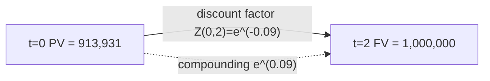

## Time Value of Money and Discounting

### Core Concept

Money available today is worth more than the same nominal amount available in the future, because it can be invested to earn a return. Discounting is the mathematical operation that converts a future cash flow into its equivalent present value, and compounding is its inverse: projecting a present amount forward in time. These two operations underlie virtually all derivatives and structured products pricing, since valuation ultimately reduces to computing the present value of a stream of future (often contingent) cash flows.

### Simple vs. Compound Interest

**Simple interest** grows linearly with time:

$$FV = PV \times (1 + r \times t)$$

**Compound interest** grows geometrically, reinvesting interest earned:

$$FV = PV \times (1 + r)^t$$

where $PV$ is present value, $FV$ is future value, $r$ is the periodic interest rate, and $t$ is the number of periods.

**Key Points**

- Simple interest is rarely used in derivatives pricing except for very short-dated money market instruments.
- Compound interest is the standard assumption underlying discount factors, zero-coupon bonds, and forward rate construction.
- The compounding frequency (annual, semiannual, quarterly, monthly, daily, continuous) materially changes the effective rate and must always be specified alongside a stated rate.

### Compounding Frequency and Effective Rates

For a nominal annual rate $r$ compounded $m$ times per year:

$$FV = PV \times \left(1 + \frac{r}{m}\right)^{mt}$$

The **effective annual rate (EAR)** allows comparison across different compounding conventions:

$$EAR = \left(1 + \frac{r}{m}\right)^m - 1$$

As $m \to \infty$, compounding becomes **continuous**, and the growth factor becomes the exponential function:

$$FV = PV \times e^{rt}$$

Continuous compounding is the dominant convention in derivatives pricing (Black-Scholes and most stochastic pricing models are built in continuous time) because it produces smooth, differentiable growth functions that are analytically tractable.

**Example**

A nominal rate of 6% compounded monthly gives:

$$EAR = \left(1 + \frac{0.06}{12}\right)^{12} - 1 \approx 6.168\%$$

The equivalent continuously compounded rate $r_c$ solving $e^{r_c} = 1.06168$ is approximately $5.99\%$.

### Discounting: The Inverse Operation

Discounting reverses compounding to bring a future cash flow $CF_t$ back to present value:

**Discrete compounding:**

$$PV = \frac{CF_t}{(1+r)^t}$$

**Continuous compounding:**

$$PV = CF_t \times e^{-rt}$$

The term $e^{-rt}$ (or $(1+r)^{-t}$) is called the **discount factor**, denoted $DF(t)$ or $Z(t)$. A discount factor is always between 0 and 1 for positive rates and represents the present value of $1 received at time $t$.

### Discount Factors and Zero-Coupon Bonds

A discount factor $Z(0,t)$ is economically equivalent to the price of a zero-coupon bond maturing at time $t$ with $1 face value:

$$Z(0,t) = e^{-r(t) \cdot t}$$

where $r(t)$ is the zero rate (spot rate) for maturity $t$. In practice, discount factors are not assumed flat across maturities; they are **bootstrapped** from observable market instruments (deposits, futures, swaps, bonds) to build a full **term structure** — the discount curve or yield curve.

**Key Points**

- Discount factors are strictly decreasing in $t$ for positive rates (further-out cash flows are worth less today).
- The discount curve is the single most important input to any derivatives pricing model, since every payoff is ultimately an expectation of discounted future cash flows.
- Since 2008, and especially post-LIBOR transition, practitioners distinguish between the **discounting curve** (typically OIS/SOFR-based, reflecting the actual funding/collateral rate) and the **forecasting curve** (used to project floating rate cash flows) — these are no longer assumed identical. [Inference: exact curve choice depends on collateralization terms of the specific trade/CSA.]

### Present Value of Cash Flow Streams

For a series of cash flows $CF_1, CF_2, \ldots, CF_n$ occurring at times $t_1, \ldots, t_n$:

$$PV = \sum_{i=1}^{n} CF_i \times Z(0, t_i) = \sum_{i=1}^{n} \frac{CF_i}{(1+r_i)^{t_i}}$$

Note that each cash flow may be discounted at a maturity-specific rate $r_i$ rather than a single flat rate, reflecting the term structure of interest rates.

### Annuities and Perpetuities

**Ordinary annuity** (constant cash flow $C$ for $n$ periods, discrete rate $r$):

$$PV = C \times \frac{1 - (1+r)^{-n}}{r}$$

**Perpetuity** (constant cash flow forever):

$$PV = \frac{C}{r}$$

**Growing perpetuity** (cash flow grows at rate $g < r$):

$$PV = \frac{C}{r - g}$$

These formulas appear in swap valuation (fixed leg as an annuity of coupon payments), bond pricing, and in approximating the value of long-dated dividend or funding streams in structured products.

### Day Count Conventions

Because $t$ in the above formulas must be expressed as a year fraction, **day count conventions** determine how calendar time maps to $t$. Common conventions:

| Convention | Description | Typical Use |
| --- | --- | --- |
| Actual/360 | Actual days / 360 | Money markets, USD LIBOR/SOFR |
| Actual/365 (Fixed) | Actual days / 365 | GBP markets, some swaps |
| 30/360 | Assumes 30-day months, 360-day year | Corporate bonds |
| Actual/Actual | Actual days / actual days in year | Government bonds |

**Key Points**

- Day count mismatches between the fixed and floating legs of a swap, or between a bond and its hedge, are a common source of small but real valuation discrepancies.
- Derivatives contracts always specify the day count convention explicitly in their term sheets; assuming a default convention is a common pricing error. [Unverified: convention defaults vary by jurisdiction, product, and ISDA definitions version in effect.]

### Continuous Compounding and Its Role in Stochastic Models

Continuous-time discounting is foundational to derivatives pricing because:

1. It allows use of calculus (derivatives, integrals) in modeling price dynamics, essential for solving PDEs like Black-Scholes.
2. Under risk-neutral valuation, the price of any derivative is:

   $$V_0 = E^{Q}\left[e^{-\int_0^T r_s \, ds} \cdot Payoff_T\right]$$

   where $E^Q$ denotes expectation under the risk-neutral measure and $r_s$ is the (potentially stochastic) short rate.
3. When rates are stochastic (e.g., in Hull-White or CIR models), the discount factor itself becomes a random variable, and its expected value must be computed via the model's dynamics rather than a simple deterministic exponential.

### Forward Rates from Discount Factors

The **forward rate** between two future times $t_1$ and $t_2$ is implied by no-arbitrage from spot discount factors:

$$1 + F(t_1, t_2) \times (t_2 - t_1) = \frac{Z(0,t_1)}{Z(0,t_2)}$$

or in continuous compounding:

$$F(t_1,t_2) = \frac{\ln(Z(0,t_1)) - \ln(Z(0,t_2))}{t_2 - t_1}$$

This relationship is the backbone of constructing forward curves for LIBOR/SOFR-linked instruments and pricing forward-starting swaps and FRAs.

### Worked Numerical Example

Suppose the continuously compounded zero rate is 4% for 1 year and 4.5% for 2 years. A cash flow of $1,000,000 is due in 2 years.

$$PV = 1{,}000{,}000 \times e^{-0.045 \times 2} = 1{,}000{,}000 \times e^{-0.09} \approx \$913{,}931$$

The implied 1-year forward rate between year 1 and year 2:

$$F(1,2) = \frac{(0.045 \times 2) - (0.04 \times 1)}{1} = 0.05 = 5\%$$

This shows the 1x2 forward rate (5%) exceeds both spot rates because the longer zero rate (4.5%) is a blended average that must be pulled up by a higher forward segment given the lower 1-year rate.

### Diagram: Present Value Timeline

### Relevance to Structured Products and Derivatives

- **Bond and note pricing**: every structured note (e.g., autocallables, principal-protected notes) decomposes into a bond floor (discounted zero-coupon component) plus an embedded option; the bond floor calculation relies entirely on discounting.
- **Swap valuation**: fixed and floating legs are each valued as the present value of their respective cash flow streams; the swap rate is the rate that equates the two legs' present values.
- **Option pricing**: the risk-free discounting term $e^{-rT}$ appears explicitly in Black-Scholes and all its extensions to convert the risk-neutral expected payoff into present value.
- **Collateralized derivatives (CSA-driven discounting)**: the choice of discount curve (OIS/SOFR vs. unsecured) directly affects valuation and is a major driver of **CVA/DVA/FVA** adjustments in modern derivatives valuation frameworks.

**Next Steps**

- Yield Curve Construction and Bootstrapping
- Forward Rate Agreements (FRAs) and Forward Curve Modeling
- Risk-Neutral Valuation and the Fundamental Theorem of Asset Pricing
- OIS Discounting and Multi-Curve Frameworks (Post-LIBOR Transition)
- Duration, Convexity, and Interest Rate Sensitivity
- Stochastic Interest Rate Models (Vasicek, CIR, Hull-White)