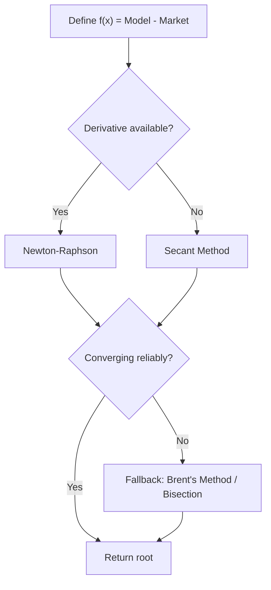

## Numerical Optimization and Root Finding

### Core Concept

Numerical optimization and root finding are the computational backbone of derivatives pricing whenever closed-form solutions are unavailable or when a model parameter must be inferred from market data. **Root finding** solves $f(x) = 0$ for an unknown $x$ (e.g., implied volatility, yield to maturity, breakeven rate). **Optimization** finds the value(s) of $x$ that minimize or maximize an objective function $f(x)$ (e.g., calibrating a model to minimize the squared error between model and market prices). Nearly every practical pricing and calibration workflow in derivatives — implied vol surfaces, curve bootstrapping, model calibration — reduces to one of these two problems.

### Root Finding Methods

#### Bisection Method

Given a continuous function $f$ with $f(a) \cdot f(b) < 0$, the interval is repeatedly halved, keeping the half where the sign change persists.

$$x_{mid} = \frac{a+b}{2}$$

**Key Points**

- Guaranteed to converge if a sign change exists (bracketing method).
- Linear convergence — robust but slow, roughly one bit of precision per iteration.
- Used as a fallback when faster methods fail to converge or overshoot.

#### Newton-Raphson Method

Uses the function's derivative to iteratively refine an estimate:

$$x_{n+1} = x_n - \frac{f(x_n)}{f'(x_n)}$$

**Key Points**

- Quadratic convergence near the root — very fast when it works.
- Requires the derivative $f'(x)$, which may need to be computed analytically or via finite differences.
- Can diverge or oscillate if the initial guess is poor, or if $f'(x_n) \approx 0$.
- The canonical use case in derivatives is solving for **implied volatility**: given a market option price, find the volatility $\sigma$ such that $BS(\sigma) = \text{market price}$, using $f'(\sigma) = \text{Vega}$.

#### Secant Method

Approximates the derivative using two prior points instead of requiring an analytical derivative:

$$x_{n+1} = x_n - f(x_n) \times \frac{x_n - x_{n-1}}{f(x_n) - f(x_{n-1})}$$

**Key Points**

- Superlinear convergence (~1.618 order), slightly slower than Newton-Raphson but does not require $f'(x)$.
- Useful when the objective function is expensive or its derivative is unavailable in closed form.

#### Brent's Method

A hybrid combining bisection, secant, and inverse quadratic interpolation, automatically switching between them to guarantee both robustness and speed.

**Key Points**

- The de facto industry standard for one-dimensional root finding in production pricing libraries (e.g., QuantLib's `Brent` solver) because it combines the reliability of bracketing with fast local convergence.
- Requires an initial bracketing interval, like bisection.

### Root Finding: Worked Example (Implied Volatility)

To find implied volatility $\sigma^*$ such that the Black-Scholes price equals a market price $P_{mkt}$:

$$f(\sigma) = BS(\sigma) - P_{mkt} = 0$$

Newton-Raphson iteration:

$$\sigma_{n+1} = \sigma_n - \frac{BS(\sigma_n) - P_{mkt}}{\text{Vega}(\sigma_n)}$$

Starting guess is often the Brenner-Subrahmanyam approximation:

$$\sigma_0 \approx \sqrt{\frac{2\pi}{T}} \times \frac{P_{mkt}}{S_0}$$

**Key Points**

- Vega diminishes for deep in/out-of-the-money options, causing Newton-Raphson to converge slowly or become numerically unstable in those regions; Brent's method or a bounded bisection is often preferred as a safeguard.

### Multi-Dimensional Root Finding

When multiple unknowns must be solved simultaneously (e.g., bootstrapping several curve nodes at once), the **multivariate Newton's method** generalizes using the Jacobian matrix $J$:

$$\mathbf{x}_{n+1} = \mathbf{x}_n - J^{-1} f(\mathbf{x}_n)$$

**Key Points**

- Computing and inverting the Jacobian is expensive for high-dimensional systems; **Broyden's method** approximates the Jacobian update without recomputation, trading some convergence speed for efficiency.

### Optimization Methods

#### Gradient Descent

Iteratively moves in the direction of steepest descent:

$$\mathbf{x}_{n+1} = \mathbf{x}_n - \eta \nabla f(\mathbf{x}_n)$$

where $\eta$ is the learning rate/step size.

**Key Points**

- Simple but sensitive to step size choice; too large causes divergence, too small causes slow convergence.
- Rarely used directly in classical derivatives calibration but forms the basis of machine-learning-based calibration approaches.

#### Newton's Method for Optimization

Uses second-order (curvature) information via the Hessian matrix $H$:

$$\mathbf{x}_{n+1} = \mathbf{x}_n - H^{-1} \nabla f(\mathbf{x}_n)$$

**Key Points**

- Fast convergence near the optimum but expensive due to Hessian computation/inversion.

#### Quasi-Newton Methods (BFGS, L-BFGS)

Approximate the Hessian using gradient information from previous iterations, avoiding direct computation.

**Key Points**

- **BFGS** (Broyden-Fletcher-Goldfarb-Shanno) is widely used for smooth, unconstrained calibration problems (e.g., fitting an SVI or SABR volatility surface).
- **L-BFGS** (limited-memory BFGS) is preferred for high-dimensional problems since it avoids storing the full Hessian approximation matrix.

#### Levenberg-Marquardt Algorithm

Specifically designed for **nonlinear least-squares** problems — the most common form of model calibration in derivatives:

$$\min_{\theta} \sum_i \left( \text{ModelPrice}_i(\theta) - \text{MarketPrice}_i \right)^2$$

It interpolates between Gauss-Newton (fast, uses curvature) and gradient descent (robust, slow), controlled by a damping parameter $\lambda$ that adapts each iteration.

**Key Points**

- The standard algorithm for calibrating models such as SABR, Heston, or local volatility surfaces to a full grid of quoted option prices simultaneously.
- More robust than pure Gauss-Newton for poorly conditioned or nonlinear calibration surfaces.

#### Derivative-Free Methods

Used when the objective function is non-smooth, noisy, or expensive to differentiate (e.g., involves Monte Carlo simulation):

- **Nelder-Mead (Simplex) Method**: moves a simplex of trial points via reflection, expansion, and contraction; robust to noise but slow and can stall in higher dimensions.
- **Simulated Annealing / Differential Evolution / Particle Swarm**: global optimization heuristics used to avoid local minima in highly non-convex calibration landscapes (e.g., multi-modal volatility surface fits).

**Key Points**

- Derivative-free global methods are computationally expensive and typically reserved for calibration problems where local methods repeatedly converge to poor local minima. [Inference: the specific choice depends heavily on the smoothness and dimensionality of the particular model's calibration surface.]

### Constrained Optimization

Many calibration problems require parameter constraints (e.g., volatility must be positive, correlation must lie in $[-1,1]$, mean-reversion speed must be non-negative for stability). Approaches include:

- **Parameter transformation**: reparametrize (e.g., optimize $\ln(\sigma)$ instead of $\sigma$ to enforce positivity implicitly).
- **Penalty methods**: add a penalty term to the objective function when constraints are violated.
- **Lagrange multipliers / KKT conditions**: formal framework for equality/inequality constrained optimization.
- **Projected gradient methods**: project each iterate back onto the feasible region after an unconstrained step.

### Convergence Criteria and Practical Considerations

| Criterion | Description |
| --- | --- |
| Absolute tolerance | $\lvert x_{n+1} - x_n \rvert < \epsilon$ |
| Relative tolerance | $\lvert (x_{n+1} - x_n)/x_n \rvert < \epsilon$ |
| Function tolerance | $\lvert f(x_n) \rvert < \epsilon$ |
| Max iterations | Hard cap to prevent infinite loops |

**Key Points**

- In production systems, root finders and optimizers must include iteration caps and fallback logic (e.g., fall back to bisection if Newton-Raphson fails to converge) since silent non-convergence can produce plausible-looking but incorrect prices.
- Numerical instability near singularities (e.g., Vega near zero for far OTM options) is a common source of calibration failure and must be handled with safeguards such as bounded search intervals.

### Diagram: Root Finding Decision Flow

### Relevance to Structured Products and Derivatives

- **Implied volatility extraction**: Newton-Raphson/Brent applied per-option to build the implied vol surface from market quotes.
- **Curve bootstrapping**: root finding solves for each successive discount factor/zero rate node so that the curve reprices input instruments exactly.
- **Model calibration**: Levenberg-Marquardt or BFGS-family optimizers fit stochastic volatility models (Heston, SABR) or local volatility surfaces to the full observed option chain.
- **Structured product hedging/greeks**: implied model parameters obtained via optimization directly feed into Greek calculations, scenario analysis, and risk sensitivities for structured payoffs.
- **Exotic option calibration**: barrier, autocallable, and cliquet structures often require calibrating a full volatility surface via optimization before Monte Carlo or PDE pricing can proceed.

**Next Steps**

- Implied Volatility Surfaces and Interpolation (SVI, SABR Parametrization)
- Monte Carlo Methods for Derivatives Pricing
- Finite Difference Methods and PDE Solvers
- Stochastic Volatility Models (Heston, SABR) and Calibration Workflows
- Yield Curve Bootstrapping Techniques
- Model Risk and Calibration Stability Testing