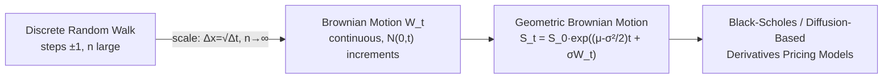

## Random Walks and Brownian Motion

### Core Concept

Random walks and Brownian motion form the mathematical foundation for modeling asset price uncertainty over time. A random walk is a discrete-time stochastic process where each step is a random increment; Brownian motion (also called a **Wiener process**) is its continuous-time limit. Nearly all continuous-time derivatives pricing models — Black-Scholes, Heston, Hull-White — are built by specifying stochastic differential equations driven by Brownian motion.

### The Discrete Random Walk

A simple symmetric random walk is defined by:

$$X_n = X_0 + \sum_{i=1}^{n} \xi_i, \quad \xi_i = \pm 1 \text{ with probability } \frac{1}{2}$$

**Key Points**

- Each increment $\xi_i$ is independent and identically distributed (i.i.d.) with mean zero.
- $E[X_n] = X_0$ (martingale property: no drift).
- $\text{Var}(X_n) = n$ (variance grows linearly with the number of steps).
- As $n \to \infty$ with appropriately scaled step size and time increments, the random walk converges in distribution to Brownian motion (a consequence of the **Central Limit Theorem** / **Donsker's invariance principle**).

### Scaling to Continuous Time

To obtain a well-defined continuous-time limit, steps are rescaled as the number of steps $n \to \infty$ over a fixed time interval $[0,T]$. Setting the time step $\Delta t = T/n$ and step size $\Delta x = \sqrt{\Delta t}$:

$$W_t = \lim_{n \to \infty} \sqrt{\Delta t} \sum_{i=1}^{\lfloor t/\Delta t \rfloor} \xi_i$$

This scaling ($\Delta x \propto \sqrt{\Delta t}$, not $\Delta t$) is essential — it is what produces finite, non-degenerate variance in the limit and is the origin of the characteristic $\sqrt{t}$ scaling of volatility in finance (e.g., "volatility scales with the square root of time").

### Formal Definition of Brownian Motion (Wiener Process)

A stochastic process $\{W_t, t \geq 0\}$ is a standard Brownian motion if:

1. $W_0 = 0$
2. **Independent increments**: for $0 \le s < t$, $W_t - W_s$ is independent of the path up to $s$
3. **Stationary, normally distributed increments**: $W_t - W_s \sim N(0, t-s)$
4. **Continuous paths**: $t \mapsto W_t$ is continuous almost surely, but nowhere differentiable

**Key Points**

- Property 4 is what necessitates a new calculus (Itô calculus) — ordinary calculus assumes differentiability, which Brownian paths violate everywhere despite being continuous.
- $E[W_t] = 0$ and $\text{Var}(W_t) = t$ for all $t$.
- $\text{Cov}(W_s, W_t) = \min(s,t)$.

### Key Properties of Brownian Motion

#### Martingale Property

$$E[W_t \mid \mathcal{F}_s] = W_s \quad \text{for } s \le t$$

Brownian motion is a martingale: its best forecast of a future value, given all information up to now, is simply its current value. This underlies the risk-neutral pricing framework, where discounted asset prices are required to be martingales under the risk-neutral measure.

#### Quadratic Variation

$$[W,W]_t = \lim_{\|\Pi\| \to 0} \sum_{i} (W_{t_{i+1}} - W_{t_i})^2 = t$$

**Key Points**

- This is the single most important technical property distinguishing stochastic calculus from ordinary calculus: for a smooth deterministic function, quadratic variation is zero, but Brownian motion accumulates quadratic variation at rate $dt$ per unit time.
- This is the origin of the famous **Itô's Lemma** correction term $\frac{1}{2}\sigma^2 S^2 \frac{\partial^2 V}{\partial S^2}$ appearing in the Black-Scholes PDE.
- Formally expressed as the informal multiplication rule: $dW_t \cdot dW_t = dt$.

#### Self-Similarity (Scaling Property)

$$W_{ct} \stackrel{d}{=} \sqrt{c} \, W_t \quad \text{for any } c > 0$$

Brownian motion looks statistically identical at any time scale once rescaled — a fractal-like property directly responsible for the square-root-of-time volatility scaling convention used throughout finance (e.g., annualizing daily volatility via $\sigma_{annual} = \sigma_{daily} \times \sqrt{252}$).

#### Markov Property

Future evolution depends only on the current value, not the path taken to reach it — a property inherited by most diffusion-based asset price models and essential for PDE-based pricing methods (Feynman-Kac).

### Geometric Brownian Motion (GBM)

Asset prices are not modeled as Brownian motion directly (which can go negative), but as **geometric Brownian motion**:

$$dS_t = \mu S_t \, dt + \sigma S_t \, dW_t$$

Solving this SDE via Itô's Lemma gives the closed-form solution:

$$S_t = S_0 \exp\left[\left(\mu - \frac{\sigma^2}{2}\right)t + \sigma W_t\right]$$

**Key Points**

- $S_t$ is always positive, since it is expressed as an exponential.
- $\ln(S_t)$ is normally distributed, meaning $S_t$ itself is **lognormally distributed** — the foundational distributional assumption of the Black-Scholes model.
- The $-\frac{\sigma^2}{2}$ term is the **Itô correction (variance drag)**: the arithmetic mean return $\mu$ differs from the median/typical growth path because of the convexity introduced by the exponential transformation.
- Under the risk-neutral measure, $\mu$ is replaced by the risk-free rate $r$ (or $r - q$ with a continuous dividend yield $q$).

### Simulating Brownian Motion and GBM

**Discretized Brownian motion path (Euler-Maruyama scheme):**

$$W_{t_{i+1}} = W_{t_i} + \sqrt{\Delta t} \cdot Z_i, \quad Z_i \sim N(0,1)$$

**Discretized GBM path:**

$$S_{t_{i+1}} = S_{t_i} \exp\left[\left(\mu - \frac{\sigma^2}{2}\right)\Delta t + \sigma \sqrt{\Delta t} \, Z_i\right]$$

**Example**

Simulating one path of GBM with $S_0=100$, $\mu=0.05$, $\sigma=0.2$, over 1 year with $n=252$ daily steps: at each step, draw $Z_i \sim N(0,1)$, compute $\Delta t = 1/252$, and apply the discretized formula above iteratively. This exact-simulation scheme (using the closed-form lognormal solution rather than a naive Euler discretization of $dS_t$) introduces no discretization bias for GBM specifically, since the exact transition density is known. [Inference: for more general SDEs without closed-form solutions, Euler-Maruyama does introduce discretization bias that shrinks as $\Delta t \to 0$.]

### Extensions Relevant to Derivatives Pricing

| Extension | Description | Typical Application |
| --- | --- | --- |
| Brownian motion with drift | $X_t = \mu t + \sigma W_t$ | Basic diffusion models |
| Correlated Brownian motions | $dW_1 dW_2 = \rho \, dt$ | Multi-asset options, basket derivatives |
| Brownian bridge | BM conditioned to hit a fixed endpoint | Path-dependent option simulation, barrier monitoring |
| Fractional Brownian motion | Correlated increments (Hurst exponent $H \neq 0.5$) | Rough volatility models |

**Key Points**

- Correlated Brownian motions are essential for multi-asset structured products (e.g., worst-of/best-of autocallables, basket options), where each underlying's diffusion is driven by a correlated Wiener process, typically constructed via Cholesky decomposition of a correlation matrix.
- Brownian bridge construction is widely used in Monte Carlo simulation of barrier and lookback options to improve accuracy of continuous barrier monitoring from discretely sampled paths.

### Diagram: Random Walk Converging to Brownian Motion

### Illustration: Sample Brownian Motion Path (svg_diagram)

<svg xmlns="http://www.w3.org/2000/svg" viewBox="0 0 700 300">
<title>Sample Brownian Motion Path (svg_diagram)</title>
<rect width="700" height="300" fill="#ffffff" />
<line x1="50" y1="150" x2="650" y2="150" stroke="#999999" stroke-width="1" />
<line x1="50" y1="20" x2="50" y2="280" stroke="#999999" stroke-width="1" />
<text x="660" y="155" font-size="12" fill="#333333">t</text>
<text x="30" y="20" font-size="12" fill="#333333">W(t)</text>
<polyline fill="none" stroke="#2b6cb0" stroke-width="1.5" points="50,150 70,140 90,155 110,145 130,160 150,150 170,170 190,165 210,180 230,175 250,190 270,185 290,200 310,190 330,205 350,195 370,180 390,190 410,175 430,160 450,170 470,155 490,145 510,160 530,150 550,135 570,145 590,130 610,120 630,110 650,100" />
<text x="500" y="270" font-size="11" fill="#666666">Illustrative single path — not to statistical scale</text>
</svg>

### Relevance to Structured Products and Derivatives

- **Black-Scholes framework**: GBM is the foundational asset price model underlying the entire Black-Scholes-Merton option pricing theory.
- **Monte Carlo pricing**: simulating discretized Brownian paths is the core computational engine for pricing path-dependent structured products (autocallables, cliquets, barrier options) lacking closed-form solutions.
- **Multi-asset structured products**: correlated Brownian motions model joint dynamics of multiple underlyings in worst-of, best-of, and basket-linked notes.
- **Interest rate modeling**: short-rate models (Vasicek, CIR, Hull-White) are SDEs driven by Brownian motion, used to price interest-rate-linked structured products and swaptions.
- **Risk-neutral valuation**: the martingale property of Brownian motion (and processes driven by it) is the mathematical basis for the no-arbitrage pricing framework itself.

**Next Steps**

- Itô's Lemma and Stochastic Differential Equations
- The Black-Scholes-Merton Model Derivation
- Girsanov's Theorem and Change of Measure
- Multi-Asset Diffusion and Correlation Structures
- Stochastic Volatility Models (Heston) and Jump-Diffusion Processes
- Monte Carlo Simulation Techniques for Path-Dependent Derivatives