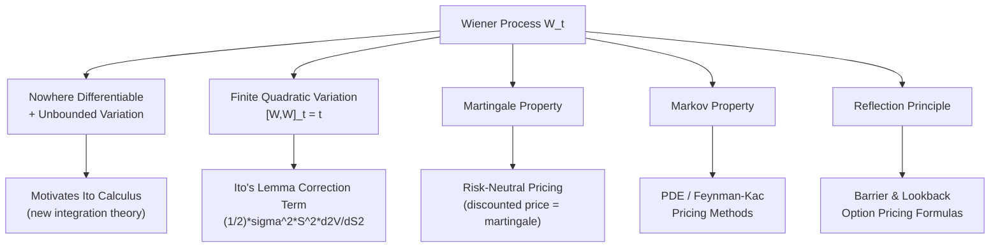

## Properties of Wiener Processes

### Core Concept

A Wiener process $W_t$ is the formal name for standard Brownian motion, and its properties are the technical machinery that makes stochastic calculus work. Where the previous topic established *what* a Wiener process is and how it arises as a limit of random walks, this topic catalogs the specific mathematical properties — path behavior, variation, measurability, and distributional structure — that are directly exploited in deriving Itô's Lemma, the Black-Scholes PDE, and risk-neutral pricing.

### Formal Definition (Recap)

$\{W_t\}_{t \geq 0}$ is a standard Wiener process if:

1. $W_0 = 0$ almost surely
2. Independent increments: $W_t - W_s \perp \mathcal{F}_s$ for $s < t$
3. Gaussian increments: $W_t - W_s \sim N(0, t-s)$
4. Almost surely continuous sample paths

### Path Properties

#### Continuity but Nowhere Differentiability

Wiener process paths are continuous everywhere but differentiable nowhere, with probability 1.

**Key Points**

- This can be understood heuristically: the increment $W_{t+h} - W_t$ has standard deviation $\sqrt{h}$, so the difference quotient $\frac{W_{t+h}-W_t}{h}$ has standard deviation $\frac{1}{\sqrt{h}}$, which diverges to infinity as $h \to 0$.
- This is the fundamental obstruction to applying ordinary calculus to Brownian motion — there is no well-defined $\frac{dW_t}{dt}$ in the classical sense, motivating the entirely different framework of stochastic integration (Itô calculus).
- Despite being nowhere differentiable, paths are **Hölder continuous of order $\gamma$** for any $\gamma < \frac{1}{2}$, meaning $|W_t - W_s| \le C|t-s|^\gamma$ locally — a precise statement of "rough but not too rough."

#### Unbounded Variation

The **total variation** of a Wiener process over any interval $[0,T]$ is infinite almost surely:

$$\sup_{\Pi} \sum_i |W_{t_{i+1}} - W_{t_i}| = \infty$$

**Key Points**

- This rules out defining stochastic integrals $\int_0^T f(t) \, dW_t$ pathwise via ordinary Riemann-Stieltjes integration, which requires bounded variation in the integrator.
- This is precisely why Itô (and separately Stratonovich) had to construct a fundamentally new definition of integration with respect to $dW_t$.

#### Finite Quadratic Variation

In contrast to total variation, the **quadratic variation** is finite and deterministic:

$$[W,W]_T = \lim_{\|\Pi\| \to 0} \sum_i (W_{t_{i+1}} - W_{t_i})^2 = T \quad \text{(almost surely)}$$

**Key Points**

- This is arguably the single most consequential property of Wiener processes for finance: it is the origin of the Itô correction term in Itô's Lemma and the second-derivative term in the Black-Scholes PDE.
- Informally summarized by the multiplication rules: $dW_t \, dW_t = dt$, $dW_t \, dt = 0$, $dt \, dt = 0$.
- The fact that quadratic variation is finite and non-zero (unlike a smooth deterministic function, where it is exactly zero) is what forces stochastic calculus to retain second-order terms that ordinary calculus discards.

### Distributional Properties

#### Marginal and Joint Distributions

$$W_t \sim N(0, t)$$

$$\text{Cov}(W_s, W_t) = \min(s,t), \quad s,t \geq 0$$

For any finite set of times $t_1 < t_2 < \cdots < t_n$, the vector $(W_{t_1}, \ldots, W_{t_n})$ is jointly multivariate Gaussian, fully characterized by this covariance structure. This makes Brownian motion a **Gaussian process**.

#### Independent Increments Structure

For $0 = t_0 < t_1 < \cdots < t_n$, the increments $W_{t_1}-W_{t_0}, W_{t_2}-W_{t_1}, \ldots, W_{t_n}-W_{t_{n-1}}$ are mutually independent.

**Key Points**

- This property is what allows discretized simulation: each simulated increment $\sqrt{\Delta t} \cdot Z_i$ can be drawn independently, since real Wiener process increments genuinely carry no memory of prior increments.

### Martingale Properties

$$E[W_t \mid \mathcal{F}_s] = W_s, \quad s \le t$$

Beyond the basic martingale property, several derived processes are also martingales:

| Process | Martingale? | Notes |
| --- | --- | --- |
| $W_t$ | Yes | Direct definition |
| $W_t^2 - t$ | Yes | Compensated square; used in deriving quadratic variation |
| $e^{\sigma W_t - \frac{1}{2}\sigma^2 t}$ | Yes | Exponential martingale; directly underlies GBM's risk-neutral drift condition |

**Key Points**

- $W_t^2 - t$ being a martingale (rather than $W_t^2$ alone) formalizes why the quadratic variation compensator is exactly $t$ — this identity is often used as a starting point to *prove* $[W,W]_t = t$ rigorously via the martingale convergence theorem.
- The exponential martingale $e^{\sigma W_t - \frac{1}{2}\sigma^2 t}$ is precisely the form seen in the GBM solution, and its martingale property is what guarantees the risk-neutral pricing measure adjustment is done correctly (no arbitrage).

### Markov Property

$$P(W_t \in A \mid \mathcal{F}_s) = P(W_t \in A \mid W_s), \quad s \le t$$

**Key Points**

- The future distribution of the process depends only on its current value, not its history — a property that is essential for using PDE-based pricing methods (via the Feynman-Kac theorem), since it justifies treating the current asset price as a sufficient statistic for pricing.

### Scaling (Self-Similarity) Property

$$\{W_{ct}\}_{t \geq 0} \stackrel{d}{=} \{\sqrt{c} \, W_t\}_{t \geq 0} \quad \text{for any } c > 0$$

**Key Points**

- This is a distributional equality of entire processes, not just marginal distributions — the rescaled process is statistically indistinguishable from the original.
- Direct practical consequence: the $\sqrt{t}$-scaling of volatility (e.g., converting daily to annual volatility by multiplying by $\sqrt{252}$) is a direct application of this scaling property.

### Reflection Principle and Related Path Properties

For a standard Wiener process, the **reflection principle** relates the distribution of the running maximum to the process itself:

$$P\left(\max_{0 \le s \le t} W_s \geq a\right) = 2 P(W_t \geq a), \quad a > 0$$

**Key Points**

- This result is the analytical basis for pricing **barrier options** and **lookback options** in closed form under the Black-Scholes framework, since it gives the distribution of the maximum (or minimum) of the underlying's path, not just its terminal value.
- Related path properties — the **law of the iterated logarithm** (describing the precise almost-sure growth rate of $W_t$ as $t\to\infty$ or $t \to 0$) and **zero set properties** (the set of times where $W_t=0$ is uncountable, closed, and has Lebesgue measure zero) — are more theoretical but underpin rigorous treatments of hitting-time problems relevant to barrier monitoring. [Unverified: these finer path properties are primarily of theoretical interest and rarely invoked directly in practitioner-level pricing workflows.]

### Multi-Dimensional and Correlated Wiener Processes

For a vector of Wiener processes $(W_t^1, \ldots, W_t^n)$ driving multiple correlated assets:

$$dW_t^i \, dW_t^j = \rho_{ij} \, dt$$

Constructed in simulation via Cholesky decomposition of the correlation matrix $\Sigma = LL^T$:

$$dW^{correlated} = L \, dW^{independent}$$

**Key Points**

- This multiplication rule generalizes the quadratic variation property to the multi-dimensional (multi-asset) setting and is essential for pricing basket options, spread options, and worst-of/best-of structured notes where co-movement between underlyings materially affects payoff value.

### Diagram: Key Properties Feeding Into Pricing Theory

### Relevance to Structured Products and Derivatives

- **Itô's Lemma derivation**: the quadratic variation property directly produces the second-order correction term that distinguishes stochastic calculus from ordinary calculus and gives rise to the Black-Scholes PDE.
- **Barrier and lookback structured notes**: the reflection principle provides closed-form distributions for the running maximum/minimum of the underlying, essential for pricing knock-in/knock-out barrier features common in structured notes.
- **Risk-neutral valuation**: the exponential martingale property is the technical justification for the specific drift adjustment (replacing $\mu$ with $r$) used when pricing under the risk-neutral measure.
- **Multi-asset products**: correlated Wiener process construction (via Cholesky decomposition) is the standard simulation technique for basket, worst-of, and best-of structured payoffs.
- **PDE pricing methods**: the Markov property justifies representing option value as a function of current state alone, enabling finite-difference PDE solvers as an alternative to Monte Carlo.

**Next Steps**

- Itô's Lemma and Stochastic Differential Equations
- Girsanov's Theorem and Change of Measure
- Feynman-Kac Theorem and PDE Pricing Methods
- Barrier and Lookback Option Pricing (Reflection Principle Applications)
- Multi-Asset Correlation Structures and Cholesky Decomposition
- Jump-Diffusion and Lévy Process Extensions