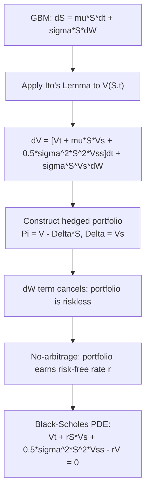

## Ito's Lemma and Stochastic Differentiation

### Core Concept

Itô's Lemma is the stochastic-calculus analogue of the chain rule, extended to account for the non-zero quadratic variation of Brownian motion. It provides the rule for differentiating a function of a stochastic process, and it is the single most important mathematical tool in derivatives pricing theory — the Black-Scholes PDE, the risk-neutral drift of GBM, and virtually all diffusion-based pricing models are derived directly from it.

### Motivation: Why Ordinary Calculus Fails

For a smooth deterministic function $f(t)$, the ordinary chain rule gives $df = f'(t)\,dt$. Applying naive Taylor expansion to a function $f(W_t)$ of Brownian motion:

$$df(W_t) = f'(W_t)\,dW_t + \frac{1}{2}f''(W_t)\,(dW_t)^2 + \cdots$$

In ordinary calculus, $(dt)^2$ and higher-order terms vanish in the limit and are discarded. But because Brownian motion has **finite quadratic variation** ($[W,W]_t = t$, i.e., $(dW_t)^2 = dt$ in the informal calculus), the second-order term does **not** vanish — it contributes a term of order $dt$, the same order as the first-order term, and must be retained.

**Key Points**

- This is the direct consequence of the "Properties of Wiener Processes" discussed previously: unbounded total variation forces a new theory of integration, and finite quadratic variation forces retention of second-order Taylor terms.
- The informal multiplication table used throughout stochastic calculus: $dW_t \cdot dW_t = dt$, $dW_t \cdot dt = 0$, $dt \cdot dt = 0$.

### Itô's Lemma: Statement (Single Variable)

Let $X_t$ follow the Itô process (a general stochastic differential equation):

$$dX_t = \mu(X_t, t)\,dt + \sigma(X_t, t)\,dW_t$$

For a twice-differentiable function $f(X_t, t)$, Itô's Lemma states:

$$df(X_t,t) = \left[\frac{\partial f}{\partial t} + \mu \frac{\partial f}{\partial X} + \frac{1}{2}\sigma^2 \frac{\partial^2 f}{\partial X^2}\right]dt + \sigma \frac{\partial f}{\partial X}\,dW_t$$

**Key Points**

- The first three terms inside the bracket resemble an ordinary total-derivative expansion (time derivative + first-order chain rule term); the term $\frac{1}{2}\sigma^2 \frac{\partial^2 f}{\partial X^2}$ is the distinctly stochastic **Itô correction term**, arising purely from quadratic variation.
- The resulting $df$ is itself an Itô process: it has both a drift term (coefficient of $dt$) and a diffusion term (coefficient of $dW_t$).

### Derivation Sketch

Starting from a second-order Taylor expansion of $f(X_t, t)$:

$$df = \frac{\partial f}{\partial t}dt + \frac{\partial f}{\partial X}dX + \frac{1}{2}\frac{\partial^2 f}{\partial X^2}(dX)^2 + \cdots$$

Substitute $dX = \mu\,dt + \sigma\,dW_t$ and compute $(dX)^2$ using the multiplication table:

$$(dX)^2 = \mu^2(dt)^2 + 2\mu\sigma\,dt\,dW_t + \sigma^2(dW_t)^2 = \sigma^2\,dt$$

(since $(dt)^2 = 0$ and $dt\,dW_t = 0$, only the $\sigma^2(dW_t)^2 = \sigma^2\,dt$ term survives). Substituting back yields Itô's Lemma as stated above.

### Application: Deriving Geometric Brownian Motion's Solution

Given $dS_t = \mu S_t\,dt + \sigma S_t\,dW_t$, apply Itô's Lemma to $f(S_t) = \ln(S_t)$:

$$\frac{\partial f}{\partial S} = \frac{1}{S}, \quad \frac{\partial^2 f}{\partial S^2} = -\frac{1}{S^2}$$

$$d(\ln S_t) = \left[\mu - \frac{1}{2}\sigma^2\right]dt + \sigma\,dW_t$$

Integrating both sides from $0$ to $t$:

$$\ln S_t - \ln S_0 = \left(\mu - \frac{\sigma^2}{2}\right)t + \sigma W_t$$

$$S_t = S_0 \exp\left[\left(\mu - \frac{\sigma^2}{2}\right)t + \sigma W_t\right]$$

**Key Points**

- This derivation is the direct origin of the $-\frac{\sigma^2}{2}$ **Itô/variance-drag correction** appearing in the GBM solution — it comes purely from the second-derivative term of Itô's Lemma applied to the logarithm, not from any economic assumption.
- This example demonstrates the general technique for solving SDEs: find a transformation $f(X_t)$ (often a log or other variance-stabilizing transform) that converts the SDE into one with constant, directly integrable coefficients.

### Multivariate Itô's Lemma

For $f(X_t^1, \ldots, X_t^n, t)$, a function of multiple correlated Itô processes with $dX_t^i\,dX_t^j = \rho_{ij}\sigma_i\sigma_j\,dt$:

$$df = \left[\frac{\partial f}{\partial t} + \sum_i \mu_i \frac{\partial f}{\partial X_i} + \frac{1}{2}\sum_{i,j}\rho_{ij}\sigma_i\sigma_j \frac{\partial^2 f}{\partial X_i \partial X_j}\right]dt + \sum_i \sigma_i \frac{\partial f}{\partial X_i}\,dW_t^i$$

**Key Points**

- The cross-partial (mixed second derivative) term is essential for pricing multi-asset structured products (basket options, spread options, worst-of/best-of notes), since it captures how correlation between underlyings affects the value function's evolution.
- This is the direct generalization used to derive multi-asset Black-Scholes-type PDEs.

### Deriving the Black-Scholes PDE via Itô's Lemma

Let $V(S_t, t)$ be the value of a derivative on an underlying following GBM. Applying Itô's Lemma:

$$dV = \left[\frac{\partial V}{\partial t} + \mu S \frac{\partial V}{\partial S} + \frac{1}{2}\sigma^2 S^2 \frac{\partial^2 V}{\partial S^2}\right]dt + \sigma S \frac{\partial V}{\partial S}\,dW_t$$

Constructing a self-financing, riskless hedged portfolio $\Pi = V - \frac{\partial V}{\partial S}S$ (long the option, short $\Delta = \frac{\partial V}{\partial S}$ shares) eliminates the $dW_t$ term, and setting the portfolio's return equal to the risk-free rate (no-arbitrage) yields:

$$\frac{\partial V}{\partial t} + rS\frac{\partial V}{\partial S} + \frac{1}{2}\sigma^2 S^2 \frac{\partial^2 V}{\partial S^2} - rV = 0$$

**Key Points**

- This is the **Black-Scholes PDE**, and every term traces directly back to Itô's Lemma: the $\frac{1}{2}\sigma^2 S^2 \frac{\partial^2 V}{\partial S^2}$ term is precisely the Itô correction term (gamma term), representing the value of convexity.
- The elimination of the $dW_t$ term via delta-hedging is the mathematical embodiment of the no-arbitrage replication argument central to derivatives pricing theory.

### Itô Isometry and Stochastic Integrals

For the Itô integral $I_t = \int_0^t \sigma_s\,dW_s$:

$$E[I_t^2] = E\left[\int_0^t \sigma_s^2\,ds\right]$$

**Key Points**

- The Itô isometry allows computing variances of stochastic integrals by converting them into ordinary (deterministic or expectation-based) integrals, which is essential for computing variances of simulated payoffs and for pricing formulas involving stochastic integrals directly (e.g., variance swaps).
- Itô integrals are defined so that the integrand is evaluated at the **left endpoint** of each partition interval (non-anticipating/adapted), which is what makes $E[I_t] = 0$ — this is a defining convention distinguishing Itô from Stratonovich calculus.

### Itô vs. Stratonovich Calculus

| Aspect | Itô Calculus | Stratonovich Calculus |
| --- | --- | --- |
| Integrand evaluation point | Left endpoint | Midpoint |
| Chain rule | Modified (extra $\frac{1}{2}\sigma^2 f''$ term) | Ordinary chain rule holds |
| Martingale property of integral | Yes (mean zero) | Not generally |
| Standard use | Finance (default convention) | Physics, some engineering applications |

**Key Points**

- Finance almost universally uses the Itô convention because the non-anticipating (left-endpoint) property aligns with the economic requirement that trading strategies cannot use future information.
- The two conventions are mathematically related by a known correction term, so results can be translated between them, but the Itô convention is the standard throughout derivatives literature (Hull, Shreve, etc.).

### Diagram: From Itô's Lemma to the Black-Scholes PDE

### Worked Example: Itô's Lemma on a Squared Process

Let $f(W_t) = W_t^2$. Then $\frac{\partial f}{\partial W} = 2W_t$, $\frac{\partial^2 f}{\partial W^2} = 2$, and $\frac{\partial f}{\partial t} = 0$. Applying Itô's Lemma:

$$d(W_t^2) = \left[0 + 0 + \frac{1}{2}(2)\right]dt + 2W_t\,dW_t = dt + 2W_t\,dW_t$$

Integrating: $W_t^2 = t + 2\int_0^t W_s\,dW_s$, which rearranges to $\int_0^t W_s\,dW_s = \frac{1}{2}(W_t^2 - t)$.

**Key Points**

- This result directly demonstrates that $W_t^2 - t$ is a martingale (as referenced under Wiener process properties): the stochastic integral term $2\int_0^t W_s\,dW_s$ has zero expectation, confirming $E[W_t^2] = t$.
- This example is frequently used as a first non-trivial exercise in stochastic calculus courses precisely because it makes the Itô correction term's necessity concrete: without it, one would incorrectly conclude $d(W_t^2) = 2W_t\,dW_t$ with zero drift.

### Relevance to Structured Products and Derivatives

- **Black-Scholes-Merton PDE derivation**: Itô's Lemma is the direct mathematical mechanism producing the PDE governing all vanilla and many exotic option prices.
- **Greeks and risk sensitivities**: Itô's Lemma decomposes the change in a derivative's value into delta ($\frac{\partial V}{\partial S}$), theta ($\frac{\partial V}{\partial t}$), and gamma ($\frac{\partial^2 V}{\partial S^2}$) exposures — the foundational building blocks of derivatives risk management.
- **Exotic and path-dependent payoffs**: pricing variance swaps, volatility derivatives, and convexity-sensitive structured notes relies on manipulating stochastic integrals via Itô's Lemma and the Itô isometry.
- **Multi-asset structured products**: the multivariate form of Itô's Lemma, with its cross-partial correlation term, is essential to deriving PDEs for basket options, spread options, and correlation-sensitive worst-of/best-of notes.
- **Stochastic volatility and interest rate models**: Itô's Lemma is applied repeatedly when deriving pricing PDEs or dynamics under models such as Heston, SABR, and Hull-White.

**Next Steps**

- The Black-Scholes-Merton Model: Full Derivation and Assumptions
- Girsanov's Theorem and Change of Measure (Risk-Neutral Pricing)
- Feynman-Kac Theorem and PDE-to-Expectation Duality
- Stochastic Differential Equations: Existence, Uniqueness, and Solution Techniques
- Jump-Diffusion Processes and Itô's Lemma with Jumps
- Stochastic Volatility Models (Heston) via Multivariate Itô Calculus