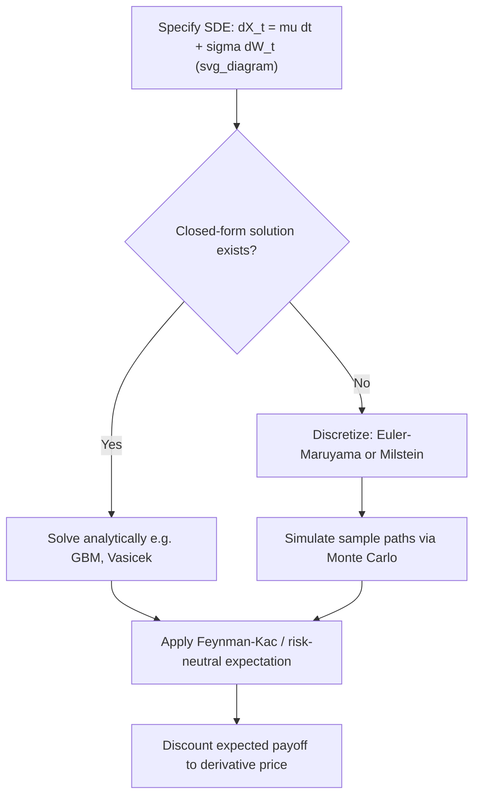

## Stochastic Differential Equations

### Definition and Core Concept

A stochastic differential equation (SDE) describes the evolution of a random process through both deterministic drift and random diffusion components. The general form is:

$$dX_t = \mu(X_t, t)\,dt + \sigma(X_t, t)\,dW_t$$

where $X_t$ is the state variable at time $t$, $\mu(X_t, t)$ is the drift coefficient governing the deterministic trend, $\sigma(X_t, t)$ is the diffusion coefficient scaling the randomness, and $W_t$ is a standard Brownian motion (Wiener process). This equation is shorthand for the integral equation:

$$X_t = X_0 + \int_0^t \mu(X_s, s)\,ds + \int_0^t \sigma(X_s, s)\,dW_s$$

The first integral is an ordinary (Riemann) integral; the second is an Itô integral, since $W_t$ has paths of unbounded variation and is not differentiable in the classical sense. This is why SDEs cannot be manipulated with ordinary calculus rules — they require Itô calculus.

In derivatives pricing, SDEs are the fundamental modeling primitive: the underlying asset price, an interest rate, a volatility process, or a credit spread are all typically specified as solutions to an SDE, and derivative valuation reduces to computing expectations of functionals of these processes (often under a risk-neutral or forward measure).

### Brownian Motion: The Building Block

Standard Brownian motion $W_t$ satisfies:

- $W_0 = 0$
- Independent increments: $W_t - W_s$ is independent of $\mathcal{F}_s$ for $t > s$
- Gaussian increments: $W_t - W_s \sim N(0, t-s)$
- Continuous sample paths (almost surely)

The key non-classical property is the quadratic variation:

$$(dW_t)^2 = dt$$

This single relation is the source of Itô's Lemma and distinguishes stochastic calculus from ordinary calculus. Informally, over an infinitesimal interval, the randomness contributes a term of order $dt$ (not $dt^2$, as it would if $dW_t$ behaved like an ordinary differential).

### Itô's Lemma

Given $X_t$ following $dX_t = \mu\,dt + \sigma\,dW_t$, and a twice-differentiable function $f(X_t, t)$, Itô's Lemma gives:

$$df = \left(\frac{\partial f}{\partial t} + \mu\frac{\partial f}{\partial x} + \frac{1}{2}\sigma^2\frac{\partial^2 f}{\partial x^2}\right)dt + \sigma\frac{\partial f}{\partial x}\,dW_t$$

The second-derivative term (the "Itô correction") arises directly from $(dW_t)^2 = dt$ via a second-order Taylor expansion where the second-order term does not vanish. This lemma is the workhorse for deriving pricing PDEs (e.g., Black-Scholes) and for transforming one SDE into another (e.g., converting geometric Brownian motion into an SDE for $\log X_t$).

**Example:** Applying Itô's Lemma to $f(X_t) = \log X_t$ where $dX_t = \mu X_t\,dt + \sigma X_t\,dW_t$ (geometric Brownian motion):

$$d(\log X_t) = \left(\mu - \frac{1}{2}\sigma^2\right)dt + \sigma\,dW_t$$

This shows the log-price follows an arithmetic Brownian motion with drift $\mu - \tfrac{1}{2}\sigma^2$, which is the origin of the well-known "volatility drag" in geometric Brownian motion.

### Standard SDE Models Used in Derivatives Pricing

**Geometric Brownian Motion (Black-Scholes)**

$$dS_t = \mu S_t\,dt + \sigma S_t\,dW_t$$

The canonical equity price model. Under the risk-neutral measure $\mathbb{Q}$, $\mu$ is replaced by $r - q$ (risk-free rate minus dividend yield). This SDE has the closed-form solution:

$$S_t = S_0 \exp\left(\left(\mu - \frac{1}{2}\sigma^2\right)t + \sigma W_t\right)$$

**Ornstein-Uhlenbeck / Vasicek Process**

$$dr_t = \kappa(\theta - r_t)\,dt + \sigma\,dW_t$$

Used for mean-reverting quantities such as short rates or volatility levels. $\kappa$ is the speed of mean reversion, $\theta$ the long-run mean. Rates can go negative under this specification, which is a known limitation for interest-rate applications. [Inference: whether negative rates are a modeling defect or a feature depends on the market regime and asset class being modeled.]

**Cox-Ingersoll-Ross (CIR) Process**

$$dr_t = \kappa(\theta - r_t)\,dt + \sigma\sqrt{r_t}\,dW_t$$

Ensures non-negativity (under the Feller condition $2\kappa\theta \geq \sigma^2$) via the square-root diffusion term, which shrinks volatility as $r_t \to 0$. Widely used for short rates and as the variance process in the Heston model.

**Heston Stochastic Volatility Model**

$$dS_t = \mu S_t\,dt + \sqrt{v_t}\,S_t\,dW_t^S$$

$$dv_t = \kappa(\theta - v_t)\,dt + \xi\sqrt{v_t}\,dW_t^v$$

$$dW_t^S\,dW_t^v = \rho\,dt$$

A two-factor SDE system where variance itself follows a CIR-type process, correlated with the asset price via $\rho$. This captures the volatility smile/skew observed in options markets, which single-factor GBM cannot.

**SABR Model**

$$dF_t = \sigma_t F_t^\beta\,dW_t^1$$

$$d\sigma_t = \nu\sigma_t\,dW_t^2$$

Widely used for interest-rate derivatives and FX to model the forward rate/price alongside a stochastic volatility parameter, with an approximate closed-form implied volatility formula (Hagan et al.) that makes it tractable for calibration.

### Existence and Uniqueness

An SDE $dX_t = \mu(X_t,t)\,dt + \sigma(X_t,t)\,dW_t$ has a unique strong solution if the coefficients satisfy:

1. **Lipschitz condition**: $|\mu(x,t) - \mu(y,t)| + |\sigma(x,t) - \sigma(y,t)| \leq K|x-y|$
2. **Linear growth condition**: $|\mu(x,t)|^2 + |\sigma(x,t)|^2 \leq K(1+|x|^2)$

for some constant $K$. These are sufficient, not necessary, conditions (the Yamada-Watanabe theorem provides weaker sufficient conditions applicable to processes like CIR, where the square-root diffusion is not globally Lipschitz near zero).

### Feynman-Kac Formula: Connecting SDEs to PDEs

The Feynman-Kac theorem links the solution of a parabolic PDE to the expectation of a functional of an SDE solution. If $V(x,t)$ solves:

$$\frac{\partial V}{\partial t} + \mu(x,t)\frac{\partial V}{\partial x} + \frac{1}{2}\sigma^2(x,t)\frac{\partial^2 V}{\partial x^2} - rV = 0$$

with terminal condition $V(x,T) = \Phi(x)$, then:

$$V(x,t) = e^{-r(T-t)}\,\mathbb{E}^{\mathbb{Q}}\left[\Phi(X_T) \mid X_t = x\right]$$

where $X_t$ follows the SDE with drift $\mu$ and diffusion $\sigma$. This is the theoretical bridge that justifies both PDE-based pricing methods (finite differences) and Monte Carlo simulation as equivalent routes to the same derivative price.

### Girsanov's Theorem and Measure Changes

Girsanov's theorem describes how an SDE's drift transforms under an equivalent change of probability measure. If $\tilde{W}_t = W_t + \int_0^t \lambda_s\,ds$ is Brownian motion under a new measure $\tilde{\mathbb{Q}}$ (defined via the Radon-Nikodym derivative involving $\lambda_s$, the market price of risk), then an SDE:

$$dX_t = \mu\,dt + \sigma\,dW_t = (\mu - \sigma\lambda)\,dt + \sigma\,d\tilde{W}_t$$

changes drift but not diffusion. This is precisely the mechanism by which one moves from the real-world measure $\mathbb{P}$ to the risk-neutral measure $\mathbb{Q}$ in derivatives pricing — the volatility structure is measure-invariant, but the drift is not, which is the mathematical reason risk-neutral pricing is tractable regardless of investors' actual risk preferences.

### Numerical Solution Methods

Closed-form solutions exist only for special cases (GBM, OU/Vasicek). Most SDEs used in practice (Heston, SABR, local volatility models) require numerical simulation.

**Euler-Maruyama Scheme**

$$X_{t+\Delta t} = X_t + \mu(X_t, t)\Delta t + \sigma(X_t, t)\sqrt{\Delta t}\,Z, \quad Z \sim N(0,1)$$

Strong convergence order $0.5$, weak convergence order $1.0$. Simple but can produce negative values for processes like CIR unless a fix (e.g., full truncation, reflection) is applied.

**Milstein Scheme**

$$X_{t+\Delta t} = X_t + \mu\Delta t + \sigma\sqrt{\Delta t}\,Z + \frac{1}{2}\sigma\sigma'(\Delta t)(Z^2-1)$$

Adds a correction term using the derivative of $\sigma$, improving strong convergence order to $1.0$. More accurate for state-dependent diffusion but requires $\sigma'$ to be computable.

**Comparison Table**

| Scheme | Strong Order | Weak Order | Complexity | Typical Use |
| --- | --- | --- | --- | --- |
| Euler-Maruyama | 0.5 | 1.0 | Low | General-purpose, fast prototyping |
| Milstein | 1.0 | 1.0 | Medium | State-dependent diffusion (CIR, Heston variance) |
| Exact simulation (e.g., Broadie-Kaya for Heston) | Exact | Exact | High | Benchmark pricing, low-bias requirements |

### Process Flow Diagram

### Worked Example: Simulating GBM for Option Pricing

For a European call under risk-neutral GBM $dS_t = rS_t\,dt + \sigma S_t\,dW_t$, using the exact solution (no discretization bias needed since GBM has a closed form):

$$S_T = S_0 \exp\left(\left(r - \frac{1}{2}\sigma^2\right)T + \sigma\sqrt{T}\,Z\right), \quad Z \sim N(0,1)$$

The Monte Carlo price estimate is:

$$\hat{C} = e^{-rT} \cdot \frac{1}{N}\sum_{i=1}^{N} \max(S_T^{(i)} - K, 0)$$

For $N$ simulated paths, the standard error scales as $O(1/\sqrt{N})$, motivating variance reduction techniques (antithetic variates, control variates using the closed-form Black-Scholes price as a control) in practical implementations.

### Common Pitfalls

- **Confusing Itô and Stratonovich integrals**: The Stratonovich SDE $dX_t = \mu\,dt + \sigma \circ dW_t$ obeys ordinary chain rule but has a different drift than the equivalent Itô form; mixing conventions silently introduces a bias term equal to $\tfrac{1}{2}\sigma\sigma'$.
- **Discretization bias near boundaries**: Euler-Maruyama on CIR-type processes can generate negative variance/rate paths; requires truncation or an exact scheme.
- **Ignoring correlation structure**: In multi-factor SDE systems (e.g., Heston), correlated Brownian motions must be simulated via Cholesky decomposition or an equivalent construction — independent simulation of each factor silently drops correlation risk.
- [Unverified: whether a specific numerical library's default random number generator has sufficient period/quality for large-scale Monte Carlo without explicit seeding controls should be checked against that library's own documentation.]

### Related Topics

- Itô's Lemma (derivation and multi-dimensional extensions)
- Girsanov's Theorem and change of measure
- Feynman-Kac Formula and PDE-Expectation duality
- Martingale Representation Theorem
- Monte Carlo Methods for Derivatives Pricing
- Heston Model calibration and characteristic-function pricing (Fourier methods)
- Local Volatility Models (Dupire's equation)
- Jump-Diffusion Processes (Merton, Kou models)
- Numerical Schemes for SDEs: Milstein, Runge-Kutta variants, exact simulation schemes