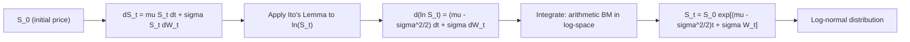

## Geometric Brownian Motion

### Definition

Geometric Brownian Motion (GBM) is a continuous-time stochastic process in which the logarithm of the process follows a Brownian motion with drift. It is the foundational model for asset price dynamics in the Black-Scholes-Merton framework, guaranteeing that prices remain strictly positive.

The process $S_t$ satisfies the stochastic differential equation (SDE):

$$dS_t = \mu S_t \, dt + \sigma S_t \, dW_t$$

where:

- $S_t$ = asset price at time $t$
- $\mu$ = drift rate (expected rate of return)
- $\sigma$ = volatility (instantaneous standard deviation of returns)
- $W_t$ = standard Brownian motion (Wiener process)

### Key Points

- The relative (percentage) change $dS_t / S_t$ is normally distributed with mean $\mu \, dt$ and variance $\sigma^2 dt$.
- $S_t$ itself is never normally distributed — it is log-normally distributed, which prevents negative prices.
- GBM has the multiplicative/proportional property: percentage changes are independent of the price level, matching the empirical observation that stock returns (not absolute price changes) are roughly stationary.
- The process is Markovian and has independent increments in $\log S_t$.

### Derivation via Itô's Lemma

Let $X_t = \ln S_t$. Applying Itô's Lemma to $f(S_t) = \ln S_t$:

$$f_S = \frac{1}{S_t}, \quad f_{SS} = -\frac{1}{S_t^2}, \quad f_t = 0$$


$$dX_t = \left( \mu S_t \cdot \frac{1}{S_t} + \frac{1}{2} \sigma^2 S_t^2 \cdot \left(-\frac{1}{S_t^2}\right) \right) dt + \sigma S_t \cdot \frac{1}{S_t} \, dW_t$$


$$dX_t = \left(\mu - \frac{\sigma^2}{2}\right) dt + \sigma \, dW_t$$

This is arithmetic Brownian motion in $\log S_t$, integrable directly:

$$\ln S_t - \ln S_0 = \left(\mu - \frac{\sigma^2}{2}\right) t + \sigma W_t$$

### Closed-Form Solution

$$S_t = S_0 \exp\left[\left(\mu - \frac{\sigma^2}{2}\right)t + \sigma W_t\right]$$

Equivalently, since $W_t \sim N(0, t)$:

$$S_t = S_0 \exp\left[\left(\mu - \frac{\sigma^2}{2}\right)t + \sigma \sqrt{t}\, Z\right], \quad Z \sim N(0,1)$$

### Distributional Properties

$\ln(S_t/S_0) \sim N\left[\left(\mu - \frac{\sigma^2}{2}\right)t,\ \sigma^2 t\right]$

Since $S_t$ is log-normal:

$$E[S_t] = S_0 e^{\mu t}$$


$$\text{Var}(S_t) = S_0^2 e^{2\mu t}\left(e^{\sigma^2 t} - 1\right)$$

Note the asymmetry: $E[S_t]$ grows at rate $\mu$, but the **median** of $S_t$ is $S_0 e^{(\mu - \sigma^2/2)t}$ — lower than the mean due to log-normal skew. This gap, $\sigma^2/2$, is often called the "volatility drag" or "variance drain."

### The Drift Adjustment Term

| Term | Role |
| --- | --- |
| $\mu$ | Drift under the real-world (physical) measure $\mathbb{P}$ |
| $\mu - \sigma^2/2$ | Drift of $\ln S_t$; the median growth rate |
| $\sigma^2/2$ | Itô correction — arises because $\ln(\cdot)$ is concave (Jensen's inequality) |

**[Inference]** Practitioners sometimes misinterpret $\mu$ as the "expected log return"; this is a common pedagogical pitfall, since $\mu$ is the arithmetic drift, not the log-return drift.

### Risk-Neutral GBM (Pricing Measure)

Under the risk-neutral measure $\mathbb{Q}$ (used for derivative pricing), the drift $\mu$ is replaced by the risk-free rate $r$ (adjusted for continuous dividend yield $q$ if applicable):

$$dS_t = (r - q) S_t \, dt + \sigma S_t \, dW_t^{\mathbb{Q}}$$


$$S_t = S_0 \exp\left[\left(r - q - \frac{\sigma^2}{2}\right)t + \sigma W_t^{\mathbb{Q}}\right]$$

This substitution is justified by Girsanov's theorem, which shows that changing from $\mathbb{P}$ to $\mathbb{Q}$ only shifts the drift of $W_t$, leaving $\sigma$ unchanged — the foundation of no-arbitrage pricing.

### Simulation (Discretized/Exact Scheme)

Exact simulation (preferred, since the closed-form solution is known — no discretization bias):

$$S_{t+\Delta t} = S_t \exp\left[\left(\mu - \frac{\sigma^2}{2}\right)\Delta t + \sigma \sqrt{\Delta t}\, Z_i\right], \quad Z_i \sim N(0,1) \text{ i.i.d.}$$

```python
import numpy as np

def simulate_gbm(S0, mu, sigma, T, n_steps, n_paths, seed=None):
    rng = np.random.default_rng(seed)
    dt = T / n_steps
    Z = rng.standard_normal((n_paths, n_steps))
    increments = (mu - 0.5 * sigma**2) * dt + sigma * np.sqrt(dt) * Z
    log_paths = np.log(S0) + np.cumsum(increments, axis=1)
    paths = np.exp(log_paths)
    paths = np.hstack([np.full((n_paths, 1), S0), paths])
    return paths
```

**Example**

For $S_0 = 100$, $\mu = 0.08$, $\sigma = 0.25$, $T = 1$:

```python
paths = simulate_gbm(S0=100, mu=0.08, sigma=0.25, T=1, n_steps=252, n_paths=10000)
terminal_prices = paths[:, -1]
print(f"Mean: {terminal_prices.mean():.2f}, Theoretical: {100*np.exp(0.08):.2f}")
print(f"Median: {np.median(terminal_prices):.2f}, Theoretical: {100*np.exp(0.08-0.5*0.25**2):.2f}")
```

Expected output (approximate, subject to Monte Carlo error): mean ≈ 108.3, median ≈ 105.3 — illustrating the mean/median gap from the $\sigma^2/2$ term.

### GBM as the Basis of Black-Scholes

The Black-Scholes PDE is derived by constructing a delta-hedged portfolio of the option and underlying (assumed to follow GBM), applying Itô's Lemma to the option value $V(S_t, t)$, and eliminating the stochastic term:

$$\frac{\partial V}{\partial t} + r S \frac{\partial V}{\partial S} + \frac{1}{2}\sigma^2 S^2 \frac{\partial^2 V}{\partial S^2} - rV = 0$$

The GBM assumption directly yields the log-normal terminal distribution used in the Black-Scholes closed-form call/put formulas.

### Diagram: GBM Sample Paths and Log-Transform



### Limitations of GBM

- **Constant volatility assumption**: contradicts the empirically observed volatility smile/skew in option markets. [Unverified — magnitude of skew varies by market and regime]
- **No jumps**: GBM paths are continuous; cannot capture sudden price gaps (addressed by jump-diffusion models like Merton's model).
- **Constant drift and volatility parameters**: real markets exhibit stochastic volatility (e.g., Heston model) and regime-dependent drift.
- **Log-normal returns assumption**: empirical asset returns typically exhibit fatter tails (excess kurtosis) than log-normal implies.

### Related Topics

- Itô's Lemma and Itô Calculus
- Risk-Neutral Valuation and Girsanov's Theorem
- Black-Scholes-Merton Model
- Jump-Diffusion Models (Merton, Kou)
- Stochastic Volatility Models (Heston, SABR)
- Ornstein-Uhlenbeck Process (mean-reverting alternative)
- Monte Carlo Methods for Option Pricing
- Volatility Smile and Local Volatility Models