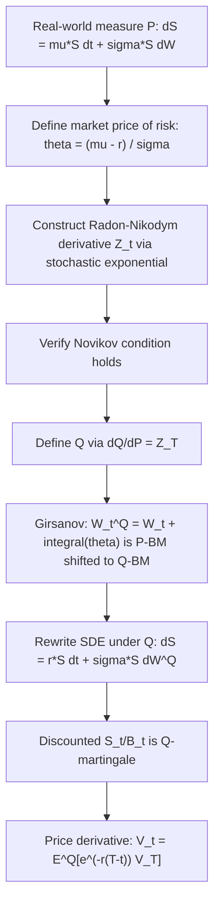

## Girsanov Theorem and Change of Measure

### Definition

Girsanov's Theorem describes how a Brownian motion transforms under a change of probability measure. Specifically, it states that a Brownian motion with drift under one measure becomes a driftless (or differently-drifted) Brownian motion under an equivalent measure, provided the change of measure is defined via a specific exponential martingale (the Radon-Nikodym derivative). This theorem is the mathematical foundation for risk-neutral pricing in derivatives markets.

### Motivation

Under the real-world (physical) measure $\mathbb{P}$, asset prices grow at the actual expected return $\mu$, which includes a risk premium and is generally unobservable/subjective. Derivative pricing requires an equivalent measure $\mathbb{Q}$ under which discounted asset prices are martingales — eliminating the need to estimate $\mu$ or investor risk preferences. Girsanov's Theorem provides the rigorous machinery for this shift.

### Setup: Equivalent Measures

Two measures $\mathbb{P}$ and $\mathbb{Q}$ on $(\Omega, \mathcal{F})$ are **equivalent** ($\mathbb{P} \sim \mathbb{Q}$) if they agree on which events have probability zero. Under equivalence, a Radon-Nikodym derivative $\frac{d\mathbb{Q}}{d\mathbb{P}}$ exists as a random variable satisfying:

$$E^{\mathbb{Q}}[X] = E^{\mathbb{P}}\left[X \cdot \frac{d\mathbb{Q}}{d\mathbb{P}}\right]$$

### The Radon-Nikodym Derivative Process

Define the process $Z_t$ (the Girsanov kernel / stochastic exponential):

$$Z_t = \exp\left(-\int_0^t \theta_s \, dW_s - \frac{1}{2}\int_0^t \theta_s^2 \, ds\right)$$

where $\theta_t$ is the **market price of risk** process. $Z_t$ satisfies the SDE:

$$dZ_t = -\theta_t Z_t \, dW_t, \qquad Z_0 = 1$$

$Z_t$ is a $\mathbb{P}$-martingale provided the **Novikov condition** holds:

$$E^{\mathbb{P}}\left[\exp\left(\frac{1}{2}\int_0^T \theta_s^2 \, ds\right)\right] < \infty$$

This condition guarantees $Z_t$ does not degenerate (e.g., to zero) and that $\mathbb{Q}$ defined via $Z_T$ is a valid probability measure.

### Statement of Girsanov's Theorem

Define the new measure $\mathbb{Q}$ via $\left.\frac{d\mathbb{Q}}{d\mathbb{P}}\right|_{\mathcal{F}_t} = Z_t$. Then the process:

$$W_t^{\mathbb{Q}} = W_t + \int_0^t \theta_s \, ds$$

is a standard Brownian motion under $\mathbb{Q}$.

Equivalently, rearranged in differential form:

$$dW_t = dW_t^{\mathbb{Q}} - \theta_t \, dt$$

**Key Points**

- The volatility (diffusion coefficient) of any process driven by $W_t$ is **unchanged** under the measure change — only the drift shifts.
- $\theta_t$ is the adjustment applied to the drift; it represents compensation per unit of volatility exposure (the Sharpe ratio in continuous time).
- The theorem applies to any $\mathcal{F}_t$-adapted $\theta_t$ satisfying Novikov's condition, not just constants.

### Application: GBM Under Risk-Neutral Measure

Under $\mathbb{P}$, asset price follows:

$$dS_t = \mu S_t \, dt + \sigma S_t \, dW_t$$

Choose $\theta_t = \frac{\mu - r}{\sigma}$ (the market price of risk for this asset). Substituting $dW_t = dW_t^{\mathbb{Q}} - \theta_t \, dt$:

$$dS_t = \mu S_t \, dt + \sigma S_t \left(dW_t^{\mathbb{Q}} - \frac{\mu - r}{\sigma} dt\right)$$

$$dS_t = \left[\mu S_t - (\mu - r)S_t\right] dt + \sigma S_t \, dW_t^{\mathbb{Q}}$$

$$dS_t = r S_t \, dt + \sigma S_t \, dW_t^{\mathbb{Q}}$$

The drift $\mu$ is replaced by $r$, and $S_t$ is now driven by a $\mathbb{Q}$-Brownian motion. This confirms $S_t / B_t$ (discounted by the money-market account $B_t = e^{rt}$) is a $\mathbb{Q}$-martingale — the defining property of the risk-neutral measure.

### The Martingale Pricing Formula

Given Girsanov's construction of $\mathbb{Q}$, the no-arbitrage price of a derivative with payoff $V_T$ is:

$$V_t = E^{\mathbb{Q}}\left[e^{-r(T-t)} V_T \mid \mathcal{F}_t\right]$$

This holds because discounted tradable asset prices are $\mathbb{Q}$-martingales by construction (Fundamental Theorem of Asset Pricing).

### Multi-Dimensional Extension

For a vector Brownian motion $\mathbf{W}_t = (W_t^1, \dots, W_t^n)$ and vector $\boldsymbol{\theta}_t = (\theta_t^1, \dots, \theta_t^n)$:

$$Z_t = \exp\left(-\int_0^t \boldsymbol{\theta}_s^\top d\mathbf{W}_s - \frac{1}{2}\int_0^t \|\boldsymbol{\theta}_s\|^2 \, ds\right)$$

$$d\mathbf{W}_t^{\mathbb{Q}} = d\mathbf{W}_t + \boldsymbol{\theta}_t \, dt$$

This extension underlies multi-asset and multi-factor models (e.g., quanto options, multi-currency derivatives), where each risk factor may require its own market-price-of-risk adjustment.

### Application: Forward Measure

Girsanov's Theorem also enables the **T-forward measure** $\mathbb{Q}^T$, under which the discounted-by-zero-coupon-bond process is a martingale — useful for interest rate derivative pricing (e.g., in the LIBOR Market Model / Black formula for caplets):

$$\left.\frac{d\mathbb{Q}^T}{d\mathbb{Q}}\right|_{\mathcal{F}_t} = \frac{P(t,T)/P(0,T)}{B_t^{-1}}$$

where $P(t,T)$ is the zero-coupon bond price. Under $\mathbb{Q}^T$, forward prices (not spot discounted prices) become martingales, simplifying pricing formulas involving stochastic interest rates.

### Diagram: Measure Change Workflow

### Practical Notes on Implementation

- In Monte Carlo pricing engines, simulation is virtually always performed directly under $\mathbb{Q}$ (using $r$ as drift), sidestepping the need to explicitly compute $Z_t$ for vanilla pricing.
- $Z_t$ itself becomes directly relevant in **importance sampling** variance-reduction techniques and in computing **Radon-Nikodym-based sensitivities** (e.g., some Greeks via Malliavin calculus or likelihood-ratio methods).
- **[Inference]** Numerical instability in $Z_t$ can arise when $\theta_t$ is large or highly time-varying, since $Z_t$ is exponential in an integral of $\theta_t^2$; practitioners often monitor effective sample size when using $Z_t$ for reweighting.

### Common Pitfalls

- Confusing $\theta_t$ (market price of risk, used to shift $W_t$) with $\sigma$ (volatility, which never changes under measure transformation).
- Assuming Girsanov's Theorem changes the **volatility** of a process — it does not; only the **drift** transforms.
- Applying Girsanov without verifying Novikov's condition — in pathological cases (e.g., unbounded $\theta_t$), $Z_t$ may fail to be a true martingale (only a local martingale), invalidating the measure change. [Unverified — condition sufficiency vs. necessity depends on the specific model setup]

### Related Topics

- Itô's Lemma and Stochastic Differential Equations
- Fundamental Theorem of Asset Pricing (No-Arbitrage and Completeness)
- Martingale Pricing and Numeraire Change
- Forward Measure and LIBOR Market Model
- Radon-Nikodym Derivatives and Equivalent Martingale Measures
- Market Price of Risk and Sharpe Ratio (Continuous Time)
- Malliavin Calculus for Greeks
- Novikov's Condition and Local Martingales