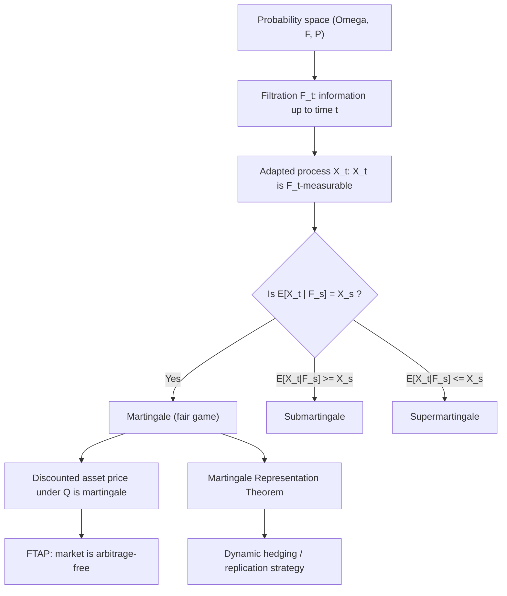

## Martingales and Filtrations

### Filtrations

A **filtration** $(\mathcal{F}_t)_{t \geq 0}$ is a family of $\sigma$-algebras on a probability space $(\Omega, \mathcal{F}, \mathbb{P})$ satisfying:

$$\mathcal{F}_s \subseteq \mathcal{F}_t \quad \text{for all } s \leq t$$

$\mathcal{F}_t$ represents the total information available at time $t$ — i.e., the history of all observable events up to and including $t$. In finance, $\mathcal{F}_t$ typically represents the price history (and any other observed data) of traded assets up to time $t$.

**Key Points**

- A filtration is non-decreasing: information is never forgotten.
- A stochastic process $X_t$ is **adapted** to $(\mathcal{F}_t)$ if $X_t$ is $\mathcal{F}_t$-measurable for every $t$ — i.e., its value at time $t$ is known given the information available at $t$ (no look-ahead).
- The **natural filtration** generated by a process $X_t$ is $\mathcal{F}_t^X = \sigma(X_s : s \leq t)$ — the smallest filtration to which $X_t$ is adapted.
- The **usual conditions** (completeness and right-continuity: $\mathcal{F}_t = \mathcal{F}_{t^+} = \bigcap_{s>t} \mathcal{F}_s$) are typically assumed in continuous-time finance to avoid technical pathologies.

### Conditional Expectation

Central to martingale theory: $E[X \mid \mathcal{F}_t]$ is the best prediction of a random variable $X$ given the information in $\mathcal{F}_t$. Properties used throughout stochastic finance:

- **Tower property**: $E[E[X \mid \mathcal{F}_t] \mid \mathcal{F}_s] = E[X \mid \mathcal{F}_s]$ for $s \leq t$.
- **Taking out what is known**: if $Y$ is $\mathcal{F}_t$-measurable, $E[YX \mid \mathcal{F}_t] = Y \, E[X \mid \mathcal{F}_t]$.
- **Independence**: if $X$ is independent of $\mathcal{F}_t$, then $E[X \mid \mathcal{F}_t] = E[X]$.

### Definition of a Martingale

A process $M_t$ adapted to $(\mathcal{F}_t)$ is a **martingale** (under measure $\mathbb{P}$) if:

1. $E[|M_t|] < \infty$ for all $t$ (integrability)
2. $E[M_t \mid \mathcal{F}_s] = M_s$ for all $s \leq t$ (martingale property)

Interpretation: the best forecast of a martingale's future value, given current information, is its current value. A martingale models a "fair game" — no drift, no predictable trend.

**Sub/Supermartingales**

| Type | Condition | Interpretation |
| --- | --- | --- |
| Martingale | $E[M_t \mid \mathcal{F}_s] = M_s$ | Fair game (flat drift) |
| Submartingale | $E[M_t \mid \mathcal{F}_s] \geq M_s$ | Tends to increase |
| Supermartingale | $E[M_t \mid \mathcal{F}_s] \leq M_s$ | Tends to decrease |

Mnemonic: a submartingale is "below" its future expectation.

### Canonical Examples

**Brownian motion**: $W_t$ is a martingale w.r.t. its natural filtration, since $E[W_t \mid \mathcal{F}_s] = W_s + E[W_t - W_s \mid \mathcal{F}_s] = W_s + 0 = W_s$ (independent increments, zero mean).

**Itô integrals**: For adapted, sufficiently integrable $\sigma_t$, the process $M_t = \int_0^t \sigma_s \, dW_s$ is a martingale. This is a foundational result — stochastic integrals w.r.t. Brownian motion are (local) martingales by construction, since they have zero drift.

**Exponential martingale**: $Z_t = \exp\left(\int_0^t \theta_s \, dW_s - \frac{1}{2}\int_0^t \theta_s^2 \, ds\right)$ is a martingale under Novikov's condition — the basis of Girsanov's Theorem.

**Discounted asset price**: Under the risk-neutral measure $\mathbb{Q}$, $S_t / B_t$ (asset price discounted by the money-market account) is a $\mathbb{Q}$-martingale. This is the defining property used in derivative pricing.

### Martingale Representation Theorem

Given a filtration generated by a Brownian motion $W_t$, **any** martingale $M_t$ (with respect to that filtration) can be represented as a stochastic integral:

$$M_t = M_0 + \int_0^t \phi_s \, dW_s$$

for some adapted process $\phi_s$.

**Significance**: This theorem underpins the theory of **dynamic hedging**. It guarantees that any contingent claim's discounted price process can be replicated by a self-financing trading strategy in the underlying asset — the mathematical basis for the existence of a perfect hedge in a complete market (e.g., Black-Scholes delta hedging).

### Martingales and No-Arbitrage: The Link

The **Fundamental Theorem of Asset Pricing** connects martingales directly to arbitrage-free markets:

- **First FTAP**: A market is arbitrage-free if and only if there exists an equivalent martingale measure (EMM) $\mathbb{Q}$ under which discounted asset prices are $\mathbb{Q}$-martingales.
- **Second FTAP**: The market is complete (every claim is replicable) if and only if the EMM is unique.

This is why derivative pricing reduces to computing expectations under $\mathbb{Q}$: $V_t = E^{\mathbb{Q}}[e^{-r(T-t)} V_T \mid \mathcal{F}_t]$ — a direct consequence of the discounted price being a $\mathbb{Q}$-martingale.

### Stopping Times and Optional Stopping

A random time $\tau$ is a **stopping time** w.r.t. $(\mathcal{F}_t)$ if $\{\tau \leq t\} \in \mathcal{F}_t$ for all $t$ — i.e., whether $\tau$ has occurred by time $t$ is knowable using only information up to $t$ (no foresight). Examples: first hitting time of a barrier; option exercise time (for American-style claims, provided the exercise strategy is adapted).

**Optional Stopping Theorem**: Under suitable regularity conditions (e.g., bounded stopping time, or uniform integrability), $E[M_\tau] = E[M_0]$ for a martingale $M_t$ stopped at $\tau$.

**Application**: This underlies pricing and valuation arguments for American options and barrier options, where exercise/knockout occurs at a stopping time rather than a fixed date.

### Doob-Meyer Decomposition

Any submartingale $X_t$ (under mild conditions) can be uniquely decomposed as:

$$X_t = M_t + A_t$$

where $M_t$ is a martingale and $A_t$ is a predictable, non-decreasing process (the "compensator"). This decomposition is central to advanced topics such as **quadratic variation** of semimartingales and the theory underlying Itô's Lemma for jump-diffusion processes.

### Diagram: Filtration and Martingale Relationship

### Practical Relevance in Derivatives Pricing

- **Model validation**: any proposed risk-neutral price process must satisfy the martingale property for discounted prices; violation implies an arbitrage opportunity.
- **Numeraire changes**: switching numeraires (e.g., to the forward measure or a stock-price numeraire) relies on the martingale property being preserved under the associated measure change (via Girsanov).
- **Simulation diagnostics**: in Monte Carlo pricing, verifying that $E^{\mathbb{Q}}[S_T/B_T] \approx S_0$ (within sampling error) is a standard sanity check that the simulated dynamics are arbitrage-consistent. [Unverified — exact tolerance depends on sample size and variance reduction technique used]

### Related Topics

- Girsanov's Theorem and Change of Measure
- Fundamental Theorem of Asset Pricing
- Itô's Lemma and Stochastic Differential Equations
- Stopping Times and American Option Pricing
- Martingale Representation Theorem and Hedging
- Quadratic Variation and Semimartingales
- Numeraire Change Techniques
- Doob-Meyer Decomposition