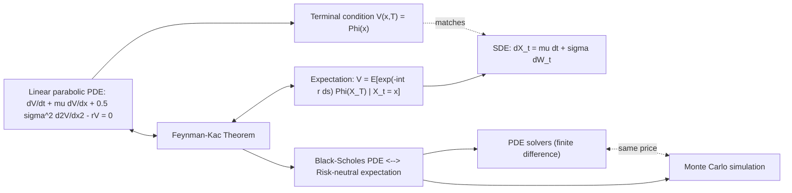

## Feynman-Kac Theorem and PDE Connections

### Definition

The Feynman-Kac Theorem establishes a rigorous equivalence between a class of linear parabolic partial differential equations (PDEs) and expectations of functionals of stochastic processes. It provides the theoretical bridge that allows derivative prices — defined as risk-neutral expectations — to be equivalently computed by solving a PDE, and vice versa. This equivalence underlies both the Black-Scholes PDE and Monte Carlo simulation as dual computational approaches to the same pricing problem.

### The PDE Side

Consider the terminal-value problem for $V(x,t)$:

$$\frac{\partial V}{\partial t} + \mu(x,t) \frac{\partial V}{\partial x} + \frac{1}{2}\sigma^2(x,t) \frac{\partial^2 V}{\partial x^2} - r(x,t) V = 0$$

with terminal condition $V(x,T) = \Phi(x)$.

### The Stochastic Side

Define the process $X_t$ via the SDE:

$$dX_t = \mu(X_t, t)\, dt + \sigma(X_t, t) \, dW_t, \qquad X_t = x$$

### Feynman-Kac Formula

Under suitable regularity conditions (Lipschitz continuity, linear growth, and integrability of the discount and payoff terms), the solution to the PDE has the probabilistic representation:

$$V(x,t) = E\left[\exp\left(-\int_t^T r(X_s,s)\, ds\right) \Phi(X_T) \,\middle|\, X_t = x\right]$$

**Key Points**

- The PDE's drift coefficient $\mu(x,t)$ equals the drift of the SDE driving $X_t$.
- The PDE's diffusion coefficient $\sigma^2(x,t)/2$ corresponds exactly to the SDE's diffusion term $\sigma(x,t)$.
- The discounting term $-r(x,t)V$ in the PDE corresponds to the exponential discount factor $\exp(-\int_t^T r \, ds)$ in the expectation.
- The terminal condition $\Phi(x)$ in the PDE corresponds to the payoff function evaluated at the terminal value of the process.

### Derivation Sketch (via Itô's Lemma)

Define $M_s = e^{-\int_t^s r(X_u,u)\,du} V(X_s, s)$ for $s \in [t,T]$. Applying Itô's Lemma to $M_s$:

$$dM_s = e^{-\int_t^s r\,du}\left[\left(\frac{\partial V}{\partial t} + \mu \frac{\partial V}{\partial x} + \frac{1}{2}\sigma^2 \frac{\partial^2 V}{\partial x^2} - rV\right) ds + \sigma \frac{\partial V}{\partial x} \, dW_s\right]$$

If $V$ solves the PDE, the drift term (bracketed, excluding the $dW_s$ term) vanishes identically, so $M_s$ is a local martingale with:

$$dM_s = e^{-\int_t^s r\,du} \, \sigma \frac{\partial V}{\partial x} \, dW_s$$

Taking expectations (assuming true martingale property holds) and using $M_T = e^{-\int_t^T r\,du}\Phi(X_T)$ and $M_t = V(x,t)$:

$$V(x,t) = E[M_t] = E[M_T] = E\left[e^{-\int_t^T r\,du}\, \Phi(X_T) \mid X_t = x\right]$$

This confirms the PDE solution equals the discounted expected payoff — the Feynman-Kac representation.

### Application: Black-Scholes PDE and Risk-Neutral Pricing

Under $\mathbb{Q}$, GBM dynamics for the underlying are:

$$dS_t = r S_t \, dt + \sigma S_t \, dW_t^{\mathbb{Q}}$$

Matching to Feynman-Kac form ($\mu(S,t) = rS$, $\sigma(S,t) = \sigma S$, $r(x,t) = r$ constant):

$$\frac{\partial V}{\partial t} + rS\frac{\partial V}{\partial S} + \frac{1}{2}\sigma^2 S^2 \frac{\partial^2 V}{\partial S^2} - rV = 0$$

This is precisely the **Black-Scholes PDE**. Feynman-Kac guarantees its solution equals:

$$V(S,t) = E^{\mathbb{Q}}\left[e^{-r(T-t)} \Phi(S_T) \mid S_t = S\right]$$

For $\Phi(S_T) = \max(S_T - K, 0)$ (a European call), this expectation evaluates in closed form to the Black-Scholes formula — Feynman-Kac is the theorem that justifies the equivalence between the PDE-derivation approach (delta-hedging argument) and the martingale/expectation-derivation approach to Black-Scholes.

### Two Computational Routes to the Same Price

| Approach | Method | Best suited for |
| --- | --- | --- |
| PDE | Finite difference methods (explicit, implicit, Crank-Nicolson) | Low-dimensional problems (1-2 state variables), American/barrier features requiring free-boundary handling |
| Probabilistic | Monte Carlo simulation | High-dimensional problems (multi-asset, path-dependent), where PDE grid methods suffer the curse of dimensionality |

Feynman-Kac is the formal justification that these two routes must agree (given the same model and boundary conditions), and it explains why practitioners can freely choose between finite-difference PDE solvers and Monte Carlo simulation based on computational convenience.

### Multi-Dimensional Extension

For $\mathbf{X}_t \in \mathbb{R}^n$ following $d\mathbf{X}_t = \boldsymbol{\mu}(\mathbf{X}_t,t)\,dt + \boldsymbol{\sigma}(\mathbf{X}_t,t)\,d\mathbf{W}_t$, the corresponding PDE is:

$$\frac{\partial V}{\partial t} + \sum_i \mu_i \frac{\partial V}{\partial x_i} + \frac{1}{2}\sum_{i,j} (\boldsymbol{\sigma}\boldsymbol{\sigma}^\top)_{ij} \frac{\partial^2 V}{\partial x_i \partial x_j} - rV = 0$$

This is directly relevant to multi-asset derivatives (basket options, spread options), where the PDE becomes high-dimensional and Monte Carlo methods typically dominate in practice due to the dimensionality of finite-difference grids.

### Regularity Conditions and Caveats

- **Feynman-Kac requires $M_s$ to be a true martingale**, not merely a local martingale — this generally requires growth/integrability conditions on $V$, $\sigma$, and $\Phi$ (e.g., polynomial growth bounds). [Unverified — precise sufficient conditions vary by textbook treatment and model class]
- For payoffs with unbounded growth (e.g., certain exotic payoffs), care is needed to confirm the martingale property holds and the expectation is finite.
- The theorem as stated assumes $r(x,t)$ is bounded or satisfies suitable integrability; in stochastic-rate models, additional technical conditions apply.

### Diagram: Feynman-Kac Bridge

### Practical Relevance

- **Model consistency checks**: quant libraries often validate a new PDE pricer against a Monte Carlo pricer (or vice versa) for the same model — Feynman-Kac guarantees they should converge to the same value, so persistent discrepancies indicate an implementation bug.
- **American options**: Feynman-Kac extends to free-boundary (variational inequality) problems, connecting American option PDEs (with early-exercise constraint) to optimal-stopping expectations.
- **Interest rate models**: short-rate models (Vasicek, CIR, Hull-White) rely on Feynman-Kac to convert bond-pricing PDEs into expectation form, yielding closed-form or semi-closed-form zero-coupon bond prices.

### Related Topics

- Black-Scholes-Merton PDE Derivation
- Itô's Lemma and Stochastic Differential Equations
- Martingales and Filtrations
- Finite Difference Methods for Option Pricing
- Monte Carlo Methods for Derivatives Pricing
- Short-Rate Models (Vasicek, CIR, Hull-White)
- American Option Pricing and Free-Boundary Problems
- Girsanov's Theorem and Change of Measure